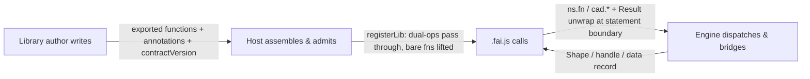

# Third-Party Library Development Guide

English | [中文](library-dev-guide.zh.md)

> This guide is organized by the three layers of the faijs ecosystem — what the **library author** writes, what the **Host** (engine assembly) handles, and what **`.fai.js` scripts** call. Each layer has its own section: responsibilities, interfaces, and boundaries.

> Related documents: `docs/api-contract.md` (engine contract — §7 for the three API surfaces and the Result error system), `docs/ops-api-inventory.md` (the `cad.*` script-face API manual).

---

## 1. The three layers at a glance



| Layer | Role | Writes / does | Produces | Key interface |
|---|---|---|---|---|
| ① Library author | TS/JS library developer | Exported functions, `Result` returns, `defineOp` / `fn.outputs` / `solidOf` annotations, `contractVersion` | A plain module namespace | `@faicad/faijs/sdk` |
| ② Host | Engine assembly (app / worker) | Creates the runtime, registers libraries, provides kernel & backends | Callable namespaces (`ns.*`, `cad.*`) | `runtime.registerLib(binding, ns, { compat: true })` |
| ③ `.fai.js` script | User / UI / AI generated code | Imports libraries and calls their functions | Geometry products & data in the value store | `ns.fn(...)` / `cad.*` |

The data flow is one direction at authoring time and another at run time: the author writes a namespace, the Host registers and admits it, and scripts call the admitted functions — the engine handles dispatch, bridging, and the statement Result boundary between them.

---

## 2. Layer 1 — what the library author writes

### 2.1 The library module

A faijs library is a plain TS/JS module namespace of exported functions. The author writes the module; they do **not** register it — that is the Host's job (§3).

```ts
import { keep, fromBrep, getBackends, CONTRACT_VERSION } from '@faicad/faijs/sdk'

export const contractVersion = CONTRACT_VERSION

export function external(params: { teeth: number; moduleSize: number; thickness: number }) {
  // ... build the gear, return a faijs Shape or a geometry handle ...
}
```

### 2.2 Exported functions return `Result`

Library functions return `Result<T>` (`ok` / `err`). The engine unwraps at the statement boundary: an `err` becomes a statement failure (`ExecutionResult.failedAt`) — **not a crash**; earlier statements keep their outputs. Bugs (unexpected exceptions) still propagate out of `execute()`.

### 2.3 Return values — the three-way classification

The engine distinguishes geometry from plain data by one discriminant — the `__occtWasm` marker (`isOcctHandle` in `brep/handle-bridge.ts`). Return one of three shapes:

| Return value | Classification | Engine behavior |
|---|---|---|
| faijs `Shape` (from `solid` / `fromBrep`) | already-wrapped | passed through unchanged |
| OCCT handle: object tagged `__occtWasm: true`, or a branded number id | geometry handle | tessellated + BREP slot registered (`fromHandle`) |
| plain object, no marker | data record (e.g. sheetmetal `part`) | stored as-is — **never** tessellated as a handle |

A data record where a handle is expected fails at the SDK boundary with `E_BAD_HANDLE`, not at kernel depth. Do not invent other handle shapes.

### 2.4 Dual-path ops: `defineOp`

Declare both implementation paths and L3 metadata with `defineOp` (from `@faicad/faijs/sdk`):

```ts ignore-check
import { defineOp, keepHidden } from '@faicad/faijs/sdk'

export const intersect = defineOp({
  mesh: (...shapes: Shape[]) => {
    if (shapes.length > 0) keepHidden(...shapes)
    return booleanMesh(reconcileBrepInputs(shapes), 'intersect')
  },
  brep: (...shapes: Shape[]) => {
    if (shapes.length > 0) keepHidden(...shapes)
    return booleanBrep(shapes, 'intersect')
  },
  capabilities: ['evolution'], // BREP features needed (gated vs brepCapabilities)
  outputs: [...],             // named multi-product fields (§2.6)
  schema: { ... },            // param types for the UI panel (L3)
  slotMap: { ... },           // positional → object boxing, for brepjs-style calls
})
```

- **`mesh` / `brep`**: the two engine paths. `mesh` is the default; `brep` is optional. A brep-only op raises `E_MESH_UNSUPPORTED` on the mesh path.
- **`capabilities`**: BREP engine features the op needs — gated against the host's declared `brepCapabilities`.
- **`outputs`**: named multi-product fields (the only recognized multi-output contract name; array fields adopted element-by-element).
- **`schema` / `slotMap`**: L3 metadata — parameter types for the UI panel, and the positional → object boxing table for brepjs-style calls.

### 2.5 `keep` / `keepHidden` — UI-layer visibility

Which input shapes stay visible in the UI layer. Function-body declarations (written by the library author, evaluated at run time) are **overridden by call-site declarations** (written by the user / UI / AI at script recording time):

| Declaration site | Who writes it | Priority |
|---|---|---|
| Call site (`.fai.js` statement options) | User / UI / AI | Highest |
| Function body (`keep` / `keepHidden` inside the impl) | Library author | Overridden |

### 2.6 Bare functions and `fn.outputs`

A plain exported function (no `defineOp`) is lifted into a brep-only op when registered with `{ compat: true }`. Declare multi-output fields with the one recognized annotation:

```ts ignore-check
interface PlanetaryOutput {
  sun: ValidSolid
  planets: ValidSolid[]
  ring: ValidSolid
}
export function planetary(params: PlanetaryParams): Result<PlanetaryOutput> {
  // ... build sun, planets, ring ...
  return ok({ sun, planets, ring })
}
;(planetary as { outputs?: string[] }).outputs = ['sun', 'planets', 'ring']
```

### 2.7 `solidOf` — explicit geometry terminal

For data-centric libraries (sheetmetal: `part` is a plain object with an embedded `solid`), provide `solidOf(part)` as the explicit geometry terminal:

```ts ignore-check
export function solidOf(part: SheetMetalPart): Result<ValidSolid> {
  return ok(part.solid!)
}
```

### 2.8 Hard constraints

1. **`contractVersion`**: match the runtime's (`assertContractVersion`); dual-ops are rejected without it.
2. **No engine internals**: no access to engine-internal mutable state (`currentStmt` / `script` / `outputCache` / `brepChain`), no DAG queries or mutation of published `Shape`s.
3. **Handle ownership**: once a returned handle is adopted by the engine, do not `delete()` it afterward (return = transfer).

### 2.9 What the author produces

A plain module namespace: exported functions, optional annotations (`fn.outputs` on bare functions), optional `defineOp` declarations, and `contractVersion`. The Host receives this namespace as-is — it never rewrites the author's code.

---

## 3. Layer 2 — what the Host handles

### 3.1 Host responsibilities

The Host (a Node host or browser worker) assembles the engine and makes libraries callable:

1. Provides the engine: kernel (`brep` / `csg` / `sdf`), backends, fonts/assets — via `createRuntime(ports, mode)`.
2. Registers libraries with `runtime.registerLib(binding, ns, { compat: true })`.
3. Provides the `cad` namespace (built-in ops) and hosts the value store.

### 3.2 Registering a library

```ts ignore-check
import { createRuntime, createNodePorts } from '@faicad/faijs'
import * as gear from 'gear-lib-demo'

const runtime = createRuntime(createNodePorts(), 'auto')
runtime.registerLib('gear', gear, { compat: true })
```

The `binding` (`'gear'`) is the name scripts import and call: `gear.external({ ... })` in `.fai.js`.

### 3.3 Admission — what happens to each export

With `{ compat: true }`, the Host's admission step processes every export of the namespace:

| Export kind | What happens |
|---|---|
| `defineOp`-declared function (carries `DUAL_OP_META`) | Passes through with its spec intact — no rewriting |
| Bare function | Lifted into a brep-only op; `fn.outputs` (if present) becomes its `outputs` spec |
| `contractVersion` | Validated against the runtime's (`assertLibConforms`) — mismatch rejects the library |
| Other values (constants, data) | Registered as-is for script access |

### 3.4 Engine boundary behavior (Host has no knowledge of it)

When a script calls an admitted function, the engine itself handles the boundary mechanics — the Host writes none of this:

1. **Dispatch**: mesh / brep path chosen statically (chain state + capabilities), no runtime fallback.
2. **Borrow**: faijs `Shape` arguments become zero-copy views for the brepjs side (current call only).
3. **Call + unwrap**: the function runs; a `Result` `err` is unwrapped into a statement failure.
4. **Adopt**: geometry products cross back as faijs `Shape`s (tessellation + BREP slot); plain data passes through (§2.3).

### 3.5 What the Host produces

Callable namespaces: `gear.*` (third-party) and `cad.*` (built-in), both usable from `.fai.js` with the same statement-level semantics.

---

## 4. Layer 3 — what `.fai.js` calls

### 4.1 Call forms

Top-level call arguments are full expressions (`lang/parser.ts`) — **`.fai.js` is a true JS subset at the call site**:

- **Positional arguments of any form, in any mix**: literals (`addHole(p, 'root', 15, 15, 4)`), arrays, declared variables, member access (`hem(p0.solid, spec)`), nested namespace queries, runtime expressions.
- **Multiple object arguments are kept as-is**: `tabAndSlot(p, tabSpec, slotSpec)` works — no overwrite, no merge. The *last* plain object is the options slot (carrying `keep` / `keepHidden`); earlier objects are positional data.

```js
import * as gear from 'gear-lib-demo'
let g1 = gear.external({ teeth: 20, moduleSize: 2, thickness: 10 })
let b0 = cad.box({ size: [30, 30, 5] })
let u1 = cad.union(g1, b0)
```

### 4.2 Statement-boundary behavior

Every statement that calls a library op is a boundary: the `Result` is unwrapped (`err` → `ExecutionResult.failedAt`, earlier statements keep their outputs), and `keep` / `keepHidden` at the call site override any function-body declaration (§2.5).

### 4.3 Call matrix

1. **The object-form entry is a recommended style, not a requirement.** Spec-object parameters stay idiomatic, but string-id / scalar / array first parameters are callable too.
2. **Record *fields* are readable in the script** (`hem(u1.solid, …)` — member access is a runtime-evaluated expression). Whole-record passing still works.
3. **Library `err` results are statement failures, not crashes** — `OpError` → `ExecutionResult.failedAt`; earlier statements keep their outputs.

Verified against `@faicad/sheetmetal` (whole-package registration, `{ compat: true }`) — every signature shape is callable now:

| Callable | Example |
|---|---|
| spec-object functions | `author(spec)`, `hem(p, spec)` |
| string-id / scalar / array functions | `addHole(p, 'root', 15, 15, 4)`, `allowance(p, 0.44)` |
| member access on variables | `hem(p0.solid, { kFactor: 0.44 })` |
| multiple object arguments | `tabAndSlot(p, tabSpec, slotSpec)` |
| geometry terminal | `unfoldSolid(s1)` — borrows a zero-copy arena view |

`solidOf` remains as an explicit terminal for the TS compat face and library-side use; on the script face it is no longer *required* — member access (`p.solid`) reaches the field directly.

---

## 5. End-to-end walkthrough

One function crossing all three layers, step by step:

1. **Author writes** (`Layer 1`): `planetary` returns `Result<{ sun, planets, ring }>` and carries `fn.outputs = ['sun', 'planets', 'ring']` (§2.6).
2. **Host registers** (`Layer 2`): `registerLib('gear', gear, { compat: true })` — `planetary` is lifted into a brep-only op with `outputs: ['sun', 'planets', 'ring']`; `contractVersion` is validated (§3.3).
3. **Script calls** (`Layer 3`): `let p0 = gear.planetary({ ratio: 4 })` — the statement records `keep` from the call site, the engine dispatches, borrows shape inputs, calls `planetary`, unwraps the `Result`.
4. **Products return**: `p0.sun` / `p0.planets` / `p0.ring` are adopted as faijs `Shape`s (or data records), stored in the value store — usable by later statements (`cad.union(p0.sun, b0)`).

Each step belongs to exactly one layer: author writes, Host admits, script calls, engine bridges.

---

## 6. Porting an existing brepjs library

Already wrote a brepjs library? Porting is mostly mechanical — faijs shares the brepjs conventions (positional params, `Result` returns, the DSL):

1. **Change imports**: `from 'brepjs'` → `from '@faicad/faijs'` (including `package.json`).
2. **Remove `registerKernel` calls** — faijs manages the kernel (single-instance); the host provides it.
3. **Remove `pinned` arrays / finalizer workarounds** — adoption lifecycle (borrow → call → unwrap → adopt) is handled by the engine; the library no longer manages disposal.
4. **Register the namespace**: `runtime.registerLib('mylib', myNamespace, { compat: true })`.
5. **Add `fn.outputs` / `solidOf` where needed** (§2.6 / §2.7).

The brepjs-side concepts (borrowed views scoped to the current call, returned-handle ownership transfer) are satisfied by brepjs conventions themselves. For engine-boundary questions, Layer 1 (§2.3 return classification, §2.6 `outputs`, §2.7 `solidOf`, §2.8 hard constraints) is authoritative.
