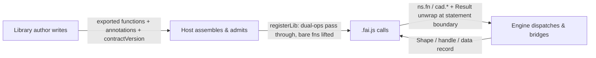

# 第三方库开发手册

[English](library-dev-guide.md) | 中文

> 本手册按 faijs 生态的三层分工组织——**库作者**写什么、**Host**（引擎装配方）处理什么、**`.fai.js` 脚本**调用什么。每层一节：职责、接口与边界。

> 相关文档：`docs/api-contract.md`（引擎契约——§7 三个 API 面与 Result 错误体系）、`docs/ops-api-inventory.md`（脚本面 `cad.*` API 手册）。

---

## 1. 三层一览


```mermaid
flowchart LR
  A[Library author writes] -->|exported functions + annotations + contractVersion| B[Host assembles & admits]
  B -->|registerLib: dual-ops pass through, bare fns lifted| C[.fai.js calls]
  C -->|ns.fn / cad.* + Result unwrap at statement boundary| D[Engine dispatches & bridges]
  D -->|Shape / handle / data record| C
```

| 层 | 角色 | 写 / 做什么 | 产出 | 关键接口 |
|---|---|---|---|---|
| ① 库作者 | TS/JS 库开发者 | 导出函数、`Result` 返回、`defineOp` / `fn.outputs` / `solidOf` 标注、`contractVersion` | 一个普通模块命名空间 | `@faicad/faijs/sdk` |
| ② Host | 引擎装配方（应用 / worker） | 创建运行时、注册库、提供内核与 backends | 可调用命名空间（`ns.*`、`cad.*`） | `runtime.registerLib(binding, ns, { autoLift: true })` |
| ③ `.fai.js` 脚本 | 用户 / UI / AI 生成代码 | 导入库并调用其函数 | 几何产物与值存储中的数据 | `ns.fn(...)` / `cad.*` |

数据流在编写期与运行期方向不同：库作者写命名空间，Host 注册并接纳，脚本调用已接纳的函数——引擎在两者之间处理分派、桥接与语句边界 Result。

---

## 2. 第一层——库作者写什么

### 2.1 库模块

faijs 库就是一个普通 TS/JS 模块命名空间，导出若干函数。库作者只写模块，**不负责注册**——那是 Host 的事（§3）。

```ts
import { keep, fromBrep, getBackends, CONTRACT_VERSION } from '@faicad/faijs/sdk'

export const contractVersion = CONTRACT_VERSION

export function external(params: { teeth: number; moduleSize: number; thickness: number }) {
  // ... build the gear, return a faijs Shape or a geometry handle ...
}
```

### 2.2 导出函数返回 `Result`

库函数返回 `Result<T>`（`ok` / `err`）。引擎在语句边界 unwrap：`err` 变成语句失败（`ExecutionResult.failedAt`）——**不是崩溃**；失败前已完成的语句保留其 outputs。意外异常（bug）仍会抛穿 `execute()`。

### 2.3 返回值——三分类

引擎用**单一判别**区分几何与纯数据——`__occtWasm` 标记（判别实现收敛在 `brep/handle-bridge.ts` 的 `isOcctHandle` 叶子）。返回值必须是以下三种形态之一：

| 返回值 | 分类 | 引擎行为 |
|---|---|---|
| faijs `Shape`（来自 `solid` / `fromBrep`） | 已包装 | 原样透传 |
| OCCT 句柄：带 `__occtWasm: true` 标记的对象，或 branded number id | 几何句柄 | 三角化 + 登记 BREP 槽（`fromHandle`） |
| 不带标记的 plain object | 纯数据记录（如 sheetmetal `part`） | 原样存储——**绝不**被当句柄三角化 |

把数据记录当句柄传入会在 SDK 边界以 `E_BAD_HANDLE` 显式拒绝，而不是在 kernel 深处崩溃。不要发明其他句柄形态。

还有两种返回值落在三分类之外，值得专门点名——被提升的裸函数会在作者毫无意图的情况下撞上它们：

| 返回值 | 落到哪里 | 后果 |
|---|---|---|
| `undefined`（`void` 函数） | 未通过对象判定，落进 `fromHandle(undefined)` | 硬失败：`E_BAD_HANDLE: expected an OCCT handle (numeric id or __occtWasm-tagged object); got undefined` |
| 未 await 的 `Promise` | 落进 plain object 分支——`typeof` 是 `'object'`，无标记 | **不报错**：被当成数据记录放行，既不 await 也不 reject——值静默丢失 |

`Promise` 那一行才是危险的：整条链路没有任何环节会报告它。调用为何会变成未 await，见 §4.5。

`unwrapResult` 只用一条结构判定识别 `Result`——`typeof v.ok === 'boolean'`（`api/internal/result-unwrap.ts`）。因此带布尔字段 `ok` 的数据记录会被当成 Result 解包：`ok: true` 取 `v.value`，`ok: false` 抛 `OpError`。返回的数据记录里绝不要用 `ok` 作字段名。

### 2.4 双路径 op：`defineOp`

用 `defineOp`（来自 `@faicad/faijs/sdk`）声明两条实现路径和 L3 元数据：

```ts ignore-check
import { defineOp, keepHidden } from '@faicad/faijs/sdk'

export const intersect = defineOp({
  mesh: (...shapes: Shape[]) => {
    if (shapes.length > 0) keepHidden(...shapes)
    return booleanMesh(reconcileBrepInputs(shapes), 'intersect')
  },
  brep: (...shapes: Shape[]) => {
    if (shapes.length > 0) keepHidden(...shapes)
    return booleanBrep(shapes, 'intersect')
  },
  capabilities: ['intersect'], // concrete BREP capability needed — a *WithHistory kernel
                              // function name, matched against the engine's `evolution` list
  outputs: [...],             // named multi-product fields (§2.6)
  schema: { ... },            // param types for the UI panel (L3)
  slotMap: { ... },           // positional → object boxing, for brepjs-style calls
})
```

- **`mesh` / `brep`**：两条引擎路径。`mesh` 是默认；`brep` 可选。brep-only op 在 mesh 路径抛 `E_MESH_UNSUPPORTED`。
- **`capabilities`**：op 需要的 BREP 引擎能力——按宿主声明的 `brepCapabilities` 门控。
- **`outputs`**：命名多产物字段（唯一被识别的多产物契约名；数组字段逐元素收养）。
- **`schema` / `slotMap`**：L3 元数据——UI 面板的参数类型，以及 brepjs 风格调用所需的位置 → 对象装箱表。

### 2.5 `keep` / `keepHidden`——UI 层可见性

控制哪些输入 shape 留在 UI 层显示。函数体声明（库作者写，执行期求值）**被调用点声明覆盖**（用户 / UI / AI 在脚本录制期写）：

| 声明点 | 谁写 | 优先级 |
|---|---|---|
| 调用点（`.fai.js` 语句选项） | 用户 / UI / AI | 最高 |
| 函数体（实现内部的 `keep` / `keepHidden`） | 库作者 | 被覆盖 |

### 2.6 裸函数与 `fn.outputs`

普通导出函数（未用 `defineOp`）在命名空间以 `{ autoLift: true }` 注册时被提升为 brep-only op。用唯一被识别的标注声明多输出字段：

```ts ignore-check
interface PlanetaryOutput {
  sun: ValidSolid
  planets: ValidSolid[]
  ring: ValidSolid
}
export function planetary(params: PlanetaryParams): Result<PlanetaryOutput> {
  // ... build sun, planets, ring ...
  return ok({ sun, planets, ring })
}
;(planetary as { outputs?: string[] }).outputs = ['sun', 'planets', 'ring']
```

### 2.7 `solidOf`——显式几何终端

对于数据中心库（sheetmetal：`part` 是一个内嵌 `solid` 的纯数据对象），提供 `solidOf(part)` 作为显式几何终端：

```ts ignore-check
export function solidOf(part: SheetMetalPart): Result<ValidSolid> {
  return ok(part.solid!)
}
```

### 2.8 硬约束

1. **`contractVersion`**：与运行时匹配（`assertContractVersion`）；双路径 op 缺它会被拒绝。
2. **不碰引擎内部**：不得访问引擎内部可变状态（`currentStmt` / `script` / `outputCache` / `brepChain`），不得查询或修改 DAG，不得原地修改已发布的 `Shape`。
3. **句柄所有权**：返回的句柄一旦被引擎收养，之后不得再 `delete()`（返回即转移）。

### 2.9 每个导出都是脚本面 API

接纳步骤遍历 `Object.entries(ns)`——不存在"内部导出"或"仅宿主可用导出"的概念（§3.3）。常量、`contractVersion`、从别处 re-export 的辅助函数、宿主侧的生命周期函数，全部都能从 `.fai.js` 触达；凡是函数的导出都要走提升，并承担 §2.3 的返回值契约。把宿主专用辅助（reset / flush / collect 回调、缓存）放在库**另外 import 的**模块里，库本身只导出脚本应该调用的东西。

### 2.10 库作者产出什么

一个普通模块命名空间：导出函数、可选标注（裸函数上的 `fn.outputs`）、可选 `defineOp` 声明、`contractVersion`。Host 原样接收这个命名空间——它从不改写库作者的代码。

---

## 3. 第二层——Host 处理什么

### 3.1 Host 职责

Host（Node 宿主或浏览器 worker）装配引擎并让库可被调用：

1. 提供引擎：内核（`brep` / `csg` / `sdf`）、backends、字体/资源——经 `createRuntime(ports, mode)`。
2. 用 `runtime.registerLib(binding, ns, { autoLift: true })` 注册库。
3. 提供 `cad` 命名空间（内置 op）与值存储。

### 3.2 注册库

```ts ignore-check
import { createRuntime, createNodePorts } from '@faicad/faijs'
import * as gear from 'my-gear-lib'

const runtime = createRuntime(createNodePorts(), 'auto')
runtime.registerLib('gear', gear, { autoLift: true })
```

`binding`（`'gear'`）是脚本导入并调用的名字：`.fai.js` 里的 `gear.external({ ... })`。

内部直接消费 faijs core `Shape` 并调用 core op 的库（faijs 化库，如 `sheetmetal`）必须加 `borrow: false`：默认的借入步骤会把嵌套的 `Shape` 实参改写成 brepjs 句柄视图，core op 随后会以 "input is not on the BREP chain" 拒绝它们。真正的 brepjs 形态库保持默认。

### 3.3 接纳——每个导出发生什么

以 `{ autoLift: true }` 注册时，Host 的接纳步骤处理命名空间的每个导出：

| 导出类型 | 发生什么 |
|---|---|
| `defineOp` 声明的函数（携带 `DUAL_OP_META`） | 按其 spec 原样透传——不重写 |
| 裸函数 | 提升为 brep-only op；`fn.outputs`（如有）成为其 `outputs` spec |
| `contractVersion` | 与运行时校验（`assertLibConforms`）——不匹配则拒绝整个库 |
| 其他值（常量、数据） | 原样登记供脚本访问 |

提升是**整个命名空间一次性**判定，不是逐导出判定：`autoLift ?? !hasDualOp(ns)`。只要命名空间里有至少一个 `defineOp` 函数，推断结果就是 `false`——所以**混合型**库（一个双路径 op + 若干裸辅助函数）里的辅助函数**不会**被提升，而全是裸函数的库则会被提升。命名空间混用两种形态时，显式传 `autoLift`，不要依赖推断。

### 3.4 引擎边界行为（Host 无感知）

脚本调用已接纳的函数时，边界机制由**引擎自己**处理——Host 不写任何这部分：

1. **分派**：mesh / brep 路径静态判定（链状态 + 能力），无运行时回退。
2. **借入**：faijs `Shape` 参数变成 brepjs 侧的零拷贝视图（仅当前调用内有效）。
3. **调用 + unwrap**：函数运行；`Result` 的 `err` 被 unwrap 成语句失败。
4. **收养**：几何产物跨回成为 faijs `Shape`（三角化 + BREP 槽）；纯数据原样透传（§2.3）。

### 3.5 Host 产出什么

可调用的命名空间：`gear.*`（第三方）与 `cad.*`（内置），都能从 `.fai.js` 以同样的语句级语义调用。

### 3.6 关掉提升——数据型与声明型库

返回值是数据、或只是登记声明（运动学、标注、元数据、颜色）的库，必须关掉提升。被提升的函数会被包成 brep-only op，产物要穿过 `wrapBrepOne`，`void` 或基本类型返回值在那里会变成 `E_BAD_HANDLE`（§2.3）。三种关掉提升的方式：

| 机制 | 谁写 | 键 | 适用 |
|---|---|---|---|
| `registerLib(binding, ns, { autoLift: false })` | Host | binding 名 | 宿主手动注册的库 |
| `libLoader.options.autoLiftFor = (name) => (name === 'my-lib' ? false : undefined)` | Host | 脚本里写的 import specifier（`packageName ?? specifier`） | 由 `import` 语句自动装载的库 |
| 库 `package.json` 里的 `"faijs": { "autoLift": false }` | 库作者 | 包名 | 浏览器宿主——`createBrowserLibLoader` 从构建期 `lib-meta.json` 或经 `prefetchMeta()` 取得 |

对不想影响的库，`autoLiftFor` 必须返回 `undefined` 而不是 `false`：`undefined` 才会回落到 `options.autoLift`，再回落到推断式。

关掉提升后命名空间原样注入：函数保持同步，可以返回 `void` 或任意值，对脚本而言就是普通 JS。代价是失去提升提供的边界服务——`Result` 不再被 unwrap（脚本拿到的是 `Result` 记录本身）、`fn.outputs` 不再做多产物收养、也没有能力门控与平台门控（§4.4）。

---

## 4. 第三层——`.fai.js` 调用什么

### 4.1 调用形态

parser 顶层调用实参是完整表达式（`lang/parser.ts`）——**`.fai.js` 在调用点上是真正的 JS 子集**：

- **位置实参任意形态、任意混排**：字面量（`addHole(p, 'root', 15, 15, 4)`）、数组、已声明变量、成员访问（`hem(p0.solid, spec)`）、嵌套命名空间查询、运行时表达式。
- **多个对象实参原样保留**：`tabAndSlot(p, tabSpec, slotSpec)` 可用——不覆盖、不合并。*末位*纯对象是选项槽（承载 `keep` / `keepHidden`），更早的对象是位置数据。

```js
import * as gear from 'my-gear-lib'
let g1 = gear.external({ teeth: 20, moduleSize: 2, thickness: 10 })
let b0 = cad.box({ size: [30, 30, 5] })
let u1 = cad.union(g1, b0)
```

### 4.2 语句边界行为

每个调用库 op 的语句都是一个边界：`Result` 被 unwrap（`err` → `ExecutionResult.failedAt`，之前已完成的语句保留其 outputs）；调用点的 `keep` / `keepHidden` 覆盖函数体声明（§2.5）。

### 4.3 调用矩阵

1. **对象形态入口是推荐风格，不再是硬性要求。** spec 对象参数仍是惯用方式，但首参是字符串 id、标量或数组的函数也能调用。
2. **脚本里可以读记录字段**（`hem(u1.solid, …)`——成员访问是运行时求值的表达式）；整份记录传递照常可用。
3. **库的 `err` 结果是语句失败，不是崩溃**——`OpError` → `ExecutionResult.failedAt`；失败前已完成的语句保留其 outputs。

对 `@faicad/sheetmetal` 的实测结论（整包注册，`{ autoLift: true, borrow: false }`）——现在全部签名形态都可调用：

| 可调用 | 示例 |
|---|---|
| spec 对象函数 | `author(spec)`、`hem(p, spec)` |
| 字符串 id / 标量 / 数组函数 | `addHole(p, 'root', 15, 15, 4)`、`allowance(p, 0.44)` |
| 变量上的成员访问 | `hem(p0.solid, { kFactor: 0.44 })` |
| 多个对象实参 | `tabAndSlot(p, tabSpec, slotSpec)` |
| 几何终端 | `unfoldSolid(s1)`——借入零拷贝 arena 视图 |

`solidOf` 作为显式终端保留，供 TS 兼容面与库侧使用；脚本面上它不再是*必需*的——成员访问（`p.solid`）可以直接取到该字段。
### 4.4 平台 op 与 `engines` 声明

库里的 op 只要**静态 import 了平台模块**（`occt-kernel/*` 或 `brepkit-kernel/*`），就是**平台 op**——import 是唯一判据（narrowing plan §1.1）。平台 op 必须在 `defineOp` 里声明平台身份：

```ts ignore-check
import { defineOp } from '@faicad/faijs/sdk'
import { occt } from './my-occt-only-helper' // imports occt-kernel/* → platform op

export const myOp = defineOp({
  name: 'myOp',
  engines: ['occt'], // REQUIRED for platform ops
  brep: async (ctx, ...args) => { /* ... */ },
})
```

规则（D11，由 `assertLibConforms` + CI 守卫 `check-platform-imports.mjs` 检查）：

1. **`engines` 只写真实引擎 id**——`'occt'` / `'brepkit'` / `'brep_mock'`（禁止裸 `string`）。
2. **`engines` 与 `capabilities` 可以并存**——两者正交：`engines` 收窄「在哪些引擎上跑」，`capabilities` 声明「需要哪些内核能力」。原 D11-7 互斥已于 2026-09-24 撤销，`assertLibConforms` 不再拒绝两者同时出现。两者皆空只允许 mesh-only op。
3. **拦截发生在执行期**——非目标引擎下 op 在触碰内核之前失败（`BrepUnsupportedError` → `ExecutionResult.failedAt`）。静态守卫只强制声明本身，不能替代声明。
4. **`brep_mock` 豁免拦截**（测试替身，D11-3）——但声明的 `engines` 仍参与 parity / engine-switch 测试。
5. **库的 dual-op 若 import 了平台模块，同样受此约束**——在 `defineOp` 写 `engines`，拦截发生在执行期 `dispatchPath`，不依赖注册期校验。

中立 op（实现只经 `getBrepApi()` L1 方法）*不得*写 `engines`——L1 契约面天然与引擎无关。

### 4.5 不在语句位置上的库调用

有三处库调用的行为与 §4.1 不同。本机函数 ABI 本身（注入的命名空间绑定、逐字嵌入的函数体）由 `docs/language-design.md` §6.2 规定。

1. **用户函数体读不到顶层脚本变量。** 那里只能解析到形参、命名空间绑定与 S4 安全全局；顶层的 `const SUN_TEETH = 20` 在函数体内不可见，报 `SUN_TEETH is not defined`。函数体需要的值一律走实参传入。
2. **函数体内的 op 调用不会被 await。** 那里的 `ns.fn(…)` 产出一个 `Promise`，而引擎只在语句边界插入 `await`（§4.2）。把 op 结果收集进数组的函数体，交出去的是一组未决 Promise；返回值分类会把它们当数据记录放行（§2.3）——数据丢失且不报错。VM 后端（默认，`exec-backend.ts`）不 await，解释器后端在表达式求值时会 await 每一次调用。两者都不要依赖：设计数据型 API 让结果在语句层被消费，或关掉提升（§3.6）让调用变同步。
3. **命名空间绑定不是顶层标识符。** 它只在语句变换把调用改写成 `await __ns.<binding>.<fn>(…)` 的位置上被绑定。在任何其他顶层值位置——`let ms = [anim.driver('a', 1)]`——该名字保持未绑定，报 `anim is not defined`。把这种数组字面量直接写在调用实参位置。

脚本无法用手工 await 补救第 2 条：实参位置的 `await` 在解析期就被拒绝（`E_VALUE: unsupported value expression: AwaitExpression`）。


---

## 5. 端到端走查

一个函数跨越全部三层，逐步看：

1. **库作者写**（第一层）：`planetary` 返回 `Result<{ sun, planets, ring }>` 并携带 `fn.outputs = ['sun', 'planets', 'ring']`（§2.6）。
2. **Host 注册**（第二层）：`registerLib('gear', gear, { autoLift: true })`——`planetary` 被提升为 brep-only op，`outputs: ['sun', 'planets', 'ring']`；`contractVersion` 通过校验（§3.3）。
3. **脚本调用**（第三层）：`let p0 = gear.planetary({ ratio: 4 })`——语句记录调用点的 `keep`，引擎分派、借入 shape 输入、调用 `planetary`、unwrap `Result`。
4. **产物返回**：`p0.sun` / `p0.planets` / `p0.ring` 被收养为 faijs `Shape`（或数据记录），存入值存储——后续语句可继续使用（`cad.union(p0.sun, b0)`）。

每一步恰好属于一层：库作者写，Host 接纳，脚本调用，引擎桥接。

---

## 6. 移植已有的 brepjs 库

已经写过 brepjs 库？移植基本是机械性的——faijs 沿用 brepjs 惯例（位置参数、`Result` 返回、DSL）：

1. **改导入**：`from 'brepjs'` → `from '@faicad/faijs'`（`package.json` 同步）。
2. **删除 `registerKernel` 调用**——faijs 管理内核（单实例）；由宿主提供。
3. **删除 `pinned` 数组 / finalizer 变通方案**——收养生命周期（借入 → 调用 → unwrap → 收养）由引擎处理，库不再管理释放。
4. **注册命名空间**：`runtime.registerLib('mylib', myNamespace, { autoLift: true })`。
5. **按需补 `fn.outputs` / `solidOf`**（§2.6 / §2.7）。

brepjs 侧的惯例概念（借入视图仅限当前调用、返回句柄所有权转移）本身就是 brepjs 的约定。移植中遇到引擎边界问题时，第一层（§2.3 返回分类、§2.6 `outputs`、§2.7 `solidOf`、§2.8 硬约束）是权威契约。
