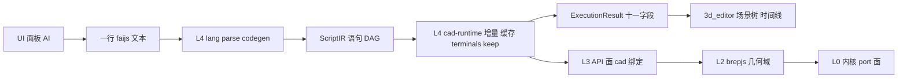
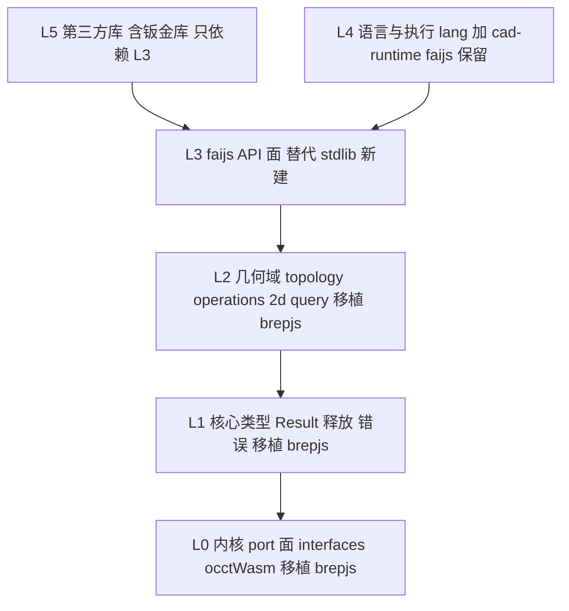

# faijs 架构重构：移植 brepjs 分层 API，重建底层

- 日期：2026-09-01（**v4**；v3/v2/v1 同日，v1 前提被否决）
- 状态：**实施中（P0 已落地：验收套件 + §2.8 锚点全绿；D1-⓪ faijs 侧桥接；D8/D9 骨架。P1 已落地：vendored `core/`+`utils/`+最小 kernel 契约，隔离编译与边界全绿。P2 已落地：`kernel/occtWasm` 全树 + `geometry2d/hullGeometry/stlBuilder` 移入，D10 冻结注册表 + L3 桥接 `api/occt-kernel-bridge.ts`，单实例断言 5/5 含建模冒烟。O13 已定夺：根包 license 升 Apache-2.0。P3 首版落地：L2 `topology/`+`query/`+`measurement/` 第一批以 brepjs 自己的测试跑通 —— `packages/tests/faijs/p3-vendored-surface/`（harness：facade 重导出 + initOcctWasm/bindOcctKernel D10 装配 + 完整 divergence 注册表按 occt-wasm 分支），22 个测试文件在全集 vitest 内 634 passed/2 skipped 全绿；其 `tests/` 子目录为 brepjs 原样测试拷贝，按上游惯例 exclude 出严格 tsc（corner/blueprint/sketch 层属 2d/blueprints，留 P5）。P4 首版落地：`defineOp` 扩展 `consumes`/`schema` 静态元数据（D2 G3/G4），消费判定链 C0→C2→C3→C5（C2 经 opConsumes 读声明），`box`/`cylinder` 声明 `consumes:'none'`+schema，`union` 声明 `'all'`；新增 `packages/tests/faijs/p4-l3-e2e/` 验收套件打通 `.fai.js → execute → terminals → ExecutionResult` 宿主链路（naming/topology/brepSolids 在场），配 C2 与元数据单测，全量 vitest 全绿）。P5 落地：L2 全量移植 `operations/`(24) `2d/`(38 含 blueprints) `sketching/`(11) `io/`(12) `gear/`(4) + `kernel/solverAdapter` + `text/`(4) `projection/`(3) `draw3d/drawingFactories` + `kernel/occt/wasmTypes/externals` 类型面——**不含 csg（D6）、implicit/voxel（推迟）**；`packages/tests/faijs/p5-vendored-surface/` harness（facade 重导出 + D10 内核装配 + divergence 复用 P3 注册表）用 brepjs 自己的测试跑通 operations/2d/sketching/io/gear/text 共 29 文件 631 tests 全绿；边界 `check-layer-boundaries` 237 个移植文件、ghost-deps、vendored 隔离编译全绿（具体数字见 commit）**
- 参照实现：`C:\git\OpenCascade\brepjs`（Apache-2.0，83528 行 src / 380 文件，L0–L3 分层 + 可插拔内核 + 三个领域扩展包）
- v3 变更：**① 不移植 `csg` 模块；② 取消 stdlib 包与"标准库"概念；③ 补齐 `cad` 前缀与命名空间设计；④ 新增钣金库移植作为 API 能力验证**
- v4 变更（全仓代码核查后的纠错与补缺）：**① 新增 D10（内核单实例 + `getKernel` 冻结而非砍除——v3 砍掉它会让全部移植 L2 无法运行）；② 新增 D11（既有几何层去向表 + L3 双链实现来源规则，`kernel/manifold` 移出 P2）；③ 新增 D12（钣金 Result 兼容 shim，保住"<5% 改动量"判据）；④ 修正事实错误：`ExecutionResult` 实为 11 字段（漏 `naming`）、`registerLib('cad')` 在门面而非 runtime.ts、钣金为 40 函数/227 it、`./stdlib` 有 3d_editor 生产消费者需先迁移、screw-db 在 core 不在 stdlib、`./csg` 是 faijs 自有导出勿与 brepjs csg 混淆、`.fai.js` 扩展名、D2 与已有 `defineOp` 对齐**

> **编号约定**：**U** = 不可变约束（上层特性）；**X** = 被抛弃的旧规则；**L** = 层；**D** = 设计决策；**P** = 分期；**O** = 开放问题。

---

## 0. 需求与约束

### 0.1 用户原话（需求基线，不准删改）

**首轮**：

> 我想更改本系统的设计。引擎层暴露最基础的op能力。基于改能力之上，叠加多层api。第三方根据上层来实现cad建模。这个方案是否可行？api如何分层可以参考../brepjs项目，请写一份分析方案。

**二轮（否决 v1 前提）**：

> 几何运算全部交给 faijs 语言库实现？ 我明明说的是：我想更改本系统的设计。 也就是说你自己要判断，哪些规则可以抛弃。这明显是一个要抛弃的规则。包括faijs 里没有"op"之类的说法，都可以抛弃，或者重新定义。
>
> 如果说有规则，就是上层的应用，功能不能被改变，已有特性必须仍然支持。比如UI生成代码，append增量执行，timeline显示，brep与mesh的融合，这些上层特性需要保留，需要能够支持。底层都可以改。
>
> stdlib也可以扔掉。其实这个stdlib并不是什么标准库。它支持上层3d_editor应用需要的api接口罢了，不具有通用性。
>
> 而且让你参考brepjs库呀。我需要整个参考它的实现，需要把它移植过来。第三方库基于上层api来开发。从重写这份文档，重点关注brepjs不支持而faijs需要支持的特性，但是要把它的api分层架构和代码都移植过来。

**三轮（本次修订）**：

> 这份文档要更新。首先，brepjs里的csg模块不需要移植；然后，取消stdlib的包和这个标准库的概念。方案里大方向是正确的，但是细节没写清楚，比如是否是import * as cad from faijs，cad这个前缀要如何处理；还有，要把brepjs的钣金库移植过来，证明faijs的api写库的能力。

### 0.2 前两版的教训

| 版 | 错在哪 |
|---|---|
| v1 | 把既有红线当成不可动摇的前提，去判定用户诉求"不可行"。**当诉求与文档冲突时，应当主动提出抛弃规则** |
| v2 | 方向对了，但**细节粒度不够**：没交代 `cad` 前缀的语义与处理方式；没给出"API 够用"的可验证判据 |

### 0.3 新红线：只有上层特性不可变

| # | 不可变约束 | 含义 |
|---|---|---|
| **U1** | **UI 生成代码** | UI/AI 生成 `.fai.js` 文本的链路必须仍可工作 |
| **U2** | **append 增量执行** | 按语句追加执行 + 增量重算必须仍可工作 |
| **U3** | **timeline 显示** | 宿主据 `ExecutionResult` 建时间线/场景树的能力必须仍可工作 |
| **U4** | **BREP 与 mesh 融合** | 双链路、链切换、身份槽并存必须仍可工作 |
| **U5** | 宿主契约不变 | `ExecutionResult` 字段集合与语义；宿主调用的导出面（`analyzeCode`/`codeToArgs`/`formatCodeLine`/`parseScript`/…） |
| **U6** | 回归锚点测试通过 | §2.8 列出的测试必须仍绿 |

### 0.4 被抛弃的规则（明确清单）

| 编号 | 旧规则 | 出处 | 处置 |
|---|---|---|---|
| **X1** | 几何运算全部交给 faijs 语言库实现，引擎不内置 | `Faijs语言的思考.md` §5 | **抛弃** |
| **X2** | faijs 里没有"op"、也没有"内置函数"这一类别 | engine-library-contract §7.3 | **抛弃**。**重新定义：op = 引擎提供给 `.fai.js` 的几何 API，一等公民，有声明、有能力、有元数据** |
| **X3** | 引擎零函数知识 | engine-library-contract K5 | **重新定义**：引擎认识 L3 API 声明层登记的函数；`cad` 与第三方库仍同构（同构性保留） |
| **X4** | stdlib 是标准库 | 事实 | **抛弃**（§D1）。删除 `packages/stdlib` 包，概念改为 **L3 faijs API 面** |
| **X5** | 隐式注入末参 `exec` 禁止 | engine-library-contract K1 | **保留** |
| **X6** | BREP/mesh 静态分派、禁止运行时回退 | `AGENTS.md` ⚠️ | **保留**（faijs 相对 brepjs 的优势） |
| **X7** | keep 是 faijs 与 UI 的唯一耦合点 | engine-library-contract K3 | **保留** |

---

## 1. 结论速览

**用 brepjs 的成熟分层替换 faijs 的几何底层；faijs 只保留自己独有的语言层与执行编排层。**

| 层 | 来源 | 规模 | 性质 |
|---|---|---|---|
| **L0 内核 port 面** | brepjs `kernel/interfaces` + `occtWasm`（砍 brepkit/occt/**manifold**，v4） | ~9.4k 行 | 移植 |
| **L1 核心类型** | brepjs `core/` + `utils/` | ~3.3k 行 | 移植 |
| **L2 几何域** | brepjs `topology/`、`operations/`、`2d/`、`query/`、`measurement/`、`io/`、`sketching/`、`gear/`、`implicit/`、`lattice/`、`projection/` | ~31.4k 行 | 移植（主体） |
| **L3 faijs API 面** | **faijs 新建**，替代 stdlib | ~2k 行 | 新建 |
| **L4 语言与执行** | **faijs 保留** `lang/` + `cad-runtime/` | ~10k 行 | 保留 |
| **L5 第三方库** | 普通 npm 包，**含移植的钣金库** | — | 只依赖 L3 |

**四项决策要点**：

1. **不移植 `csg` 模块**（§D6）。硬证据：brepjs 自己的钣金库就零 csg 依赖（§7.3），说明 csg 不是生态必需。
2. **取消 stdlib 包与概念**（§D1）。几何实现删除，`screw-db` 等独有资产迁出，"标准库"改称 **faijs API 面**。
3. **`cad` 是绑定名，不是包名**（§5.3）。`import * as cad from '@faicad/faijs'` 与 `.fai.js` 里的 `cad.*` 指向**同一个函数集合**——这是给库作者的强保证。
4. **移植钣金库作为 API 能力验证**（§7）。10278 行领域逻辑只消费 **40 个运行时函数 + 8 个类型**（v4 修正：v3 写 41，实际枚举就是 40 个，已逐项 grep 核对无多无缺）——这张清单就是"API 够用"的可执行判据。

---

## 2. 上层特性：必须保住的契约（不可变面）

> 移植 brepjs 时，以下机制必须原样或等价保留。每条附代码证据。

### 2.1 契约面总览



### 2.2 U1 · UI 生成代码

**关键事实：UI 与 AI 不共享 `ScriptIR`，共享的是「一行 `.fai.js` 源码文本」。**

宿主侧唯一入口是 `formatCodeLine`（纯数据 → 一行代码），由 3d_editor 的 12+ 个 feature 复用（`3d_editor/src/engine/features/types.ts:23,109-115,177`）。硬红线：**宿主禁止 import `ScriptIR`/`StatementIR`**（`statement-summary.ts:6-8`）。

| 机制 | 位置 | 约束 |
|---|---|---|
| codegen 是**机械打印机，无 per-callee 分支** | `lang/codegen.ts:128-163`（四分支：解构/成员调用/无赋值/赋值） | **移植不得引入 per-op 打印逻辑** |
| 往返契约 | `packages/tests/faijs/syntax.test.ts:55-76`（对所有 `.fai.js` 递归跑） | 回归锚点 |
| 依赖的数据结构 | `StatementIR`（`lang/types.ts:72-110`）、`ArgIR` 三变体（`types.ts:26-45`）、品牌类型 `StmtId`/`PartName`（`identity.ts:56-57`） | 扁平标量形态；**`SolidShape` 与 `StatementIR` 无关** |
| 反向（代码行 → args 供面板回填） | `codeToArgs`（`lang/code-to-args.ts:87-99`），宿主在 `ScriptEngine.ts:1320` 取 `CommandParams` | 必须保留 |

### 2.3 U2 · append 增量执行

| 机制 | 位置 | 约束 |
|---|---|---|
| 编译产物 = **零 import ESM 文本 + 并行元数据** | `lang/compile.ts:208-259`（零 import 是 Node `data:` URL / 浏览器 Blob URL 都能直接 `import()` 的前提，`compile.ts:6-9`） | 必须保留 |
| 增量粒度 = **语句级** | `CadRuntime.append`（`runtime.ts:431-456`） | 必须保留 |
| 缓存键算法 | `module-executor.ts:408-421`：`<ns>.<callee>` + `JSON(args 去掉 keep 两键)` + **依赖的 `outputContentKey` 级联** | 必须保留 |
| 内容键 | `content-key.ts:8-26`，FNV-1a 逐元素 | 必须保留 |
| **三级缓存** | ① `ModuleExecutor.ctx`（`:91`）② `executor.cache`（`:95`）③ `CadRuntime.statementCache`（`runtime.ts:653-667`） | 必须保留 |
| DAG 与失效 | DAG 在 `compile.ts:222-235` 构建；失效在 `runtime.ts:513-541` `planCompiled`；拓扑排序在 `module-executor.ts:194-210` | 必须保留 |
| 顶替释放（失败天然回滚） | `module-executor.ts:166-186` | 必须保留 |

> 参数语句也编译成语句（`compile.ts:213-217`），改参数经 deps 级联让下游 stale——这是增量的关键设计。

### 2.4 U3 · timeline 显示

| 机制 | 位置 | 约束 |
|---|---|---|
| `ExecutionResult` 十一字段 | `runtime.ts:115-162`（`outputs/brepChain/terminals/infos/failedAt/brepSolids/topology/naming/compounds/changed/activeValues`） | 不变。**v4 修正：v3 写"十字段"漏了 `naming`**（`runtime.ts:148`，拓扑命名，来自 `docs/plans/2026-08-31-topology-naming-port-v2.md`，宿主拾取反查依赖它） |
| `TerminalShape` | `lang/types.ts:136-145`（`id: PartName / meta / kind / hidden`） | 不变 |
| terminals 推导 | `cad-runtime/terminal-dag.ts:113-169`：`computeLeafTerminals` = **最后写者 P 之后无任何语句消费该变量 → 终端** | 必须保留 |
| 消费判定短路链 | `cad-runtime/terminal-dag.ts:50-96`：C0/C1（keep）→ C3（输出全非几何 → 不消费）→ C5（默认消费） | 必须保留 |
| 宿主消费 | `3d_editor/src/engine/script-engine/ScriptEngine.ts:1278-1358` `commitSceneResult` | 契约不变 |

> 判定单位是 **PartName，不涉及 StmtId**（`terminal-dag.ts:23`）。

### 2.5 U4 · BREP 与 mesh 融合

**Shape 同时持有 mesh 与 BREP 句柄——通过并列的「身份槽」而非字段。**

```ts
// shape.ts:98-121 —— BREP 句柄不在 Shape 对象上，在 WeakMap 身份槽里
export function getSlot(shape: object): ShapeSlot | undefined { return getRuntimeState().slots.get(shape) }
export function hasBrep(shape: Shape): boolean { return getRuntimeState().slots.get(shape)?.solid !== undefined }
export function brepOf(shape: Shape): unknown | undefined { return getRuntimeState().slots.get(shape)?.solid }
```

| 机制 | 位置 | 约束 |
|---|---|---|
| 身份槽 | `runtime-state.ts:115,120-125`：`WeakMap<object, ShapeSlot>`，`{ solid?, faceEvolution?, behavior? }`；`fromBrep()` 一次登记三者（`shape.ts:51-59`） | **硬 API**：`getSlot`/`hasBrep`/`brepOf`/`fromBrep`/`fromHandle` |
| 槽挂全局锚点 | `globalThis.__FAICAD_FAIJS_RUNTIME__`（`runtime-state.ts:167-197`）——宿主与第三方库各打一份 faijs 时身份不孤岛 | 必须保留 |
| 静态分派 | `backend-dispatch.ts:67-118`；**禁 try-catch 回退**（`:6-7`） | 必须保留 |
| 链状态 | **逐 part** 判定，`solidCache.has(partName)` 即在链上（`brep-chain.ts:61-76`） | 必须保留 |
| 断链事件 | `part-brep-lost` 由引擎统一发（`module-executor.ts:382-401`） | 必须保留 |
| 面演化 | `face-evolution.ts` 纯 hash↔ordinal 编解码；布尔走 `*WithHistory`（`:141-178`） | 必须保留 |

### 2.6 keep 语义（U3 的支撑）

语义集中在 `lang/keep.ts:12-15`，运行时三处集中点：

| 点 | 位置 | 关键性质 |
|---|---|---|
| 函数体声明 | `runtime-state.ts:272-292` `keep()/keepHidden()` → 读 `currentStmt`（`module-executor.ts:172` 设置）→ `internalKeep`（`:262-273`） | 缓存命中时保留上一轮记录（`:96-101`，**增量下 keep 不失效的关键**） |
| 调用点声明 | `parseUserKeep`（`keep.ts:99-119`） | 三种条目形态等价 |
| 合并优先级 | `resolveKeep`（`keep.ts:129-143`）：调用点 > 函数体 | 不变 |
| 三处剥离点 | ① 编译发射前（`compile.ts:164`）② `statementKey` 排除 keep 两键（`module-executor.ts:415`）→ **切换保留/隐藏零几何重算** ③ terminal-dag 消费判定（`terminal-dag.ts:57`） | **漏一处就丢增量零重算或 terminals 判定** |

### 2.7 宿主契约：`ExecutionResult`

`commitSceneResult` 逐字段消费（`ScriptEngine.ts:1278-1358`）。缺 `compounds`/`activeValues`/`topology`/`naming` 会**静默降级**——最危险的回归类型，验收必须逐字段断言（**十一个字段，含 `naming`**）。

宿主 API 契约面由 `3d_editor/src/engine/__tests__/contract-entry.test.ts:222,240` 断言：**`analyzeCode`/`codeToArgs`/`formatCodeLine`/`parseScript`/`statementToLine`/`scriptToCode`/`buildArgsParts` 必须导出**。

### 2.8 回归锚点测试（U6）

| 测试 | 覆盖特性 |
|---|---|
| `packages/tests/faijs/syntax.test.ts:55-76` | **UI 代码生成**：全量 `.fai.js` 往返 + codegen 确定性 |
| `packages/tests/faijs/mixed/mixed.test.ts:76-119` | **BREP/mesh 融合**：M1–M5 混合矩阵 |
| `packages/tests/faijs/parity/parity.test.ts:65-79` | 双链路 bbox 等价（1% 容差） |
| `packages/tests/faijs/multi-mesh/multi-mesh.test.ts:48-62` | **timeline 多终端** + split DAG |
| `packages/core/src/cad-runtime/runtime.test.ts:418-465` | **append 增量**：`beforeCalls === ['s3']`、只重算 stale 及下游、无变更零执行 |
| `runtime.test.ts:604,686,863` | **装配**：`do_assemble` 变换 moving part、`brepSolids` 新 handle |
| `runtime.test.ts:973-1017` | **timeline terminals** |
| `runtime.test.ts:1103-1151` | **第三方库**：statementKey 包名前缀不碰撞、`registerLib` 版本不匹配抛错 |
| `runtime.test.ts:1154-1190` + `packages/tests/faijs/v53-lib-brep-dispatch/` | 第三方 `brepImpl` 静态分派矩阵 |
| `packages/core/src/cad-runtime/keep.test.ts:141,161,260,396` | **keep**；`:396-421` 是 keep+append 交叉的唯一锚点 |
| `packages/core/src/brep-mesh-equivalence.test.ts:219-560` | 双链路精度等价 |
| `packages/core/src/lang/parser.test.ts:272-320`、`codegen.test.ts:236-330` | 单元级往返 |

---

## 3. brepjs 移植清单

### 3.1 代码量与移植决策（`src/`，83528 行 / 380 文件）

| 目录 | 行数 | 占比 | 决策 |
|---|---:|---:|---|
| `kernel/` | 37371 | 44.7% | **部分**（砍 brepkit 9224 + occt 8211 + manifold 7530 → 剩 ~12.4k，见 §3.2） |
| `topology/` | 11473 | 13.7% | **整搬**（49 文件） |
| `2d/` | 7105 | 8.5% | **整搬**（纯 TS，38 文件） |
| `operations/` | 4971 | 5.9% | **整搬**（24 文件） |
| `core/` | 2974 | 3.6% | **整搬**，需对齐内核接口 |
| `io/` | 2948 | 3.5% | 部分（平台相关改写） |
| `sketching/` | 2569 | 3.1% | **整搬** |
| `voxel/` | 1311 | 1.6% | **暂缓**（依赖 Rust WASM） |
| `gear/` | 1269 | 1.5% | **整搬**（纯算法） |
| `query/` | 746 | 0.9% | **整搬** |
| `worker/` | 685 | 0.8% | 改写（faijs 已有 browser-host/worker） |
| `implicit/` | 565 | 0.7% | **整搬**（faijs 已有 sdf） |
| `measurement/` | 528 | 0.6% | **整搬** |
| `utils/`、`text/`、`lattice/`、`projection/`、`ns/` | 1552 | 1.9% | **整搬** |
| **`csg/`** | **5570** | **6.7%** | **❌ 不移植**（§D6） |
| `src` 根 barrel | 2191 | 2.6% | 重写 |

**净效果**：src 总量 83528 → **约 48.8k 行**（v4：再减去不搬的 `kernel/manifold` 7530 行；v3 的 52.9k 还内含一处算术错误——kernel 砍 brepkit+occt 后剩 19936，不是 12.8k）。

### 3.2 kernel 层：搬 / 砍

| 子目录 | 行数 | 决策 | 理由 |
|---|---:|---|---|
| `kernel/interfaces/` | 1289 | **搬** | 契约切片（16 个 `KernelXxxOps`），L0 的定义 |
| `kernel/` 根 | 3423 | **搬**（`withKernel`/`init` 三级回落除外；`getKernel` **冻结保留**，D10） | 见 §D4/D10 |
| `kernel/occtWasm/` | 8107 | **搬** | faijs 用的正是 npm `occt-wasm`，适配器直接可用 |
| `kernel/manifold/` | 7530 | **不搬（v4 降级，D11）** | mesh 链由现有 `mesh/` 层承担；opGraph/replay 本就在砍除清单，剩余适配器价值不足以抵消重接成本 |
| `kernel/brepkit/` | 9224 | **砍** | faijs 无 brepkit 后端 |
| `kernel/occt/` | 8211 | **砍** | 用 `occt-wasm` 替代 `brepjs-opencascade` |

### 3.3 合规与依赖

| 项 | 事实 | 处置 |
|---|---|---|
| **License** | 主包 `brepjs` **Apache-2.0**；`packages/brepjs-opencascade` **LGPL-2.1-only** | **不搬 opencascade 包**。`src/kernel/occtWasm/` 属主包可搬。移植文件保留 Apache-2.0 头与 NOTICE |
| 运行时依赖 | brepjs 仅 2 个：`flatbush`、`opentype.js` | faijs 已有 `opentype.js ^1.3.4`；`flatbush` 随 `2d/` 引入 |
| 内核 peerDeps | `occt-wasm: ^3.8.0 \|\| ^4.0.0`（optional） | faijs 用 `occt-wasm 3.8.4`，**在范围内** |
| `manifold` | brepjs 经 `brepjs-manifold`（20 行壳）；`src/kernel/manifold/` 内**无直接 `manifold-3d` import**，模块经 DI 注入 | faijs 用 `manifold-3d ^3.5.1`；**v4：适配器不搬**（D11），O2 关闭 |
| TS 严格度落差 | brepjs 开 `noUncheckedIndexedAccess` + `exactOptionalPropertyTypes`；faijs 未开 | 隔离编译（§D9） |

---

## 4. 差异特性：brepjs 不支持、faijs 必须自建

> 移植 brepjs 能拿到"几何能力"，但下面八项**一件都搬不到**——它们是 faijs 的存在理由。

| # | 特性 | brepjs | faijs 要求 | 处置 |
|---|---|---|---|---|
| **G1** | **文本语言层** | ❌ 完全没有（纯 TS 库） | `.fai.js` 文本 + parse/codegen 往返 | 保留 `lang/` |
| **G2** | **增量执行** | ❌ 无语句概念，调用即执行 | 语句级 DAG + 三级缓存 + append | 保留 `cad-runtime/` |
| **G3** | **timeline / terminals** | ⚠️ 仅 `historyFns` 线性步骤列表 | DAG 终端推导 C0–C5 + keep | 保留 `terminal-dag.ts` |
| **G4** | **keep 保留语义** | ❌ 无（不关心"显示什么"） | 保留/显示是 UI 唯一耦合点 | 保留 `keep.ts` + 三处剥离 |
| **G5** | **BREP/mesh 双链** | ⚠️ **op-graph replay**（运行时重放=回退） | 静态分派 + 身份槽 + 链切换，**禁回退** | **改造**（§D4） |
| **G6** | **装配的引擎侧传播** | ⚠️ 有求解器，无失效重算 | 求解 + 下游失效重算 | 求解可搬，**传播保留 faijs** |
| **G7** | **宿主契约 ExecutionResult** | ❌ 无 | 十一字段（含 `naming`）+ `compounds` 建场景树 | 保留 |
| **G8** | 第三方库动态加载 | ⚠️ 有但复杂（Blob wrapper + 源码改写） | `ModuleResolver` + `registerLib` | 保留 faijs（更简洁） |

### 4.1 G1 · 语言层

`lang/`（parser/codegen/symbol-table/keep；**args-schema 已删除**，§4.1 现状注记）**完全保留**，不参与移植。

**新增约束**：L3 API 面必须提供**参数 schema 元数据**供 codegen 与 UI 面板使用（brepjs 从 TS 类型直接获得，faijs 运行时无类型）。**现状（v4 核查）**：`lang/args-schema.ts` 的 SCHEMAS 已删除（参数校验由 stdlib `assert.ts` 助手承担）；现存元数据链路是 ① `packages/core/scripts/gen-symbol-table.ts` 从 `internal-stdlib` 的 cad 命名空间生成 `lang/symbol-table.generated.ts`（P1 后只剩**键存在性**，供 `check()` 符号检查）；② 根 `scripts/gen-ops-api-inventory.ts` 从 stdlib JSDoc 生成 API 手册。**迁移为从 L3 声明生成**（§D2）：schema 进 L3 声明后，symbol-table 的键集合与 ops-inventory 的条目都从同一份声明派生。

### 4.2 G2 · 增量执行

`cad-runtime/`（DAG/增量/缓存/失效/顶替释放）**完全保留**。变化只在于：**语句 fn 调用的目标从 stdlib 函数换成 L3 API**。

**关键冲突**：brepjs 函数是**纯函数**（返回 `Result`、不消费输入），与 faijs 的"默认消费"（C5）假定冲突。处置见 §D5——**消费语义是 faijs 的声明，不由 brepjs 函数决定**。

### 4.3 G3/G4 · terminals 与 keep

`terminal-dag.ts` 与 `keep.ts` **完全保留**。必须解决的新问题：

> brepjs 函数是纯函数，**不声明"我消费了哪些输入"**。faijs 的 terminals 推导依赖消费判定。

**解法**：消费语义**不在 brepjs 函数里**，而在 **L3 API 声明里**（§D2）——`consumes: 'all' | 'none' | number[]`，默认 `'all'`。这替代现在 stdlib 函数体的 `keep()` 调用：**声明从"运行时调用"上移到"API 声明"，更静态、更可测、能进 codegen 元数据**。

### 4.4 G5 · BREP/mesh 双链（架构根本不同，最需改造）

| | brepjs | faijs |
|---|---|---|
| 内核模型 | 单内核可插拔（`getKernel()` 可变全局） | **双链并存**，静态分派；**双槽位注册表**（`brep/engine/registry.ts`，与 brepjs `registerKernel` 同构但 mesh/BREP 正交、装配后冻结） |
| 精度补救 | **op-graph replay**：mesh 上执行时记录 `OpNode`，事后在 OCCT 重放 | **不存在回退**：执行前判定走哪条链 |
| 能力表达 | `KernelCapabilities { exact, brepExport, exactMeasurement, tessellationModel }` | **已实现能力路由**：`defineOp` 的 `capabilities` 声明 + `dispatchPath`（`backend-dispatch.ts:67-118`）按 `config.brepCapabilities` 路由（auto 降级 mesh / brep 模式抛错） |

> **v4 现状修正**：v3 把 faijs 现状描述为"`brepImpl: boolean` 标记"——已过时。能力声明与路由**已经落地**（2026-08-29/30 两案），D4 的伪代码与现有 `dispatchPath` 基本一致。因此 P7 的实际剩余工作只有：把 brepjs `KernelCapabilities` 的字段（`tessellationModel`、`disposalModel` 等）**并入**现有 `BrepCapabilities` 数据，而不是"用 capabilities 替换布尔标记"。

| 动作 | 内容 |
|---|---|
| ✅ **搬 `capabilities` 模型** | 字段并入现有 `BrepCapabilities`；L3 声明沿用 `defineOp` 已有的 `capabilities` 字段（**不叫 `requires`**，见 D2） |
| ❌ **砍 op-graph + replay** | `kernel/manifold/opGraph.ts`(47) + `replay.ts`(572)。运行时回退的变体，违反 X6 |
| ❌ **砍 `withKernel` 运行时切换** | brepjs 自陈的脆点（async 回调静默用错内核）。**但 `getKernel()` 不能砍**——见 D10：移植 L2 每个函数都调 `getKernel()`，砍掉则 L2 全灭；处置是"一次性绑定 + 冻结"，与现有 `freezeEngineRegistries()` 同语义 |
| ❌ **砍 `init()` 三级 WASM 回落** | try/catch 动态 import |
| ✅ **保留身份槽** | 双链融合的挂载点，brepjs 无对应物（§D5） |

### 4.5 G6 · 装配

| 部分 | brepjs | faijs | 决策 |
|---|---|---|---|
| 约束求解 | `mateFns.ts`(199) + `solverAdapter.ts`(384)，已解算 fixed/concentric/angle/coincident/distance | `compound.ts:126-143` `solveFaceMate`（Rodrigues） | 见 O4，建议**先保留 faijs** |
| **下游失效重算** | ❌ 无 | `module-executor.ts:335-364` `applyPendingAssemblyTransforms` | **必须保留 faijs** |
| 宿主消费 | ❌ | `ExecutionResult.compounds` → `model-store.ts:144-167` | **必须保留** |

### 4.6 G7/G8 · 宿主契约与第三方库

`ExecutionResult` 十一字段、`registerLib`、`ModuleResolver`、`CONTRACT_VERSION`——brepjs 无对应物，**完整保留**。

---

## 5. 目标架构

### 5.1 分层总图



### 5.2 移植后的目录布局（`packages/core/src/`）

```
packages/core/src/
  ── 移植自 brepjs ──────────────────────────────
  kernel/            L0  interfaces/ + occtWasm/（砍 brepkit/occt/manifold，manifold 不搬见 D11）
  core/              L1  Result·shapeTypes·disposal·errors·validityTypes·vecOps
  topology/          L2  布尔·倒角·抽壳·变换·查询·网格化（49 文件）
  operations/        L2  扫掠·放样·阵列·螺纹·装配求解（24 文件）
  2d/                L2  草图与蓝图系统（38 文件，纯 TS）
  query/             L2  finder
  measurement/ io/ sketching/ gear/ implicit/ lattice/ utils/ projection/   L2
  ── faijs 专属 ─────────────────────────────────
  api/             ★ L3 新建：faijs API 面（替代 stdlib，§D1/§D2）
  lang/            ★ L4 保留：parser·codegen·symbol-table·keep·identity
  cad-runtime/     ★ L4 保留：DAG·增量·缓存·terminals·分派·Runtime·ports
  shape.ts         ★ L4 保留：WeakMap 身份槽
  brep/            ★ L4 保留：brep-chain·face-evolution·step 导出
  module-resolver/ ★ L4 保留
  node-host/ browser-host/   ★ L4 保留
```

**删除**：`packages/stdlib/`（整个包，经 D1 的迁移步骤后）。**不移植**：brepjs `src/csg/`（§D6）。

**v4 新增 · 既有目录去向表**（v3 只画了新布局，没交代 `packages/core/src/` 下现有目录的命运——这是实施时最先碰到的问题）：

| 现有目录/文件 | 去向 | 理由 |
|---|---|---|
| `occt-kernel/` | **保留**（本期） | 现有 OCCT 适配器，服务 `brep/` 全层；与移植的 `kernel/occtWasm` **共享同一 occt-wasm 实例**（D10）。远期可被 ported 适配器吸收，非本期目标 |
| `brep/`（brep-chain/brep-ops/primitives-brep/face-evolution/brep-topology/export/svg/text/engine） | **保留** | U4 的现有实现：链状态、面演化、拓扑命名（`naming` 字段来源）、STEP 导出都长在这里；`engine/registry.ts` 双槽位注册表继续承担引擎注册与冻结 |
| `mesh/`（boolean/extrude/drill/knurl/primitives/split/transform/reconcile/io + 生成的 `api.d.ts`） | **保留，是 mesh 链唯一正式数据路径** | 引擎定位：mesh 是正式数据不是预览（AGENTS.md）；content key、`api-dts-sync.test.ts` 守卫都挂在上面。L3 的 mesh 实现优先复用它（D11） |
| `boolean/`（csg-core/joinery/extrude-helpers/geo-convert…） | **保留** | mesh 层 CSG 与榫卯几何的底层；`./csg` 导出来源（见 §5.4 澄清） |
| `primitives/`（含 `screw/screw-db`） | **保留** | screw-db 是 core 资产（v4 修正：不在 stdlib） |
| `sdf/`、`assets/`、`faqts/` | **保留** | sdf 模型只能 mesh 表示；brepjs `implicit/` 移植后与之并存，L3 的 `sdf` op 仍走现有 `sdf/` |
| `csg.ts`（`./csg` 导出） | **保留**（v4 修正，见 §5.4） | 是 faijs 自有的榫卯/CSG 辅助导出，与 brepjs `src/csg/` 模块无关 |
| `define-op.ts`、`identity.ts`、`shape.ts`、`runtime-state.ts` | **保留并扩展**（D2） | L3 声明层的承载体已存在 |
| `topology/`（build-face-ids/build-selector-runtime/naming…） | **保留** | 是宿主选择器/命名运行时，与 brepjs `topology/` 同名不同物——**移植时需要改名避让**（如 ported 侧放 `kernel-topology/` 或既有侧保持、ported 侧按 brepjs 原名但加 `vendored/` 前缀，实施时定一处并写进边界检查） |

> ⚠️ **同名冲突警告**：brepjs 的 `topology/`、`operations/`、`core/`、`utils/` 与 faijs 既有 `topology/`、`primitives/` 语义完全不同。§5.2 的目录布局是**目标态**；落盘时必须给 ported 代码独立的命名空间根（建议 `packages/core/src/vendored/brepjs/{kernel,core,topology,operations,2d,...}`），边界检查（D8）按此根写规则，避免"同名目录合并"这种不可逆混乱。

### 5.3 ★ 命名空间与 `cad` 前缀

> 本节回答用户点名的细节问题：**"是否是 `import * as cad from faijs`，`cad` 这个前缀要如何处理"**。

#### 5.3.1 先分清三个不同的"名字"

`cad` 这个词在三个层面出现，混为一谈是设计不清的根源：

| 概念 | 例子 | 谁决定 | 能否改 |
|---|---|---|---|
| **npm 包名** | `@faicad/faijs` | 固定 | 否 |
| **`.fai.js` 命名空间绑定（binding）** | 脚本里的 `cad.box(...)` | **宿主** `registerLib(binding, ns)` | **能**（但见 §5.3.5） |
| **TS 导入标识符** | `import * as cad from '@faicad/faijs'` | **库作者**随意取名 | 能 |

**结论：`cad` 是绑定名，不是包名，也不是特权命名空间。**

#### 5.3.2 引擎侧：`cad` 与第三方库完全同构

`cad` **不是**引擎内置的保留名。它走的是和第三方库完全相同的注册路径：

```ts
// src/index.ts:24-28 与 src/browser.ts:24（现状，v4 修正：在根门面不在 runtime.ts）
// core 不默认装配 cad（K5 引擎零函数知识），由门面 createRuntime 包装注入。
// 移植后仅把第二参数换成 L3 API 面：
export function createRuntime(ports: HostPorts, mode?: ExecutionMode): CadRuntime {
  const rt = createRuntimeCore(ports, mode)
  rt.registerLib('cad', createApiNamespace())     // faijs 自带 API（原 createInternalStdlib）
  return rt
}
// 第三方库（宿主装配期）：rt.registerLib('mech', mechNs) —— 同一条 registerLib
```

因此：

| 性质 | `cad` | `mech`（第三方） |
|---|---|---|
| 注册方式 | `registerLib` | `registerLib` |
| 版本校验 | `assertContractVersion` | `assertContractVersion` |
| 编译产物 | `ns.cad.box(...)` | `ns.mech.makeHeadstock(...)` |
| `statementKey` 前缀 | `cad.box` | `mech.makeHeadstock` |
| 引擎内部区分 | **不区分** | **不区分** |

> **这条"同构性"是 X3 重新定义后仍然保留的部分**：引擎认识 L3 声明层登记的函数，但 `cad` 与第三方库之间没有类别之别。

#### 5.3.3 TS 侧：双形态导出（回答"是否 `import * as cad`"）

**是，且推荐作为主要写法，但不强制。** `@faicad/faijs` 同时支持两种导入形态：

```ts
// 形态 A：具名导入（细粒度，tree-shaking 友好）
import { box, cylinder, union, type Shape } from '@faicad/faijs'

// 形态 B：命名空间导入（与 .fai.js 脚本写法逐字一致）
import * as cad from '@faicad/faijs'
const part = cad.box({ size: 20 })
```

**形态 B 的设计价值**：库作者写的 TS 代码与 `.fai.js` 脚本**长得一模一样**——

```js
// .fai.js 脚本
const part0 = cad.box({ size: 20 })
const part1 = mech.makeHeadstock({ size: 10 })
```

```ts
// 第三方库 mech-lib 的 TS 源码
import * as cad from '@faicad/faijs'

export function makeHeadstock(opts: HeadstockOpts): SolidShape {
  const body = cad.box({ size: [400, 300, 350] })
  return cad.union(body, cad.cylinder({ radius: 20, height: 400 }))
}
```

好处：① 心智负担低，一套写法两处通用；② **TS 代码可逐行搬进 `.fai.js`**（原型验证与库化之间零摩擦）；③ 库作者调试时能直接把脚本片段粘进 TS。

#### 5.3.4 强保证：默认导出面 == `cad` 绑定面

**这是本设计的核心不变量**：

```
import * as cad from '@faicad/faijs'  可访问的函数集合
        ≡
.fai.js 脚本里 cad.* 可调用的函数集合
```

L3 API 面（`packages/core/src/api/`）是**唯一定义源**，两处都从它生成：

```
packages/core/src/api/  ──→  @faicad/faijs 导出面（形态 A + B）
        │
        └──→  createApiNamespace()  ──→  registerLib('cad', ns)  ──→  .fai.js 的 cad.*
```

| 收益 | 说明 |
|---|---|
| 单一事实源 | "哪些函数可用"只有一处定义，不会漂移 |
| 文档自动同步 | `ops-api-inventory` 从 L3 声明生成，与实际可用面必然一致 |
| 验收可机械化 | 直接断言两处函数集合相等（§9） |

#### 5.3.5 `cad` 能否改名

**技术上能，但不建议。** 改绑定名需要三处同时一致：

| 处 | 位置 | 现状 |
|---|---|---|
| 宿主注册 | `src/index.ts:26`、`src/browser.ts:24` `registerLib('cad', ...)`（v4 修正：v3 写的 `runtime.ts:248-255` 是错的） | 门面硬编码 |
| codegen 默认值 | `codegen.ts:159` `${stmt.namespace ?? 'cad'}` | 缺省回填 `cad` |
| `statementKey` 前缀 | `module-executor.ts:414` `${source.namespace ?? 'cad'}` | 缺省回填 `cad` |

**约束**：改名后**所有存量 `.fai.js` 脚本失效**（U1 回归面）。且 `cad` 在 `ops-api-inventory.md`、全部 fixture、3d_editor 的 12+ feature 中都是字面量。

**决策**：**保持 `cad`**。它现在是"约定"而非"特权"——引擎侧没有任何按 `cad` 分支的代码，改名不会破坏架构，只是成本高。这个区别要写清楚。

#### 5.3.6 `cad` 前缀在关键链路上的落点（清单）

| 链路 | `cad` 如何参与 | 位置 |
|---|---|---|
| 解析 | `cad.box(...)` → `stmt.namespace = 'cad'` | `lang/parser` |
| 编译发射 | `ns.cad.box(ctx.size)` | `compile.ts:168,189` |
| codegen 回填 | 无 namespace 时回填 `cad` | `codegen.ts:159` |
| 缓存键 | `cad.box` ≠ `mech.box`（防同名碰撞） | `module-executor.ts:414` |
| 符号检查 | 未注册 namespace → `stage:'symbol'` 报错 | `runtime.ts:1065-1074` |
| 命名空间热更新 | `setNamespaces({...this.libs})` | `runtime.ts:333`（v4 修正：v3 写的 `:257-261` 是错的） |

### 5.4 exports 子路径

保留环境入口，按层新增。**删除 `./stdlib`**（包与概念取消，§D1——**前置条件：3d_editor 的 `./stdlib` 消费者先迁移**，见 D1）：

```
./                全量（形态 A 具名 + 形态 B 命名空间，等价）
./api             L3 API 面（元数据 + 声明，供工具链）
./ops             L2 原子几何操作
./features        L2 复合特征
./query           finder / 选择器
./primitive       L0 逃生舱（§D8）
./sdk             第三方库入口（保持）
./csg             保持（faijs 自有榫卯/CSG 辅助导出，见下方澄清）
./browser ./node ./faqts ./module-resolver …   环境入口（保持）
────────────────
./stdlib          ❌ 删除（原 exports 子路径；先迁移宿主消费者）
```

> **v4 澄清 · 两个"csg"不要混淆**：v3 写"`./csg` ❌ 不存在（不移植 csg）"是错的。**不移植的是 brepjs 的 `src/csg/` 模块**（5570 行惰性 DAG，§D6）；而 `@faicad/faijs/csg` 是 **faijs 自有的既有导出**（`packages/core/src/csg.ts`：榫卯布尔拆分、截面、网格转换等，`boolean/manifold-preview.ts` 内部在用）。两者同名不同物。决策：**保留 `./csg`**；若远期要清理，单独立项评估消费者，不与本方案捆绑。

---

## 6. 关键设计决策

### D1 取消 stdlib 包与"标准库"概念

用户的判断准确：stdlib 不是标准库，只是"支撑 3d_editor 的 API 集合"，不具有通用性。

| 动作 | 内容 |
|---|---|
| **⓪ 宿主迁移（前置，v4 新增）** | **3d_editor 现有两处生产代码直接 import `@faicad/faijs/stdlib`**：`LiveDrillPreview.tsx:9`（`drill`）、`EngravingCore.ts:15`（`engrave`），另有测试 mock（`LiveDrillPreview.test.tsx:47`）。删 `./stdlib` 之前必须先把它们改到 L3 根导出（`@faicad/faijs`）并回归——否则 U1/U5 当场破。这一步在 P6 删包**之前**完成 |
| **删除包** | `packages/stdlib/` 整个删除；根 `package.json` workspaces 移除；tsconfig paths 移除 `@faicad/faijs-stdlib/*` |
| **删除概念** | 文档、注释、错误文案中的"标准库"/"stdlib"一律改为 **faijs API 面**（L3） |
| **删除 exports** | `./stdlib` 子路径 |
| **重命名符号** | `createInternalStdlib()` → `createApiNamespace()`；`internal-stdlib.ts` → `api-namespace.ts` |
| **文档** | `docs/ops-api-inventory.md` 改为从 **L3 声明**生成（不再从 stdlib JSDoc） |

**stdlib 内容的去向**（不是简单删除）：

| 内容 | 去向 | 理由 |
|---|---|---|
| 几何实现（primitives/boolean/transform/extrude/drill/split/copy） | **删除** | 由 L3 op 取代（实现来源按 D11 规则：mesh 侧复用 `mesh/` 层，brep 侧缺失能力调移植 L2） |
| `screw.ts` | 重写为 L3 op | **v4 修正：`screw-db` 不在 stdlib**——它在 `packages/core/src/primitives/screw/screw-db`，是 core 资产，**原地保留**，stdlib 的 `screw.ts` 只是它的封装 |
| `brepjs-mirror/`（threadFns/joinery-brep） | **迁入 L2 复合特征** | **v4 新增：这是已存在的 brepjs 移植先例**（文件头自带适配模式：kernel 直调、手动 release、throw 替代 Result）——D11 的参考样板，不要删 |
| `knurl`/`svgExtrude`/`engrave`/`text` | 重写为 L2 复合特征 | 建立在 mesh/ 与 brepjs 原语之上 |
| `compound.ts` 装配求解 + behavior | 求解见 O4；**behavior 挂载与 `do_assemble` 保留** | U3/U4 依赖 |
| `assert.ts` 参数校验 | 由 L3 的 `schema` 声明取代 | 见 D2 |
| `geom.ts` 查询 | 由 brepjs `measurement/` + `query/` 取代 | — |

### D2 L3 API 声明层（重构枢纽）

**v4 现状修正：L3 的承载体已经存在，不是新建。** `packages/core/src/define-op.ts` 已实现 `defineOp({ mesh, brep, capabilities, outputs })`：自动收集几何输入（`isShape ∨ isMeshShape`）、经 `dispatchPath` 静态分派、产物包装（`solid()`/`fromHandle()`/`fromBrep()`）、元数据挂在函数对象上（`DUAL_OP_META`）、装配期校验（`assertLibConforms`）。**L3 的工作是在其上扩展两份新元数据（`consumes`、`schema`），并把它从"SDK 工具"升格为"API 面的唯一定义源"**——不是另起炉灶。

把 brepjs 的 TS 函数"翻译"成 `.fai.js` 的 `cad.*`，目标形态：

```ts
// packages/core/src/api/primitives.ts（目标形态示意；签名对齐现有 define-op.ts）
export const box = defineOp({
  // ── 双链实现（缺 brep = mesh-only；实现来源按 D11 规则）──
  mesh: (p) => meshPrimitives.box(p.size, p.center),        // 复用 mesh/ 层（正式数据路径）
  brep: (p) => topologyFns.makeBox(p.size, p.center),       // 调移植 L2（经 D10 桥接，返回句柄/Shape）

  // ── faijs 独有元数据（brepjs 没有）──
  consumes: 'none',                          // ★ 新增字段：G3/G4 terminals 判定
  schema: { size: 'number | [n,n,n]', center: 'vec3?' },  // ★ 新增字段：G1 codegen + UI 面板
  capabilities: [],                          // 沿用现有字段（v4 修正：v3 写的 `requires` 与已有 `capabilities` 重复，取消）
})
```

| 元数据 | 状态 | 解决什么 | 替代了现状的什么 |
|---|---|---|---|
| `mesh` / `brep` / `outputs` | **已有**（define-op.ts） | 双链实现集 | — |
| `capabilities` | **已有** | G5 双链分派（能力路由已落地，见 §4.4） | v3 误写为 `requires`，取消 |
| `consumes` | **★ 新增** | G3/G4 terminals 推导 | stdlib 函数体的 `keep()` 运行时调用 |
| `schema` | **★ 新增** | G1 UI 生成代码 + 参数面板 | 旧 args-schema/SCHEMAS（已删除）；现 symbol-table 只剩键存在性 |
| keep 默认值 | **★ 新增** | G4 库作者默认值 | 函数体 `keep()` |

**注意现有 `BrepImpl` 签名约定**（v4 修正 v3 示例）：brep 实现接收的是**与 mesh 实现相同的参数列表**（`(…args) → BrepProduct`），不是 v3 示例的 `(kernel, p) => kernel.makeBox(...)`。内核获取在实现体内部经 D10 的冻结 `getKernel()` 或 `getBackends().kernel.brep`（mech-lib 的 brepjs-gear 适配器已是这个模式）。多产物 op（如 split）用现有 `outputs` 字段。

**schema 格式**：复用语言层既有数据形态（`ArgIR` 三变体 + symbol-table 的键集合），不新造字符串 DSL——`gen-symbol-table.ts` 与 `gen-ops-api-inventory.ts` 改为读 L3 声明生成（§4.1），schema 字符串语法若确需引入，先在 `syntax-design.md` 定义再实施。

**收益**：消费语义从"运行时调用"上移为"静态声明"——可测、可生成文档、可进 codegen。且因为 defineOp 已存在，P4 的端到端验证不需要等 L3"建成"，扩字段即可。

### D3 Result vs throw

| 层 | 错误模型 | 理由 |
|---|---|---|
| L0–L2（brepjs 代码） | `Result<T, E>` | **保持 brepjs 原样，不改造移植代码** |
| **L3 API 面** | **翻转点**：`Result` → throw | `.fai.js` 用户面不变（U1/U3） |
| L5 第三方库 | throw（直接消费 `cad.*`）；**移植的钣金库例外**：内部保持 Result 风格，经兼容 shim 桥接（D12） | 与现状一致；钣金库大改不可行 |

**这条边界很重要**：brepjs 的 Result 风格**只在 L2 及以下**存活，L3 是翻译边界。移植时不改 brepjs 代码。**推论（v4）**：L3 的 brep 实现调移植 L2 函数时，必须在实现体内部做 `Result → throw` 翻转（`if (!r.ok) throw …`），这是 L3 实现体的固定样板，不算"改造移植代码"。

### D4 双链分派：能力路由（v4 重定性：**大部分已落地**）

v3 把本节写成"用 capabilities 替换布尔标记"的新工作。**核查结论：该机制已实现**——`backend-dispatch.ts:67-118` 的 `dispatchPath(inputs, impls, requiredCapability)` 就是下面的伪代码（mode mesh/brep/auto 三分支、auto 缺能力静态降级、brep 模式缺能力/断链抛 `BrepUnsupportedError`、禁回退），`defineOp` 已在调用它：

```ts
// backend-dispatch.ts 现状（摘要）：mode='mesh' → mesh（缺实现抛 MeshUnsupportedError）；
// mode='brep' → 缺 brep 实现/输入断链/缺能力 → BrepUnsupportedError；
// mode='auto' → 缺能力静态降级 mesh；brep 实现存在且全部输入在链 → brep；否则 mesh。
```

**剩余工作**（这才是 P7 的真实内容）：把 brepjs `KernelCapabilities` 的字段（`exact`、`brepExport`、`exactMeasurement`、`tessellationModel`、`disposalModel`）**并入**现有 `BrepCapabilities`（`evolution/heal/directEdit/advSurface/assembly/meshLift`）数据模型，由移植的 occtWasm 适配器在注册时如实声明。分派逻辑本身**不改**。

### D5 身份槽 vs brepjs disposal

| | brepjs | faijs |
|---|---|---|
| 句柄生命周期 | `createHandle()` + `using` + `FinalizationRegistry` + arena slot | 顶替释放（fn 前预捕获旧 handle，成功后释放） |
| mesh/BREP 并存 | 无（单内核） | `WeakMap` 身份槽 |

**决策**：**身份槽保留**（U4 硬 API）。brepjs `disposal.ts` 搬入 L1，但**释放编排仍由 `cad-runtime/` 的顶替释放负责**（增量执行失败回滚的前提）。brepjs 的 `Symbol.dispose`/arena 语义作为 `disposalModel` 能力位记录，不强制统一。

### D6 不移植 `csg` 模块

**决策：不移植 `src/csg/`（5570 行 / 28 文件）。**

| 理由 | 证据 |
|---|---|
| **不是生态必需** | brepjs 自己的钣金库（10278 行）**零 csg 依赖**（`grep csg src/` 只命中 3 处注释）——最复杂的官方领域包都不需要它 |
| **存在两套同名实现，易误用** | `fuse`/`cut`/`intersect` 在 `csg/builders.ts` 返回惰性节点，在 `topology/api.js` 返回立即求值的 `Result<Solid>`。钣金库用的是后者（调用点全部做 `.ok` 判定，`authorFns.ts:414-416`） |
| **与 faijs 的执行模型不匹配** | faijs 是"调用即执行 + 语句级缓存"，csg 的惰性 DAG 求值会与语句 DAG 概念打架（见 O7） |
| **省下 6.7% 代码量** | 5570 行 |

**连带影响**：§5.4 exports 中不设 `./csg`；`brepjs-families`（依赖 `import { csg } from 'brepjs'`）**不移植**——它的"身份树/几何 DAG 分离"思路值得借鉴，但应作为 faijs 自己的远期设计，而不是搬包（见 O8）。

> 若将来需要"声明式建模 + 子树缓存"，应在 **L3 API 面**用 faijs 自己的机制实现（例如基于语句 DAG 的等价子树合并），而不是引入第二套 DAG。

### D7 逃生舱

复合特征（精确螺纹、滚花、SVG 挤出）在 brepjs 原语里找不到完全对应物。**保留 `@faicad/faijs/primitive` 逃生舱**，允许 L2 特征直触 L0 内核（与 brepjs families 的 `Geometry` 节点同构）。目标使用率 < 30%。

### D8 边界强制

移植 brepjs 的 `scripts/check-layer-boundaries.sh`，faijs 化为 `scripts/check-layer-boundaries.mjs`。**目录均相对移植代码的独立根**（建议 `packages/core/src/vendored/brepjs/`，见 §5.2 同名冲突警告）：

| 层 | 目录 |
|---|---|
| 0 | `kernel/` `utils/` |
| 1 | `core/` |
| 2 | `topology/` `operations/` `2d/` `query/` `measurement/` `io/` `sketching/` `gear/` `implicit/` `lattice/` `projection/` |
| 3 | `api/` |
| 4 | `lang/` `cad-runtime/` `module-resolver/` |

规则：导入只向下；**L3 及以上禁止 import `kernel/*`**（`./primitive` 逃生舱白名单）；L0 内部互不 import。**另加 faijs 侧规则（v4）**：移植树内禁止 import faijs 既有模块（`brep/`、`occt-kernel/`、`mesh/`、`runtime-state` 等）——唯一的桥接点是 L3 与 D10 的内核注入；反向（faijs 既有代码 import 移植树）只允许发生在 L3 `api/`。

### D9 TS 严格度落差

brepjs 开了 `noUncheckedIndexedAccess` + `exactOptionalPropertyTypes`，faijs 未开。

**决策**：移植代码放在**独立 tsconfig**（`packages/core/tsconfig.vendored.json`）下按 brepjs 原严格度编译，不与 faijs 现有代码混编。避免"给 faijs 全量开严格（大面积报错）"或"给 brepjs 代码降级（引入隐患）"的两难。构建编排：core 的 build 改为两段 `tsc`（vendored 先、主 tsconfig 后），主代码只经 d.ts 边界引用 vendored 产物。

---

### D10 ★ 内核单实例与 `getKernel` 冻结（v4 新增——v3 的实施阻断点）

**v3 的矛盾**：§4.4/附录 A 把 `getKernel` 列入"砍"，但**移植 L2 的每个函数都通过 `getKernel()` 拿内核**（证据：`brepjs/src/topology/adjacencyFns.ts:49,81,98,…`、`booleanFns.ts:48,135`，全 L2 同模式）。砍掉它 = 全部移植 L2 无法运行；把几千处调用改成参数传递 = 违反 D3"不改造移植代码"。**必须给出第三种处置：**

| 决策 | 内容 |
|---|---|
| **`getKernel()` 冻结保留** | 保留为**只读取数器**：装配期一次性绑定内核实例，绑定后不可换（与 faijs 现有 `freezeEngineRegistries()` 同语义、同时机冻结）。砍的只是 **`withKernel`（运行期切换）和 `init()` 三级 WASM 回落** |
| **occt-wasm 单实例禁令** | 进程/worker 内 occt-wasm 模块实例**唯一**。移植的 `kernel/occtWasm` 适配器本来就是 DI 形态（构造注入模块，不直接 import `occt-wasm`，v4 已核实）——由 faijs 的 occt 加载器（`initOcctWasm` 链路）把**同一个模块实例**注入给它。**严禁**适配器自行加载第二份 wasm：两个实例的句柄分属不同指针空间，`hasBrep`/`brepOf`/面演化全部静默错乱 |
| **句柄互通规则** | faijs `BrepHandle`（`brep/engine/types.ts:20`，`number & brand`）与 brepjs `ShapeHandle`（品牌 number）同源于同一 wasm 实例 → **互转为零成本 cast，且只允许发生在 L3 边界**（L3 从身份槽取 `BrepHandle` → cast 进 L2；L2 产物句柄 → cast 登记进身份槽） |
| **所有权与释放** | 移植 L2 内部的 `DisposalScope`/arena **只管单次调用内的临时句柄**；返回给 L3 的产物句柄**所有权转移**给 faijs 身份槽，后续释放由 `cad-runtime` 顶替释放统一编排（D5 细化）。L2 对输入句柄**只读**——输入释放责任永远在 faijs 侧。brepjs 侧"返回即转出所有权"的具体机制（scope 的 keep/escape hatch）在 P2 落地时核实并写进移植笔记 |
| **manifold-3d 单实例** | 同理（`mesh/manifold-loader.ts` 已有加载器）。v4 起 manifold 适配器不搬（D11），此条为远期备忘 |

### D11 ★ L3 双链实现来源规则与既有层分工（v4 新增）

v3 默认"L2 全替换"，没回答两个实施必答题：① L3 每个 op 的 mesh/brep 两个实现**分别**从哪里来？② 移植的 brepjs 内核与 faijs 已有的 `occt-kernel/` + `brep/engine` 注册表 + `mesh/` 层什么关系？规则如下：

| 链 | 实现来源 | 理由 |
|---|---|---|
| **mesh 链** | **一律复用现有 `mesh/` 层**（boolean/extrude/drill/knurl/primitives/…） | mesh 是正式数据（content key、`api.d.ts` 守卫、parity 锚点都在上面）；brepjs 把 manifold 当可插拔内核是"另一条路"，与 faijs 定位哲学冲突——**不引入第二套 mesh 路径**。这就是 `kernel/manifold` 不搬的根据 |
| **brep 链：已有能力** | **保留现有实现**（`brep/brep-ops.ts`、`primitives-brep.ts` 等，跑在 `occt-kernel/` 上） | U4 回归面最小；这些实现带着面演化与拓扑命名，移植 L2 没有 |
| **brep 链：缺失能力**（chamfer 之外的 fillet/shell/offset/sweep/loft/revolve/sketch/curve/surface query/measure…） | **调移植 L2**（经 D10 桥接） | 这正是移植的价值所在——钣金 40 函数里的 wire/curve/query/measure 大半在此 |
| **同一个 op 的双链** | mesh 实现 + brep 实现可以**分别来自不同来源**（如 `union`：mesh 用 `mesh/boolean.ts`，brep 用移植 `booleanFns.fuse`） | parity 测试（1% bbox 容差）是双源一致性的既有护栏 |

**配套结论**：
- **`kernel/manifold` 移出移植清单**（P2 范围从 ~19.9k 行降到 ~9.4k 行）；mesh 链不需要它，钣金库也不需要它（§7.3 的 40 函数全部经 L3 `cad.*` 消费，与内核无关）。
- **`occt-kernel/` 与移植 `kernel/occtWasm` 本期并存**（同一 wasm 实例，D10），分别服务 `brep/` 层与移植 L2；远期可合并，不追求一步到位。
- **L5 钣金库不感知上述任何分工**——它只消费 L3 `cad.*`。这正是"L3 是依赖面"的含义。
- 既有移植资产定位：`stdlib/brepjs-mirror/`（threadFns/joinery-brep）迁为 L2 复合特征（D1）；mech-lib 的 `brepjs-gear` 适配器是 L5 直接消费内核的**既有先例**（经 `getBackends().kernel.brep` 注入）——它证明 D10 的注入模式已跑通，P10 时改为消费 L3。

### D12 ★ 钣金库的 Result 兼容 shim（v4 新增——保住"<5% 改动量"判据）

**v3 的隐性矛盾**：D3 定 L3 throw，但钣金 3D 侧是密集的 Result 消费（`ok` 77 处 / `err` 186 处 / `validationError` 186 处）。若 `cad.fuse` 抛异常，`authorFns.ts:414-416` 这类 `if (!fusedPatch.ok) return fusedPatch` 全部改写——改动量远超 5%，§7.5 的判据直接破产。

**决策**：钣金包内设 **`src/compat.ts`**（约百行）：以**与 brepjs 相同的函数名和签名**导出 shim——

```ts
// @faicad/sheetmetal/src/compat.ts（示意）
import * as cad from '@faicad/faijs'
export const fuse = (a: Solid, b: Solid): Result<Solid, BrepError> => {
  try { return ok(cad.union(a, b) as unknown as Solid) }
  catch (e) { return err(toBrepError(e)) }
} // cut/intersect/box/cylinder/extrude/… 同样板
```

移植时 27 个源文件**只改 import 来源行**（`from 'brepjs'` → `from './compat.js'`），Result 消费点零改动。`ok/err/validationError/isOk/isErr` 与 8 个类型从移植的 L1 `core/result.ts`/`shapeTypes.ts` re-export。**§7.5 的"<5% 改动量"判据因此成立**，且 D3 的 L3 throw 边界不被破坏。

---

## 7. ★ 验证：移植 brepjs 钣金库

> 用户要求：*"要把 brepjs 的钣金库移植过来，证明 faijs 的 api 写库的能力。"*
> 本章把"证明"变成**可执行的判据**。

### 7.1 为什么选钣金库

| 判据 | 值 |
|---|---|
| 规模 | 10278 行 src / 27 文件（**不是玩具**） |
| 领域复杂度 | 折弯展开、让位槽、卷边、阶差、斜切、成形、冲裁、排料、DXF 出图、折弯表 |
| 依赖面 | **只消费 40 个运行时函数 + 8 个类型**（§7.3；v4 修正：v3 写 41，实为 40，枚举本身经逐项 grep 核对无多无缺） |
| 洁净度 | **零内核访问、零 csg 依赖、零私有 API、零 Finder** |
| 测试 | 22 个 `*.test.ts` + `setup.ts`（23 文件）/ 4741 行 / **227 个 `it`**（v4 修正：v3 写 220），含**精度测试** |

**它是"上层 API 是否够用"的天然探针**：一个复杂的工业领域库只用了这么窄的 API 面就写成了——如果 faijs 具备这 40 个函数，就证明了 API 的表达力。

### 7.2 API 形态：双轨制（不是"延迟 bake"）

```
3D 侧：命令式，立刻布尔          2D 侧：纯声明式，只吃特征数组
authorFns.ts:182-201                 unfoldFns/reportFns/nestFns/dxfFns…
  solid = box(...)                     ↑
  for flange: solid = fuse(solid,…)    grep part.solid → 0 命中
```

```ts
// authorFns.ts:182-201 —— 3D 侧即刻构造，同时记录声明式特征
let solid: Solid = box(baseLen, width, thickness)
for (const flange of spec.flanges) {
  const built = buildFlange(solid, parentFrame, thickness, flange)
  if (!built.ok) return built
  solid = built.value.solid           // ← 立刻 fuse
  flanges.push(built.value.flange)    // ← 同时记录特征
  bends.push(built.value.bend)
}
```

**关键结构事实**：`unfoldFns`/`reportFns`/`featureTreeFns`/`dxfFns`/`nestFns`/`polygonFns`/`allowanceFns`/`bendTableFns`/`materials` 共 **2940 行（29%）完全不碰 3D 实体**（已 grep 验证 `part.solid` 零命中）。这个"3D/2D 双轨、2D 侧可独立测试"的结构，与 faijs 的 BREP/mesh 双链**哲学同构**——移植时 2D 侧可先落地、先用精度测试验证，风险最低。

**Flat pattern 形态**（`types.ts:505-533`）：2D 轮廓，非实体——`outline: Wire`（z=0 闭合线）+ `bendLines: {line, angleDeg, direction, inward}[]` + `holes`/`formCuts`/`formMarkers` + `developedArea: number`。

**`fold` 反向**（`foldFns.ts:58-67`）：不做几何反演，把 `FoldRegion` 映射成 `FlangeSpec` 复用正向 `authorPart`，再重放 relief/cutout/tab/form（`:73-120`）。

### 7.3 ★ API 依赖穷举表（验收判据）

**钣金库从 `brepjs` 裸导出消费的全部符号**：

| 类别 | 符号 | 调用数 | faijs 移植后必须由谁提供 |
|---|---|---:|---|
| **Result** | `ok` / `err` / `validationError` / `isOk` / `isErr` / `Result` | 77 / 186 / 186 / 2 / 1 / type | L1 `core/result.ts` |
| **布尔** | `fuse` / `cut` / `intersect` | 10 / 10 / 5 | L2 `topology/booleanFns.ts` |
| **图元** | `box` / `cylinder` / `line` | 16 / 6 / 24 | L2 `topology/primitiveFns.ts` |
| **变换** | `translate` / `rotate` | 13 / 12 | L2 `topology/transformFns.ts` |
| **草图→实体** | `wireLoop` / `face` / `extrude` / `wire` | 9 / 9 / 4 / 2 | L2 `topology/`、`operations/` |
| **拓扑查询** | `getSolids` / `getEdges` / `getFaces` / `sharedEdges` | 8 / 7 / 1 / 1 | L2 `topology/topologyQueryFns.ts` |
| **曲线读取** | `curveStartPoint` / `curveEndPoint` | 13 / 9 | L2 `topology/curveFns.ts` |
| **曲面查询** | `getSurfaceType` / `normalAt` / `pointOnSurface` / `faceCenter` | 2 / 2 / 1 / 6 | L2 `topology/surfaceFns.ts` |
| **度量** | `getBounds` / `measureArea` / `measureVolume` | 6 / 2 / 1 | L2 `measurement/` |
| **谓词** | `isValid` / `isPlanarWire` / `isSolid` | 8 / 4 / 2 | L2 `topology/healingFns.ts` 等 |
| **向量** | `vecScale` / `vecAdd` / `vecDot` / `vecNormalize` / `vecSub` / `vecCross` / `vecLength` | 76 / 63 / 41 / 33 / 20 / 13 / 6 | L1 `utils/vec3.ts` |
| **类型** | `Solid` / `Vec3` / `Wire` / `Bounds3D` / `Edge` / `ValidSolid` / `Face` / `BrepError` | type | L1 `core/shapeTypes.ts` |

**合计：40 个运行时函数 + 8 个类型**（v4 修正：v3 写 41——把枚举逐项数一遍就是 40；上表符号清单本身与实测 grep 结果**逐项一致**，无多无缺）。

> **这张表就是"faijs API 够用"的可执行判据**——移植完成后，逐项断言这 40 个函数在 L2/L1 中存在且语义一致（§9）。注意落地形态：钣金消费的是 **compat shim 的同名包装**（D12），shim 底下是 L3 `cad.*`；因此判据断言的是"L3 `cad.*` 具备支撑这 40 个函数的能力"。

**明确不用的**（同样是判据，说明 API 面不需要多宽）：`fillet`、`chamfer`、`shell`、`offset`、`thicken`、`sweep`、`revolve`、`loft`、`section`、`split`、**任何 Finder（edgeFinder/faceFinder）**、`getKernel` —— **全部 0 命中**。

**洁净度验证**：

```
grep "brepjs/kernel|getKernel|from 'brepjs/|@/internal|oc\.|opencascade"  src/  → 0 命中
grep "from '"  src/ | 排除 './' 和 'brepjs'                                → 0 命中
```

`src/**` 只有两种 import：相对路径 `./x.js` 和裸 `'brepjs'`。唯一例外是 `harness/snapshot.ts:51`（离线快照工具，非库代码）。

### 7.4 csg 零依赖（支持 D6 的硬证据）

brepjs 里 `fuse`/`cut`/`intersect` 有**两套同名实现**：

- `src/csg/builders.ts:222/233/244` → 惰性 `FuseNode`/`CutNode`/`IntersectNode`
- `src/topology/api.js`（由 `src/index.ts:1151-1155` 导出）→ 立即求值 `Result<Solid>`

钣金库用的是**后者**，证据是调用点全部做 `.ok` 判定：

```ts
// authorFns.ts:414-416
const fusedPatch = fuse(base, patchPlaced)
if (!fusedPatch.ok) return fusedPatch
```

`src/index.ts:1251` 的 `export * as csg from './ns/csg.js'` 命名空间在钣金库**从未出现**。

> **结论：不移植 csg 对钣金库零影响。** 这直接支持 §D6 的决策。

### 7.5 移植分三批

| 批次 | 文件 | 行数 | 条件 |
|---|---|---:|---|
| **第一批：整段搬** | `allowanceFns`(58) `bendTableFns`(384) `materials`(41) `reportFns`(69) `featureTreeFns`(226) `types`(635) `polygonFns`(313) `nestFns`(671) `dxfFns`(277) `unfoldFns`(901) | **2940** (29%) | 只需 `Result` + `line/wire/wireLoop` + `getEdges/curveStartPoint/curveEndPoint`。**不碰任何 3D 实体** |
| **第二批：适配层** | `authorFns`(789) `contourFlangeFns`(487) `reliefFns`(481) `formFns`(381) `loftedFlangeFns`(345) `cutoutFns`(316) `hemFns`(253) `tabFns`(225) `validateFns`(221) `jogFns`(204) `miterFns`(160) `internal`(28) | **5600** | 只需最基础 API：box/cylinder + fuse/cut/intersect + rotate/translate + wireLoop/face/extrude + 7 个 vec* |
| **第三批：最难** | `foreignUnfoldFns`(1010) `facade`(413) | **1423** (14%) | 唯一用到曲面级查询（`getFaces`/`getSurfaceType`/`pointOnSurface`/`normalAt`/`measureArea`/`sharedEdges`）。`foreignUnfold` 是可选功能（`index.ts:31` 单独导出），**可延后或砍掉** |

**预期总改动量 < 5%**，集中在五处：① import 语句（`brepjs` → `./compat.js`，**compat shim 见 D12**——Result 消费点零改动是 <5% 成立的前提）；② `ValidSolid` 品牌类型（faijs 若无则降级为 `Solid`——v4：移植 L1 `validityTypes.ts` 后即有，不用降级）；③ `normalizeSolid` 的 compound 拆包语义（`internal.ts:9-14`，假定 OCCT 布尔返回 compound——**v4 警示：faijs 现有 `union` 不保证返回 compound 包装，此语义要在 compat shim 里对齐**，P9 时实测）；④ 测试 setup 的 `initOCCT` 路径（改走 faijs `initOcctWasm`，D10 单实例）；⑤ vec* 函数（brepjs `utils/vec3.ts` 是纯函数，整搬到 L1 后从 shim re-export，**不要**映射到 cad 命名空间——它们不是几何 op，不进 `.fai.js` 面）。

### 7.6 精度测试是移植的锚

`tests/reference.test.ts:34-47` 用**独立硬编码参考常数**（SheetMetal.Me 与 Machinery's Handbook）：

```ts
// 90°, T=0.036", R=0.039", K=0.446 → BA=0.086482"
{ angleDeg: 90, thickness: 0.036, innerRadius: 0.039, kFactor: 0.446, expectedBA: 0.086482 },
{ angleDeg: 90, thickness: 1.0,   innerRadius: 1.0,   kFactor: 0.44,  expectedBA: 2.261947 },
```

**移植第一批后即可跑通这些精度测试**（它们不依赖任何 3D 实体）——这是极好的早期验证点。另有 `invariants.test.ts`（展开面积不变量，`toBeCloseTo(…, 6)`）。

### 7.7 移植后的定位

| 项 | 决策 |
|---|---|
| **包名** | `@faicad/sheetmetal`（独立 workspace 包） |
| **层** | **L5 第三方库**（不是 faijs 内置） |
| **依赖** | `peerDependencies: { "@faicad/faijs": ">=1.0.0 <2" }`，**dependencies 为空**（与 brepjs-sheetmetal 一致） |
| **exports** | 单一入口 `"."`（同 brepjs-sheetmetal） |
| **代码形态** | `import * as cad from '@faicad/faijs'`（§5.3.3 形态 B） |
| **版本协商** | faijs 侧用 `CONTRACT_VERSION` 校验（brepjs 版无此机制，只有 semver peer range——**faijs 更严，保持 faijs 的做法**） |

**它的角色**：既是真实的领域库，也是 **L3 API 面的"集成测试"**——任何 API 设计缺陷都会在这里最先暴露。

---

## 8. 分期实施

> 纪律（AGENTS.md）：每期独立验证；**严禁通过跑 CI 找 bug**。
> ~~前提：先完成 `engine-library-contract` 的 P2（去 exec）/ P4（分派收归引擎）~~ **v4 核查：均已完成**（`defineOp`、`dispatchPath` 能力路由、分派收归 `cad-runtime/backend-dispatch.ts` 均已落地）。**真正的排序约束**：同日方案 `2026-09-01-faijs-control-flow-functions-design.md`（函数定义 + `$expr`）改动 `parser/compile/terminal-dag/keep` 同一批文件——**让它先落地、本方案 P0 在其之后锁基线**，避免两案并行改同一文件的语义基线漂移。

| 期 | 内容 | 风险 | 依赖 |
|---|---|---|---|
| **P0** | 锁回归基线：把 §2.8 测试落成"重构验收套件"（含 `naming` 字段断言），确认全绿 | 无 | control-flow 方案落地后 |
| **P1** | 搬 L1：brepjs `core/` + `utils/`；独立 tsconfig（D9）；落盘到 `vendored/brepjs/` 根（§5.2） | 低 | P0 |
| **P2** | 搬 L0：`kernel/interfaces` + `occtWasm`（**不含 manifold**，D11）；**D10 落地**：`getKernel` 冻结绑定 + occt-wasm 单实例注入（接 `initOcctWasm` 链路）；单实例断言测试 | 中 | P1 |
| **P3** | 搬 L2 第一批：`topology/` + `query/` + `measurement/`；用 brepjs 自己的测试跑通（内核经 D10 绑定） | **高** | P2 |
| **P4** | **L3 端到端**：`defineOp` 扩展 `consumes`/`schema` 字段（D2）；只接 3 个 op（box/cylinder/union，实现来源按 D11）打通 `.fai.js` → 执行 → terminals → 宿主 | **高**（首个端到端验证点） | P3 |
| **P5** | L2 全量：`operations/` `2d/` `sketching/` `io/` `gear/` `implicit/`（**不含 csg**，D6） | 中 | P4 通过 |
| **P6** | **L3 全量 + 取消 stdlib（D1）**：30 个 `cad.*` 迁移到 L3；**先做 D1-⓪ 宿主迁移**（3d_editor 的 `drill`/`engrave` 改根导出导入并回归）再删 `packages/stdlib`；`brepjs-mirror` 迁 L2；screw-db 原地保留（在 core） | **高**（U1–U4 全面回归） | P5 |
| **P7** | **双链整合（v4 重定性，原"capabilities 替换布尔"已完成）**：`KernelCapabilities` 字段并入 `BrepCapabilities`（D4 剩余项）；身份槽与移植 L2 产物整合（D5/D10 所有权规则）；砍 op-graph/replay（随 manifold 不搬已自然消失，此处做 grep 断言） | 中（原评"高"已过估——机制都在，剩整合） | P6 |
| **P8** | **钣金库移植第一批（2940 行纯 2D/数据层）+ compat shim（D12）+ 精度测试** | 中（**早期验证点**） | P6 |
| **P9** | 钣金库第二、三批（5600 + 1423 行）；`normalizeSolid` compound 语义实测（§7.5③）；`foreignUnfold` 视 API 完备度决定 | 中 | P8 通过 |
| **P10** | 第三方库通道：mech-lib 改为只依赖 L3（含既有 `brepjs-gear` 适配器从内核直注改为 L3 消费）；`registerLib` 接 L3 命名空间 | 中 | P6 |
| **P11** | 文档：`ops-api-inventory` 从 L3 声明生成；同步 `api-contract`/`syntax-design`；3d_editor 回归 | 中 | 全部 |

**关键纪律**：
- **P4、P7、P8 是三个验证点**。P4 不通不进 P5；P7 不通不进 P8；P8 精度测试不过不进 P9。
- **P8 可以提前到 P6 之后立刻做**——它只需 40 个 API 中的 2D/数据部分（经 D12 shim），是 L3 API 面的最佳早期验证。

---

## 9. 验收标准

**U1 UI 生成代码**
- `syntax.test.ts`（全量 `.fai.js` 往返）通过；`contract-entry.test.ts` 七个导出断言通过
- 新增 op 后 `formatCodeLine` 无需改动即可工作（元数据来自 L3 schema）
- codegen 仍无 per-callee 分支（`grep` 断言）

**U2 append 增量**
- `runtime.test.ts:418-465` 通过：`beforeCalls === ['s3']`、只重算 stale 及下游、无变更零执行
- 切换 keep/keepHidden **零几何重算**

**U3 timeline**
- `runtime.test.ts:973-1017`、`multi-mesh.test.ts:48-62` 通过
- `ExecutionResult` **十一字段**逐字段断言（防静默降级；**含 `naming`**——宿主拾取反查依赖它，v3 漏列）
- `compounds` 仍能驱动 `buildSceneTreeFromDag`

**U4 BREP/mesh 融合**
- `mixed.test.ts`、`parity.test.ts`、`brep-mesh-equivalence.test.ts` 全通过
- `hasBrep/brepOf/fromBrep/getSlot/fromHandle` 五个硬 API 行为不变
- **链切换**：`box → knurl(meshOnly) → drill`，knurl 后转 mesh，之前仍 BREP
- `mode:'brep'` + 缺能力 op → `BrepUnsupportedError`，**不得静默回退**
- 全局锚点：两份 faijs 实例下 Shape 身份互通

**★ 命名空间与 `cad` 前缀（§5.3）**
- **不变量断言**：`import * as cad from '@faicad/faijs'` 的导出函数集合 **≡** `.fai.js` 中 `cad.*` 可调用集合（机械比对，逐项相等）
- `cad.box` 与 `mech.box` 的 `statementKey` 不碰撞（`runtime.test.ts:1103-1151`）
- `registerLib('cad', apiNamespace)` 与 `registerLib('mech', ns)` 走同一代码路径（`grep` 断言：引擎内无按 `'cad'` 字面量分支）
- codegen 无 namespace 时回填 `cad` 的行为不变
- 第三方库用 `import * as cad from '@faicad/faijs'` 写成的代码，逐行搬进 `.fai.js` 后仍可运行

**★ 取消 stdlib（D1）**
- **前置**：3d_editor 的 `./stdlib` 消费者（`LiveDrillPreview.tsx` 的 `drill`、`EngravingCore.ts` 的 `engrave`）已迁移到根导出并回归通过
- `packages/stdlib` 目录不存在；`workspaces`/`exports`/tsconfig paths 零残留
- 全仓 `grep -i "标准库\|stdlib"` 仅命中历史文档引用

**★ 不移植 csg（D6）**
- 移植树内无 brepjs `src/csg/` 内容；无 `brepjs-families` 相关代码
- **faijs 自有的 `./csg` 导出保留**（§5.4 澄清）——验收断言的是"无 brepjs csg 模块"，不是"无 `./csg` 子路径"（v3 写错了）

**★ 内核单实例与 getKernel 冻结（D10，v4 新增）**
- 单实例断言：移植 occtWasm 适配器与 `occt-kernel/` 持有**同一个** occt-wasm 模块实例（identity 比较测试）；`initOcctWasm` 全进程只初始化一次
- `getKernel()` 绑定后冻结：二次绑定/运行期替换抛错；无 `withKernel`、无 `init()` 回落路径（grep 断言）
- 句柄互转只发生在 L3（边界检查规则断言，D8）

**★ 钣金库移植（§7）**
- **API 完备性**：§7.3 的 **40** 个运行时函数 + 8 个类型在 L1/L2 中逐项存在（机械比对清单）；compat shim（D12）同名同签名
- 第一批精度测试通过：`reference.test.ts`（5 位小数，对 SheetMetal.Me 手册值）、`invariants.test.ts`（`toBeCloseTo(…, 6)`）
- 全量后 **227** 个 `it` 通过（含 dxf/nest/fold 往返）
- **零内核依赖**：`packages/sheetmetal/src` 中 `kernel/`、`getBackends`、`getSlot` 零命中（`compat.ts` 除外——它是唯一桥接点，单独白名单）
- 包形态：`dependencies` 为空，`peerDependencies` 仅 `@faicad/faijs`

**第三方库**
- mech-lib 源码零 `kernel/*` import；`statementKey` 包名前缀不碰撞

**移植完整性**
- 边界检查零违规；L3 以上无 `kernel/*` import；逃生舱使用率 < 30%

---

## 10. 风险与开放问题

| # | 问题 | 处置 |
|---|---|---|
| **O1** | **工程量**：移植约 48.8k 行（v4：去掉 manifold）+ faijs 侧改造 + 钣金 10.3k 行。数月级工程 | 严格按 P0–P11 分期；P4/P7/P8 设卡 |
| **O2** | ~~`manifold-3d` 与 brepjs `brepjs-manifold` 壳的 API 差异~~ | **v4 关闭**：manifold 适配器不搬（D11），mesh 链不需要它 |
| **O3** | TS 严格度落差 | D9：独立 tsconfig 隔离 |
| **O4** | 装配求解：搬 brepjs `mateFns`+`solverAdapter` 还是保留 faijs `solveFaceMate` | 建议**先保留 faijs**（回归面小），P7 后再评估。**不追求全搬** |
| **O5** | 消费语义从"运行时 `keep()`"改为"L3 静态 `consumes`"是**行为变更** | P6 逐条对照旧行为，差异必须有意为之并更新 `keep-syntax-design.md` |
| **O6** | Result 在 L3 翻转后，错误归属（stmt）是否仍能挂上 | 引擎在 L3 调用点 catch 后挂 stmt（现状机制不变） |
| **O7** | 不移植 csg 后，将来若需"声明式建模 + 子树缓存"怎么办 | 在 **L3 API 面**用 faijs 自身机制实现（如基于语句 DAG 的等价子树合并），**不引入第二套 DAG** |
| **O8** | `brepjs-families`（依赖 csg）不移植，其"身份树/几何 DAG 分离"思路是否可惜 | 思路记入远期设计，不搬包。与 §7.2 的双轨制哲学可互相印证 |
| **O9** | License 合规 | 不搬 LGPL 的 `brepjs-opencascade`；移植文件保留 Apache-2.0 头与 NOTICE |
| **O10** | brepjs 持续演进 | 移植时锁定 commit（`8685273a`），记录 upstream 差异，不做双向同步 |
| **O11** | 钣金库第三批 `foreignUnfoldFns`(1010) 需要曲面级查询 | faijs 若无等价 API，延后或砍掉（它是可选功能，不影响主流程） |
| **O12** | `cad` 绑定名是否要保持 | 保持（§5.3.5）。架构上可改，成本在存量脚本与文档 |
| **O13** | **faijs 根包 license 是 `LGPL-2.0-only`，与移植的 Apache-2.0 代码存在兼容性争议**（Apache-2.0 的专利条款与 GPL-2.0 系不兼容的通说；LGPL-2.1+/GPL-3.0 则无此问题） | **v4 新增**。P1 前定夺：① 根包 license 升级为 LGPL-3.0/Apache-2.0；或 ② 移植代码保持独立包/目录级 NOTICE 隔离。这不是阻断项但必须在发布前闭合 |
| **O14** | **同日并行方案 `2026-09-01-faijs-control-flow-functions-design.md` 改同一批语言层文件**（parser/compile/terminal-dag/keep） | **v4 新增**。排序：control-flow 先落地 → 本方案 P0 再锁基线（§8）。两案的 keep/terminals 语义基线以先落地者为准 |
| **O15** | 移植 L2 内部 `DisposalScope` 的"产物句柄转出所有权"机制未逐行核实 | **v4 新增**。P2 落地时核实 brepjs scope 的 escape hatch（keep/转移语义），写进移植笔记；若不存在现成机制，L3 边界改为"调用后立即 `kernel.clone` 产物、scope 整体释放"的保守策略 |

---

## 附录 A：证据索引

**brepjs（参照源）**

| 事实 | 位置 |
|---|---|
| L0–L3 分层与"导入只向下" | `README.md:100-107`、`CLAUDE.md:7-14` |
| 三层升维铁律（`*Fns.ts` → `api.ts` → `wrapperFns.ts`） | `CLAUDE.md:68` |
| `KernelAdapter` = 15 子接口（约 211 方法） | `src/kernel/interfaces/index.ts` |
| 能力数据化 `KernelCapabilities` | `src/kernel/capabilities.ts` |
| `registerKernel`/`getKernel`/`withKernel` | `src/kernel/index.ts`（**v4 处置**：`withKernel`/`init` 砍；`getKernel` **冻结保留**，D10） |
| **L2 经 `getKernel()` 拿内核（遍布全 L2）** | `src/topology/adjacencyFns.ts:49,81,98,…`、`booleanFns.ts:48,135` |
| **occtWasm/manifold 适配器均为 DI 注入**（不直接 import wasm 模块） | `src/kernel/occtWasm/occtWasmAdapter.ts`（构造注入）、`src/kernel/manifold/helpers.ts:2` |
| **op-graph + replay（砍）** | `src/kernel/manifold/opGraph.ts:47`、`replay.ts:572` |
| Result（282 行，仅 1 个 type-only import） | `src/core/result.ts` |
| 品牌类型 + 双 phantom | `src/core/shapeTypes.ts` |
| 有效性品牌 + 智能构造器 | `src/core/validityTypes.ts` |
| Finder 不可变 builder | `src/query/finderCore.ts`、`shapeFinders.ts` |
| **csg 的两套同名实现** | `src/csg/builders.ts:222/233/244`（惰性）vs `src/index.ts:1151-1155`（立即求值） |
| families 依赖 csg（故不移植） | `packages/brepjs-families/src/resolve.ts` |
| 领域包只依赖根包 | `packages/brepjs-{sheetmetal,bim,families}/package.json` |
| 边界强制 | `scripts/check-layer-boundaries.sh` |
| `mateFns` + `solverAdapter` | `src/operations/mateFns.ts:199`、`src/kernel/solverAdapter.ts:384` |
| License | 主包 Apache-2.0；`packages/brepjs-opencascade` LGPL-2.1-only |

**brepjs-sheetmetal（§7）**

| 事实 | 位置 |
|---|---|
| 27 文件 / 10278 行 | `packages/brepjs-sheetmetal/src/` |
| 3D 侧即刻布尔 + 声明式记录 | `authorFns.ts:182-201`、`:233-241`、`:414-416` |
| 2D 侧不碰实体（29%） | `unfoldFns`/`reportFns`/`nestFns`/`dxfFns`/`polygonFns`…（`grep part.solid` 零命中） |
| Flat pattern 是 2D 轮廓 | `types.ts:505-533` |
| `fold` 复用正向 author | `foldFns.ts:58-67`、`:73-120`、`:182` |
| 精度参考常数 | `tests/reference.test.ts:34-47` |
| 面积不变量 | `tests/invariants.test.ts`（`toBeCloseTo(…, 6)`） |
| 零内核/csg 依赖 | `grep "brepjs/kernel\|getKernel\|csg"` → 内核 0 命中；csg 仅 1 处注释（`src/formFns.ts:41`） |
| package.json（依赖为空、单一入口） | `packages/brepjs-sheetmetal/package.json` |
| 测试 23 文件（22 test + setup）/ 4741 行 / 227 it | `packages/brepjs-sheetmetal/tests/` |

**faijs（必须保留）**

| 事实 | 位置 |
|---|---|
| codegen 机械打印 | `packages/core/src/lang/codegen.ts:128-163` |
| 宿主禁 import ScriptIR | `packages/core/src/lang/statement-summary.ts:6-8` |
| 往返契约测试 | `packages/tests/faijs/syntax.test.ts:55-76` |
| 编译产物 | `packages/core/src/lang/compile.ts:208-259` |
| 缓存键（deps 级联 + 排除 keep） | `packages/core/src/cad-runtime/module-executor.ts:408-421`、`:414` |
| 内容键 FNV-1a | `cad-runtime/content-key.ts:8-26` |
| 三级缓存 | `module-executor.ts:91,95`；`runtime.ts:653-667` |
| 顶替释放 | `module-executor.ts:166-186` |
| `ExecutionResult` 十一字段（含 `naming`） | `runtime.ts:115-162`（`naming` 在 `:148`） |
| terminals 推导 C0–C5 | `cad-runtime/terminal-dag.ts:113-169`、`:50-96`（v4 修正：在 `cad-runtime/` 不在 `lang/`） |
| **身份槽五个硬 API** | `shape.ts:98-121`、`runtime-state.ts:115,120-125` |
| 全局锚点 | `runtime-state.ts:167-197` |
| 静态分派禁回退 | `cad-runtime/backend-dispatch.ts:6-7,67-118` |
| **能力路由已实现（v4 新增）** | `cad-runtime/backend-dispatch.ts:89-108`（brep 模式缺能力抛错 / auto 缺能力静态降级） |
| **`defineOp` 已存在（v4 新增，D2 的承载体）** | `packages/core/src/define-op.ts`（`{mesh,brep,capabilities,outputs}` + `DUAL_OP_META` + `assertLibConforms`） |
| **双槽位引擎注册表 + 冻结（v4 新增，D10 的同语义机制）** | `brep/engine/registry.ts`（`registerBrepEngine`/`registerMeshEngine`/`freezeEngineRegistries`） |
| **既有 OCCT 适配器（与移植 occtWasm 共享单实例，D10）** | `packages/core/src/occt-kernel/` |
| **screw-db 实际位置（v4 修正：在 core 不在 stdlib）** | `packages/core/src/primitives/screw/screw-db` |
| **brepjs 移植先例（v4 新增）** | `packages/stdlib/src/brepjs-mirror/`（threadFns/joinery-brep）；`packages/mech-lib/src/brepjs-gear*`（L5 经 `getBackends().kernel.brep` 注入） |
| **3d_editor 的 `./stdlib` 生产消费者（D1-⓪ 前置）** | `3d_editor/src/engine/components/drill-hole/LiveDrillPreview.tsx:9`、`…/engraving/EngravingCore.ts:15` |
| 链状态逐 part | `brep/brep-chain.ts:61-76` |
| 面演化 | `brep/face-evolution.ts:63-105,141-178,192-202` |
| keep 三处剥离 | `compile.ts:164`；`module-executor.ts:415`；`terminal-dag.ts:57` |
| keep 优先级 | `lang/keep.ts:129-143`；`module-executor.ts:96-101` |
| **registerLib（cad 与第三方同构）** | `src/index.ts:26`、`src/browser.ts:24`（门面注入；v4 修正：v3 写的 `runtime.ts:248-261` 是错的）、`runtime-state.ts:66,80-86` |
| codegen 回填 `cad` | `lang/codegen.ts:159` |
| 装配传播 | `module-executor.ts:335-364` |
| 宿主消费 | `3d_editor/src/engine/script-engine/ScriptEngine.ts:1278-1358`；`3d_editor/src/stores/core/model-store.ts:144-167` |
| 宿主 API 契约断言 | `3d_editor/src/engine/__tests__/contract-entry.test.ts:222,240` |

## 附录 B：用户约束与本方案对应

| 用户约束 | 落实 |
|---|---|
| "哪些规则可以抛弃…自己要判断" | §0.4 抛弃 X1–X4，保留 X5–X7；§0.2 记录 v1 的判断失误 |
| "上层的应用，功能不能被改变" | §0.3 U1–U6；§2 逐条落到代码证据 |
| "UI生成代码" | §2.2；G1（§4.1） |
| "append增量执行" | §2.3；G2（§4.2） |
| "timeline显示" | §2.4；G3/G4（§4.3） |
| "brep与mesh的融合" | §2.5；**G5（§4.4）**：能力路由已落地，剩余是并入 `KernelCapabilities` 字段（D4）；**D10 内核单实例 + `getKernel` 冻结**；砍 op-graph replay 与 withKernel |
| "底层都可以改" | §5 目标架构：L0–L2 移植，L3 新建，L4 保留 |
| **"csg模块不需要移植"** | **D6（§6）**：四条理由 + 硬证据（钣金库零 csg 依赖，§7.4）；**v4 澄清**：不移植的是 brepjs `src/csg/` 模块；faijs 自有的 `./csg` 导出保留（§5.4） |
| **"取消stdlib的包和这个标准库的概念"** | **D1（§6）**：删包、删概念、删 exports、重命名符号、文档改为"faijs API 面"；内容去向表 |
| **"是否是 import * as cad from faijs，cad这个前缀要如何处理"** | **§5.3 全节**：三个名字的区分、cad 与第三方同构、双形态导出（推荐形态 B）、**"导出面 ≡ cad 绑定面"不变量**、能否改名、六条链路落点清单 |
| **"把brepjs的钣金库移植过来，证明faijs的api写库的能力"** | **§7 全章**：定位为 L5 旗舰库；**§7.3 的 40 函数 + 8 类型清单即"API 够用"的可执行判据**；三批移植计划；精度测试作锚；**D12 compat shim 保住 <5% 改动量** |
| "整个参考brepjs…把它移植过来" | §3 移植清单（48.8k 行，v4 去掉 manifold）；§5.2 目录布局 + 既有目录去向表；D9 隔离编译；**D11 双链实现来源规则** |
| "第三方库基于上层api来开发" | L3 API 面是依赖面（§5.3.3）；G8；钣金库为样板（§7.7） |
| "重点关注brepjs不支持而faijs需要支持的特性" | §4 全章 G1–G8 |
| "细节没写清楚"（v2 批评） | §5.3（cad 前缀，六个子节）、§7（钣金，七个子节）、§9 中★机械验收判据；**v4 再补 D10–D12 三个实施级决策 + 既有目录去向表** |
