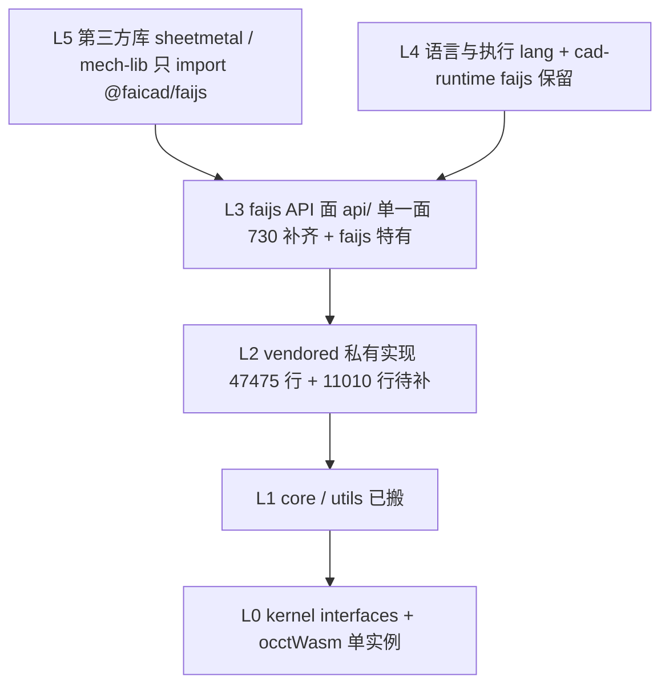

# faijs API 面补齐方案

- 日期：2026-09-02
- 状态：**方案（未实施）**
- 前序：`docs/plans/2026-09-01-layered-api-architecture.md`（P0–P9 已落地；**方向被否决**，本方案重定方向并承接其全部可复用资产）
- 参照实现：`C:\git\OpenCascade\brepjs`（Apache-2.0，`src` 83528 行 / 381 文件）

> **编号约定**：**U** = 不可变约束；**Y** = 被推翻的旧决策；**E** = 本方案的设计决策；**B** = 实测发现的缺陷；**P** = 分期；**O** = 开放问题。

---

## 0. 需求与约束

### 0.1 用户原话（需求基线，不准删改）

> @docs\plans\2026-09-01-layered-api-architecture.md 给我写一份新的方案。之前的这份方案已经实施到了P9，但是方向错误。它把 faijs 变成了 brepjs 的包装器，而不是让 sheetmetal 长在 faijs 自己的建模语义上。而我需要的是完全移植brepjs的所有能力，所有api，可以只变包名，但是其他完全一致。但绝对不能包名中出现brepjs。目前faijs的api 面能力太弱。我要的就是补齐能力。在api全部补齐的基础上，添加faijs自己特有的api。目录packages\core\src\vendored\brepjs可以保留，这样以后brepjs更新的时候，方便升级。但是里面的内容必须修改，至少是包名必须批量换掉。我要求的是，所有第三方库，都基于faijs的api建模。给我在目前代码的现状下，写一份新的方案。

#### 补充要求（2026-09-02 第二轮，同为准绳）

> **不移植 csg 模块，这个要求必须保留。** brepjs的csg模块能力太弱，且faijs自身的能力完全覆盖这部分。其他非brep建模的部分，也要盘查，比如implicit、voxel、lattice之类的，如果能够增强faijs的能力，那么可以引入。如果和现有的如sdf冲突，也不要引入。

> **所谓的cad，只是一个别名。它应该对应faijs的全部api。**

**两条要求的直接后果（本方案据此重构）**：

| 要求 | 后果 |
|---|---|
| csg 不移植 | 前案 D6 恢复为**不可变约束 U9**。实测补强：`csg/` 在 brepjs 根 barrel **零扁平符号**（§2.6.1）⇒ 不移植 csg 与"全部 API"**不冲突**，代价仅 1 个命名空间别名 |
| 非 brep 域要盘查 | 新增 §2.6 盘查表，六个模块逐个裁决。`implicit`/`lattice` **判冲突不引入**、`voxel` **判依赖不可得不引入**、`worker` **判与宿主层冲突不引入**、`ns` **搬 9 删 1** |
| cad 只是别名 | 取消"stdlib 31 函数 = 特殊子集"的心智模型。§3.2 重定义为**单一 API 面**：`@faicad/faijs` 导出面 ≡ 任意绑定名（默认 `cad`）≡ `.fai.js` 可调用面，三者同源生成 |

### 0.2 方向诊断：前一版错在哪（逐条实测证实）

| 用户判断 | 实测证据 | 结论 |
|---|---|---|
| **① 把 faijs 变成了 brepjs 的包装器** | 全仓 import `vendored/brepjs` 的只有 **2 个文件**：`api/occt-kernel-bridge.ts`、`packages/sheetmetal/src/compat.ts:23-56`（原 `api/fillet.ts` 已随 D-FILLET 删除）。其余 47k 行 vendored 代码的"消费者"只有**测试专用 facade**：`packages/tests/faijs/p3-vendored-surface/brep-surface.ts:8-10` 与 `p5-vendored-surface/p5-surface.ts:7-8`（文件头自述"刻写 brepjs `src/index.ts` 的公共面，全部重导出至 vendored 树"） | vendored 是"能在 faijs 里跑起来的 brepjs 副本"，**没有进入 faijs 的 API 面** |
| **② 不是让 sheetmetal 长在 faijs 语义上** | `packages/sheetmetal/src/compat.ts` 深导入 `@faicad/faijs-core/vendored/brepjs/*` 数十处（Result / 类型 / op 全部来自 vendored）；`./compat.js` 被包内 **34 处** import；sheetmetal 的 227 个 `it` **没有一处**经过 `cad.*` | sheetmetal 长在 brepjs 语义上 |
| **③ faijs 的 api 面能力太弱** | `createApiNamespace()`（`api/api-namespace.ts:39-51`）返回 **31 个函数**；brepjs 公开 API 面 **810 个符号**（625 运行时值 + 185 类型，实测统计 `brepjs/src/index.ts`），经 §2.6 盘查裁决后的**目标面 730 符号** | 覆盖率 **31 / 730 ≈ 4.2%** |

**根因**：前一版把"移植"定义成了"把代码搬进来、让它能跑"（P1–P5 全部围绕这个目标），**没有把"搬进来的能力投影到 faijs 的 API 面上"当作独立工程**。P6 取消 stdlib 后，`cad.*` 停留在原 stdlib 的 31 个函数，与移植的 47k 行是两条平行线——这就是"包装器"的成因：vendored 能跑，但 faijs 用户（含第三方库）够不着。

### 0.3 不可变约束

沿用前案 U1–U6，新增 U7–U10：

| # | 约束 | 含义 |
|---|---|---|
| **U1** | UI 生成代码 | `.fai.js` 文本往返链路必须仍可工作，**存量脚本零修改** |
| **U2** | append 增量执行 | 语句级 DAG + 三级缓存 + 增量重算 |
| **U3** | timeline 显示 | `ExecutionResult` 十一字段 + terminals 推导 C0–C5 |
| **U4** | BREP 与 mesh 融合 | 双链路、链切换、身份槽；**静态分派、禁运行时回退** |
| **U5** | 宿主契约不变 | `ExecutionResult` 字段集合；宿主导出面七个函数 |
| **U6** | 回归锚点 | 前案 §2.8 锚点套件全绿 |
| **U7** | **API 面完整性（新增）** | **brepjs 公开 API 面的符号，必须在 faijs API 面上可调用（同名、同参数语义）**。范围以 §2.6 裁决后的 **730 符号**为准，排除项全部登记 divergence（U9） |
| **U8** | **包名零 brepjs（新增）** | **用户可见的任何字符串——npm 包名、import 子路径、运行时报错、导出产物文件内容——不得出现 `brepjs`。物理目录名可保留（升级友好），但不得出现在用户可见面** |
| **U9（新增）** | **不移植 `csg` 模块** | 用户明示"这个要求必须保留"。brepjs `src/csg/`（5570 行 / 199 个内部 export）**整体不搬**；`ns/csg.ts` 随之删除。**本条高于 U7**——即"全部 API"在 `csg` 处让位于本条，代价仅 1 个命名空间别名（§2.6.1 实测） |
| **U10（新增）** | **`cad` 只是别名，不是一层** | 不存在"stdlib 是 API 面的子集"这回事。`cad` 是宿主注入的**默认绑定名**，任意绑定名等价（`registerLib(binding, ns, {default: true})`）。API 面只有**一张**，不是"原生面 + 补齐面"的拼接 |

### 0.4 被推翻的旧决策

| 编号 | 旧决策 | 出处 | 新处置 |
|---|---|---|---|
| ~~Y1~~ | ~~不移植 `csg` 模块~~ | 前案 §D6 | **撤回推翻**：本方案初稿错误地推翻了它（理由是"用户要所有 API"）。用户第二轮明示"**这个要求必须保留**"。⇒ **升格为 U9 不可变约束**，实测补强见 §2.6.1 |
| **Y2** | L5 库用 Result 兼容 shim 桥接，保 <5% 改动量 | 前案 §D12 | **推翻**：shim 正是"包装器"的成因。改为**库直接消费 API 面**，Result 消费点迁移到 faijs throw 语义 |
| **Y3** | 移植代码作为 L2 能力池，不强制投影到 API 面 | 前案 P1–P5 隐含目标 | **推翻**：本方案的全部意义就是投影 |
| **Y4** | `vendored/brepjs` 作为 core 对外 exports 子路径 | `packages/core/package.json:41-42` | **推翻**：vendored 降为 **core 私有实现目录**，两条 exports 删除 |
| **Y5** | 每个 op 必支持 mesh（默认路径） | `AGENTS.md:44` | **修订**（见 O1）：改为 op 链归属三分类 |
| **Y6（新增）** | "stdlib 31 函数"是 API 面的一个层次 | `api/api-namespace.ts` 现状 + 本方案初稿 §3.2 三段结构 | **推翻**：用户明示"cad 只是一个别名，它应该对应 faijs 的全部 api"。31 个不是"原生面"，只是**面还没填满**。三段结构取消，改单一面（§3.2） |
| 保留 | D10 内核单实例 + `getKernel` 冻结、D11 双链实现来源、D9 隔离编译、D8 边界检查、D3 Result/throw 边界 | 前案 §D3/D8/D9/D10/D11 | **保留** |

---

## 1. 结论速览

**把已经搬进来的 47k 行能力投影成 faijs 自己的 API 面；把没搬的 11k 行补齐；然后把第三方库从 vendored 深导入迁移到 `cad.*` 上。**

| 主线 | 目标 | 量化 |
|---|---|---|
| **① 补齐能力** | faijs API 面 = brepjs 公开面（**730 符号**，§2.6 裁决后）+ faijs 特有面 | 新增 **699 个**可调用符号 |
| **② 去 brepjs 化** | 目录保留（升级友好），用户可见面零 brepjs | 删 2 条 exports；清理 **86 处**字面量；新增守卫 |
| **③ 库长在 faijs 上** | sheetmetal 删 `compat.ts`，改 `import * as cad from '@faicad/faijs'` | 47 文件 / 227 it 迁移后保绿 |
| **④ 非 brep 域只搬不冲突的** | 六模块盘查（§2.6）：搬 `ns/` 9 文件，**排除 8379 行 / 80 符号** | 净搬 **2631 行** |

**关键机制**：699 个符号**不手写**。模板原型 `api/fillet.ts`（P7 落地的第一个 brep-only op，已随 D-FILLET 删除——faijs `{radius}` 形态废弃，为 brepjs 直连版让路）跑通过句柄借入 → 调 vendored → Result 翻转 → 所有权转入身份槽的完整链路。本方案把它抽象为生成层 `scripts/gen-l3-surface.ts` + 人工维护的**签名适配表**。

**方向性提醒**（来自初稿的教训）：补齐 ≠ 加一层。`cad` 不是"标准库"的门面，**它就是 faijs API 面本身的一个别名**（U10）。衡量本方案成功的标准不是"cad 里多了多少函数"，而是"**还有没有 faijs 能做、但第三方库够不着的能力**"。

---

## 2. 现状核查（2026-09-02 实测）

### 2.1 全景数字

| 项 | 数 | 位置 |
|---|---:|---|
| brepjs 参照源 | 83528 行 / 381 文件 | `C:\git\OpenCascade\brepjs\src` |
| faijs vendored 树（已搬） | **47475 行 / 237 文件** | `packages/core/src/vendored/brepjs/` |
| 尚未搬入 | **11010 行** | §2.2 |
| brepjs 公开 API 面 | **810 符号**（625 运行时值 + 185 类型） | `brepjs/src/index.ts` |
| **目标 API 面（§2.6 裁决后）** | **730 符号** | 810 − 80 排除 |
| faijs `cad.*` 面 | **31 个函数** | `api/api-namespace.ts:39-51` |
| faijs 包导出面 | **29 个函数**（缺 `chamfer`） | `api/index.ts:1-34` |
| 全仓 import vendored 的文件 | **3 个** | §0.2 |

vendored 各目录行数（实测）：`topology` 11473、`kernel` 12204（其中 `interfaces` 1289 / `occtWasm` 8127 / `occt` 21 / 根 2767）、`2d` 7105、`operations` 4971、`core` 2974、`io` 2948、`sketching` 2343、`gear` 1269、`query` 746、`measurement` 528、`utils` 356、`text` 300、`projection` 218。

### 2.2 尚未搬入的 11010 行

| 目录/文件 | 行数 | 外部依赖（实测） | 处置 |
|---|---:|---|---|
| `ns/`（9 个文件） | 130 | 命名空间聚合层 | **搬 9 删 1**（`ns/csg.ts` 随 U9 删） |
| 根 barrel（`index.ts` 1251 + `topology.ts`/`2d.ts`/`core.ts`/`result.ts`/`vectors.ts`/`quick.ts`/`shapeRef.ts`/`io.ts`/`measurement.ts`/`operations.ts`/`projection.ts`/`query.ts`/`sketching.ts`/`text.ts`/`worker.ts`） | 2191 | — | **搬**（`index.ts` 是 API 面定义源；`worker.ts` 分支按 §2.6 删） |
| `sketching/blueprintContourFns.ts` | 226 | — | **补**（唯一漏掉的单文件） |
| `kernel/optionalBackend.ts` + `kernel/perfStats.ts` | 84 | — | 评估（`optionalBackend` 按前案 D10 有意未搬） |
| **`csg/`** | **5570** | 仅相对导入，零外部包 | **❌ 不搬**（**U9**，用户明示。§2.6.1） |
| **`voxel/`** | **1311** | `@/core/*`、`@/kernel/types.js`、`@/topology/meshFns.js` + **`brepjs-voxel-wasm`（未发布 npm）** | **❌ 不搬**（§2.6.2） |
| **`implicit/`** | **565** | `@/core/*`、`@/kernel/types.js`、`@/voxel/*` | **❌ 不搬**（§2.6.3，与 faijs `sdf` 冲突） |
| **`lattice/`** | **233** | `@/voxel/*`、`@/core/*` | **❌ 不搬**（§2.6.4，与 faijs `sdf` 模板冲突） |
| **`worker/`** | **685** | 全自包含，零外部包 | **❌ 不搬**（§2.6.5，与 faijs host 层 worker 冲突） |

> **净搬运量**：原 11010 行 → 实际搬 **2631 行**（`ns/` 9 文件 + 根 barrel + `blueprintContourFns.ts` + kernel 2 文件评估）。排除 **8379 行**。
>
> **路径别名**：待搬模块中只有 `ns/` 与根 barrel 用到，量极小。已搬部分大量使用（topology 33、kernel/manifold 23、operations 21 文件命中 `from '@/`），说明 vendored 树**已有别名改写机制**——照搬同一套即可（P12 先确认是脚本改写还是 tsconfig paths）。

---

## 2.6 非 BREP 建模域盘查（用户第二轮要求）

**盘查判据**（用户给定）：① 该模块是"非 brep 建模"能力；② **能增强 faijs 能力 → 可引入**；③ **与 faijs 现有能力（如 `sdf`）冲突 → 不引入**。
补充两条实测判据：④ 依赖能否在 faijs 里获得；⑤ 是否是建模 API（而非执行基础设施）。

**总览裁决**（六模块 / 8379 行 / 80 符号）：

| 模块 | 行数 | 符号 | 能力 | 判据 | 裁决 |
|---|---:|---:|---|---|---|
| `csg/` | 5570 | **0**（根 barrel 零扁平符号） | 惰性 CSG IR + 求值器 | ②③ | **❌ U9 不可变** |
| `voxel/` | 1311 | 23 | 体素场、offset/shell/repair/ winding number | ④（依赖未发布 wasm） | **❌ 不引入**（O9） |
| `implicit/` | 565 | 16 | 解析式 SDF 表达式树 → 体素栅格 | ③（与 `sdf` 冲突）+ ④ | **❌ 不引入** |
| `lattice/` | 233 | 3 | TPMS 点阵（gyroid / schwarzP / diamond） | ③（已被 `sdf` 模板覆盖） | **❌ 不引入**（补 2 个模板即可，§2.6.4） |
| `worker/` | 685 | 37 | 通用 worker 池 + op 注册协议 | ⑤（非建模 API）+ ③（与 host 层冲突） | **❌ 不引入** |
| `ns/` | 145 | 10 | 命名空间聚合（纯重导出） | ②（零风险分组） | **✅ 搬 9 删 1** |

### 2.6.1 `csg/`：不移植（U9）—— 代价仅 1 个命名空间别名

**实测（推翻本方案初稿 Y1 的硬证据）**：

```
brepjs/src/index.ts 中 'csg' 全部命中：
  1251: export * as csg from './ns/csg.js';      ← 唯一一处
brepjs/src/csg/*.ts 内部 export 语句：199 条   ← 但零条进入根 barrel
按模块统计根 barrel 符号贡献：csg = 0
```

**结论**：`csg/` 5570 行、199 个内部 export，**对 brepjs 公开 API 面的扁平符号贡献为 0**。它只通过 `ns/csg.ts` 暴露为一个**命名空间别名** `brepjs.csg`。

**因此"不移植 csg"与"全部 API 完全一致"不冲突**——两者可同时满足。代价、以及必须登记的一条 divergence：

| 项 | 内容 |
|---|---|
| 代价 | `import * as faijs from '@faicad/faijs'` 后 **`faijs.csg` 为 `undefined`**（brepjs 下是命名空间对象）。这是 810 符号中唯一因 U9 缺失的 1 个 |
| 处置 | 登记进 divergence 表 `kind: 'cut'`，理由 `U9 (user-mandated)`。**不允许静默跳过**——验收清单里显式标注 `N/A` 并给出本条链接 |
| 能力是否已覆盖 | `csg` 的**求值语义**（`fuse`/`cut`/`intersect` 立即求值版）在 `topology/` 与 `operations/api.js` 已有同名实现，且 brepjs 自己的钣金库用的就是后者（前案 §7.4 实测）。**惰性 IR 语义** faijs 不需要——faijs 的语句 DAG 已是声明式 IR，引入第二套 DAG 违反 Y3 的方向 |

### 2.6.2 `voxel/`：不引入 —— 依赖不可得

| 事实 | 证据 |
|---|---|
| 需要一个外部 wasm 引擎 | `src/voxel/engine.ts` 定义 `VoxelEngine` 接口（`WasmVoxelField` / `WasmSdf` / `WasmScalarField`），实现来自 **`brepjs-voxel-wasm`** |
| **该包未发布到 npm** | `npm view brepjs-voxel-wasm` → **`404 Not Found`** |
| 它是 brepjs workspace 内部的 Rust crate | `brepjs/packages/brepjs-voxel-wasm/`（`Cargo.toml` + `pkg/` + `src/*.rs`），在 `node_modules` 里是**符号链接**；`brepjs-voxel/package.json:24` 声明 `"brepjs-voxel-wasm": ">=0.2.0"` |
| 许可 | Apache-2.0（`LICENSE` 首行）——**许可不是障碍**，可获得性才是 |
| 构建依赖 | Rust + `wasm-bindgen 0.2` + `fast-surface-nets 0.2`（Surface Nets 等值面提取，Rust crate） |

**裁决**：**不引入**。两条理由：

1. **依赖不可得**（判据 ④）。引入 `voxel/` = 给 faijs 引入一条 **Rust → wasm-pack → CI** 的工具链。faijs 当前是纯 TS monorepo，零 Rust 工具链（`package.json` 无相关脚本）。这是**量级变化**，不是"补齐 API"。
2. **与 faijs 场管线是同一概念空间的第二套实现**（判据 ③ 的弱形式）。`voxel` 的 `voxelField → fieldContour` 与 faijs 的 `sdf`（`sdf-runner.ts` + manifold levelset）都是"采样场 → 提取网格"。同域双实现 = 用户要选一条，违反 U10 的"只有一张 API 面"。

**faijs 因此缺失的能力**（诚实登记，见 O9）：`offsetMesh` / `shellMesh` / `voxelBoolean` / `repairMesh` / `windingNumbers`。其中 `offset`/`shell` 在 brepjs `topology/` 里也**没有**（`ls src/topology | grep -i offset` 无命中），即 brepjs 也只有 voxel 一条路。

> **注意区分两个"csg"**（沿用前案 v4 澄清）：不移植的是 brepjs `src/csg/`；`@faicad/faijs/csg` 是 faijs **自有**导出（`packages/core/src/csg.ts`，榫卯/CSG 辅助），与本条无关，**保留**。

### 2.6.3 `implicit/`：不引入 —— 与 faijs `sdf` 冲突

| 项 | brepjs `implicit/` | faijs `sdf/` |
|---|---|---|
| 表达形态 | **结构化表达式树**（`SdfHandle`，`sphere(r)` / `box(hx,hy,hz)` / `lattice(...)` 组合子） | **JS 代码字符串**（`compileSdf(code, params)` → `SdfFn`，`sdf.ts:25`） |
| 求值后端 | 光栅化进 **voxel 栅格**（依赖 §2.6.2 的 wasm） | **manifold levelset**（`sdf-runner.ts` + `SdfBackend` 端口） |
| 用户入口 | `brepjs.sphere(5)` 等 10 个构造器 | `cad.sdf({ code, box, resolution, params })`（`api/sdf.ts`） |
| 参数化 | 组合子链 | `// @param` 注释 + `params` 表（`sdf/types.ts:11-17`） |

**裁决**：**不引入**（判据 ③ 直接命中）。

- **两套 SDF 语义**。用户说的"如果和现有的如 sdf 冲突，也不要引入"——`implicit/` 就是最典型的那个：它整块是一个 SDF 建模域，而 faijs 已有 `cad.sdf`。
- 叠加 §2.6.2 的**依赖不可得**（`implicit` 明确声明"rasterizes DIRECTLY into the voxel substrate's dense grid"），即使无冲突也搬不动。
- faijs 的 `sdf` 反而**更强**：接受任意用户 JS 代码（`compileSdf`），`implicit/` 只能组合固定原语。

### 2.6.4 `lattice/`：不引入 —— 已被 faijs `sdf` 模板覆盖

**实测：faijs 已有等价能力**。`packages/core/src/sdf/templates.ts` 10 个模板中已有两个 TPMS 相关：

| 行 | id | 名称 | category |
|---|---|---|---|
| `:64` | `gyroid` | — | `periodic` |
| `:188` | `gyroid-lattice` | **晶格填充** | `periodic` |

`gyroid-lattice` 模板体（`templates.ts:194-208`）就是 brepjs `latticeInfill` 的同一件事——**Gyroid 曲面加厚成壳，再与立方体包围盒求交**，参数 `period` / `thickness` / `size`：

```js
const g = Math.cos(k*x)*Math.sin(k*y) + Math.cos(k*y)*Math.sin(k*z) + Math.cos(k*z)*Math.sin(k*x)
const gyroidShell = thickness - Math.abs(g)
return Math.max(gyroidShell, box)
```

**裁决**：**不引入**（判据 ③）。`brepjs/lattice/` 的 3 个符号（`latticeInfill` / `latticeInfillShape` / `tpmsLattice`）依赖 voxel wasm（§2.6.2），而 faijs 已用 `cad.sdf({ code: 'gyroid-lattice', … })` 覆盖 gyroid。

**缺口处置**：`schwarzP` / `diamond` 两种 TPMS faijs 没有。解法是**在 `sdf/templates.ts` 里补 2 个模板**（约 20 行/个，纯 JS），不引入 233 行 + 一条 Rust 依赖。列为 P18 的一条子任务。

### 2.6.5 `worker/`：不引入 —— 非建模 API 且与 faijs host 层冲突

| 项 | brepjs `worker/`（685 行 / 37 符号） |
|---|---|
| 内容 | `protocol.ts`（请求/响应判别联合 + 类型守卫）、`taskQueue.ts`、`workerClient.ts`、`workerHandler.ts`（`createOperationRegistry` / `registerHandler`）、`workerPool.ts` |
| 外部依赖 | **零**（全部相对导入）——技术上可搬 |
| 形态 | **用户可见的通用 op 注册 + 池**：用户注册 op → 丢给池执行 |

**faijs 已有自己的一套**（实测 `packages/core/src/browser-host/`）：

`csg-worker-protocol.ts` / `csg-worker.ts` / `worker-csg-backend.ts` / `sdf-worker-protocol.ts` / `sdf-worker.ts` / `worker-sdf-backend.ts` / `inline-csg-backend.ts` / `inline-sdf-backend.ts`

**裁决**：**不引入**。两条理由：

1. **不是建模 API**（判据 ⑤）。worker 是执行基础设施，属于 L3 host 层，不属于"API 面能力"。U7 说的是建模 API 面完整性，worker 不在其中。
2. **概念冲突**（判据 ③）。faijs 的 worker 是**宿主注入后端**（`ports.ts` 的 `SdfBackend` / `CsgBackend`，inline 与 worker 两种实现可互换，`sdf-runner.ts:22` 的 `setSdfBackend`）；brepjs 的是**用户直接操作的池**。引入即出现两套 worker 机制，用户要选一套。

> 若将来确实需要"通用 op 卸载到 worker"，正解是**扩展 faijs 自己的 `browser-host` backend 抽象**（让更多 op 走 `ports` 注入），而不是搬一个外部池。

### 2.6.6 盘查后的目标面重算

| 项 | 数 | 说明 |
|---|---:|---|
| brepjs 公开 API 面（原始） | 810 | 625 运行时值 + 185 类型 |
| − `voxel` / `implicit` / `lattice` | −42 | §2.6.2–2.6.4 |
| − `worker` | −37 | §2.6.5 |
| − `ns/csg` | −1 | §2.6.1 |
| **= 目标 API 面** | **730** | U7 的验收基数 |
| 现有可调用 | 31 | `api/api-namespace.ts` |
| **= 需新增** | **699** | 原估 611，因补齐 `ns/` 9 个命名空间与重算而修正 |

**730 按模块分布**（`topology` 265 / `core` 129 / `operations` 122 / `sketching` 51 / `2d` 37 / `io` 27 / `gear` 17 / `kernel` 21 / `measurement` 21 / `query` 14 / `projection` 9 / `text` 8 / `ns` 9）。

### 2.3 能力缺口：730 vs 31

brepjs 公开 API 面按模块分布（实测）：

| 模块 | 符号数 | 模块 | 符号数 |
|---|---:|---|---:|
| `topology` | 265 | `voxel` | 23 |
| `core` | 129 | `kernel` | 21 |
| `operations` | 122 | `measurement` | 21 |
| `sketching` | 51 | `gear` | 17 |
| `2d` | 37 | `implicit` | 16 |
| `worker` | 37 | `query` | 14 |
| `io` | 27 | `projection` / `text` / `lattice` | 9 / 8 / 3 |

faijs 现有 31 个函数的归属：

| 类别 | 数 | 符号 |
|---|---:|---|
| **与 brepjs 同名** | **11** | `box` `sphere` `cylinder` `cone` `translate` `rotate` `scale` `chamfer` `fillet` `intersect` `faceCenter` |
| **已更名避让（不再同名）** | **3** | `fai_drill`（原 `drill`）、`fai_extrude`（原 `extrude`）、`fai_split`（原 `split`）——D-DRILL / D-EX / D-SPLIT 已落地（§5.1.1），faijs 保留导出 |
| **faijs 特有** | **18** | `wedge` `text` `screw` `svgExtrude` `sdf` `load` `engrave` `knurl` `union` `subtract` `group` `assembly` `copy` `faceNormal` `bboxCenter` `bboxMin` `bboxMax` `asset` |

### 2.4 包名违规实测（U8）

| 违规面 | 位置 | 严重度 |
|---|---|---|
| **对外 import 子路径含 brepjs** | `packages/core/package.json:41-42` `"./vendored/*.js"`、`"./vendored/*"` → 实际路径 `@faicad/faijs-core/vendored/brepjs/topology/booleanFns.js` | **高** |
| **导出产物文件内容含 brepjs** | `vendored/brepjs/io/gltfExportFns.ts:354,608` `generator: 'brepjs'`；`io/objExportFns.ts:36` `'# brepjs OBJ export'` | **高**（用户导出的 GLB/OBJ 里写着 brepjs） |
| **运行时报错文案含 brepjs** | `kernel/index.ts:91` `brepjs kernel registry frozen…`、`:110` `brepjs kernel not initialized…`、`:115` `brepjs: kernel '…' is not registered.`、`:127` `brepjs: current kernel does not support 2D operations.` | **高** |
| 注释/文档中的 brepjs | vendored 内 **86 处**命中（含 `README.md`、`NOTICE`、`ambient.d.ts`） | 中 |
| **mech-lib 包名/文件名** | `packages/mech-lib/src/brepjs-gear.ts`（文件名）、3 处 `from 'brepjs'` | **高** |

### 2.5 附带发现的四个缺陷（本方案一并处理）

| # | 缺陷 | 证据 |
|---|---|---|
| **B1** | **符号表生成脚本已失效**：P6 删 `packages/stdlib` 后未同步 | `packages/core/scripts/gen-symbol-table.ts:26` 仍指向 `../../stdlib/src/internal-stdlib.ts`（该目录已不存在）；产物 `lang/symbol-table.generated.ts`（39 行）无法重新生成 |
| **B2** | **`cad.*` 面 ≠ 包导出面**：前案 §5.3.4 承诺的不变量未落地 | `chamfer` 在 `api/api-namespace.ts` 注入 `cad.*`，但 `api/index.ts`（34 行）未导出 ⇒ `import { chamfer } from '@faicad/faijs'` 失败（原 `fillet` 已随 D-FILLET 删除，不再适用） |
| **B3** | **API 手册预算将爆** | `docs/ops-api-inventory.md` 现 3188 词 / 预算 4290 词（`scripts/doc-budgets.manifest.json:5`）。op 数 32 → 643 后按 ~100 词/op 外推 ≈ 64000 词，**超预算 15 倍** |
| **B4** | 两份手工清单易漂移 | `api-namespace.ts`（31 项）与 `api/index.ts`（30 项）靠人工同步 |

---

## 3. 目标架构

### 3.1 分层与依赖方向



**依赖方向的硬规则**：

| 规则 | 内容 |
|---|---|
| **L5 只依赖 L3** | 第三方库 `import * as cad from '@faicad/faijs'`，**禁止 import `@faicad/faijs-core` 的任何子路径**（含 `vendored/*`） |
| **vendored 是 core 私有** | 删除 `packages/core/package.json` 的 `"./vendored/*"` 与 `"./vendored/*.js"` 两条 exports（Y4）。core 内部仍可相对导入 |
| **反向只允许 L3** | faijs 既有代码 import vendored 只发生在 `api/`（`fillet.ts` 先例）与 `api/occt-kernel-bridge.ts` |

### 3.2 单一 API 面与 `cad` 别名（U10）

> **用户原话**："所谓的cad，只是一个别名。它应该对应faijs的全部api。"

**核心纠正**：不存在"标准库是 API 面的一个子集"这回事。31 个函数不是"原生面"，只是**面还没填满**。`cad` 只是宿主在 `.fai.js` 里注入的那个**默认绑定名**，换成任何名字都一样。

```
                    ┌──────────────────────────────────────┐
                    │   faijs 单一 API 面（一张，不是拼的）  │
  三面同源生成 ─────►│   730 补齐符号 + 18 faijs 特有 +      │
                    │   引擎 API（createRuntime / 类型 …）  │
                    └──────────────────────────────────────┘
                       │            │              │
            @faicad/faijs 导出面   cad.* 绑定面   .fai.js 可调用面
                  (import)      (注入的命名空间)    (parser 解析)
                       │            │              │
                       └────────────┴──────────────┘
                          三者由生成层从同一份清单产出
```

**四条硬规则**：

| # | 规则 |
|---|---|
| **R1** | **只有一个面**。`import { box } from '@faicad/faijs'` 与 `.fai.js` 里的 `cad.box(...)` 是**同一个函数对象**，不是"导出版"与"命名空间版"两套 |
| **R2** | **绑定名任意**。`cad` 是根门面（`src/index.ts:26` `registerLib('cad', …)`）的**约定注入**，不是语言内置。宿主可 `registerLib('g', ns)` 后写 `g.box(...)`；默认名由 `registerLib(binding, ns, {default: true})` 显式声明，而非散落在四处的 `'cad'` 字面量 |
| **R3** | **面 ≡ 全部 API**。补齐完成后 `cad.*` 覆盖整个 API 面，不再有"cad 里没有但包里能 import"的函数（B2 的 `chamfer`/`fillet` 就是这条被破坏的实例） |
| **R4** | **包内可 import，脚本内需注入**。`.fai.js` 是受限子集（无 `import` 语句，`parser.ts:791-820` 只记 binding），命名空间只能由宿主注入；第三方库（TS）则 `import * as cad from '@faicad/faijs'`——**两者拿到的是同一个对象** |

**R2 的现状缺口（必读，与既有记忆一致）**：L2 运行时**早已支持任意绑定名**（`runtime.ts:307` `registerLib(binding: string, ns)`），但 L0 与若干位置仍把"默认命名空间"硬编码成字面量 `cad`：

| 位置 | 硬编码形态 | 风险 |
|---|---|---|
| `parser.ts:1086` | 强制 `params[0].name !== 'cad'` → ParseError | 脚本**无法**用别的名字引用 API |
| `parser.ts:365,488,600,1337` | `nsName !== 'cad'` 时省略字段 | 非 `cad` 绑定名的 IR 不完整 |
| `runtime.ts:722,736` | `?? 'cad'` | 默认值散落 |
| `runtime.ts:1279` | `ns && ns !== 'cad'` 走内部符号表 | **名为 `cad` 的第三方库会被误判进内部符号表，绕过 registerLib 校验** |
| `types.ts:96` | 注释里写死 | 文档与实现不一致 |

**处置（P14）**：把"默认命名空间"从隐含字面量提升为**宿主显式声明**（`registerLib(binding, ns, {default: true})`），四处硬编码改读该声明。**零风险前置**：先抽概念不改行为，使后续改造降级为"接一根线"。

> **与 E5 的关系**：§3.2 的"一个面"是**目标形态**；E5 生成层是**实现手段**。生成层从同一份清单同时产出 ①包导出面 ②命名空间绑定面 ③符号表与手册输入 —— 三者不可能漂移（B4 随之解决）。

### 3.3 vendored 的角色重定

| | 前案（实际） | 本方案 |
|---|---|---|
| 物理位置 | `packages/core/src/vendored/brepjs/` | **不变**（升级友好） |
| 对外可见性 | core exports 暴露 `./vendored/*` | **core 私有**，仅经 L3 投影暴露 |
| 用户可见字符串 | 含 86 处 brepjs | **零 brepjs**（E6） |
| 升级方式 | — | diff 对齐 upstream 目录树（E11） |

**物理目录名保留 `brepjs` 与 U8 不矛盾**：目录名是构建期实现细节，用户永远只能经 `@faicad/faijs` 的导出面访问，任何用户可见字符串里都不出现它（E6 守卫断言）。

---

## 4. 关键设计决策

### E1 能力基线 = brepjs 公开 API 面经 §2.6 裁决后的 730 符号

**"API 补齐"的判据是符号级机械比对，不是感觉。** 基线清单从 `brepjs/src/index.ts` 提取（625 运行时值 + 185 类型），**减去 §2.6 排除的 80 个**（`voxel` 23 / `implicit` 16 / `lattice` 3 / `worker` 37 / `ns/csg` 1），落到 `packages/core/src/api/surface/upstream-surface.json`（生成文件）与 `upstream-exclusions.json`（排除项 + 理由 + divergence 链接），供生成层与验收脚本共用。

| 类别 | 处置 |
|---|---|
| 运行时值（730 中） | 全部在 faijs API 面可调用（同名） |
| 类型（730 中） | 从 `api/` 或 vendored 的 L1 类型面 re-export（TS 消费方需要） |
| faijs 原有 14 个同名 | 其中 11 个见 E2 双形态重载**不改名**（改名破 U1）；`drill`→`fai_drill`、`extrude`→`fai_extrude`、`split`→`fai_split` 已更名落地（D-DRILL/D-EX/D-SPLIT，faijs 保留导出）；`fillet` faijs 形态已删除，直接用 brepjs 版（D-FILLET，§5.1.1） |
| faijs 特有 18 个 | 原样保留并叠加新增 |
| **排除 80 个** | **逐条登记** `upstream-exclusions.json`，理由引用 §2.6.x 与 U9。**严禁静默跳过**——验收脚本断言"排除项数 == 登记项数" |

### E2 参数形态：双形态重载（不改名、不破存量）

**冲突**：faijs 全部 op 是**单对象参数**（`cad.box({ size: 20 })`，`.fai.js` 里 UI/AI 生成代码用 key-value 最稳）；brepjs 是**位置参数 + options**（`box(10, 20, 30, { centered: true })`）。同一个 `cad.*` 空间里两种风格并存是设计灾难，但改名会破 U1。

**决策：同名函数支持两种形态，由生成器注入的形态判别器分派，不在每个 op 里手写 if。**

```ts
// 生成器产物的形态（示意，非逐字实现）
export const box = defineOp({
  brep: (…args) => brepBox(…normalizeArgs(args, BOX_SPEC)),
  consumes: 'none',
  schema: { size: 'number | [n,n,n]', center: 'vec3?' },
})
// BOX_SPEC（适配表条目，人工维护）：
//   faijs:  ['size', 'center']          → 首参为 plain object 且非 Shape
//   brepjs: ['width','depth','height','options']  → 首参为 number
```

| 判别规则 | 说明 |
|---|---|
| 首参为 **plain object 且不是 Shape**（无 `positions`/`indices`） | faijs 形态 → 按 `faijs` 形参名映射到 brepjs 位置参数 |
| 否则 | brepjs 位置参数形态 → 原样透传 |
| 判别在**生成层产出的 `normalizeArgs`** 里做 | 每个 op 零手写分支；适配表是唯一人工维护点 |

**收益**：① 存量 `.fai.js` 零修改（U1）；② brepjs 生态代码（含未来任何第三方移植库）**只改包名即可逐行运行**（用户诉求"可以只变包名，但是其他完全一致"）；③ 判别逻辑集中可测。

### E3 返回形态：主面统一 throw + Shape；Result 镜像可选

**冲突**：brepjs 混合形态——构造/变换返回裸值（`box(w,d,h): ValidSolid`），布尔/查询返回 `Result`（`fuse(a,b): Result<ValidSolid>`）。faijs `cad.*` 全部是 throw + Shape。

**决策**：

| 面 | 形态 | 理由 |
|---|---|---|
| **`cad.*` 主面（默认）** | **统一 throw + faijs Shape** | ① `.fai.js` 是单行文本语言，Result 链式处理无法表达；② 现有 31 个 op 全 throw，改返回类型破 U1；③ 前案 D3 已定"L3 是 Result→throw 的翻转边界"，此决策与其一致 |
| **Result 镜像（可选，默认不装）** | 同签名、返回 `Result`，独立子路径 `@faicad/faijs/result` | 供**机械搬运**的移植库过渡期使用；**不作为推荐面**，sheetmetal 必须迁到主面（E8） |

**边界样板已存在**（`api/fillet.ts:56-60`）：`if (!result.ok) throw new Error(...)`。生成器把它固化为模板。

### E4 链归属三分类 + 可选 lift（U4 红线的修订）

**冲突**：补齐的 699 个 op 绝大多数没有 mesh 实现（brepjs 是 BREP 库），与 `AGENTS.md:44`"每个 op 必支持 mesh（默认路径）"直接冲突。

**决策：把"必支持 mesh"改为"必须声明链归属"。**

| 分类 | 含义 | 典型 |
|---|---|---|
| **dual** | `mesh` + `brep` 双实现 | 现有 31 个 + 新增符号中 mesh 层能承担的 |
| **brep-only** | 仅 `brep` | 新增主体：`fillet` `shell` `loft` `sweep` `offset` 查询/度量/IO |
| **mesh-only** | 仅 `mesh` | `sdf`、`knurl` |

**brep-only op 在 mesh 链上的行为**（默认分支保持不变）：

| 场景 | 行为 | 依据 |
|---|---|---|
| **默认（auto / brep 模式，输入在 BREP 链）** | 走 brep | `backend-dispatch.ts:113` `if (impls.brep && inputs.every(hasBrep)) return 'brep'` |
| **默认（输入已断链到 mesh）** | 抛 `E_MESH_UNSUPPORTED` | `backend-dispatch.ts:115-120`；brep-only op 在 mesh 链上的行为（原 `cad.fillet` 已删除，brepjs 直连版将继承同样语义） |
| **op 声明 `lift: 'mesh-to-brep'`（opt-in）** | 执行前把 mesh 输入提升为 BREP | 新增，见下 |

**lift 不是"运行时回退"**：红线（U4/`AGENTS.md`）禁的是"BREP 路径执行失败后 try-catch 回退到 mesh"。lift 是**执行前的输入数据规整**，由 `dispatchPath` 静态判定后触发，与已存在的 `reconcileBrepInputs`（`api/reconcile.ts:32`，brep→mesh 归约）**方向对偶**。

**技术基础已具备**：`occt-kernel/occtKernel.ts:481` `kernel.buildTriFace(...)` + `:489` `kernel.sewAndSolidify(faces, tolerance)` —— 三角汤缝合成 OCCT solid 的能力已在 mesh STEP 导出路径上跑通。lift 是它的复用。

**lift 的三条约束**：① 默认关闭（保留已被验证的默认分支）；② 由 op 声明或宿主配置开启，静态可判；③ 必须在 `ExecutionResult.infos` 留痕 + 发 `part-brep-lifted` 事件，**绝不静默**。

> ⚠️ `AGENTS.md:44` 的红线文本需同步修订为上述三分类表述（O1 待用户确认）。

### E5 生成层 `gen-l3-surface.ts`（不手写 699 个）

699 个 op 手写不现实，也不可维护（upstream 一更新就漂）。

```
brepjs/src/index.ts  ──提取──▶  api/surface/upstream-surface.json（基线 730）
                     └────────▶  api/surface/upstream-exclusions.json（排除 80 + 理由）
                                        │
                    ┌───────────────────┴───────────────────┐
                    ▼                                       ▼
        api/surface/arg-spec.ts                 scripts/gen-l3-surface.ts
        （人工：签名适配表）                     （机械：投影 + 模板展开）
                    └───────────────────┬───────────────────┘
                                        ▼
                        api/generated/*.ts（按模块分片）
                                        ▼
              api/index.ts + api/api-namespace.ts（同源，B2/B4 解决）
```

**生成器对每类符号的产出规则**：

| 符号类别 | 判别 | 产出 |
|---|---|---|
| **几何 op**（参数或返回值含 Shape/handle 类型） | 类型面判定 | `defineOp({ brep: … })` + `consumes`/`schema`/`capabilities` 元数据 |
| **查询/度量**（返回数组/标量，输入含 Shape） | 返回值非 Shape | `defineOp({ brep: … })`，`consumes: 'none'`（不消费输入，输入仍在 timeline） |
| **纯函数**（`vec*`、数学、常量） | 无 Shape 参数 | **直接 re-export**，不进 `defineOp`（不是 op） |
| **IO**（`exportSTEP`/`importSTEP`/GLB/OBJ/DXF） | 涉及文件/字节 | 走 faijs `node-host`/`browser-host` 端口适配，**不直接搬** |
| **类型**（185 个） | `type` 导出 | re-export |

**模板来源**：原 `api/fillet.ts`（已随 D-FILLET 删除）的句柄借入 `createBorrowedHandle` → 调 vendored → `Result.ok` 翻转 → `unregisterFromCleanup` → `fromBrep` 所有权转入身份槽模式。生成器的每条产物与该模式同构。

**适配表是唯一人工维护点**，规模估算：699 个符号中约 200 个需要手写条目（几何/查询类），其余按默认规则推导。

### E6 包名去 brepjs 化（三层 + 守卫）

| 层 | 动作 | 位置 |
|---|---|---|
| **① 对外路径层** | 删除 `packages/core/package.json` 的 `"./vendored/*.js"`、`"./vendored/*"`（Y4） | `packages/core/package.json:41-42` |
| **② 用户可见字符串层** | ① 产物内容：`gltfExportFns.ts:354,608` `generator: 'brepjs'` → `'faijs'`；`objExportFns.ts:36` `'# brepjs OBJ export'` → `'# faijs OBJ export'`；② 报错文案：`kernel/index.ts:91,110,115,127` → `faijs …`；③ 其余 86 处注释/文档 | vendored 全树 |
| **③ mech-lib 层** | `src/brepjs-gear.ts` 重命名（如 `gear-adapter.ts`）；3 处 `from 'brepjs'` 改为 `from '@faicad/faijs'` | `packages/mech-lib/src/` |

**守卫脚本**（新增 `scripts/check-vendored-branding.mjs`，接入 CI）：

| 断言 | 白名单 |
|---|---|
| `packages/core/dist/**` 与 `packages/core/src/vendored/**` 中**字符串字面量**零 `brepjs` | ① `NOTICE`（Apache-2.0 归属声明，法律必需）；② `README.md` 中 `UPSTREAM:` 前缀的升级追踪段落；③ 文件内以 `UPSTREAM:` 开头的注释行 |
| `packages/core/package.json` 的 exports 键零 `brepjs` | 无 |
| `packages/*/package.json` 的 `name`/`dependencies`/`peerDependencies` 零 `brepjs` | 无 |
| `packages/*/src/**` 的 import 说明符零 `brepjs` | 无 |

> **目录名 `brepjs` 不触犯守卫**——守卫只查字符串字面量与包名，不查路径段。

### E7 vendored 补全

按 §2.2 表格搬入（`ns/` 9 文件 + 根 barrel + `blueprintContourFns.ts`，**净 2631 行**），**`@/` 别名沿用既有改写机制**。搬入后跑 upstream 自带测试（复用前案 P3/P5 的 harness 模式：facade 重导出 + `initOcctWasm`/`bindOcctKernel` 装配 + divergence 注册表）。

**U9 的执行细则（`csg` 相关）**：

| 位置 | 动作 |
|---|---|
| `vendored/brepjs/csg/` | **不存在**（从不搬入，不是"搬了再删"） |
| `vendored/brepjs/ns/csg.ts` | **不搬**（它是 `export * from '@/csg/index.js'` 的单行文件） |
| 根 barrel `index.ts:1251` `export * as csg from './ns/csg.js'` | 搬入时**删除该行**，并在同位置留 `// FAIIS-CUT: csg namespace omitted per U9 (see §2.6.1)` |
| divergence 表 | 登记 1 条 `kind: 'cut'`，理由 `U9 (user-mandated)` + 链接 §2.6.1 |
| 验收脚本 | 断言 `upstream-exclusions.json` 中 `csg` 项存在且理由非空（**不允许静默跳过**） |

**边界守卫（新增）**：`scripts/check-layer-boundaries.mjs` 增加一条断言——vendored 树内**不得出现 `csg/` 目录**，`ns/` 下**不得出现 `csg.ts`**。防止后续"顺手搬回来"。

### E8 sheetmetal 迁移：删 `compat.ts`，长在 `cad.*`

| 步 | 动作 |
|---|---|
| 1 | 包 `peerDependencies` 从 `@faicad/faijs-core` 改为 `@faicad/faijs`（现状 `packages/sheetmetal/package.json:29-31` 依赖 core，是深导入的入口） |
| 2 | 全部 `./compat.js` import 改为 `import * as cad from '@faicad/faijs'` |
| 3 | Result 消费点迁移到 throw 语义：`if (!r.ok) return r` → 直接删除（异常自动冒泡）；`err(validationError(...))` → `throw new Error(...)` |
| 4 | 删除 `src/compat.ts`（Y2） |
| 5 | 227 个 `it` 保绿；`test-setup.ts` 的内核装配改走 `@faicad/faijs` 的 `initOcctWasm` |

**改动量预估**：Result 消费点约 350 处（`ok` 77 / `err` 186 / `validationError` 186 的调用点，非全部需改）。多数是**净删除**（错误向下传递的 `if (!r.ok) return r` 直接消失），代码量下降。前案"<5% 改动量"判据作废——**本方案不追求最小改动，追求正确归属**。

**sheetmetal 对外 API 形态由库自己决定**（可在库边界保留 Result 给上层），约束只有一条：**内部消费 `cad.*`**。

### E9 mech-lib 清理

`packages/mech-lib/src/brepjs-gear.ts` 是"L5 直接消费内核"的历史先例（经 `getBackends().kernel.brep` 注入）。按 E6 ③ 重命名，并迁移到 L3 消费（前案 P10 的目标在本方案内一并完成）。

### E10 文档、符号表与手册扩容（解决 B1/B3/B4）

| 缺陷 | 处置 |
|---|---|
| **B1** 符号表生成脚本失效 | 改为从 `api/` 单一清单生成（输入源换成 `api/index.ts` 或生成层的清单），脚本路径修好并接入 `doc-sync` |
| **B3** 手册预算将爆 | **分层手册**：① `docs/ops-api-inventory.md` 保留**高频面**（预算内，人工排序）；② 全量索引改为**生成文件** `docs/ops-api-inventory.generated.md`（不受预算门禁，如同 `symbol-table.generated.ts` 的先例）；③ 新增预算条目需 PR 说明 |
| **B4** 两份清单漂移 | `api/index.ts` 与 `api/api-namespace.ts` 同源于生成层（E5），手工清单退场 |

### E11 升级友好机制（目录保留的真正价值）

| 机制 | 内容 |
|---|---|
| **目录树一一对应** | `vendored/brepjs/<dir>/<file>` 与 upstream `src/<dir>/<file>` 同名同构，升级时可 `diff -r` |
| **divergence 注册表** | 沿用前案 P3/P5 的 `kernel-divergences.ts` 模式，扩展为全树 divergence 表：每个偏离 upstream 的改动登记 `{ file, upstreamRef, reason, kind }`，`kind ∈ {rename, shim, cut, faijs-adapt}` |
| **升级演练** | P19 做一次"从 upstream 新 commit 拉差异"的演练，验证 divergence 表能支撑合并 |
| **锁定 upstream commit** | 记录当前基线 commit（`8685273a`），不做双向同步 |

### E12 目录与 exports 终态

```
packages/core/src/
  vendored/brepjs/          私有实现（目录名保留；exports 不暴露）
    {2d,core,gear,io,kernel,measurement,ns,operations,
     projection,query,sketching,text,topology,utils}
    index.ts                 ← 新增：对应 brepjs src/index.ts（API 面定义源，csg 行按 U9 删）
    ❌ {csg,voxel,implicit,lattice,worker}   ← 从不搬入（§2.6，守卫断言其不存在）
  api/                       ★ L3 faijs API 面（唯一对外面；cad 只是它的别名）
    index.ts                 ← 生成：导出面
    api-namespace.ts         ← 生成：绑定面（与 index.ts 同源）
    generated/               ← 生成：699 个新增符号
    surface/                 ← 人工：upstream 清单 + 排除清单 + 签名适配表
    {primitives,boolean,…}.ts  ← 保留：现有 31 个 op（人工）
```

`packages/core/package.json` exports 变更：

| 动作 | 条目 |
|---|---|
| **删除** | `"./vendored/*.js"`、`"./vendored/*"` |
| **新增** | `"./result"`（E3 可选 Result 镜像，默认不安装） |
| 保留 | 其余全部 |

---

## 5. API 面清单与冲突处置

### 5.1 同名冲突的处置（逐条，2026-09-02 复核：11 个仍同名 + `drill`/`extrude`/`split` 已更名避让）

> **用户原话**（需求基线，第一轮）：「这些api要检查是否兼容。其中extrude肯定不兼容。需要把faijs自己的extrude更名为split_extrude，同时更新3d_editor里的应用名字。其他的我怀疑大部分应该兼容。不兼容的话，请整理出所有不兼容的部分，我来决定处理方案。」
>
> **用户原话**（第二轮，是否决第一轮的部分名称）：「目前，faijs自己的fillet有真实的下游在用吗，也就是3d_editor有用到吗？没有的话，直接用brepjs的版本。此外，目前3d_editor项目在用的extrude/split两个函数，更名为：fai_extrude、fai_split。而brepjs的extrude/split则保留。」

统一规则：**同名同参语义（U7）逐条实测判定**（判定源：vendored 树 = brepjs 参照），分三档：
- **✅ 双形态兼容**（E2）：保留 faijs 对象形态 + 追加 brepjs 位置形态，判别器分派；
- **⚠️ 双形态可容纳、但 faijs 需补能力**：判别可行，但 brepjs 形态依赖 faijs 目前缺失的输入/参数化；
- **❌ 语义断裂（双形态无法掩盖）**：输入或返回契约根本不同，**必须更名或登记 divergence**。

| 符号 | faijs 现形态 | brepjs 形态（实测） | 判定 | 处置 |
|---|---|---|---|---|
| `box` | `box({size, center})` | `box(width, depth, height, {at?, centered?})`（`primitiveFns.ts:82`） | ✅ | 双形态；`size`↔`(w,d,h)`、`center`↔`at` |
| `sphere` | `sphere({radius, segments, center})` | `sphere(radius, {at?})`（`primitiveFns.ts:136`） | ✅ | 双形态；`segments` 为 faijs 网格细分，brepjs 精确面，互不冲突 |
| `cylinder` | `cylinder({radius, height, segments, center})` | `cylinder(radius, height, {at?, axis?, centered?})`（`primitiveFns.ts:111`） | ✅ | 双形态；brepjs `axis`/`centered` 经 brepjs 路径实现 |
| `cone` | `cone({radiusBottom, radiusTop, height, segments, center})` | `cone(bR, tR, h, {at?, axis?, centered?})`（`primitiveFns.ts:162`） | ✅ | 双形态；同 cylinder |
| `translate` | `translate(shape, {offset})` | `translate(shape, v: Vec3)`（`transformFns.ts:27`） | ✅ | 双形态；二参 object→faijs / array→brepjs |
| `rotate` | `rotate(shape, {anglesDeg, pivot})`（欧拉 XYZ，度） | `rotate(shape, angle, pos?, dir?)`（轴角，度）（`transformFns.ts:43`） | ✅ | 双形态（D-ROTATE，§5.1.1）；判别：二参 `number`→轴角 / `object`→欧拉；brep 路径复用 vendored rotate，mesh 路径补 `THREE.Matrix4.makeRotationAxis` |
| `scale` | `scale(shape, {factor})`（number 或 [x,y,z] 非等比） | `scale(shape, factor, center?)`（仅等比）（`transformFns.ts:83`） | ✅ | 双形态；faijs 非等比是超集；brepjs `center` 需补缩放中心支持 |
| `drill` | （已更名 `fai_drill`，`{diameter, depth, holeType, direction, position, face, faceNormal, screw*}`，CSG 减除打孔） | `drill(shape, {at, radius, axis, depth})`（造圆柱切掉）（`operations/compoundOpsFns.ts:104`） | ✅（已更名避让） | **D-DRILL 已落地**（§5.1.1）：faijs 保留导出 `fai_drill`；`drill` 空出，投影 brepjs |
| `extrude` | （已更名 `fai_extrude`，语义 = 体沿法向拉伸移动中段） | `extrude(face, height\|Vec3)`（2D 面拉伸成体）（`operations/extrudeFns.ts:36`） | ✅（已更名避让） | **D-EX 已落地**（§5.1.1）：faijs 保留导出 `fai_extrude`；`extrude` 空出，投影 brepjs 面拉伸 |
| `chamfer` | `chamfer(shape, {edges: EdgeTopoRef[], type, width, width1, width2, angle})` | `chamfer(shape, edges?, distance\|[d1,d2]\|cb)`（`modifierFns.ts:326`） | ⚠️ | 取边模型不同：role 引用（可持久化）vs Edge 句柄；距离语义近似可映射；per-edge 回调缺失——**O-CHAMFER-1** |
| `fillet` | ~~`fillet(shape, {radius})`~~（已删除） | `fillet(shape, edges?, radius\|[r1,r2]\|cb, opts)`（`modifierFns.ts:265`） | ❌ | **无真实下游**（3d_editor / demo / mech-lib / .fai.js fixture 零命中，唯一消费者是自有测试）→ **直接用 brepjs `fillet`**（决策 D-FILLET，§5.1.1），faijs `{radius}` 形态已删除，待导入 brepjs 版 |
| `intersect` | `intersect(...shapes)`（variadic，throw+Shape） | `intersect(a, b, {simplify?, ...}?) → Result`（`booleanFns.ts:283`） | ✅ | 双形态；二参调用语义天然一致，第三参 options 判别；返回统一 throw（E3），Result 语义经 `@faicad/faijs/result` |
| `split` | （已更名 `fai_split`，语义 = `{front, back}` 平面二分+榫卯） | `split(shape, tools[])` → Result&lt;compound 碎件&gt;（BRepAlgoAPI_Splitter）（`booleanFns.ts:915`） | ✅（已更名避让） | **D-SPLIT 已落地**（§5.1.1）：faijs 保留导出 `fai_split`；`split` 空出，投影 brepjs 工具切件 |
| `faceCenter` | `faceCenter(of, anchor?, ordinal?)`（Shape+引用/锚点反查查询 op） | `faceCenter(face: Face) → Vec3`（面质心）（`faceFns.ts:189`） | ✅ | 双形态（D-FACECENTER，§5.1.1）；判别：首参运行时类型（`Shape` 包装→查询形态 / `Face` 包装→质心）；brepjs 形态对投影层必供（brepjs 内部 drill/pocket/sketch/mate/wrapper/形状引用打分依赖） |

> **复核结论**：**9 个 ✅**（双形态映射即可：`box`/`sphere`/`cylinder`/`cone`/`translate`/`scale`/`rotate`/`intersect`/`faceCenter`）、**1 个 ⚠️**（`chamfer` 待用户拍板）、**`drill`/`extrude`/`split` 已更名 `fai_drill`/`fai_extrude`/`fai_split` 并保留导出**（D-DRILL/D-EX/D-SPLIT 已落地，§5.1.1）、**`fillet` faijs 形态已删除，待导入 brepjs 版**（D-FILLET，§5.1.1）。上表行号为沿用的既有实测行号；brepjs 签名均与本轮 vendored 源复核一致，**不再需要 P13 逐项重查**，直接落签名适配表。§5.1 原「extrude 双形态」判断被实测推翻；更名名 `split_extrude` 是首轮拟定、二轮改为 `fai_extrude`（见 §5.1.1 用户原话）。

#### 5.1.1 决策（用户已定）：D-DRILL / D-EX / D-SPLIT（更名避让，已落地）、D-ROTATE / D-FACECENTER（双形态）、D-FILLET（直接用 brepjs，待实施）

用户原话（第二轮，否决第一轮的 `split_extrude` 命名）：「目前，faijs自己的fillet有真实的下游在用吗，也就是3d_editor有用到吗？没有的话，直接用brepjs的版本。此外，目前3d_editor项目在用的extrude/split两个函数，更名为：fai_extrude、fai_split。而brepjs的extrude/split则保留。」

**命名规则**：凡与 brepjs 同名、且用户拍板更名避让的 faijs 独有 op → 更名 `fai_<原名>`；brepjs 侧保留原名。`extrude`/`split`（语义断裂无法双形态）与 `drill`（本可双形态，用户一并避让）适用；第一轮定的 `split_extrude` 作废。

**D-EX / D-SPLIT（已落地，2026-09-02）：`extrude`→`fai_extrude`、`split`→`fai_split`，faijs 保留导出**

- `extrude`→`fai_extrude` 原因（实测）：faijs 原 `extrude` 入参是 **3D 体 Shape**（`{length, mode, normal, originOffset}`，行为 = 在法向平面处切开并把中段沿法向移动），brepjs `extrude` 入参是 **2D 平面 Face**（`(face, height|Vec3)`，行为 = 轮廓拉伸成体）。输入类型与几何语义都不同，同一个名字无法承载两种形态。
- `split`→`fai_split` 原因（实测）：faijs 原 `split` 返回 **`{front, back}` 具名双 Shape**（`outputs: ['front','back']`，平面二分+榫卯，内部调 `cad.splitWithParams`），brepjs `split` 返回 **Result&lt;compound 碎件&gt;**（BRepAlgoAPI_Splitter，工具集切件，`booleanFns.ts:915`）。返回契约根本不同，`defineOp` 静态 `outputs` 元数据不可变，双形态无法掩盖。

已落地范围（faijs 与 3d_editor 双侧同步）：
- faijs：`api/extrude.ts`→`api/fai_extrude.ts`、`api/split.ts`→`api/fai_split.ts`（导出名 + `@name` + 错误文案）；`api/index.ts` 与 `api/api-namespace.ts` **只导出 `fai_extrude`/`fai_split`**；mesh 键 `extrude:`→`fai_extrude:`、`split:`→`fai_split:`；`symbol-table.generated.ts` 与 `mesh/api.d.ts` 重生成（B1 已修）
- 3d_editor：`engine/features/extrude.ts`→`fai_extrude.ts`（`ops:['fai_extrude']`、`callee:'fai_extrude'`）、`engine/features/split.ts`→`fai_split.ts`（`ops:['fai_split']`、`callee:'fai_split'`）；store / feature-registry / 图标映射 / 存量脚本随重放迁移同步
- 语义归属：原「体沿法向拉伸」「`{front,back}` 平面二分+榫卯」完整保留在 `fai_extrude`/`fai_split`；`extrude`/`split` 空出，投影 brepjs（face 拉伸 / 工具切件）

**D-DRILL（已落地，2026-09-02）：`drill`→`fai_drill`，faijs 保留导出**

与 `extrude`/`split`（语义断裂被迫更名）不同，`drill` 本可直接双形态兼容，但用户拍板一并更名避让：

- 用户原话（第三轮）：「drill也已更名为了fai_drill，不和brepjs冲突」。
- 落地范围：faijs `api/drill.ts`→`api/fai_drill.ts`（导出名 + `@name` + 错误文案）；`api/index.ts` 与 `api/api-namespace.ts` **只导出 `fai_drill`**；mesh 键 `drill:`→`fai_drill:`（`mesh/fai_drill.ts`）；`symbol-table.generated.ts` 与 `mesh/api.d.ts` 已是 `fai_drill`；3d_editor feature（`ops:['fai_drill']`、`callee:'fai_drill'`）/ store `fai_drill-store` / `ActiveToolMode 'fai_drill'` / 图标映射 / undo 注册 / 存量脚本随重放迁移，双侧同步完成。
- 语义归属：空调语义（`{diameter, depth, holeType, direction, position, face, faceNormal, screw*}`）完整保留在 `fai_drill`；`drill` 空出，投影 brepjs `{at, radius, axis, depth}`（`compoundOpsFns.ts:104`）。

**双形态（D-ROTATE / D-FACECENTER，已定，实施随 P13）**

用户原话（第四轮）：「完全说不通，你一直没说清楚faceCenter到底怎么回事。而且只要brepjs里有用到其faceCenter, faijs就需要支持」

规则：**只要 brepjs 内部（vendored 树）用到/依赖该符号，faijs 就必须提供其 brepjs 形态**——公开符号全量投影（P13/P14）后，TS 库与投影操作会产生这些输入值（Face 句柄、轴角 rotate）并直接调用，不供则生态搬不动。`faceCenter` 是 brepjs 面级操作体系的地基：drill/pocket 定位（`compoundOpsFns.ts:52,187,231`）、sketch/blueprint 原点（`cannedSketches.ts:244`、`blueprint.ts:292`）、mate 原点（`mateFns.ts:56`）、面包装器 `.center()`（`wrapperFns.ts:535`）、拓扑引用打分（`scoring.ts:58`/`shapeRefFns.ts:31`/`derivedFaceRefFns.ts:77`）都依赖它；`rotate` 轴角形态被 brepjs 内部依赖（齿轮生成 `gearFns.ts:517,540`、包装器 `wrapperFns.ts:349,357-359`、`topology/api.ts:68`）。

- **D-ROTATE**：faijs 保留欧拉 `rotate(shape, {anglesDeg, pivot})`；新增 brepjs `rotate(shape, angle, position?, direction?)` 轴角形态；判别：二参 `number`→轴角 / `object`→欧拉；brep 路径复用 vendored rotate（`kernel.rotateWithHistory`），mesh 路径补 `THREE.Matrix4.makeRotationAxis`。
- **D-FACECENTER**：faijs 保留查询形态 `faceCenter(of, anchor?, ordinal?)`；新增 brepjs `faceCenter(face: Face) → Vec3`（薄包 `faceFns.ts:189` 面质心）；判别：首参运行时类型（`Shape` 包装→查询形态 / `Face` 包装→质心）；`.fai.js` 无 Face 值，脚本恒走查询形态，TS 投影层走质心形态。

**D-FILLET（实施中）：`fillet` 直接用 brepjs 版**

实测（无真实下游）：`fillet` 在 3d_editor / demo / mech-lib / `.fai.js` fixture 全部零命中，唯一消费者是自有测试 `packages/tests/faijs/fillet/fillet.test.ts`（已随删除）。按用户决定「直接用brepjs的版本」。

| # | 动作 | 状态 | 范围 |
|---|---|---|---|
| 1 | 弃 faijs 形态 | ✅ 已完成 | `api/fillet.ts` 及其测试已删除；`api-namespace.ts` 已移除 fillet 装配；`fillet` 签名待改为投影 brepjs `modifierFns.ts:265` 的 `fillet(shape, edges?, radius\|[r1,r2]\|cb, opts)` |
| 2 | 测试迁移 | ⏳ 待实施 | 按 brepjs 签名覆盖（选边 / 变半径 / per-edge 回调） |
| 3 | 符号与 schema | ⏳ 待实施 | `mesh/api.d.ts` / `symbol-table.generated.ts` 的 `fillet` 参数映射更新（brep-only）；先修 B1 再重生成 |
| 4 | divergence 登记 | ⏳ 待实施 | 无 faijs 独有 `fillet` 形态 |

#### 5.1.2 开放问题（用户拍板后落 P13 签名适配表 / divergence 表）

| # | 符号 | 冲突 | 候选方案 |
|---|---|---|---|
| **O-CHAMFER-1** | `chamfer` | Edge 句柄 vs EdgeTopoRef；per-edge 回调 | a) 双形态 + faijs 命名层接受 Edge 句柄输入；b) 仅 faijs 形态 + brepjs `chamfer` 登记 divergence |

### 5.2 新增符号的分类规则（生成器输入）

| 规则 | 类别 | 产出 |
|---|---|---|
| 参数/返回值含 `Solid`/`Wire`/`Face`/`Edge`/`Shape` 类型 | 几何 op | `defineOp({ brep })` |
| 输入含 Shape、返回标量/数组 | 查询 op | `defineOp({ brep })`，`consumes: 'none'` |
| 无 Shape 参数（`vec*`、齿轮数学、2D 几何算法） | 纯函数 | re-export |
| 涉及文件读写/字节流 | IO | 走 host ports 适配 |
| `type` 导出 | 类型 | re-export |

### 5.3 验收：符号级机械比对

```text
断言 A：upstream-surface.json 的 730 个符号 ⊆ faijs API 面导出符号集合
断言 B：10 个同名符号双形态均可调用 + `fai_drill`/`fai_extrude`/`fai_split`（已更名保留导出）可调用 + `fillet`（brepjs 形）可用（各一个最小用例，§5.1）
断言 C：`import * as cad from '@faicad/faijs'` 与 `createApiNamespace()` 的键集合相等（B2/R3）
断言 D：`.fai.js` 的 `check()` 符号表覆盖上述全集合（B1）
断言 E：upstream-exclusions.json 的条目数 == 80，且每条有非空 reason + §2.6 链接（U9 的反静默跳过）
断言 F：vendored 树内不存在 `csg/` 目录与 `ns/csg.ts`（U9 边界守卫）
断言 G：绑定名可换——`registerLib('g', ns, {default: true})` 后 `.fai.js` 里 `g.box(...)` 可解析（U10/R2）
```

---

## 6. 分期实施

> 纪律（AGENTS.md）：每期独立验证；**严禁通过跑 CI 找 bug**；每期通过才进下一期。
> 前案 P0–P9 已落地，本方案从 **P10** 起。

| 期 | 内容 | 风险 | 依赖 |
|---|---|---|---|
| **P10** | **基线锁定**：① 提取 brepjs 公开面清单落 `api/surface/upstream-surface.json`（730）+ `upstream-exclusions.json`（80）；② 修 B1（符号表生成脚本）；③ 补 B2（`chamfer` 进 `api/index.ts`）；④ 建 U8 守卫 `check-vendored-branding.mjs` 并接入 CI；⑤ 全量锚点套件（U6）确认全绿 | 低 | — |
| **P10b** | **`cad` 别名去硬编码（U10/R2）**：① `registerLib(binding, ns, {default: true})` 显式声明默认绑定名；② `runtime.ts:722,736,1279` 与 `parser.ts:365,488,600,1086,1337` 的 5 处 `'cad'` 字面量改读声明；③ 先抽概念不改行为（零风险前置），再开任意绑定名。**解决"名为 `cad` 的第三方库被误判进内部符号表"的既有隐患** | 中（触碰 L0 parser + L2 runtime） | P10 |
| **P10c** | **`fillet` 直连 brepjs（D-FILLET，§5.1.1，实施中）**：faijs `{radius}` 形态已删除（步骤 1 ✅）；待导入 brepjs `modifierFns.ts:265` 全签名（`edges?` / `[r1,r2]` / per-edge 回调）+ 测试迁移 + 符号与 schema 重生成（先修 B1）。（`drill`→`fai_drill`、`extrude`→`fai_extrude`、`split`→`fai_split` 已落地，不在此期） | 低 | P10 |
| **P11** | **去 brepjs 化（E6）**：删 core 的两条 `vendored` exports；清 86 处字面量（产物串、报错串优先）；mech-lib 重命名 + 改 import；守卫转绿 | 中（会打破 sheetmetal 的深导入 → 与 P15 联动，见 O2） | P10 |
| **P12** | **vendored 补全（E7）**：搬 `ns/` 9 文件 + 根 barrel + `blueprintContourFns.ts`（**净 2631 行**，§2.2）；`@/` 别名沿用既有机制；upstream 自带测试跑通 + divergence 表登记；**U9 边界守卫**落地（断言 `csg/`、`ns/csg.ts` 不存在） | 中 | P10 |
| **P13** | **生成层（E5）+ 第一批投影**：写 `scripts/gen-l3-surface.ts` + 签名适配表；先投 `topology`（265 符号，最大块）；产物进 `api/generated/topology.ts` | **高**（机制验证点） | P11、P12 |
| **P14** | **新增符号全量投影**：按模块分批（`operations` 122 → `core` 129 → `sketching` 51 → `2d` 37 → `io`/`measurement`/`gear`/`query`/`projection`/`text`）；每批跑 upstream 测试。**不含 §2.6 排除的四个模块** | 中 | P13 通过 |
| **P14b** | **补 TPMS 模板（§2.6.4）**：`sdf/templates.ts` 增 `schwarzP` / `diamond` 两个模板（纯 JS，约 40 行），替代引入 `lattice/` 233 行 + Rust wasm 依赖 | 低 | P13 |
| **P15** | **sheetmetal 迁移（E8）**：peerDeps 改 `@faicad/faijs`；34 处 compat import 改 `cad.*`；Result 消费点转 throw；删 `compat.ts`；227 个 `it` 保绿 | **高**（用户最关心的验证点） | P14 |
| **P16** | **第三方库通道（E9）**：mech-lib 迁 L3；`registerLib` 版本协商与 L3 命名空间对齐；mech-lib 测试保绿 | 中 | P15 |
| **P17** | **文档与工具链（E10）**：手册分层（B3）；符号表从单一清单生成；`gen-ops-api-inventory` 支持生成索引 | 低 | P15 |
| **P18** | **双链整合与 lift（E4）**：op 三分类落 `defineOp`；`AGENTS.md:44` 红线修订；lift 通道（默认关闭）+ `part-brep-lifted` 事件 + `infos` 留痕 | 中 | P15 |
| **P19** | **升级演练与终态验收**：从 upstream 拉一次差异合并演练（E11）；全量验收（§7）；3d_editor 回归 | 中 | 全部 |

**三个卡点**：**P13**（生成层机制是否成立）、**P15**（sheetmetal 是否真的长在 faijs 上）、**P19**（终态验收）。任一层不通不进下一层。

---

## 7. 验收标准

### U7 · API 面完整性（本方案核心）

- **符号覆盖**：`upstream-surface.json` 的 625 个运行时值，逐项在 `@faicad/faijs` 导出面存在（机械比对，零遗漏）
- **类型覆盖**：185 个类型可从 `@faicad/faijs` 以 `import type` 取得
- **双形态**：10 个同名各有一个 faijs 形态用例 + 一个 brepjs 位置参数形态用例；`fai_drill`/`fai_extrude`/`fai_split`（已更名保留导出）各一调用用例；`fillet` 按 brepjs 签名一用例（D-FILLET）
- **不变量**：`import * as cad from '@faicad/faijs'` 的键集合 **≡** `createApiNamespace()` 的键集合 **≡** `check()` 符号表覆盖集合
- **移植库可搬运**：brepjs 生态的一段源码（取 sheetmetal 任意 3 个文件）改包名后可直接运行（E2 判别器验证）

### U8 · 包名零 brepjs

- `scripts/check-vendored-branding.mjs` 全绿（四条断言 + 白名单）
- 导出的 GLB/OBJ 文件中零 `brepjs` 字样（实测导出 + 字节断言）
- 触发 `kernel/index.ts` 的四条错误路径，报错文案零 `brepjs`
- `packages/*/package.json` 与全仓 import 说明符零 `brepjs`

### 第三方库长在 faijs 上

- **`packages/sheetmetal/src` 与 `packages/mech-lib/src` 中 `vendored`、`getBackends`、`getSlot`、`compat` 零命中**
- sheetmetal 的 `package.json`：`dependencies` 为空，`peerDependencies` 仅 `@faicad/faijs`
- sheetmetal 227 个 `it` 全绿（含 `reference.test.ts` 5 位小数精度、`invariants.test.ts` `toBeCloseTo(…, 6)`）
- `packages/core/package.json` 无 `./vendored*` 子路径

### U1–U6 回归（前案 §2.8 全套）

- `syntax.test.ts` 全量 `.fai.js` 往返；`contract-entry.test.ts` 七个导出断言
- `runtime.test.ts:418-465` append 增量；`:973-1017` terminals；`:1103-1151` 第三方库
- `mixed.test.ts`、`parity.test.ts`、`brep-mesh-equivalence.test.ts` 双链
- `ExecutionResult` **十一字段**逐字段断言（含 `naming`）
- 3d_editor 回归：12+ feature 生成的 `.fai.js` 全部可执行

### 工具链与文档

- `gen-symbol-table.ts` 可运行且产物与 `api/` 单一清单一致（B1）
- `npm run doc-sync` 全绿（含手册预算与新增的生成索引）

---

## 8. 风险与开放问题

| # | 问题 | 处置建议 |
|---|---|---|
| **O1** | **`AGENTS.md:44` 红线"每个 op 必支持 mesh"需修订为三分类**（E4）。这是红线变更，超出本方案自行决定的范围 | **需用户拍板**。方案给的是"默认分支零变化 + opt-in lift"，风险最低 |
| **O2** | P11 删 `vendored` exports 会让 sheetmetal 当场编译失败（它深导入数十处），而 P15 才迁移 | 两案：① P11 与 P15 合并为一期；② P11 先删 exports 并立即同步改 sheetmetal（推荐 ②，避免中间态） |
| **O3** | `worker/`（685 行）与 faijs 既有 `browser-host/`、`node-host/` 职责重叠 | 搬入 vendored 但**不投影到 L3**（faijs 的 host 端口是既有契约，U5）。列为 divergence 表的 `cut` 项 |
| **O4** | 611 个符号中部分语义 faijs 无法表达（如依赖 brepjs 惰性 DAG 的 csg 节点、`withKernel` 相关） | 逐项登记进 divergence 表的 `faijs-adapt` 项；无法投影的在验收清单里标注 `N/A` + 理由，**不允许静默跳过** |
| **O5** | 双形态判别（E2）在少数签名上可能歧义（如 `translate(shape, {...})` vs `translate(shape, [...])` 已可判别，但嵌套 Shape 的场景需逐项验证） | 适配表逐项人工确认（约 200 项）；判别失败时 **抛明确错误**，不做启发式猜测 |
| **O6** | API 面从 31 涨到 643，`check()` 符号检查与 codegen 的性能/体积影响 | P13 后实测；符号表仍只存键存在性（前案 P1 后的精简形态），预期无性能问题 |
| **O7** | B3 手册预算：新增生成索引文件是否触发 `verify-doc-budgets` | 确认 `docs/*.generated.md` 不在 `doc-budgets.manifest.json` 名单内（现名单只有 5 项，故不受限） |
| **O8** | E3 的 Result 镜像子路径是否要做 | 建议**先不做**（默认不安装）；若 P15 迁移遇到不可克服的困难再启用，并明确它只是过渡通道而非第二主面 |
| **O9** | License：brepjs Apache-2.0，faijs 根包已升 Apache-2.0（前案 O13 已定夺） | 移植文件保留 Apache-2.0 头与 `NOTICE`（NOTICE 是 E6 守卫白名单项） |
| **O10** | upstream 演进 | 锁定 commit `8685273a`；divergence 表支撑后续合并（E11） |
| **O11** | lift（E4）的精度与性能代价未实测 | 默认关闭；P18 做一次实测并写入 `infos`，由用户决定是否提升为默认 |
| **O12** | 611 个补齐 op 全部走 BREP 链，mesh 引擎（manifold）在补齐面上无角色 | 与 faijs 定位一致：mesh 是正式数据路径（原生面 + sdf/knurl），BREP 是精度增强层（补齐面）。parity 测试仍是双源一致性护栏 |

---

## 附录 A：证据索引

**brepjs（参照源）`C:\git\OpenCascade\brepjs`**

| 事实 | 位置 |
|---|---|
| 公开 API 面 810 符号（625 值 + 185 类型，实测统计） | `src/index.ts`（1251 行，159 条 export 语句，123 个来源文件，10 处 `export *`） |
| 模块分布（topology 265 / core 129 / operations 122 / …） | `src/index.ts` 统计 |
| `box(width, depth, height, options?): ValidSolid`（返回裸值） | `src/topology/primitiveFns.ts:82`、`BoxOptions` `:68` |
| `cylinder(radius, height, options?)` / `sphere(radius, options?)` / `cone(...)` | `primitiveFns.ts:111` / `:136` / `:162` |
| `translate<T>(shape: T, v: Vec3): T` / `rotate` / `scale` | `src/topology/transformFns.ts:27` / `:43` / `:83` |
| `fuse(a, b, options?): Result<ValidSolid>`（返回 Result） | `src/topology/booleanFns.ts:110-116` |
| `intersect(...)` / `faceCenter(face): Vec3` | `booleanFns.ts:283,288` / `topology/faceFns.ts:189` |
| 未搬目录规模：csg 5570 / voxel 1311 / worker 685 / implicit 565 / lattice 233 / ns 145 | `src/{csg,voxel,worker,implicit,lattice,ns}/` |
| 根 barrel 2191 行（index.ts 1251 等 16 文件） | `src/*.ts` |
| voxel/lattice/implicit 仅依赖 `@/core/*`、`@/kernel/types.js`、`@/voxel/*` | `src/voxel/*.ts`、`src/lattice/*.ts`、`src/implicit/*.ts` 的 import 实测 |
| `csg/` 零外部包依赖（仅相对导入） | `src/csg/**` import 实测 |

**faijs（现状）**

| 事实 | 位置 |
|---|---|
| vendored 47475 行 / 237 文件 | `packages/core/src/vendored/brepjs/` |
| vendored 各目录行数 | 同上的分目录统计（§2.1） |
| `cad.*` 面 31 个函数 | `packages/core/src/api/api-namespace.ts:39-51` |
| 包导出面 29 个函数（缺 chamfer） | `packages/core/src/api/index.ts:1-34`（34 行） |
| core 主入口导出 api 面 | `packages/core/src/index.ts:242` `export * from './api'` |
| 根门面薄 re-export + cad 注入 | `src/index.ts:10`（`export * from '@faicad/faijs-core'`）、`:27` `registerLib('cad', createApiNamespace())` |
| vendored exports 子路径（将删） | `packages/core/package.json:41-42` |
| 全仓 import vendored 的 2 个文件 | `api/occt-kernel-bridge.ts`、`packages/sheetmetal/src/compat.ts:23-56`（原 `api/fillet.ts` 已随 D-FILLET 删除） |
| **brep-only op 样板（句柄借入→Result 翻转→所有权转入）** | 原 `packages/core/src/api/fillet.ts:1-70`（已随 D-FILLET 删除；模式记录：`createBorrowedHandle` `:52-53`、Result 翻转 `:56-60`、`unregisterFromCleanup` `:63`） |
| 产物串含 brepjs | `vendored/brepjs/io/gltfExportFns.ts:354,608`；`io/objExportFns.ts:36` |
| 报错串含 brepjs | `vendored/brepjs/kernel/index.ts:91,110,115,127` |
| vendored 内 brepjs 字面量 86 处 | 全树 grep |
| sheetmetal 深导入 + compat 被 34 处 import | `packages/sheetmetal/src/compat.ts`；包内 import 统计 |
| sheetmetal 227 个 `it` / 15900 行 | `packages/sheetmetal/src/*.test.ts` |
| sheetmetal peerDeps 指向 core（待改） | `packages/sheetmetal/package.json:29-31` |
| mech-lib 的 brepjs 残留 | `packages/mech-lib/src/brepjs-gear.ts`（文件名）；3 处 `from 'brepjs'` |
| **符号表生成脚本失效（B1）** | `packages/core/scripts/gen-symbol-table.ts:26`（指向已删除的 `packages/stdlib`） |
| 手册预算（B3） | `scripts/doc-budgets.manifest.json:5`（4290 词）；`docs/ops-api-inventory.md` 现 3188 词 |
| 分派器现状（默认分支） | `packages/core/src/cad-runtime/backend-dispatch.ts:67-118`（mesh `:71-77`、brep `:81-99`、auto `:101-121`） |
| 默认 `mode='auto'`，auto 优先 brep | `packages/core/src/cad-runtime/runtime.ts:336`；`backend-dispatch.ts:113` |
| brep→mesh 归约（lift 的对偶） | `packages/core/src/api/reconcile.ts:32` `reconcileBrepInputs` |
| **lift 技术基础：三角汤缝合成 solid** | `packages/core/src/occt-kernel/occtKernel.ts:481` `kernel.buildTriFace(`、`:489` `kernel.sewAndSolidify(faces, tolerance)` |
| `defineOp` 已支持 consumes/schema/capabilities/outputs | `packages/core/src/define-op.ts:95-100`、`:194-197` |
| 双链红线（待修订，O1） | `AGENTS.md:44` |
| 测试 facade（包装器证据） | `packages/tests/faijs/p3-vendored-surface/brep-surface.ts:8-10`、`p5-vendored-surface/p5-surface.ts:7-8` |

## 附录 B：用户约束与本方案对应

| 用户约束 | 落实 |
|---|---|
| "方向错误…把 faijs 变成了 brepjs 的包装器" | §0.2 三条实测诊断 + 根因；§3.1 依赖方向硬规则；**Y4 删 vendored exports，vendored 降为 core 私有** |
| "而不是让 sheetmetal 长在 faijs 自己的建模语义上" | **E8**：删 `compat.ts`（Y2）、peerDeps 改 `@faicad/faijs`、Result 消费点转 throw；§7 断言 sheetmetal 源码零 `vendored`/`compat` 命中 |
| "完全移植 brepjs 的所有能力，所有 api" | **E1 基线 = 810 符号**（§5.1/§7 符号级机械比对）；**E7 补 11010 行**（含 `csg`，**Y1 推翻**前案 D6） |
| "可以只变包名，但是其他完全一致" | **E2 双形态重载**：brepjs 位置参数形态原样可调用，移植代码只改包名即可运行（§5.1 逐条冲突表 + 验收"移植库可搬运"） |
| "绝对不能包名中出现 brepjs" | **U8 + E6 三层清理 + 守卫脚本**；目录名保留但只是构建期实现细节（§3.3 论证其不矛盾） |
| "目前 faijs 的 api 面能力太弱。我要的就是补齐能力" | §2.3 缺口量化（31 / 810 = 3.8%）；**E5 生成层**（不手写 611 个，模板取自已跑通的原 `api/fillet.ts` 模式，该文件已随 D-FILLET 删除） |
| "在 api 全部补齐的基础上，添加 faijs 自己特有的 api" | §3.2 三段结构：原生面 31 + 补齐面 611 + 特有面 18（并继续新增） |
| "目录 packages\core\src\vendored\brepjs 可以保留…方便升级" | **E11**：目录树一一对应 + divergence 表（扩展前案 P3/P5 模式）+ 锁定 upstream commit + P19 升级演练 |
| "里面的内容必须修改，至少是包名必须批量换掉" | **E6 ②**：产物串、报错串、86 处注释批量替换（守卫白名单只留 NOTICE 与 `UPSTREAM:` 追踪段落） |
| "所有第三方库，都基于 faijs 的 api 建模" | §3.1 硬规则"L5 只依赖 L3"；**P15/P16** 两个现有第三方库全部迁移；§7 断言二者源码零内核/vendored 命中 |
| "给我在目前代码的现状下，写一份新的方案" | §2 全部数字均为 2026-09-02 实测（含 B1–B4 四个附带缺陷） |
