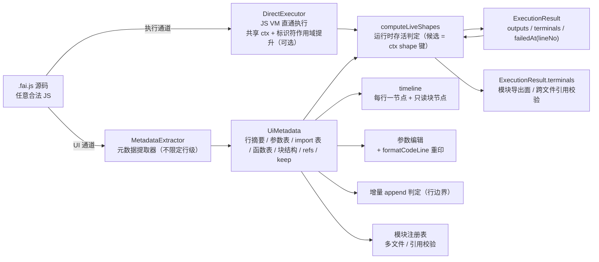

# 无 IR 双通道执行 —— 取消 parser 语义层，.fai.js 直通 JS VM（技术实现方案）

日期：2026-09-06
基线仓库：`C:\my\Faicad\faijs`、`C:\my\Faicad\3d_editor`
状态：实施中（P1–P4 guarded 已落地：MetadataExtractor + DirectExecutor + computeLiveShapes，对拍 A-16/A-17/A-14 全绿；CadRuntime 增 `CadRuntimeOptions.executor:'direct'` 可选无 IR 执行通道——execute/append/update 分支 + computeLiveShapes 终端组装 + failedAt.lineNo + AppendPrefixError 语义保留 + E4 执行选项（beforeStatement 逐单元触发、executionTimeoutMs → ExecutionLimitError/E_EXEC_LIMIT），`packages/tests/faijs/no-ir/parity/runtime-direct-mode.test.ts` 49 例（mesh fixture 全集 + runtime 面语义）绿；**缺省仍为 'module' 未翻转**——direct 组装尚未复刻 BREP topology/naming/changed/activeValues 面，完整 P4 翻转（collectResult 缺省换源 + check 降级语法门禁 + 旧路径停用）与 P5/P6 未实施）

> 定位：本文件是「UI 通道与执行通道解耦 + parser 退化为元数据提取器 + 删除中间层 IR」路线的**唯一实施文档**，包含全部实施内容（组件设计、文件级清单、迁移映射、测试、验收、门禁）。shape 存活判断的现状（DAG + keep）与新方案变化的**说明性**介绍见配套文档 [2026-09-06-dual-channel-shape-survival.md](2026-09-06-dual-channel-shape-survival.md)——该文档只做解释，不包含实施内容。

> 本文的现状结论均以 2026-09-06 读代码（`lang/parser.ts` / `lang/compile.ts` / `lang/statement-summary.ts` / `lang/code-to-args.ts` / `lang/codegen.ts` / `lang/keep.ts` / `lang/host-arg.ts` / `cad-runtime/runtime.ts` / `cad-runtime/module-executor.ts` / `cad-runtime/terminal-dag.ts` / `cad-runtime/ports.ts` / 3d_editor `script-engine/ScriptEngine.ts`）为准。行号引用仅供定位，实施时以代码为准。

---

## 0. 用户原始需求（逐字）

> 能否取消parser，让js vm直接执行.fai.js的代码。今天我有一份新的需求，结果又要大量改parser。每次改功能，就要改parser。所以我想是否能取消parser。到底有哪些功能，只有parser提供，而运行时肯定实现不了。

> 有几个功能，要能在运行时实现：
> 1. 判断哪些shape最终输出到UI上。
> 2. 能够增量执行，（最好出错还知道行号，可选）。所谓增量执行，其实是append语义，不是update语义。就是UI上多了几个操作，对应多了几行代码，要能够在之前的结果上增量执行这几行代码。至于参数变更后的update，无法增量update也无所谓，可以全量执行。
> 3. 3d_editor项目的timeline和参数编辑功能要能正常运行。
> 4. 还有ts库，以及.fai.js文件加载

> 哪些shape在UI上显示，运行时是否可以处理的？比如收集所有shape，最后存活的就是UI上显示的，是否可行。

> 一个.fai.js里定义的模型，能否在另外一个.fai.js里引用。而且引用的判定和UI上是否显示的判定一致，也就是最终显示在UI上的shape，也可以被别的.fai.js文件引用。而且，引用时源代码的名字，运行时如何处理的？

> 为何现在的parser要做那么多语法限定，它不能就是一个js语言的parser吗？支持所有的语法，我可以不要什么静态检查，但是不应该改功能就要改parser呀？直接js的所有语法就那么难吗？

> 可是我明明要求"timeline、增量执行、DAG 终端判定、参数编辑"必须建立在行级源代码之上呀。为何必须有这个IR？为何还要把IR送到js vm里。不能.fai.js代码直接让js vm执行吗？parser只干自己的活，就是UI层需要的东西解析出来。能否没有中间这个IR

> 方案大方向正确，就是要彻底删除中间无用的IR层。其他的写的不够明确，比如目前的加载第三方库的功能，是否有影响。这个似乎是parser和运行时合作实现的。还有哪些shape保留到UI上，目前是如何实现的，新的方案是否有变化，如何保证兼容。还有，外层循环不应该显示在timeline上，循环有无限中可能性，怎么可能是你说的"在 timeline 显示 ×N 聚合"，完全不可行。目前的timeline节点的方式保留即可。不认识的语法块用合理的只读节点的方式显示，不应该分析语义。

> 请更新这份文档，并保证其可实施性。指导方向是：UI通道与执行通道解耦；parser 退化为元数据提取器（不要限定为parser只做行数据提取）；彻底删除中间层IR，.fai.js源代码直接交给js vm执行。

> 这份文档只写shape 存活判断的现状实现（DAG + keep）与新方案有哪些变化，这份文档是说明性的，帮我我了解上面的方案。而2026-09-06-no-ir-dual-channel-runtime.md则要包含所有实施内容。

> 给我在方案里删除2026-09-06-cadquery-compat-and-multifile-faijs.md部分，写你自己的文档，自包含，能够交给别人实施。

> 所有3d_editor需要的api，实施方案里要写明：先实现无ir的parser保证结果和有ir的一致，有了这层测试的保证后，才准删除ir代码。

拆解出 12 条硬要求：

| # | 要求 | 约束强度 |
|---|---|---|
| R1 | 取消 parser 语义层：`.fai.js` 代码直接由 JS VM 执行，无中间 IR | 目标 |
| R2 | 四个 UI 能力（timeline / 增量执行 / DAG 终端判定 / 参数编辑）必须建立在行级源代码之上 | 红线 |
| R3 | 增量执行 = append 语义（新行增量）；update 允许全量重跑 | 红线 |
| R4 | 判断哪些 shape 显示在 UI 上；"收集所有 shape，最后存活的就是 UI 上显示的" | 目标 |
| R5 | 多文件：一个 `.fai.js` 定义的模型可在另一个 `.fai.js` 引用；引用判定与 UI 显示判定一致；TS 库加载保留 | 目标 |
| R6 | 支持所有 JS 语法（不要语法子集、不要静态检查）；改功能不应改 parser | 目标 |
| R7 | 出错最好知道行号（可选） | 可选 |
| R8 | timeline 节点方式与现状一致（每行一个节点）；**外层循环不进入 timeline 的展开节点**；不认识的语法块用只读节点显示源码文本，**不分析语义** | 红线 |
| R9 | 第三方库加载（libLoader/registerLib）功能必须保留，明确其与 parser 的协作拆分 | 红线 |
| R10 | 文档自包含：删除对 `2026-09-06-cadquery-compat-and-multifile-faijs.md` 的依赖，本文件独立可实施 | 红线 |
| R11 | **实施顺序红线**：先实现无 IR 的 parser（MetadataExtractor），保证其结果与有 IR 的结果一致（对拍测试）；**该测试全绿之后才准删除 IR 代码** | 红线 |
| R12 | 实施方案必须写明 **3d_editor 需要的全部 API** 及其在新方案下的对应实现（§4.10） | 红线 |

---

## 1. 结论摘要（先给决策）

| 决策 | 结论 |
|---|---|
| **D1 彻底删除中间层 IR** | 执行链 `parseScript → ScriptIR → compileToModule → ModuleExecutor(动态 import)` 整体移除。`.fai.js` 源码文本**直接交给 JS VM 执行**（`DirectExecutor`）。`ScriptIR`/`StatementIR`/`ImportIR`/`FunctionDefIR` 不再存在为任何中介；`lang/types.ts` 中仅保留宿主面类型（`ParamDef`/`TerminalShape`/`ScriptMetaIR`）。 |
| **D2 双通道零耦合** | 执行通道（源码 → JS VM → 结果）与 UI 通道（元数据提取器 → `UiMetadata` → timeline/参数/存活判定输入）完全分离。执行不吃提取物，UI 不依赖执行。唯一可选的共享点是**标识符作用域提升**用到的 outputs/行边界信息（文本级变换，不是 IR 编译）。 |
| **D3 parser 退化为元数据提取器（不限定行级）** | 新组件 `MetadataExtractor` 从源码提取 **UI 需要的全部元数据**：行级语句摘要、参数表、import 表、函数表、块结构、变量引用关系（refs）、keep 指令。**明确不做**：不生成可执行代码、不求值、不参与执行、不建"作为执行中介"的 IR。元数据范围由 UI 消费方决定，**不限定为行数据提取**。 |
| **D4 增量语义** | append = 共享 ctx 执行新行（精确增量，行号即语句边界）；update = 全量重跑（用户接受）。放弃 deps 闭包重算与 content-key 缓存（现状 `planUpdateStale` / `statementKey` 逻辑删除）。 |
| **D5 终端判定 = 运行时存活判定** | `computeLiveShapes`：候选（ctx 中 shape 键）− 模块内独占消费 + keep + 显式 return。**产出形态与现状 `ExecutionResult.terminals`（`TerminalShape`）逐字段兼容**（§4.4），宿主零改动。现状 `terminal-dag.ts` 静态算法删除。 |
| **D6 跨文件引用 ≠ 消费** | B 引用 A 的 shape 不取消 A 中该 shape 的终端资格（否则被装配引用的零件从 UI 消失）。模块内消费仍生效。 |
| **D7 timeline 节点方式不变 + 只读块节点** | op 行/参数行按现状每行一节点；**不认识的语法块（循环/条件等）显示为单个只读节点（行号范围 + 块类型 + 源码文本），不分析内部语义、不展开、不聚合**（R8）。 |
| **D8 第三方库通道保留** | `HostPorts.libLoader` → `registerLib` → `admitCompatLib` 契约原样保留；拆掉的只是 parser 的 import 提取与 compile 的 ns 注入，改为元数据 import 表 + DirectExecutor 执行前轻 transform（§4.8）。第三方库编写方式零改动。 |
| **D9 多文件 = 模块注册表 + 隐式导出** | `HostPorts.projectLoader` 提供文件；模块导出面 = 存活 shape ∪ 常量 ∪ 函数；源码 LHS 名 = 导出名 = 引用名（字符串匹配契约）。 |

**工作量评估**：核心替换集中在 `lang/` 语义层（parseScript/compileToModule/ModuleExecutor/statement-summary/code-to-args）→ `MetadataExtractor + DirectExecutor + computeLiveShapes`（含 keep 驱动消费判定的 StatementSummary 适配，行内 keep 查表）；3d_editor 消费点零改动（terminals/analyzeCode 面不变）。**对拍测试（A-16/A-17/A-14）是删除 IR 的前置门禁（R11），按阶段双路径共存实现**。预估 2.5–3.5 周（含对拍测试、测试迁移与门禁）。

---

## 2. 现状分析

### 2.1 当前执行链（2026-09-06 核实）

```
.fai.js 文本
  → parseScript        [lang/parser.ts:1445：acorn 解析 + AST walk → ScriptIR（语句语义提取 + 语法门禁 + 表达式折叠）]
  → compileToModule    [lang/compile.ts:322：ScriptIR → { id, deps, fn } 零 import ESM 模块；fn 体与用户源码 1:1（ctx.part5 = await ns.cad.box(10)）]
  → 动态 import        [ModuleExecutor.importModule（module-executor.ts:60：data:/Blob URL）→ JS VM 执行 fn(ctx, ns)，ctx = 持久变量容器]
  → executeIds/executeFrom  [增量：append 只执行新 id；update 按 deps 闭包重算（planUpdateStale）]
  → collectResult      [runtime.ts：outputs / terminals / brepSolids / topology / naming / compounds / activeValues / changed]
```

**执行本身已是 JS VM**——`compileToModule` 产出的 fn 体就是源码的机械改写（标识符 → `ctx.<name>`），没有任何自定义执行器。

### 2.2 IR 双消费：执行中介 + UI 元数据

`ScriptIR` 同时被两个通道消费：

| 通道 | 消费方式 | 位置 |
|---|---|---|
| 执行通道 | compileToModule 把 IR 编译成可执行模块 | `lang/compile.ts` |
| UI 通道 | analyzeCode 派生 StatementSummary、codeToArgs 反提参数、formatCodeLine 重印行 | `lang/statement-summary.ts`、`lang/code-to-args.ts`、`lang/codegen.ts` |

3d_editor 已完成 IR 剥离：宿主只持有 sceneCode 文本 + statementIndex 摘要，禁止接触 ScriptIR/StatementIR（`3d_editor/src/engine/script-engine/ScriptEngine.ts` 头部红线）。

### 2.3 IR 作为执行中介的动机与失效

compileToModule 把每条语句编译为独立 fn，动机是三条，全部服务于 update 闭包增量重算：

| 动机 | 现状实现 | 本方案处置 |
|---|---|---|
| 语句级增量控制 | executeIds 只跑新语句（append） | 保留需求但改为**行级**：append = 执行新行（共享 ctx），行号即语句边界 |
| deps 拓扑 | refs → 依赖语句 id，update 重算下游闭包（planUpdateStale / executeFrom） | **放弃**：update 全量重跑（R3） |
| content-key 缓存 | statementKey / outputContentKey 语句结果复用判定 | **放弃**：随 deps 一并消失 |

**R3（update 允许全量）一旦成立，IR 作为执行中介的必要性归零**：JS 源码顺序即执行顺序，共享 ctx 天然持有旧变量，append 新行直接执行即可。

### 2.4 语法限定的根源

`parseScript` 不是语法 parser，是**语句语义提取器**。acorn 解析所有 JS 都免费；被禁的语法（循环/条件/链式/嵌套调用/解构）是因为**无法压进扁平 StatementIR**（`{callee, positional, args, outputs, refs}` 只能表达"一行 = 一个 op 调用"），而 IR 的消费者（timeline/增量/DAG/参数编辑）要求该形态。**语法限定发生在语义提取层，不在解析层。** 每次新需求 = 新语法形态 → IR 要能表达 → parseScript 开分支 → 消费者跟着适配，即"每次改功能就要改 parser"的根源。

### 2.5 关键前置结论（已确认）

- **执行不需要 IR**：源码顺序 = 执行顺序；共享 ctx 持旧变量；append 新行直接执行。
- **变量名获取**：JS 词法作用域不可枚举（`const part5 = ...` 的 LHS 在浏览器拿不到）。三条路径：a) 标识符作用域提升（浏览器主路径，§4.2）；b) 宿主自报 outputs（3d_editor 生成代码时已知）；c) Node `vm.runInNewContext` sandbox 枚举（node-host/CLI）。
- **UI 能力本质是行级的**：timeline 每行一节点、参数编辑每行参数、增量每行 id、DAG 每行消费关系。全局性来自逐行累积（符号表/消费表），不需要全局 IR。
- **timeline 现状（2026-09-06 核实）**：`analyzeCode` 只对语句行（`script.statements`，即 op 行）生成 StatementSummary；import 行不进 statementIndex（仅用于推导 packageName）；**参数行也不进 statementIndex**（parser 把 `const X = <literal>` 收进 ScriptIR.params、不进 statements，参数值经宿主 `parseParamsFromCode` + `ExecuteOptions.params` 注入）。timeline 节点 = 每行一条摘要，字段：id/callee/namespace/packageName/receiver/positional/args/outputs/refs/hasAssignment/hasComputedArgs/line（`statement-summary.ts:88-104`）。
- **terminals 现状（2026-09-06 核实）**：终端判定完全由 faijs 负责（`terminal-dag.ts` 的 DAG 叶子算法；消费判定是 keep 驱动 C0/C3/C5——**无 op 静态 consumes 声明**，该机制曾于 P4 引入、因违反"对外约定只有 keep/keepHidden"红线已于 2026-09-06 提交 f72c0d8 删除）；3d_editor **直接信任 `result.terminals`**（"faijs runtime 已按 DAG 叶子算法产出 terminals，宿主直接信任 result.terminals，不重复实现 DAG 过滤"，`executeScript.ts`），用 `TerminalShape.id`（PartName）反查摘要 → 创建场景零件 → 提交几何。本方案对 terminals 形态零改动（§4.4）。

---

## 3. 目标架构

### 3.1 双通道总览



两条通道零耦合：执行吃源码文本，UI 吃元数据。

### 3.2 组件归属（core 内文件级）

| 组件 | 位置（新增） | 职责 |
|---|---|---|
| `MetadataExtractor` | `lang/metadata-extractor.ts` | 源码 → `UiMetadata`（行摘要 + 参数表 + import 表 + 函数表 + 块结构 + refs + keep）；替代 parseScript 的 UI 职责与 statement-summary/code-to-args 的输入侧 |
| `DirectExecutor` | `cad-runtime/direct-executor.ts` | 源码直通 JS VM：import 轻 transform + 标识符作用域提升 + 逐单元执行 + 错误行号；替代 compileToModule + ModuleExecutor 的执行路径 |
| `computeLiveShapes` | `cad-runtime/live-shapes.ts` | 存活判定（候选 = ctx shape 键 + keep 驱动 consumes 的 StatementSummary 适配，C0/C3/C5 原样、行内 keep 查表）；产出 `TerminalShape[]` 与现状兼容；替代 terminal-dag |
| `ModuleRegistry` | `cad-runtime/module-registry.ts` | 多文件装载（projectLoader 接入 + 模块导出面） |
| `SyntaxGate`（可选） | `lang/syntax-gate.ts` | check() 用：acorn parse 纯语法门禁（不做语义提取）；可从 MetadataExtractor 内建 |
| 保留：`formatCodeLine` / `host-arg.ts` / `derive-part-name` | `lang/codegen.ts` 等（原样） | 行打印、HostArg 守卫、命名 |
| 保留：`libLoader` / `registerLib` / `admitCompatLib` | `ports.ts` / `runtime.ts` / `admit-compat-lib.ts`（原样） | 第三方库通道（§4.8） |

---

## 4. 组件设计（实施内容）

### 4.1 元数据提取器 `MetadataExtractor`（D3：不限定行级）

**定位**：从 `.fai.js` 源码（任意合法 JS）提取 **UI 通道需要的全部元数据**。行级语句摘要是其中一个面，不是全部。输入 = 源码文本；输出 = `UiMetadata`。不生成可执行代码、不求值、不参与执行、不建执行中介 IR。

```ts
/** 元数据提取器输出：UI 通道的完整元数据面 */
interface UiMetadata {
  /** 行级语句摘要 = 现状 StatementSummary[] 原样（仅 op/param 行；import/function/block 行不进本面，
   *  由 imports/functions/blocks 独立表承载——与现状 ScriptIR 多面结构同构）。
   *  消费方：timeline / 参数编辑 / 存活判定的消费输入与锚点行号 / 增量行边界 / LHS 重写 inputs */
  lines: StatementSummary[]
  /** 参数表（参数面板：const X = <字面量> → 名字/值/是否计算表达式） */
  params: ParamEntry[]
  /** import 表（模块图：specifier / kind / bindings / packageName → moduleKey 或 libLoader） */
  imports: ImportEntry[]
  /** 函数表（本机函数：名字 / 形参 / 函数体原文区间） */
  functions: FunctionEntry[]
  /** 块结构（只读节点：循环/条件/switch/函数体：行号范围 + 类型 + 源码文本） */
  blocks: BlockEntry[]
  /** 变量引用关系（lineNo → 引用的变量名；UI 级联删除 removeCodeAt 等现状能力保留）——= lines[].refs 按行投影的派生视图，实现时只维护 lines 一份 */
  refs: Map<number, string[]>
  /** keep 指令（lineNo → 调用点 keep/keepHidden 条目；供存活判定静态输入） */
  keep: Map<number, KeepEntry[]>
  /** 场景级属性（现状 ScriptIR.meta 的替代：name/appearance） */
  meta?: ScriptMetaIR
  /** 显式 return 终端（AI 手写 .fai.js 场景，保留现状语义） */
  terminalShapes?: TerminalShape[]
}
```

**条目类型定义**（UiMetadata 各面的最小结构，实施以本定义为准）：

```ts
/** 参数表条目（参数面板：const X = <字面量> → 名字/值/是否计算表达式） */
interface ParamEntry {
  name: string; lineNo: number; value: unknown
  type: 'number' | 'vec3' | 'bool' | 'enum'
  computed: boolean                      // RHS 是表达式/参数引用 → 面板只读
}
/** import 表条目（模块图；relative specifier → moduleKey，裸 specifier → libLoader） */
interface ImportEntry {
  lineNo: number; specifier: string
  kind: 'named' | 'namespace' | 'default'
  bindings: string[]; localName?: string
  packageName?: string; moduleKey?: string
}
/** 函数表条目（本机函数） */
interface FunctionEntry {
  name: string; lineNo: number; params: string[]
  bodyRange: { start: number; end: number }   // 函数体原文区间（只读显示用）
}
/** 块结构条目（只读节点，R8） */
interface BlockEntry {
  lineNo: number; kind: 'loop' | 'condition' | 'function-body' | 'other'
  source: string; range: { start: number; end: number }
}
/** keep 指令条目（行级，存活判定静态输入；hidden=true 为 keepHidden） */
interface KeepEntry { target: string; hidden: boolean }
```

**行面直接复用现状 `StatementSummary`**（`lang/statement-summary.ts:32-71`，无 IR 的宿主面行摘要——文件头注释即"非 IR 类型，IR 剥离后宿主禁止 import ScriptIR/StatementIR"）。**不新增 `StatementLine`、无字段映射层**：MetadataExtractor 的 `lines` 面与现状 `analyzeCode` 产出**逐字相等**（A-16 对拍锁定）。依据：`StatementSummary` 已含全部所需字段（`id`/`callee`/`namespace`/`packageName`/`receiver`/`local`/`positional`/`args`/`outputs`/`refs`/`hasAssignment`/`hasComputedArgs`/`line`）。行分类不进入 lines——提取器把每行**分派到对应面**：op 行 → lines（= StatementSummary 原样）；param/import/function/block 行 → `params`/`imports`/`functions`/`blocks` 独立表。这与现状一致：**参数行本就不进 `statements`**（parser.ts:1695-1698 只 push ScriptIR.params，不 push statements/statementLines），现状 `analyzeCode` 只投影 op 行；参数值现状经 `ExecuteOptions.params` 注入、参数行不执行，新方案同（§4.2）。仅一处语义变化：`id` 从 sN 换 `'s'+lineNo`（append 场景稳定，宿主 timeline key 兼容；host 按字符串使用不破裂）。

**行分类规则**（"分类" = 提取器把行分派到的面）：

| 行形态 | 分派面 | 提取内容 |
|---|---|---|
| `import { bp } from './x.fai.js'` / `import * as cfg from 'pkg'` / `import cfg from 'pkg'` | imports 表 | specifier / kind / bindings / localName；相对 specifier → 模块注册表，裸 specifier → libLoader（§4.8）。**不进 timeline**（与现状一致） |
| `function name(...) { ... }` | functions 表 | 函数表（名字/形参/函数体原文区间）；timeline 按宿主现状处理（本机函数只读节点或隐藏） |
| `const X = <literal>` | params 表（**不进 lines，与现状一致**） | params 表累积（名字/值/类型/computed）；**参数行不执行**，参数值经 `ExecuteOptions.params` 注入（§4.2）；timeline 参数节点由宿主参数面板提供 |
| `const x = <call>` / `let x = <call>` / `x = <call>` | lines（op 行） | LHS → outputs；RHS 用 acorn `parseExpressionAt` 提取 callee/receiver/namespace/positional/args/refs（HostArg 形态）。timeline 正常节点 |
| `if / for / while / do / switch` 及大括号块 | blocks 表 | **只读节点**：块头行号 + 块类型 + 块源码文本（到匹配闭合 `}` 的整段）。**不提取内部 op、不分析语义、不展开为多个节点**（R8） |
| 其余（空行/注释/return 等） | 丢弃 | 仅行号；timeline 只读显示或不显示 |

**实现要点**：
- 逐行用 acorn 解析（`parseExpressionAt` 提取 RHS 调用表达式），维护**累积符号表**（已声明变量集合）用于 refs 判定。
- 表达式/参数引用（`$param`、嵌套调用、`cfg.OUTX`）按 HostArg 引用形态保留（`var-ref` / `param-ref` / `call-ref` / `expr-ref`），**不求值**。
- keep/keepHidden 作为 args 键直接提取（沿用 `host-arg.ts` 的 `kind` 判别与保留字规则），同时汇入 `metadata.keep`。
- 块行识别用**括号配对扫描**（不解析 AST）：遇到块头行（for/if/while/function/switch 或以 `{` 结尾）即进入块，扫描到匹配闭合 `}` 的整段作为一个只读节点。**不做任何语义分析**。
- 单行内多个语句（`const a=1; const b=2`）按 token 切分。
- 宿主面入口：`analyzeCode(code)` 与 `codeToArgs(codeLine)` **保留函数名与签名**（3d_editor 大量消费点不改调用），内部实现换成 MetadataExtractor 投影（迁移见 §5）。

**不随语法扩展的论证**：派生常量（`const INX = OUTX - 24`）→ param 行（RHS 是表达式 → hasComputedArgs 只读，无需折叠分支）；链式调用（`let w1 = w0.rect(...)`）→ op 行（callee=rect, receiver=w0，通用提取，无需 receiver 分支）；循环 → block 只读节点（不分析语义，无控制流分支）；import → import 行（分类 + specifier 提取，无 ImportIR）。提取的是"这行调用了什么、赋值给谁、是不是认识的单行调用、属于哪个块"，与语法形态无关——**任何合法 JS 语法都不需要改提取器**。

### 4.2 执行通道 `DirectExecutor`（D1：源码直通 JS VM）

**核心语义**：`.fai.js` 源码文本按**执行单元**（由元数据 `lines` + `blocks` 划分的顶层语句单元）直接交给 JS VM 执行。没有语句模型、没有 deps、没有表达式折叠、没有 outputs 投影。

```ts
class DirectExecutor {
  /** 持久变量容器（append 跨次存活；与现状 ModuleExecutor.ctx 同角色） */
  readonly ctx: Record<string, unknown> = {}
  /** 已执行行号集合（append 增量边界：行号即语句边界） */
  private executedUnits = new Set<string>()   // key = 单元标识（单行行号 或 块起始行）
  private fullCode = ''

  async execute(code: string, opts: DirectExecOpts): Promise<DirectExecOutcome>
  async append(code: string, opts: DirectExecOpts): Promise<DirectExecOutcome>   // 只执行新单元
  async update(oldCode: string, newCode: string, opts: DirectExecOpts): Promise<DirectExecOutcome>  // 清 ctx 全量重跑
}
```

**执行流程（execute）**：
1. 元数据提取（轻量，仅取 lines/blocks/imports 作单元划分；**param 行不是执行单元**——参数值经 `ExecuteOptions.params` 注入 ctx，与现状"参数行不执行"一致）；
2. 收集 import 行 → `__libs`（libLoader）与 `__mods`（模块注册表）装载（§4.5/§4.8）；
3. 文本变换（§下）后按单元逐个执行，单元之间共享同一 ctx；
4. 每单元 try/catch，失败记 `failedAt`（单行单元 → 精确行号；块单元 → 块首行，v2 可加 sourcemap）；
5. 产出 `ExecutionResult`：outputs/terminals/brepSolids/topology/naming/compounds 由 runtime 现有 `collectResult` 组装，输入侧换源（terminals 侧换 `computeLiveShapes`，§4.4）。

**执行载体（浏览器/Node 通用）**：变换后的单元代码用 `new Function('__ctx', unitCode)` 包裹逐单元同步执行（`__ctx` 即共享 ctx，单元内 `__ctx.<name>` 直接读写）；块单元整块同法包裹。不依赖动态 import/Blob URL（现状 `importModule` 的 data URL 机制随 ModuleExecutor 删除）；`executionTimeoutMs` 在单元循环层检查。Node 端亦可整体 `vm.runInNewContext(code, ctx)`（ctx 即全局作用域，零重写）。

**文本变换（机械、语义保持，非 IR 编译）**：
- **头部注入**：执行前注入 `const cad = __ctx.cad`（及 `__libs`/`__mods`/已注册库绑定解构），使裸 `cad`/`ns` 标识符在单元作用域内可解析。
- **import 替换**：`import * as ns from 'pkg'` → `const ns = __ctx.__libs['pkg']`；`import { bp } from './x.fai.js'` → `const { bp } = __ctx.__mods['x']`；`import cfg from 'pkg'`（default）→ `const cfg = __ctx.__libs['pkg']`。
- **标识符作用域提升（LHS 重写的完整形态）**：顶层声明与**自由引用**统一改写为 `__ctx.<name>`——`const part5 = cad.box(10)` → `__ctx.part5 = cad.box(10)`；`cad.union(part5, ...)` → `cad.union(__ctx.part5, ...)`；`function foo(...) {...}` → `__ctx.foo = function foo(...) {...}`。用 acorn walk 单遍完成，**跳过函数体局部作用域**（函数形参、函数体内声明）；**块单元自身的顶层声明提升到 `__ctx`**（块内 `const p = cad.box(...)` → `__ctx.p = ...`——否则块内产出的 shape 无法进 ctx → 存活候选，§4.3/A-6）；块内的**嵌套块**跳过。这与现状 compile.ts 的发射变换同源，但**不建语句 id、不算 deps、不投影 outputs、不折叠表达式**——只是变量容器搬家。Node 端 `vm.runInNewContext(code, ctx)`（ctx 即全局作用域）可零重写。
- **keep 键剥离**：调用实参尾随对象中的 `keep`/`keepHidden` 两键在变换时剥除（与现状 `withoutKeepDirectives` 同语义，防挤占 op 参数槽）；剥离前的值由元数据 `metadata.keep` 捕获，供存活判定。
- **宿主自报 outputs + 无跨行引用**的场景可跳过作用域提升（记录为可选优化）。

**执行模式分层（R8 的落地）**：
- **扁平行式代码**（3d_editor 生成，每行一个 op）：单元 = 单行，逐行执行 + 行级定位，能力与现状等价。
- **自由 JS**（AI/用户手写，含循环/条件块）：单元 = 块（括号配对划分），整块执行；**timeline 对块只显示只读节点**；块内产生的 shape 经执行前后 ctx diff 进入存活候选，块对外部变量的消费做词法级引用扫描（§4.3）。

**兼容面（宿主零改动或最小改动）**：
- `CadRuntime.execute/append/update(code, opts)` **签名不变**（内部改调 DirectExecutor）；`AppendPrefixError` 语义保留（append 引用不在 ctx 的变量 → 抛错，宿主升级为 execute）。
- `ExecuteOptions` 字段全部保留：`params` / `partTransform` / `beforeStatement(stmtIndex, lineNo?)`（**第一参数保持单元序数**——宿主按序数定位 summaries 不破裂；**新增第二参数 lineNo**）/ `startIndex`（**行号起点，语义与现状一致**：该行号之前的单元不执行、其产物假定已在 ctx——前置已由 execute/append 跑过）/ `topology` / `executionTimeoutMs`（E_EXEC_LIMIT 保留，整轮超时在执行单元循环中检查）。
- `failedAt` **字段兼容**：现状 `{ index, callee, message }` 保留，**新增 `lineNo`**；宿主按现状读 index/callee/message 不破裂。

### 4.3 消费判定与候选收集（keep 驱动，红线：无 consume 类接口）

**红线（用户既定，自包含）**：本项目对外约定只有 `keep` / `keepHidden`（2026-09-06 提交 f72c0d8 的 consume audit 已删除全部 consume 类接口；任何 consume 类自创接口一律禁止）。早期草案中的 `OpRecorder`/`OpRecord`（Proxy 包装 `ctx.cad` 记录执行时消费）是 consume 思想的运行时变体，违反红线，**已删除**。终端判定的消费判定**复用现状 keep 驱动 `consumes()`（C0/C3/C5 短路）**，输入从 StatementIR 换成 StatementSummary（lines 面原样，§4.1），行内 keep 判定从"扫 args"换"查 `metadata.keep` 表"（提取器已把 args 中的 keep/keepHidden 键结构化），逻辑零改动：

```
C0/C1：v ∈ keepOf(lineNo, keepRegistry).kept（行内 keep 查 metadata.keep 表；函数体 exec.keep 登记经 keepRegistry）→ 不消费
C3   ：line 有赋值且 outputs 全部非几何（不在 shapeVarNames）→ 不消费任何输入
C5   ：默认消费——line 的 positional/args 中 VarRef 引用扫描（嵌套调用内只读不消费；receiver 不消费）
```

**候选收集（运行时，与现状 `allShapeVarNames` 同源）**：执行后遍历共享 ctx 键，结构判定 `isShapeLike`/`isCompoundLike` 即为存活候选——"收集所有 shape，最后存活的就是 UI 上显示的"。块单元执行前后 ctx diff（新增 shape 键 = 块内产出）补充进候选。

**消费检查起点锚点（producerIdx）**：候选名 v 的"最后写者"由 **ctx 天然给出**（JS 赋值覆盖，键值即最后写的结果），**不需要静态找最后写者**；但消费检查必须从"v 最后一次出现在行级 outputs（或块单元产出）的行号 + 1"开始——ctx 值不带行号，锚点必须从行级元数据反查。起点之前的消费不算（对被覆盖旧值的消费）：如 `part5=box; part6=union(part5,part5); part5=box(20)`，第 2 行消费的是旧 part5，第 3 行重写后 part5 应正常显示；若从第 0 行扫起会被误判为消费而错误隐藏（terminal-dag.ts:157-171 的 `for i = producerIdx+1` 原样搬入）。

**块单元（自由 JS）的外部变量消费**：块在 timeline 上是只读节点（R8），但**消费判定**对块源码文本做词法级变量名引用扫描（与 C5 的 VarRef 扫描同精神，非语义分析），发现外部 shape 名 → 保守判为消费。这只影响自由 JS 场景；扁平行式代码与现状逐位等价（A-14 锁定）。

**块单元产出（blockOutputs）**：块内声明/产生的 shape 不在 `lines` 里（块整体是只读节点），其 `producerIdx` 锚点由**执行时登记**给出——DirectExecutor 执行块单元前后对共享 ctx 做 diff，新增的 shape 键登记为 `blockOutputs: Map<shapeName, 块起始行号>`；`computeLiveShapes` 对这类候选用块起始行作 producerIdx（否则会误走"无生产者 → 直接终端"分支，跳过消费检查，块产出被后续行消费时漏判）。

**跨文件引用 ≠ 消费（D6）**：消费判定按模块作用于**本模块自己的行级元数据**——B 引用 A 的 shape 的行不在 A 的 lines 中，A 的该 shape 天然保持终端，无需任何运行时记录器。

### 4.4 存活判定 `computeLiveShapes`（实施契约；说明见配套文档）

**取消 IR 前后，shape 活跃性判断的实现变化（逐环节对照）**：

| 实现环节 | 实施前（现状，有 IR） | 实施后（无 IR） | 变化 |
|---|---|---|---|
| 语句序列 | `script.statements`（parseScript 语义层 → `StatementIR[]`） | `metadata.lines`（MetadataExtractor → `StatementSummary[]`，与现状 analyzeCode 逐字相等） | **变**：取消 IR 的直接落点（唯一核心变化） |
| 候选集合 | 运行时 ctx 键 + `isShapeLike`/`isCompoundLike` 结构判定（`allShapeVarNames`，runtime.ts:983-990） | 同左，同源 | **不变** |
| lastProducer 查找 | 单次遍历 `StatementIR.outputs` + Map 覆盖写（terminal-dag.ts:142-150） | 单次遍历 `StatementSummary.outputs` + Map 覆盖写（§4.4 算法第 1 步） | 算法逐字不变，输入字段换 |
| 消费判定 `consumes()` | C0/C1 `resolveKeep(StatementIR, view.internalKeep)` → C3 outputs 全非几何 → C5 扫 `StatementIR.positional/args`（VarRefIR/ExprIR.refs；CallRefIR 内只读） | C0/C1 `keepOf(lineNo, keepRegistry)`（查 metadata.keep 表）→ C3 同 → C5 扫 StatementSummary 的 HostArg 引用形态 | 逻辑零改动，输入形态换 |
| 函数体 keep 登记 | `ModuleExecutor.internalKeep`（执行期登记，经 runtime view 注入） | `DirectExecutor` 持 `KeepRegistry`（执行期登记） | 机制等价，宿主换 |
| hidden（D2） | 按语句顺序"最后一次保留声明胜出" | 同左 | **不变** |
| 显式 return | `script.terminalShapes` 非空优先 | `metadata.terminalShapes` 非空优先 | 输入源换 |
| 产出 | `TerminalShape[]`（computeLeafTerminals） | `TerminalShape[]`（computeLiveShapes），形态逐字段兼容 | **不变** |
| 自由 JS 块 | 不支持（循环/条件语法被禁或不识别） | 块单元整块执行 + 词法级消费扫描 + ctx diff 补候选 | 新增场景（扩展，不是替换） |

> 结论：**活跃性判断的算法实施前后不变，变的是两个输入源**——① 语句序列从 `ScriptIR` 换成行级元数据（`StatementSummary`，这是"取消 IR"的落点）；② 行内 keep 判定从"扫 StatementIR.args"换"查 metadata.keep 表"、函数体 keep 登记宿主从 `ModuleExecutor` 换成 `DirectExecutor/KeepRegistry`。候选、lastProducer、consumes（C0/C3/C5）、hidden、显式 return、`TerminalShape` 产出全部原样；自由 JS 块是新增场景。这就是 A-14/A-16/A-17 对拍测试锁定的等价性边界。

```
候选   = ctx 中 Shape 类型键（变量名来自作用域提升器 / 宿主自报 / vm sandbox / 块 ctx diff；与现状 allShapeVarNames 同源；ctx 值天然是最后写者）
消费   = keep 驱动 consumes() 判定（C0/C3/C5 原样，输入换 StatementSummary；行内 keep 查 metadata.keep 表；**检查起点 = producerIdx+1**，producerIdx 由行级元数据反查最后一次 outputs 含该名的行号，§4.3；块单元词法级引用扫描）
保留   = metadata.keep（行级 keep/keepHidden 提取）+ exec.keep 运行时登记（DirectExecutor 持 KeepRegistry，替代 ModuleExecutor.internalKeep）
       优先级与 hidden 三态完全沿用 lang/keep.ts（调用点 > 函数体；最后一次保留声明胜出）
显式   = metadata.terminalShapes（显式 return 终端，优先）
存活   = (候选 − 模块内消费 + 保留) ∪ 显式
```

**完整算法（伪代码，含 lastProducer 查找——对每个候选名 v，找"最后一次以 v 为 outputs 的行"）**：

```
computeLiveShapes(metadata, ctx, keepRegistry, blockOutputs, shapeVarNames):
  lines = metadata.lines                      # StatementSummary[]（op 行；outputs/hasAssignment/refs）
  blocks = metadata.blocks                    # BlockEntry[]（自由 JS 块，词法级消费扫描用）
  # blockOutputs: Map<shapeName, 块起始行号>（DirectExecutor 执行块前后 ctx diff 登记，§4.3）

  # 0. hidden：最后一次保留声明胜出（与现状 D2 相同）
  #    先铺函数体登记（keepRegistry），再按行号顺序用行级调用点覆盖 → 调用点 > 函数体（与现状 resolveKeep 一致）
  hiddenOf = {}
  for v in keepRegistry.allKept():            # 函数体 exec.keep/exec.keepHidden 登记（DirectExecutor）
    hiddenOf[v] = keepRegistry.hidden(v) ?? false
  for lineNo, kept in metadata.keep:          # 行级调用点（metadata.keep: Map<lineNo, KeepEntry[]>，Map 按插入序 = 行号序）
    for k in kept: hiddenOf[k.target] = k.hidden   # 后行覆盖前行

  # 1. lastProducer：单次正向遍历 + Map 覆盖写 —— "最后一次"靠覆盖天然得到，
  #    不是对每个 v 反向扫描（O(总 outputs) 而非 O(候选数 × 语句数)）
  lastProducer = {}
  for i, line in enumerate(lines):
    if not line.hasAssignment: continue       # void op 无 outputs，跳过
    for out in line.outputs:
      lastProducer[out] = i                   # 后写覆盖先写 → 遍历结束即"最后一次"

  # 2. 候选名来自 ctx（结构判定，与现状 allShapeVarNames 同源，§4.3），逐个判定
  #    shapeVarNames = 结构判定(ctx) 的产物：遍历 ctx 键，isShapeLike/isCompoundLike 命中即候选
  terminals = []
  for v in shapeVarNames:                     # ctx 键 ∩ isShapeLike/isCompoundLike
    producerIdx = lastProducer[v] ?? blockOutputs.get(v)   # 行级锚点优先；块内产出用块起始行
    if producerIdx is undefined:              # 无生产者 → 直接终端。仅宿主手工注入
      terminals.append({id: v} ∪ hiddenOf[v]) # ctx 的变量会触发；append 不会——它重
      continue                                # 解析完整 accumulatedCode，producer 行在列
    consumed = false
    for i in range(producerIdx+1, len(lines)):# 起点 = 最后一次赋值之后（锚点，§4.3）
      if consumes(lines[i], v, metadata.keep, keepRegistry, shapeVarNames):  # C0/C1→C3→C5 短路
        consumed = true; break
    if not consumed and blockConsumes(blocks, v, producerIdx):
      consumed = true                          # 块单元词法级引用扫描（§4.3，自由 JS 新增场景）
    if not consumed:
      terminals.append({id: v} ∪ hiddenOf[v])
  return terminals

# blockConsumes：块源码文本中词法扫描外部 shape 名 v（引用即消费，保守判定）；
# 只扫 range.start 行号 > producerIdx 的块（producerIdx 之前的块不可能消费新值）
blockConsumes(blocks, v, producerIdx):
  for b in blocks:
    if b.range.start <= producerIdx: continue
    if wordBoundaryMatch(b.source, v): return true
  return false
```

> 与现状 `computeLeafTerminals`（terminal-dag.ts:123-179）逐行对应：hidden 预计算（0）→ lastProducer（1）→ 逐候选名查消费（2）。差异仅在 `lines` 来自 MetadataExtractor 而非 parseScript、行内 keep 来自 `metadata.keep` 表 + `KeepRegistry` 而非 `view.internalKeep`、自由 JS 块新增块产出锚点（`blockOutputs`）与词法级扫描（扁平行式代码不触发）；循环体、Map 语义、短路顺序逐字相同（A-14/A-16 逐字段对拍锁定）。

**与现状 `TerminalShape` 的兼容保证**（用户问"目前如何实现、是否有变化、如何保证兼容"）：
1. **字段兼容**：`ExecutionResult.terminals` 与 `TerminalShape { id, meta?, kind?, hidden? }` 结构不变 → 3d_editor 的 `createPartForTerminal` / `writeScriptStore` 零改动。
2. **行为等价**：对现有 `.fai.js` fixture（无控制流、扁平行式），静态 DAG 叶子 == 动态存活集合。用**黄金数据对比测试**锁定（验收 A-14）：实施时先双路径对照（新路径 vs 现状 computeLeafTerminals），删除旧路径后转为快照断言。
3. **keep 语义不变**：`lang/keep.ts` 的 `parseUserKeep` / `resolveKeep` / `withoutKeepDirectives` / `validateKeepDirectives` 逻辑原样；行内 keep 提取输入从 StatementIR.args 换 metadata.keep 表（提取器从行 args 的 HostArg 中扫 keep/keepHidden 键，等价于现状 parseUserKeep 的扫描）。
4. **消费判定同源**：新方案与现状使用**同一个** keep 驱动 `consumes()`（C0/C3/C5），无新接口；差异仅在输入形态（StatementIR → StatementSummary + metadata.keep 表）与块单元的词法级扫描（自由 JS 新增场景），扁平行式代码两者等价。
5. **显式 return 保留**：AI 手写 `.fai.js`（`return { shape }` 形态）场景，liveShapes = 显式列表，语义与现状一致。

**三消费方**：① UI 显示（`ExecutionResult.terminals` → 3d_editor 创建场景零件，现状路径不变）；② 模块导出面（`FaiModuleExports.liveShapes`，§4.5）；③ 跨文件引用校验（`bp ∈ A.liveShapes`，不在 → `failedAt`）。

### 4.5 多文件 `ProjectLoader` + 模块注册表

```ts
interface ProjectLoader {          // HostPorts 新增可选字段（契约唯一归属本文件 §4.5，自包含）
  listModules(): string[]
  readSource(moduleKey: string): Promise<string>
  fingerprint?(moduleKey: string): Promise<string>
}
interface FaiModuleExports {
  values: Record<string, unknown>   // 存活 shape + 常量（params）
  fns: Record<string, (...a: unknown[]) => unknown>
  liveShapes: Set<string>           // 存活 shape 名（供引用校验）
}
```

**装载流程**（`module-registry.ts`）：
1. 入口文件行切分 → import 行收集相对 specifier → 归一为 moduleKey（字符串路径处理，POSIX、无扩展名、相对项目根）；
2. DFS 递归装载（读源码 → MetadataExtractor → 递归收集 import 行）；循环依赖 → `failedAt`（含环路径）；已装载（moduleKey + fingerprint）→ 复用缓存；
3. 拓扑序执行每个模块（**每个模块一个独立 ctx 实例**，共享 OCCT kernel 单例与拓扑/命名服务；主模块执行时其 ctx 即 DirectExecutor 的持久 ctx——append 跨次存活）；
4. 主模块执行前 import 轻 transform（§4.2）。

**名字契约**：A 的 LHS 名 = 导出名；B 的 import 绑定名 = 引用名；projectLoader 字符串匹配校验。**跨文件引用 ≠ 消费**（D6）：B 引用 A 的 shape 的行不出现在 A 的行级元数据中，不参与 A 的消费判定；模块内消费仍生效（A 内 `bp` 被 `fillet` 吃掉 → 导不出 bp → B 引用报错）。

**`// @export bp, mb` 可选收窄**：文本级注释指令（不进 AST、往返无损）；出现时导出面 = 显式列表 ∩ 存活集合（保证"引用判定与显示判定一致"不被破坏）。

### 4.6 四个 UI 能力映射

| 能力 | 数据源 | 说明 |
|---|---|---|
| timeline | `UiMetadata.lines/blocks`（静态，不执行） | op 行每行一节点（**与现状逐字一致**）；**block 行单个只读节点**（行号范围 + 块类型 + 源码文本，不分析语义、不展开、不聚合）；import/param 行不进（与现状一致，参数节点由宿主参数面板提供） |
| 参数编辑 | 行级 positional/args（HostArg 引用形态保真）+ `formatCodeLine` 重印 | 编辑 → update（全量重跑）；表达式/参数引用行 → hasComputedArgs 只读；只读块节点不可编辑 |
| 增量 append | DirectExecutor.append | 共享 ctx 执行新单元（行号即边界） |
| DAG 终端 | computeLiveShapes（§4.4） | keep 驱动消费判定 + keep（与现状同算法）；产出 terminals 与现状兼容 |

### 4.7 保留的行级工具（不随语法扩展）

- `formatCodeLine`（`lang/codegen.ts`）：纯数据 → 代码行打印，依赖 HostArg 面（`FormatCodeLineInput`）而非 parseScript，原样保留。
- `host-arg.ts`（HostArg 守卫 / 引用形态）：原样保留。
- `derive-part-name.ts`（partN 分配）：原样保留（UI 生成代码命名）。
- `keep.ts`：语义与四个导出函数原样；行内 keep 提取输入从 StatementIR.args 换 metadata.keep 表（§4.4）。

### 4.8 第三方库加载（用户问"parser 和运行时合作实现，是否有影响"）

**现状（parser + 运行时合作）**：

| 环节 | 组件 | 职责 |
|---|---|---|
| 1 | parser `importDeclToIR`（`parser.ts:1197`） | `import * as ns from 'pkg'` → ImportIR（kind / localName / packageName） |
| 2 | runtime `autoLoadLibs`（`runtime.ts:898`） | 收集 ImportIR → 调 `HostPorts.libLoader` 加载 → `registerLib(localName, ns, { packageName })` |
| 3 | compile（`compile.ts:232`） | 编译产物 `fn(ctx, ns)`，ns 含已注册库；`ns.<binding>.<callee>()` 发射为命名空间调用 |
| 4 | `admitCompatLib` / `compatOp` | 第三方库边界收口（`admit-compat-lib.ts`） |

**新方案（拆分不变，载体变）**：

| 环节 | 组件 | 职责 |
|---|---|---|
| 1 | MetadataExtractor import 行 | `import * as ns from 'pkg'` → ImportEntry（specifier/kind/bindings/localName/packageName），并推导 summary.packageName |
| 2 | DirectExecutor 执行前轻 transform | `import * as ns from 'pkg'` → `const ns = __ctx.__libs['pkg']`（§4.2）。`__libs` 来自 `HostPorts.libLoader` → `registerLib`（**通道原样**） |
| 3 | 共享 ctx 预置 | 注册库命名空间对象挂在 ctx（`ctx.cad` / `ctx.<localName>`），源码直接访问 |
| 4 | `admitCompatLib` / `compatOp` | 原样保留（库边界收口与执行载体无关） |

**影响面（如实）**：
- `HostPorts.libLoader` 契约（`loadLib` / `listLibs` / `options.compat`）**不变**；
- `registerLib` 注入点从"compile 的 ns 参数"变为"DirectExecutor 的 ctx 预置"——宿主调用方式不变；
- 第三方库（如仓库现有 gear-lib-demo / 仅 import `@faicad/faijs/compat` 的库）编写方式**零改动**；
- 库调用 `ns.<fn>()` 的执行与原语义一致；函数体 `exec.keep`/`exec.keepHidden` 登记（KeepRegistry）与调用点 keep 覆盖关系不变；
- **变化点**：`autoLoadLibs` 的触发从"解析 ImportIR"变为"元数据 import 表扫描"；`__libs` 注入在浏览器下用轻 transform（Node ESM 可原生 import）。
- 验收：A-13。

### 4.9 文件级实施清单

**新增**（core 内）：
- `lang/metadata-extractor.ts`（+ `metadata-extractor.test.ts`）：元数据提取器，UiMetadata（lines = StatementSummary[] 原样 + params/imports/functions/blocks/keep/refs/meta/terminalShapes 各表）/ 行分派 / 块配对 / 符号表。
- `lang/syntax-gate.ts`（可选，并入 metadata-extractor 亦可）：`check()` 的 acorn 纯语法门禁。
- `cad-runtime/direct-executor.ts`（+ `direct-executor.test.ts`）：源码直通执行（import 轻 transform / 作用域提升 / 逐单元执行 / append / 错误行号）。
- `cad-runtime/live-shapes.ts`（+ `live-shapes.test.ts`）：computeLiveShapes + keep 驱动 consumes 的 StatementSummary 适配（C0/C3/C5，行内 keep 查 metadata.keep 表，无新接口）。
- `cad-runtime/module-registry.ts`（+ `module-registry.test.ts`）：ProjectLoader 接入 + FaiModuleExports。
- `packages/tests/faijs/no-ir/`（集成测试目录）：`parity/`（对拍测试：A-16/A-17/A-14，删除 IR 的前置门禁）、golden-terminals、多文件、循环块、libLoader 回归。

**删除**（执行侧与旧语义层）：
- `lang/parser.ts`：语义提取（parseScript / ParseError 的语义分支 / importDeclToIR / 表达式折叠）删除；仅保留的 acorn 语法门禁能力迁入 `syntax-gate.ts`。
- `lang/compile.ts`：compileToModule / CompiledStatementMeta 删除。
- `cad-runtime/module-executor.ts`：ModuleExecutor 删除（持久 ctx / 作用域提升 / internalKeep 登记 / releaseSolid 回调迁入 DirectExecutor；`ExecBookkeeping`/`Namespaces` 迁入 direct-executor.ts）。
- `cad-runtime/terminal-dag.ts`：computeLeafTerminals / consumes / DagRuntimeView 删除（live-shapes.ts 替代）。
- `lang/code-to-args.ts`：`codeToArgs` 实现换 MetadataExtractor 行级提取（函数名与返回类型保留）。
- `lang/types.ts`：删除 ScriptIR / StatementIR / ImportIR / FunctionDefIR / ArgIR / StatementIR 相关守卫与工厂；保留 ParamDef / TerminalShape / ScriptMetaIR / VarKind。

**修改**：
- `lang/statement-summary.ts`：`analyzeCode` 实现换 MetadataExtractor（**lines 面直接产出 StatementSummary 原样，无投影层**）；导出类型 `StatementSummary` 本身不变（id 语义换 `'s'+lineNo`）。
- `cad-runtime/runtime.ts`：execute/append/update 改调 DirectExecutor；autoLoadLibs 改元数据 import 表；collectResult 的 terminals 侧改 computeLiveShapes；check 改语法门禁 +（可选）试执行；`ExecuteOptions.beforeStatement` 第一参数保持单元序数、**新增第二参数 lineNo**（见 §4.10 E4）。
- `cad-runtime/ports.ts`：HostPorts 新增 `projectLoader?: ProjectLoader`。
- `lang/keep.ts` / `lang/host-arg.ts`：行内 keep 提取输入从 StatementIR.args 换 metadata.keep 表（提取器用 HostArg 守卫从行 args 中扫 keep/keepHidden 键）。**注意**：keep.ts 内部依赖的 `isVarRef`/`isCallRef`/`isExprRef` 守卫随 ArgIR 删除，改为 HostArg 守卫（`isHostVarRef`/`isHostRef`/`isHostParamRef` 等），判定逻辑逐字不变；`StatementSummary` 是唯一行面类型。
- `lang/codegen.ts`：`buildIRArgsParts`/`statementIRToLine`（StatementIR 依赖）改以 HostArg 面输入；`formatCodeLine` 不动。
- 根门面 `packages/core/src/index.ts` 与各子路径：删 parseScript/compileToModule 相关导出，增 MetadataExtractor 面导出；`analyzeCode`/`codeToArgs`/`formatCodeLine` 导出保留。

**保留**：`preview-exec.ts`、`content-key.ts`（computeContentKey 若仅宿主用则随 update 语义调整，见 §5）、`backend-dispatch.ts`、`admit-compat-lib.ts`、`lib-id.ts`、`brep/`、`mesh/`、`boolean/`、`topology/`、`api/`、`primitives/`、`sdf/` 全部原样。

### 4.10 3d_editor 需要的 API（逐条契约，R12）

> 范围：3d_editor 消费 faijs 的面分两块——**脚本引擎面**（script-engine / script-store / model-store，本方案覆盖）与**几何/拓扑/导出面**（`buildSelectorRuntime` / `deriveNormals` / `mergeBufferGeometries` / `importStep` / `exportStep` / `solveFaceMate` 等，**不在本方案范围，原样保留**）。下表逐条列脚本引擎面的全部 API：现状实现 → 新方案实现 → 3d_editor 迁移动作。所有"签名不变"的条目 = 3d_editor 零改动（R12 验收：本表每行都有测试覆盖）。

#### 4.10.1 UI 通道（静态/文本面，parser 职责 → MetadataExtractor）

| # | API（现状签名） | 现状实现 | 新方案实现 | 3d_editor 消费点（文件:行） | 迁移动作 |
|---|---|---|---|---|---|
| U1 | `analyzeCode(code): StatementSummary[]`（parse 失败抛含 `line` 的错误） | `lang/statement-summary.ts`（基于 parseScript 的 ScriptIR） | **函数名与签名不变**，内部换 MetadataExtractor（lines 面直接产出 StatementSummary 原样，无投影层；id 兼容 `'s'+lineNo`） | `executeScript.ts:123`（parse 阶段错误捕获）、`executeScript.ts:527`（submitFaijsEdit）、`script-store.ts`、`undo-registrations.ts:30` | 零改动（返回类型不变） |
| U2 | `codeToArgs(codeLine): { args: Record<string, HostArg>; positional?: HostArg[] }` | `lang/code-to-args.ts`（parser 行级反提） | **函数名与签名不变**，内部换 MetadataExtractor 行级提取（HostArg 引用形态保真） | `executeScript.ts:294`、`ScriptEngine.ts:1468`（collectTransformStmtsUpTo）、`model-store.ts:12`、`primitives-store.ts`、`WedgePanel.tsx:10` | 零改动 |
| U3 | `formatCodeLine(input): string`（行重印） | `lang/codegen.ts`（原样保留） | **原样保留**（依赖 HostArg 面而非 parseScript） | `script-store.ts`（updateStatementArgs 重印行）、`model-store.ts:12` | 零改动 |
| U4 | `isHostVarRef / isHostRef / isHostParamRef(v): boolean` | `lang/host-arg.ts`（原样保留） | **原样保留** | `script-store.ts:21`、`model-store.ts:12`、`transform-session.test.ts` | 零改动 |
| U5 | `deriveOutputs(op, inputs, n, code): string[]`（partN 命名） | `lang/derive-part-name.ts`（原样保留） | **原样保留** | `ScriptEngine.ts:458`（recordShape）、`:907`（chamferPreview）、features/types.ts | 零改动 |
| U6 | 类型 `StatementSummary`（id/callee/namespace/packageName/receiver/local/positional/args/outputs/refs/hasAssignment/hasComputedArgs/line） | `lang/statement-summary.ts`（现状类型） | **原样保留**（类型与字段全集不变，id 语义换 `'s'+lineNo`） | script-store `statementIndex`、FeatureTree、`ScriptEngine.ts:213`（findLastProducerSummary）、`:235`（collectPartStmtIds，读 outputs/refs/id） | 零改动 |

#### 4.10.2 执行通道（runtime 面，DirectExecutor）

| # | API（现状签名） | 现状实现 | 新方案实现 | 3d_editor 消费点（文件:行） | 迁移动作 |
|---|---|---|---|---|---|
| E1 | `CadRuntime.execute(code, opts): Promise<ExecutionResult>` | 现有 `executeIR` 链（parseScript → compile → ModuleExecutor） | **签名不变**，内部改调 `DirectExecutor.execute`（P4 切换） | `executeScript.ts:197`、`ScriptEngine.ts:910/1214/1379` | 零改动 |
| E2 | `CadRuntime.append(code, opts): Promise<ExecutionResult>` | 增量：executeIds 只执行新语句 | **签名不变**，改调 `DirectExecutor.append`（共享 ctx 执行新单元，行号即边界）；`AppendPrefixError` 语义保留 | `ScriptEngine.ts:970`（_appendExecute） | 零改动 |
| E3 | `CadRuntime.update(oldCode, newCode, opts): Promise<ExecutionResult>` | deps 闭包增量重算 | **签名不变**，改调 `DirectExecutor.update`（清 ctx 全量重跑，R3） | `ScriptEngine.ts:1186`（editStatement）、`:1354`（updateSceneCode） | 零改动 |
| E4 | `ExecuteOptions`：`params` / `partTransform` / `beforeStatement` / `startIndex` / `topology` / `executionTimeoutMs` | 现语义 | **字段全保留**；`beforeStatement(stmtIndex, lineNo?)` 第一参数保持单元序数（宿主按序数定位 summaries 不破裂），**新增第二参数 lineNo**；`startIndex` = 行号起点（该行号之前的单元不执行、其产物假定已在 ctx，§4.2）；`executionTimeoutMs`（E_EXEC_LIMIT）保留 | `executeScript.ts:186-194`（beforeStatement 用 index 定位 `summaries[index]`） | 零改动（宿主只用第一参数） |
| E5 | `AppendPrefixError`（类，instanceof 判定） | 现语义 | **保留**（append 引用不在 ctx 的变量 → 抛错，宿主升级 execute 兜底） | `ScriptEngine.ts:972`（_appendExecute catch） | 零改动 |
| E6 | `failedAt: { index; callee; message }` | 现语义 | **三字段保留 + 新增 `lineNo`**；单行单元 = 精确行号，块单元 = 块首行 | `executeScript.ts:199-201/248-252`、`ScriptEngine.ts` 多处 throw（按 index/callee/message 读） | 零改动（新增字段不破裂） |
| E7 | `check(code): CheckResult`（parse/符号/引用预检） | parseScript + symbol/ref 校验 | 降级为 acorn 语法门禁 +（可选）试执行；`CheckResult` 结构保留 | `executeScript.ts:140` | 零改动 |
| E8 | `getCachedOutput(partName): Shape \| undefined` / `clearStatementCache()` | runtime 持久 ctx/缓存 | **保留**（DirectExecutor 持久 ctx + 派生缓存提供） | `ScriptEngine.ts:1401/1391`、`executeScript.ts:446`（editParam 取几何算 contentKey） | 零改动 |
| E9 | `buildBrepTopology(partName)` / `setTopology(partName, kind, data)` / `mode` | runtime 派生数据面 | **保留**（与执行链解耦，由 runtime 继续维护拓扑/命名/导出缓存） | `ScriptEngine.ts:707/601/795`、`createPrimitivePart` | 零改动 |
| E10 | `dispose()` | runtime 生命周期 | **保留** | `ScriptEngine.ts:127`（resetCadRuntime） | 零改动 |
| E11 | `createRuntime(ports, mode): CadRuntime`（门面工厂） | 现语义（注入 cad 命名空间） | **签名不变**；`HostPorts` 新增可选 `projectLoader?: ProjectLoader`（§4.5），既有字段（libLoader/assetResolver/…）不变 | `ScriptEngine.ts:115/134`（createRuntime + resetCadRuntime）、`host/index.ts`（createBrowserPorts） | 零改动（projectLoader 为可选，不提供则单文件行为不变） |
| E12 | `isMeshShape(shape): boolean` | 现语义 | **原样保留** | `executeScript.ts:20`、`ScriptEngine.ts:196/919`（requireMeshOutput） | 零改动 |

#### 4.10.3 结果面（`ExecutionResult` / `TerminalShape`）

| # | 字段 | 现状 | 新方案 | 3d_editor 消费点 | 迁移动作 |
|---|---|---|---|---|---|
| R1 | `outputs: Map<PartName, Shape>` | collectResult 组装 | **不变**（collectResult 组装逻辑原样，terminals 侧输入换 computeLiveShapes） | `executeScript.ts:274/279`、`ScriptEngine.ts:192`（requireMeshOutput） | 零改动 |
| R2 | `terminals: TerminalShape[]` | computeLeafTerminals（DAG 叶子） | computeLiveShapes（§4.4），**形态逐字段兼容** `{ id, meta?, kind?, hidden? }` | `executeScript.ts:330`（直接信任）、`ScriptEngine.ts:1251-1299`（commitSceneResult） | 零改动 |
| R3 | `brepSolids` / `brepChain` / `topology` / `naming` / `compounds` / `activeValues` | collectResult 组装 | **原样保留** | `ScriptEngine.ts:1041-1051/1305-1323`（_fillExportCacheAndRebuildTopology / commitSceneResult） | 零改动 |
| R4 | 类型 `TerminalShape` / `PartNaming` / `StmtId` / `Shape` / `HostArg` | `lang/types.ts` 等 | **原样保留**（`StmtId` = `'s'+行号` 字符串，宿主按字符串使用不破裂） | 全仓类型 import | 零改动 |

**R12 验收**：本表 U1–U6 / E1–E12 / R1–R4 每行对应至少一条回归测试（在 3d_editor `script-engine/*.test.ts` 与 core 测试中覆盖），实施时逐行打勾；任何一行"签名变化"必须经用户确认后方可偏离。

---

## 5. 兼容性与迁移

| 对象 | 现状 | 迁移 |
|---|---|---|
| 3d_editor `analyzeCode` | 返回 StatementSummary[]（script-store statementIndex / timeline / FeatureTree） | 函数名与调用不变，内部换 MetadataExtractor（lines 面原样产出 StatementSummary）；id 语义换 `'s'+lineNo`；3d_editor 零改动 |
| 3d_editor `codeToArgs` | 从代码行反提参数 | 实现换行级提取，签名不变 |
| 3d_editor `formatCodeLine` | 重印行 | 原样保留，零改动 |
| 3d_editor `deriveOutputs` | 命名 | 原样保留，零改动 |
| `runtime.execute/append/update` | 文本入口 | DirectExecutor 保持同一签名（宿主零改动面）；`ExecuteOptions.beforeStatement` 第一参数保持单元序数、**新增第二参数 lineNo**（宿主只读第一参数零改动，见 §4.10 E4） |
| **`result.terminals` / `TerminalShape`** | DAG 叶子静态算法 | **字段与形态不变**，computeLiveShapes 动态产出；3d_editor `createPartForTerminal` / `writeScriptStore` 零改动（§4.4） |
| **`failedAt`** | `{ index, callee, message }` | 三字段保留 + 新增 `lineNo`（宿主按现状读不破裂） |
| **`libLoader` / `registerLib`** | parser ImportIR + compile ns | 契约不变；import 轻 transform + ctx 预置；第三方库零改动（§4.8） |
| `runtime.check` / CLI `check` | 静态预检（parse/symbol/reference/keep） | 降级为 acorn 语法门禁（可选）+ 试执行；`CheckResult` 结构保留 |
| `computeContentKey`（宿主在用：executeScript.ts:446 editParam） | 语句结果复用 | update 全量重跑后无执行侧用途（D4）；导出保留为纯函数，宿主仍用作 UI 侧缓存键 |
| 测试套件 | parser/compile/statement-summary/code-to-args/terminal-dag 测试 | **先双路径共存**：新增对拍测试（A-16/A-17/A-14）锁定新旧一致；删除 IR 后对拍转快照断言。迁移为 MetadataExtractor/DirectExecutor/computeLiveShapes（含 keep 契约回归）测试 |
| 门禁 | typecheck/lint/doc-sync/CI | 照旧；删除的 parser/compile/module-executor/terminal-dag 模块同步移除导出与类型，`gen-api-dts.ts` 不受影响（mesh schema 未动） |

---

## 6. 实施计划与验收

### 阶段划分（每阶段可独立交付、独立验收；顺序依赖按表）

> **R11 红线落地（实施顺序）**：P1–P3 全部是"**新增 + 对拍**"，任何阶段都不允许先删 IR 代码。A-16/A-17/A-14 三组对拍测试（`packages/tests/faijs/no-ir/parity/`）从 P1 起常绿；**P6 的删除 PR 以它们为合并前置条件**。删除完成后对拍测试转快照断言（行为基线固化）。

| 阶段 | 内容 | 依赖 | 退出标准 | 预估 |
|---|---|---|---|---|
| **P1 无 IR 提取器（不删任何代码）** | MetadataExtractor（UiMetadata 全量：lines = StatementSummary[] 原样 + 参数表 + import 表 + 函数表 + 块结构 + refs + keep）+ **对拍测试 A-16**（lines 面 == 现状 analyzeCode 产出逐字段相等；keep 表 == parseUserKeep 逐语句提取；params/imports/functions/meta/terminalShapes vs ScriptIR 派生面相等）；analyzeCode/codeToArgs 换实现（parseScript 仍供执行链，双路径共存） | — | A-4/A-6/A-7/A-11 + **A-16 全绿** | 3–4d |
| **P2 无 IR 执行（不删任何代码）** | DirectExecutor（共享 ctx / 作用域提升 / cad 与库注入 / import 轻 transform / append / 逐单元错误行号）+ **对拍测试 A-17**（DirectExecutor vs 现状 executeIR 同 fixture 逐条相等） | P1 | A-1/A-2/A-3/A-5 + **A-17 全绿** | 2–3d |
| **P3 无 IR 存活判定（不删任何代码）** | computeLiveShapes + consumes 的 StatementSummary 适配（行内 keep 查表）+ **黄金数据双路径对比测试 A-14**（computeLiveShapes == computeLeafTerminals 逐条相等，含 hidden/kind） | P2 | **A-14（双路径）全绿** | 2d |
| **P4 切换（门禁：A-16/A-17/A-14 全绿后）** | runtime execute/append/update 切 DirectExecutor；collectResult 的 terminals 侧切 computeLiveShapes；check 降级语法门禁；**旧路径代码保留但停用** | P3 | A-1–A-15 全量回归绿 | 1–2d |
| **P5 参数编辑对接 + 多文件** | 行级参数保真 + formatCodeLine 重印 + update 全量重跑 + hasComputedArgs 只读；projectLoader + 模块注册表 + import 轻 transform + 隐式导出 + 引用校验（liveShapes 三消费方） | P4 | A-5/A-8/A-9/A-10 | 2–3d |
| **P6 删除 IR + 迁移门禁** | **前置门禁：A-16/A-17/A-14 在 CI 全绿（R11）**；删除 parseScript 语义层 / compileToModule / ModuleExecutor / terminal-dag；对拍测试转快照断言；3d_editor 消费点映射（§4.10 逐行打勾）/ CLI / doc-sync / Agent Note | P5 | A-12/A-15；全量 CI 绿 | 2–3d |

### 验收标准（每条都是可执行断言）

- A-1 `execute('const part5 = cad.box(10)')` 返回 `outputs.part5` 为 Shape，`terminals = [{id: 'part5'}]`；中间被消费 shape 不在 terminals。
- A-2 `append` 新行后只执行新行（旧 op 调用计数不变），`terminals` 正确更新；旧变量在共享 ctx 中可见。
- A-3 `update`（改参数）全量重跑，结果正确；失败时 `failedAt.lineNo` 指向真实行号（`failedAt.index/callee/message` 保留可读）。
- A-4 timeline 摘要（callee / outputs / args 引用形态 / line / id）与现状 statementIndex 逐字段等价（黄金数据对比测试）。
- A-5 参数编辑：`cad.box(10, 20, height)`（height 为参数引用）编辑 height 值后代码行保留参数引用形态，重跑结果正确。
- A-6 循环块：`for` 块在 timeline 显示为**单个只读节点**（行号范围 + 块类型 + 源码文本），不展开、不聚合、不分析内部语义；执行正常，块内产出的 shape 出现在 terminals。
- A-7 链式 `let w1 = w0.rect(100, 100)` 解析 + 执行通过，timeline 显示 callee=rect, receiver=w0。
- A-8 多文件：`import { bp } from './x.fai.js'` + `cad.union(bp, ...)` 通过；`bp ∈ A.liveShapes` 校验；缺失导出名 → `failedAt`；循环依赖 → `failedAt` 带环路径。
- A-9 引用判定与显示判定一致：A 的存活 shape 全部可被 B 引用；A 内被消费的 shape 不可引用。
- A-10 跨文件引用不取消被引用 shape 的 UI 显示资格（D6）。
- A-11 语法自由回归：派生常量、负字面量、链式调用、循环块、条件块用例全部通过，MetadataExtractor 零改动。
- A-12 全流程 `stderr` 零输出（CI 红线）；doc-sync 全绿。
- A-13 **libLoader 兼容**：`registerLib` 注入的第三方库在 DirectExecutor 下 `ns.fn(...)` 正常调用、函数体 `exec.keep`/`exec.keepHidden` 登记与调用点 keep 覆盖生效（keep 契约回归）；`HostPorts.libLoader` 契约不变（回归测试）。
- A-14 **terminals 兼容**：现有 `.fai.js` fixture 全集上，`computeLiveShapes` 产出 == 现状 `computeLeafTerminals` 产出（黄金数据对比，逐条相等，含 hidden 与 kind；P3 双路径，P6 转快照）。
- A-15 重赋值 `bp = bp2` 后 `terminals` 含 `bp`（最后写者语义，ctx 键天然覆盖）。
- A-16 **提取器对拍（删除门禁 1/3）**：`packages/tests/faijs/` 全部 `.fai.js` fixture + 3d_editor 脚本引擎集成用例上，`MetadataExtractor` 的 lines 面与现状 `analyzeCode` 产出**逐字段相等**（id 兼容 `'s'+lineNo` 规则下）；keep 表与现状 `parseUserKeep` 逐语句提取相等；params / imports / functions / meta / terminalShapes 与 ScriptIR 派生面逐字段相等。
- A-17 **执行对拍（删除门禁 2/3）**：同一批 fixture（**限扁平行式 op 行代码**——现状不支持自由 JS 块，块场景由 A-6 单独验收）上，`DirectExecutor.execute` 与现状 `executeIR`（ModuleExecutor 链）产出逐条相等（outputs 键集与值、terminals、failedAt 语义；append/update 路径同）。
- A-18 **删除门禁（删除门禁 3/3 = R11）**：A-16/A-17/A-14 在 CI 全绿之前，`lang/parser.ts` 语义层 / `lang/compile.ts` / `cad-runtime/module-executor.ts` / `cad-runtime/terminal-dag.ts` 的删除 PR 不得合并（CI 把 `packages/tests/faijs/no-ir/parity/` 设为强制阶段）。

---

## 7. 风险与待裁决

| ID | 风险 | 影响 | 处置 |
|---|---|---|---|
| **R-1** | 参数编辑的引用形态保真（值 vs 引用） | 高 | 行级元数据保留 HostArg 引用形态（§4.1），表达式行只读；验收 A-5 固化 |
| **R-2** | 只读块节点的产品形态（循环/条件在 timeline 上的呈现） | 中 | 已按 R8 定为"单只读节点显示源码文本，不分析语义"；块内 shape 仍进 terminals（A-6）。UI 呈现细节与 3d_editor 确认 |
| **R-3** | update 全量重跑对大型 BREP 场景的响应性 | 中 | 用户已接受（R3）；如需恢复可后续加"行级依赖图"（行级 refs 可重建，v2 选项） |
| **R-4** | 测试套件迁移量（parser/compile/terminal-dag 测试重写） | 中 | P6 集中迁移；terminals 用黄金数据对比测试锁定（P3 双路径 → P6 快照） |
| **R-5** | 标识符作用域提升对自由 JS 的覆盖（解构/块内/多行/with） | 低 | v1 支持标识符声明 + 自由引用提升、函数/块局部作用域跳过；解构 v2；块内 shape 用 ctx diff 收集（§4.3）；宿主自报可跳过 |
| **R-6** | 模块注册表与既有 libLoader 通道的边界 | 低 | 相对 specifier → 模块注册表，裸 specifier → libLoader，不重叠（§4.8） |
| **R-7** | 作用域提升与 `executionTimeoutMs`/Worker 的交互（自由 JS 死循环） | 中 | 整轮超时在执行单元循环中检查（E_EXEC_LIMIT 保留）；自由 JS 块内部超时 v2 用 Worker 终止 |
| **R-8** | 对拍测试覆盖缺口（fixture 不全 → 删除 IR 后行为回归） | 高 | 对拍基线 = `packages/tests/faijs/` 全部 fixture + 3d_editor script-engine/stores 集成测试；P1 先扩 fixture（keep/链式/多文件/错误路径）再进 P6；三组对拍（A-16/A-17/A-14）常绿后才准删（R11） |
| **R-9** | hidden 声明绑定单次调用、聚合按变量名（D2）：变量重写后，旧调用上的 keepHidden/keep 声明会附着到新值（`hiddenOf` 按名全局覆盖，重写行无声明则不重置） | 低 | **用户 2026-09-06 确认暂不处理**。属既定语义（名字级声明持续有效，直到该名字下一次 keep 声明覆盖；逃生口 = 重写行再声明）。若未来改为"值代际"绑定（重写后重置为可见）＝ 独立行为变更，需单独立项评估 3d_editor 与既有 fixture 影响，不在本方案等价性范围内 |

### 待用户裁决（1 项）

1. **update 全量重跑**是否接受为长期语义（v2 再考虑行级依赖图恢复增量）——本方案默认接受（R3）。循环 timeline 的呈现已按 R8 定为只读节点，无需裁决。
