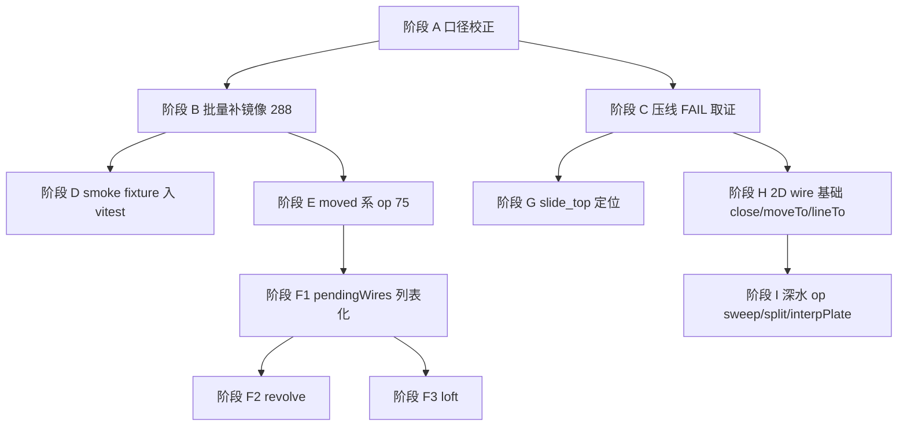

# cq-compat 对等验证 — 剩余工作开发计划（Phase 2）

> 状态：**方案（未实施）**
> 日期：2026-09-08
> 上游方案：`docs/plans/2026-09-08-cq-compat-cadquery-parity.md`（P0–P4 批次1 已落地，本计划承接其未完成项）
> 范围：`packages/cq-compat`、`packages/mini_lathe`（受影响的消费方）

---

## 1. 用户原始要求（原文引用）

本轮要求：

> 上面总结的所有未完成的任务，请按照难易程度和依赖顺序，先易后难，写一份新的开发计划文档。

拆解为两条硬性约束：

| 编号 | 约束 |
|---|---|
| C1 | 覆盖**上一份方案全部未完成项**，不得遗漏 |
| C2 | 排序规则 = **先易后难**，且必须满足**依赖顺序**（被依赖的排前面） |

上一轮（原方案 §1）的基础约束继续有效：验证对象是 CadQuery 上游建模测试（C1'）、参考侧导出 STEP（C2'）、
`packages/cq-compat/tests/` 逐用例镜像（C3'）、判定标准为双方 STEP 一致（C4'），非建模用例忽略。

---

## 2. 未完成项全景与实测基线

### 2.1 基线数据（2026-09-08 17:5x 在本仓库实测，非估算）

| 项 | 值 | 来源 |
|---|---|---|
| ref 用例 / STEP | 305 case / **650 个 STEP** | `out/ref/manifest.json` |
| manifest 条目 | 697 = ported **27** / blocked 623 / skipped **47** | `tests/manifest.json` |
| 磁盘镜像脚本 | **55 个** `.fai.js` | `tests/test_cadquery/` |
| 比对结果 | PASS **50** / PASS-NT 1 / **FAIL 4** / ERROR 0 | `out/report.md` |
| parity | **7.85%**（51/650） | `out/report.md` |
| coverage 分类 | PORTABLE **136** / PORTABLE-WITH-STUB **36** / BLOCKED 125（共 305 case） | `tests/coverage.json` |
| 可移植 case 的 var 数 | **318**（174 case） | `tests/coverage.json` |
| cq-compat 导出 op 数 | 36（Workplane 面）+ 4（Assembly 面） | `src/index.ts` |

> ⚠️ **口径失真已确认**：`manifest.json` 记 `ported: 27`，磁盘上却有 **55** 个镜像脚本——
> P4 批次1 新增的 28 个镜像**没有重跑 `gen-manifest.ts`**，清单与磁盘不一致。
> 这是全部未完成项中成本最低的一项，但会污染后续所有计数，必须最先修。

### 2.2 未完成项清单（按 manifest var 粒度排序）

| # | 未完成项 | 阻塞量（var） | 需新 op | 需架构改动 | 外部依赖 | 难度 |
|---|---|---|---|---|---|---|
| U1 | `manifest.json` 与磁盘镜像不同步 | — | 否 | 否 | 无 | ★ |
| U2 | 批量补写 `pending:mirror` 镜像脚本 | **288** | 否 | 否 | 无 | ★ |
| U3 | `testMultiFaceWorkplane` 布尔差 0.100 压线 | 1 | 待取证 | 待取证 | 无 | ★★ |
| U4 | P5 残留：smoke fixture 入 vitest / CI | — | 否 | 否 | 无 | ★★ |
| U5 | `moved`（+ `move` / `located` 同族） | **75 / 14 / 3** | 是 | 否 | 无 | ★★ |
| U6 | 多 pending-wire 语义（`testNestedCircle`、`testTwoWorkplanes`×2） | 3（另解锁一批） | 否 | **是** | 无 | ★★★ |
| U7 | `revolve` | 5 | 是 | 否 | brepjs 符号已具备 | ★★ |
| U8 | `loft` | 18 | 是 | 否 | **依赖 U6** | ★★★ |
| U9 | 2D wire 基础：`close` / `moveTo` / `lineTo` / `wire` | 19 / 8 / 3 / 3 | 是 | 否 | 无 | ★★★ |
| U10 | `sweep` / `split` / `interpPlate` / `twistExtrude` / `wedge` / `text` | 10 / 16 / 5 / 4 / 3 / 9 | 是 | 部分 | 部分内核能力待核 | ★★★★ |
| U11 | `importStep` / `load` / `save` / `export` / `importBrep` | 23 / 13 / 6 / 4 / 4 | 是 | 否 | 外部文件 IO | ★★★★ |
| U12 | mini_lathe `slide_top` 2.50% 体积差（验收标准 3 未闭环） | 1 零件 | 待取证 | 待取证 | 无 | ★★★★ |
| U13 | 原方案 §10 三个待裁决问题（Q1/Q2/Q3） | — | — | — | 用户拍板 | — |

### 2.3 难度分级依据（写明判定标准，便于复核）

| 等级 | 判定标准 |
|---|---|
| ★ | 不新增 op、不改架构，只补脚本/清单/工具调用；失败可回滚且不影响其它用例 |
| ★★ | 新增**单个独立** op 或工具，且不触碰 Workplane 核心状态机；或需跨包（core/brepjs-compat）加一个薄投影 |
| ★★★ | 需要**改动 Workplane 核心状态模型**（如 pending 2D 从单槽改列表），或多个 op 共享同一处语义 |
| ★★★★ | 需要**新内核能力**、跨模块语义对齐，或需对既有消费方（mini_lathe）做回归定位 |

---

## 3. 分阶段计划（先易后难 + 依赖顺序）



### 阶段 A — 口径校正（难度 ★，无依赖，必须先做）

| 任务 | 内容 | 验收 |
|---|---|---|
| A1 | 重跑 `npx tsx tests/gen-manifest.ts`，让 `manifest.json` 的 `ported` 与磁盘 55 个镜像一致 | `ported == 55`；`report.json` 分母口径与 manifest 一致 |
| A2 | 核对 `blocked` 项无空 `blockedBy`（§9 验收标准 2） | 逐条检查通过 |
| A3 | 把 A1 固化进 `tests/README.md` 流程（"新增镜像后必须重跑 gen-manifest"） | README 有显式步骤 |

**不做**：不改任何 op、不调容差。

### 阶段 B — 批量补写 `pending:mirror` 镜像（难度 ★，依赖 A）

**为什么排第二**：收益最大（288 var，全通过则 parity 从 7.85% → 约 50%）、
难度最低（op 已齐备，纯写脚本），且能**顺带暴露分析器盲区**（写不出来的一律降级为 `blocked` 并补 `blockedBy`）。

| 任务 | 内容 |
|---|---|
| B1 | 交叉比对 `coverage.json`（PORTABLE + PORTABLE-WITH-STUB，174 case / 318 var）与 manifest `pending:mirror`（288 var），取**交集优先**作为首批 |
| B2 | 分批落地，每批 **≤30 个** `.fai.js`：写镜像 → `run-cand.ts` → `compare.ts` → 全 PASS 后再进下一批 |
| B3 | 每批遇到的"写不出来"用例，**当场**标 `blocked` + 具体 `blockedBy`（不得记为 ported，红线见 §2.4） |
| B4 | 镜像命名与 ref STEP 严格一一对应；末行 `let result = cq.val(...)`；`await` 不得嵌实参（已知 `.fai.js` 语法限制） |
| B5 | 每批结束重跑 `gen-manifest.ts`（A1 的成果） |

**验收**：每批 `compare.ts` 无新增 ERROR；批次 parity 单调上升；`report.md` 贴进 PR。

### 阶段 C — `testMultiFaceWorkplane` 压线 FAIL 取证（难度 ★★，依赖 A）

**现状**：vol Δ = 2.47e-14、centroid Δ = 5.56e-2、bbox Δ = 0、**双向布尔差恰好 0.100 / 0.100**。

**可疑同源线索（需实测确认，不得直接当结论）**：`src/workplane.ts:907` 定义了 `const OVERLAP = 0.1`，
与布尔差数值**精确吻合**。该常量用于"在已有 shape 上 extrude pending profile"时把工具体加高 0.1 并沿 normal 反向下沉 0.1。
用例链为 `box(1,1,1).faces(">Z").rect(1,0.5).cutBlind(-0.2)`，需确认走的是否为这条路径（或同源的 origin 抬升）。

| 任务 | 内容 |
|---|---|
| C1 | 用 `compare-step.ts --json` 单独跑该用例，导出双向布尔差的具体面/位置 |
| C2 | 判定：是**容差边界**（0.0995 四舍五入到 0.100）还是**真实 0.1mm 几何缺失** |
| C3 | 若为真实缺失 → 修 op（并同步检查 mini_lathe 是否同源，见阶段 G）；若为边界 → 在 `compare.ts` 集中容差处加注释说明，**禁止**单用例放宽容差 |

**验收**：该用例有明确结论写入 `report.md` 备注或 manifest 备注；不得用放宽容差的方式翻成 PASS（红线）。

### 阶段 D — P5 收尾：smoke fixture 入 vitest（难度 ★★，依赖 B）

| 任务 | 内容 |
|---|---|
| D1 | 从阶段 B 的稳定 PASS 用例中挑 **≤30 个**，把 ref STEP 复制进 `packages/cq-compat/tests/fixtures/ref/` 入库 |
| D2 | 新增 vitest 测试：对 smoke 子集跑 `run-cand` 逻辑 + `compareStepFiles`（复用现有 `src/step-compare.ts`，不新写比对器），断言 PASS |
| D3 | 全量（650）仍走本地 `npm run compat:all`，不进 CI（原方案 §8 CI 取舍不变） |
| D4 | 确认 `scripts/ci.ps1` 已含 `@faicad/cq-compat`（已加，需实测跑通一次） |

**验收**：`npm run test -w @faicad/cq-compat` 含 smoke 比对且全绿；CI 时长增量可接受。

### 阶段 E — `moved` 系 op（难度 ★★，依赖 B）

**为什么在 B 之后**：75 var 是 pending:mirror 之后的第二大单项，且**不依赖架构改动**。

语义要点（已在 `out/cache/v2.8.0/tests` 上游源码中取样确认）：

```python
box2 = box.moved(loc)                    # Shape.moved(Location)
r = ref.vertices().eachpoint(lambda loc: box.moved(loc), combine=True)
f2 = face(circle(1)).moved(z=1)          # 关键字形式
res3 = shell(sh.faces(), ftop, ftop.moved(x=1))
r2 = list(_get_wires(compound(r1, r1.moved(Location(0, 0, 1)))))
```

- `moved` 是 **Shape 级** API（`Shape.moved(*locs)`），不是 Workplane op —— 这解释了为什么它被
  分析器单列成 75 var 的最大阻塞项。
- 需要 cq-compat 侧提供 `Location` 构造（`Location(Vector(...))` / `Location(0,0,1)`）与 `moved` 包装；
  **当前 `packages/cq-compat/src` 与 `packages/core/src/api/brepjs-compat` 均无 `Location` 导出**，
  需新建或从 brepjs 投影。

| 任务 | 内容 |
|---|---|
| E1 | 评估 `Location` 的最小表达（平移 + 可选旋转），在 cq-compat 侧落地并导出 |
| E2 | 实现 `moved(shape, ...locs)`：单 loc → Shape；多 loc → 列表（与上游 `moved(Location(), Location(2,0,0))` 语义一致） |
| E3 | 支持关键字形式 `.moved(x=..)/(y=..)/(z=..)` 在镜像脚本中的等价写法 |
| E4 | 配 `src/p4-ops.test.ts`（或新建 `moved.test.ts`）单测 + 解锁 ≥3 个上游 case |
| E5 | 同族 `move`（14 var）/ `located`（3 var）按同一机制顺带接入（若语义一致） |

**验收**：新增 op 至少解锁一个镜像用例（原方案 §9 验收标准 4）；parity 报告体现增量。

### 阶段 F — 多 pending-wire 语义 + revolve + loft（依赖 E；内部 F1 → F2 → F3 串行）

#### F1 `pendingWires` 列表化（难度 ★★★，依赖 E，且是 F3 的前置）

**根因（实测代码）**：`src/workplane.ts:60-65` 的 Workplane 状态里 pending 2D 是**单槽**
`pendingRect` / `pendingCircle` / `pendingPolygon` 三个互斥字段，而上游 CadQuery 是
`pendingWires` **列表**。因此：

- `testNestedCircle`（双 circle 环形）→ 第二个 `circle()` 覆盖第一个；
- `testTwoWorkplanes`（连续两个 rect）→ 同上；
- 二者当前报 vol Δ 1.39% 与 55.6%，正是单槽覆盖的外显。

| 任务 | 内容 |
|---|---|
| F1.1 | 把三槽改为 `pendingWires: Wire[]`（保留旧字段作兼容读取，逐步迁移），`extrude` / `cutBlind` / `cutThruAll` / `hole` 族全部改为遍历列表 |
| F1.2 | 回归：55 个已有镜像必须**零回归**（这是最大的风险点，见 §5 R2） |
| F1.3 | 解锁 `testNestedCircle` / `testTwoWorkplanes`×2（当前 3 个 FAIL） |

#### F2 `revolve`（难度 ★★，依赖 F1 完成后同批做；其实不依赖，但同批省回归成本）

`packages/core/src/api/brepjs-compat/index.ts:214` **已有** `revolve` 投影（`wrapGuarded('revolve', vendoredRevolve)`），
内核实现在 `vendored/brepjs/kernel/occtWasm/sweepOps.ts:101`（`revolve(k, shape, axis, angle)`）。
接入成本主要在 cq-compat 侧的 `axis + angle` 参数语义对齐（上游 `revolve(angleDegrees, axisStart, axisEnd)`）。

#### F3 `loft`（难度 ★★★，**强依赖 F1**）

`brepjs-compat:216` 已有 `loft` 投影，内核 `sweepOps.ts:113` 接受 **wires 数组**。
没有 F1 的 `pendingWires` 列表就无从提供多个 wire，故必须排在 F1 之后。

| 任务 | 内容 |
|---|---|
| F3.1 | `loft()`：消费 `pendingWires`，支持 `ruled` 参数；多 wire 位于不同 z 高度 |
| F3.2 | 解锁 `testLoft` 等相关 case（manifest 中 `op:loft` 18 var） |

**验收（F 阶段整体）**：3 个既有 FAIL 全部转 PASS；55 个旧镜像零回归；新增单测覆盖 revolve/loft/multi-wire。

### 阶段 G — mini_lathe `slide_top` 缺口定位（难度 ★★★★，依赖 C 的取证结论）

**现状**：`slide_top` 体积差 2.50%（f73 vs f70，B−A = 2646 mm³），是原方案 §9 验收标准 3 唯一未闭环项。
其余 6 个零件已完全等价。

| 任务 | 内容 |
|---|---|
| G1 | 复用阶段 C 的布尔差定位方法，把 2646 mm³ 差定位到具体 op 链（优先怀疑与 C 同源：faces→rect→cutBlind/cbore 链） |
| G2 | 修 op 后重跑 `packages/mini_lathe/scripts/verify-all.ts`，**零回归**是硬要求 |
| G3 | 达成验收标准 3（体积相对偏差 ≤ 0.01%）后再回头刷新 parity |

**为什么排后面**：它对 parity 数字贡献为 0（不在 650 分母内），且需要 C 的取证结论作输入，属于"深水定位"。

### 阶段 H — 2D wire 基础（`close` / `moveTo` / `lineTo` / `wire`）（难度 ★★★）

19 + 8 + 3 + 3 = 33 var，且是 `sweep`、`interpPlate`、大量 2D 用例的共同底座。
排在 F 之后：此时 `pendingWires` 结构已就绪，2D wire 可以直接挂进同一条链，避免二次改动。

### 阶段 I — 深水 op 与文件 IO（难度 ★★★★，一期可只做评估）

| 组 | var | 处置建议 |
|---|---|---|
| `sweep` / `split` / `interpPlate` / `twistExtrude` / `wedge` / `text` | 10 / 16 / 5 / 4 / 3 / 9 | 先做**可行性评估**（内核能力是否具备），能做的按 blockedBy 频次挑；不能做的在 manifest 标注为长期 `blocked` |
| `importStep` / `load` / `save` / `export` / `importBrep` | 23 / 13 / 6 / 4 / 4 | 原方案 §3 已列为一期非目标（测的是 IO 链路本身）；**建议整组标 `skipped`** 并在 manifest 注明原因，等用户裁决 Q2 |

---

## 4. 阶段排序总表（先易后难 + 依赖）

| 顺序 | 阶段 | 难度 | 依赖 | 主要收益 |
|---|---|---|---|---|
| 1 | A 口径校正 | ★ | — | 清单与磁盘一致，计数可信 |
| 2 | B 批量补镜像 | ★ | A | **+288 var 上限**，parity 7.85% → ~50% |
| 3 | C 压线 FAIL 取证 | ★★ | A | 1 FAIL 定性；为 G 提供线索 |
| 4 | D smoke 入 vitest | ★★ | B | P5 闭环，CI 门禁 |
| 5 | E `moved` 系 | ★★ | B | +75 var |
| 6 | F1 pendingWires | ★★★ | E | 3 FAIL 转 PASS；F3 前置 |
| 7 | F2 `revolve` | ★★ | F1 同批 | +5 var |
| 8 | F3 `loft` | ★★★ | F1 | +18 var |
| 9 | G slide_top 定位 | ★★★★ | C | 验收标准 3 闭环 |
| 10 | H 2D wire 基础 | ★★★ | F | +33 var，解锁后续 |
| 11 | I 深水 op / IO | ★★★★ | H（部分） | 评估为主，能做的挑着做 |

> C 与 B 可并行（不同文件，互不干扰）；D 可与 E 并行；G 必须在 C 之后。

---

## 5. 风险与处置

| # | 风险 | 处置 |
|---|---|---|
| R1 | 阶段 B 的 288 个 `pending:mirror` 里混着分析器盲区（未导出的中间 2D wire 上的 op 静态不可见），写镜像时才发现缺 op | 分批（≤30）执行；写不出即降级 `blocked` 并补 `blockedBy`；每批重跑 coverage 校正 |
| R2 | **阶段 F1（pendingWires 列表化）有回归风险**：55 个已 PASS 的镜像依赖现有单槽语义 | F1 前先固化 55 个镜像的 baseline 报告；改造后逐个 diff，出现回归立即停止并回退 |
| R3 | `moved` 需要新建 `Location` 抽象，可能与 core 既有位姿表达重叠 | 先查 `packages/core` 是否已有等价能力（本轮核查未发现 `Location` 导出），能复用则复用，避免第二套位姿模型 |
| R4 | C 的 0.100 布尔差若认定为真实缺失，可能牵连 mini_lathe 多个零件 | C 结论出来后先评估影响面，再决定是否与 G 合并为一个任务 |
| R5 | CI 时长：D 阶段 smoke（≤30 case）跑 brep 导出 + 比对，可能显著拉长 CI | 先本地计时；超时则把 smoke 缩到 ≤15 case 或改为 nightly |

---

## 6. 验收标准

1. **A**：`manifest.json` 的 `ported` 数 == 磁盘 `.fai.js` 数；无空 `blockedBy` 的 blocked 项。
2. **B**：每批镜像 `compare.ts` 零 ERROR；批次 parity 单调上升；报告贴入 PR。
3. **D**：`npm run test -w @faicad/cq-compat` 含 smoke STEP 比对且全绿；`scripts/ci.ps1` 实测跑通。
4. **E/F/H**：每新增一个 op，至少解锁一个镜像用例（原方案 §9 验收标准 4 沿用）。
5. **F1**：55 个旧镜像零回归（硬要求）。
6. **G**：mini_lathe 7 零件全部达到体积相对偏差 ≤ 0.01%，`verify-all.ts` 零回归。
7. **全程红线**：`blocked` 不得记为 `ported`；`FAIL` 不得用放宽容差翻成 `PASS`。

---

## 7. 实施记录（2026-09-08 晚）

### 7.1 阶段 A — 口径校正 ✅ 完成

| 任务 | 结果 |
|---|---|
| A1 重跑 `gen-manifest` | `ported` 27 → **55**（与磁盘一致），口径失真修复 |
| A2 空 `blockedBy` 检查 | 595 条 blocked，**0 条空 `blockedBy`** |
| A3 固化进 README | 新增红线"新增镜像后必须重跑 gen-manifest" |

### 7.2 阶段 B — 批量补镜像（进行中，已 3 批）

| 批次 | 新增镜像 | 结果 |
|---|---|---|
| 批次 1 | testIsInside×2、testCenterOfBoundBox、testFindSolid、testBoxCombine | 5/5 PASS（testFindSolid 初版因多体 `val()` 语义 FAIL，按 §README 约定只推首点后 PASS） |
| 批次 2 | testFaceIntersectedByLine、testExtrude\_\_box、testCutBlindUntilFace\_\_wp_ref | 3 PASS；testLegoBrick / testConstructionWire 降级 blocked |
| 批次 3 | testFuzzyBoolOp×5（box1–box4、res） | 5 PASS；testFrontReference 新增 FAIL（见 §7.4） |

**指标**：PASS 51 → **63**，FAIL 4 → 5（新增 1 个待查），parity **7.85% → 9.85%**，
`ported` 55 → **69**。cq-compat 单测 **31/31** 全绿，无回归。

### 7.3 工具修复与新增（阶段 B 的配套）

| 项 | 说明 |
|---|---|
| `tests/gen-manifest.ts` | **修缺陷**：原实现只保留 `skipped` 的人工标注，人工写的 `blocked` 会被机器默认值（`pending:mirror`）覆盖。改为 `manual: true` 的 blocked 条目跨重建保留——否则 §3-B3「写不出即降级 blocked」无法落地 |
| `tests/mark-blocked.ts`（新增） | 集中登记人工 blocked 标注（17 条），带 `manual: true`；未命中的 key 会打印警告 |
| `tests/README.md` | 补两条约定：重跑 gen-manifest；**多体用例只 push 首点**（ref 的 `val()` = `objects[0]`） |
| `out/extract-case.py`（新增，gitignored） | 从 `out/cache/v2.8.0/tests` 按 `Class.method` 提取上游用例源码，供写镜像时用 |

### 7.4 新发现（原 U1–U13 清单之外，需并入清单）

| 缺口 | 证据 | 归属 |
|---|---|---|
| `extrude(both=)` / `extrude(combine="cut"\|"s")` | `workplane.ts:887` `extrude(wp, height)` 只接受 height | 新 op（U14） |
| `shell` 无内核投影 | `brepjs-compat` 无 `shell` 符号 → `workplane.ts:1582` `if (!shellFn) return wp` **静默 no-op**（违反「绝不静默」约定） | 新 op + 静默缺陷（U15） |
| `Workplane(plane, origin=)` 不支持 origin | `workplane.ts:602` 只接受 plane 字符串 | 新 op（U16）；当前镜像用 `translate()` 等价绕过 |
| `pushPoints` 只支持 2D 点 | `workplane.ts:1291` `pts: [number,number][]` | 新 op（U17）；当前用 `translate+union` 绕过 |
| `cutBlind("last"/"next")` | untilLastFace / untilNextFace 未实现 | 新 op（U18） |
| `Solid.makeCone` / `CQ()` / `Workplane` 插件 / `findSolid` | 自由函数与包装器面 | 新 op（U19） |
| **`faces("front")` 后 `workplane()` origin 抬升错误** | 见下 | 新 bug（U20），**当前唯一新增 FAIL** |

**U20 取证**：CadQuery 2.8.0 实测（`cadquery-env`）——named-view 面选择语义为
`front→+Z`、`back→−Z`、`left→−X`、`right→+X`、`top→+Y`、`bottom→−Y`，
即 cq-compat 的 `front: { n: [0,0,1] }` **法向是对的**。
但 `testFrontReference` 实测 vol Δ=2.58%、B−A=0.025 mm³ ≈ **半个孔的体积**
（孔体积 π·0.125²·1 = 0.049）→ 说明 `workplane()` 把 origin 抬到了 z≈0.5（形状中心）
而不是顶面 z=1。`workplane.ts:1254` 的 `t = dot(center − origin, normal)` 依赖
`resolveFaceSelector` 返回的 center，怀疑该选择器在 named-view 分支未返回单面中心。
与 testSimpleWorkplane 等 `>Z` 用例 PASS 对照，可确认是 named-view 分支的局部问题。

### 7.5 下一步

阶段 B 剩余候选中，~30 个 case 属 `test_assembly`（与装配双求解器方案重叠，
建议等那条线的 P0b 成员配对裁定后再动）；`test_cadquery` 侧剩余高分项：
testCompoundCenter、testPlanes、testPlaneMethods、testMakeShellSolid、
testCutBlindUntilFace\_\_wp_ref_regular_cut（需 `faces(">X[2]")` 索引选择器）。

---

## 8. 待裁决（需用户拍板，不在本计划擅自决定）

沿用原方案 §10 的三个开放问题，并新增两条：

- **Q1**：参考基线用 `v2.8.0` tag（现状）还是本地 dev HEAD `a6bedc0`（需换 OCP 8.0.1）？
- **Q2**：`importStep` / `load` / `save` / `export` 组（46 var）是否整组标 `skipped`？
- **Q3**：`parity score` 是否作为发版门禁（如 ≥60% 才准 pack）？
- **Q4（新）**：阶段 B 的 288 var 是否**全量推进**到"写不出来为止"，还是先只做与 coverage
  PORTABLE 交集的那一批（约 174 case / 318 var）、剩下的等 op 补齐后再说？
- **Q5（新）**：阶段 F1 的 `pendingWires` 改造若导致旧镜像回归，是**回退改造**还是**修旧镜像**？

---

## 附录：本计划引用的实测命令

```bash
# 统计 manifest 状态与 blockedBy 分布
node -e "const m=require('./tests/manifest.json'); ..."

# 口径校正（阶段 A）
npx tsx tests/gen-manifest.ts

# 分批补镜像后（阶段 B）
npx tsx tests/run-cand.ts && npx tsx tests/compare.ts

# 单用例取证（阶段 C）
npx tsx packages/cq-compat/scripts/compare-step.ts <ref>.step <cand>.step --json
```
