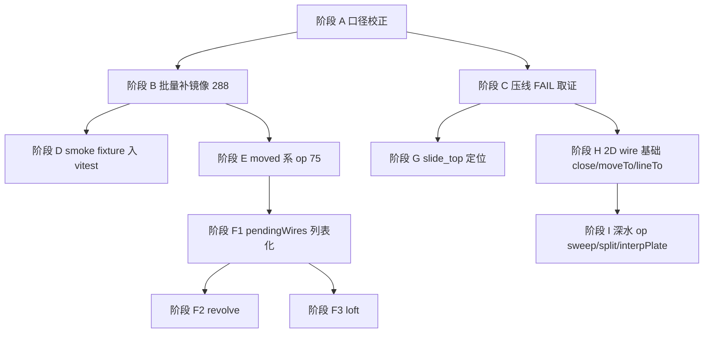

# cq-compat 对等验证 — 剩余工作开发计划（Phase 2）

> 状态：**方案（未实施）**
> 日期：2026-09-08
> 上游方案：`docs/plans/2026-09-08-cq-compat-cadquery-parity.md`（P0–P4 批次1 已落地，本计划承接其未完成项）
> 范围：`packages/cq-compat`、`packages/mini_lathe`（受影响的消费方）

---

## 1. 用户原始要求（原文引用）

本轮要求：

> 上面总结的所有未完成的任务，请按照难易程度和依赖顺序，先易后难，写一份新的开发计划文档。

拆解为两条硬性约束：

| 编号 | 约束 |
|---|---|
| C1 | 覆盖**上一份方案全部未完成项**，不得遗漏 |
| C2 | 排序规则 = **先易后难**，且必须满足**依赖顺序**（被依赖的排前面） |

上一轮（原方案 §1）的基础约束继续有效：验证对象是 CadQuery 上游建模测试（C1'）、参考侧导出 STEP（C2'）、
`packages/cq-compat/tests/` 逐用例镜像（C3'）、判定标准为双方 STEP 一致（C4'），非建模用例忽略。

---

## 2. 未完成项全景与实测基线

### 2.1 基线数据（2026-09-08 17:5x 在本仓库实测，非估算）

| 项 | 值 | 来源 |
|---|---|---|
| ref 用例 / STEP | 305 case / **650 个 STEP** | `out/ref/manifest.json` |
| manifest 条目 | 697 = ported **27** / blocked 623 / skipped **47** | `tests/manifest.json` |
| 磁盘镜像脚本 | **55 个** `.fai.js` | `tests/test_cadquery/` |
| 比对结果 | PASS **50** / PASS-NT 1 / **FAIL 4** / ERROR 0 | `out/report.md` |
| parity | **7.85%**（51/650） | `out/report.md` |
| coverage 分类 | PORTABLE **136** / PORTABLE-WITH-STUB **36** / BLOCKED 125（共 305 case） | `tests/coverage.json` |
| 可移植 case 的 var 数 | **318**（174 case） | `tests/coverage.json` |
| cq-compat 导出 op 数 | 36（Workplane 面）+ 4（Assembly 面） | `src/index.ts` |

> ⚠️ **口径失真已确认**：`manifest.json` 记 `ported: 27`，磁盘上却有 **55** 个镜像脚本——
> P4 批次1 新增的 28 个镜像**没有重跑 `gen-manifest.ts`**，清单与磁盘不一致。
> 这是全部未完成项中成本最低的一项，但会污染后续所有计数，必须最先修。

### 2.2 未完成项清单（按 manifest var 粒度排序）

| # | 未完成项 | 阻塞量（var） | 需新 op | 需架构改动 | 外部依赖 | 难度 |
|---|---|---|---|---|---|---|
| U1 | `manifest.json` 与磁盘镜像不同步 | — | 否 | 否 | 无 | ★ |
| U2 | 批量补写 `pending:mirror` 镜像脚本 | **288** | 否 | 否 | 无 | ★ |
| U3 | `testMultiFaceWorkplane` 布尔差 0.100 压线 | 1 | 待取证 | 待取证 | 无 | ★★ |
| U4 | P5 残留：smoke fixture 入 vitest / CI | — | 否 | 否 | 无 | ★★ |
| U5 | `moved`（+ `move` / `located` 同族） | **75 / 14 / 3** | 是 | 否 | 无 | ★★ |
| U6 | 多 pending-wire 语义（`testNestedCircle`、`testTwoWorkplanes`×2） | 3（另解锁一批） | 否 | **是** | 无 | ★★★ |
| U7 | `revolve` | 5 | 是 | 否 | brepjs 符号已具备 | ★★ |
| U8 | `loft` | 18 | 是 | 否 | **依赖 U6** | ★★★ |
| U9 | 2D wire 基础：`close` / `moveTo` / `lineTo` / `wire` | 19 / 8 / 3 / 3 | 是 | 否 | 无 | ★★★ |
| U10 | `sweep` / `split` / `interpPlate` / `twistExtrude` / `wedge` / `text` | 10 / 16 / 5 / 4 / 3 / 9 | 是 | 部分 | 部分内核能力待核 | ★★★★ |
| U11 | `importStep` / `load` / `save` / `export` / `importBrep` | 23 / 13 / 6 / 4 / 4 | 是 | 否 | 外部文件 IO | ★★★★ |
| U12 | mini_lathe `slide_top` 2.50% 体积差（验收标准 3 未闭环） | 1 零件 | 待取证 | 待取证 | 无 | ★★★★ |
| U13 | 原方案 §10 三个待裁决问题（Q1/Q2/Q3） | — | — | — | 用户拍板 | — |

### 2.3 难度分级依据（写明判定标准，便于复核）

| 等级 | 判定标准 |
|---|---|
| ★ | 不新增 op、不改架构，只补脚本/清单/工具调用；失败可回滚且不影响其它用例 |
| ★★ | 新增**单个独立** op 或工具，且不触碰 Workplane 核心状态机；或需跨包（core/brepjs-compat）加一个薄投影 |
| ★★★ | 需要**改动 Workplane 核心状态模型**（如 pending 2D 从单槽改列表），或多个 op 共享同一处语义 |
| ★★★★ | 需要**新内核能力**、跨模块语义对齐，或需对既有消费方（mini_lathe）做回归定位 |

---

## 3. 分阶段计划（先易后难 + 依赖顺序）



### 阶段 A — 口径校正（难度 ★，无依赖，必须先做）

| 任务 | 内容 | 验收 |
|---|---|---|
| A1 | 重跑 `npx tsx tests/gen-manifest.ts`，让 `manifest.json` 的 `ported` 与磁盘 55 个镜像一致 | `ported == 55`；`report.json` 分母口径与 manifest 一致 |
| A2 | 核对 `blocked` 项无空 `blockedBy`（§9 验收标准 2） | 逐条检查通过 |
| A3 | 把 A1 固化进 `tests/README.md` 流程（"新增镜像后必须重跑 gen-manifest"） | README 有显式步骤 |

**不做**：不改任何 op、不调容差。

### 阶段 B — 批量补写 `pending:mirror` 镜像（难度 ★，依赖 A）

**为什么排第二**：收益最大（288 var，全通过则 parity 从 7.85% → 约 50%）、
难度最低（op 已齐备，纯写脚本），且能**顺带暴露分析器盲区**（写不出来的一律降级为 `blocked` 并补 `blockedBy`）。

| 任务 | 内容 |
|---|---|
| B1 | 交叉比对 `coverage.json`（PORTABLE + PORTABLE-WITH-STUB，174 case / 318 var）与 manifest `pending:mirror`（288 var），取**交集优先**作为首批 |
| B2 | 分批落地，每批 **≤30 个** `.fai.js`：写镜像 → `run-cand.ts` → `compare.ts` → 全 PASS 后再进下一批 |
| B3 | 每批遇到的"写不出来"用例，**当场**标 `blocked` + 具体 `blockedBy`（不得记为 ported，红线见 §2.4） |
| B4 | 镜像命名与 ref STEP 严格一一对应；末行 `let result = cq.val(...)`；`await` 不得嵌实参（已知 `.fai.js` 语法限制） |
| B5 | 每批结束重跑 `gen-manifest.ts`（A1 的成果） |

**验收**：每批 `compare.ts` 无新增 ERROR；批次 parity 单调上升；`report.md` 贴进 PR。

### 阶段 C — `testMultiFaceWorkplane` 压线 FAIL 取证（难度 ★★，依赖 A）

**现状**：vol Δ = 2.47e-14、centroid Δ = 5.56e-2、bbox Δ = 0、**双向布尔差恰好 0.100 / 0.100**。

**可疑同源线索（需实测确认，不得直接当结论）**：`src/workplane.ts:907` 定义了 `const OVERLAP = 0.1`，
与布尔差数值**精确吻合**。该常量用于"在已有 shape 上 extrude pending profile"时把工具体加高 0.1 并沿 normal 反向下沉 0.1。
用例链为 `box(1,1,1).faces(">Z").rect(1,0.5).cutBlind(-0.2)`，需确认走的是否为这条路径（或同源的 origin 抬升）。

| 任务 | 内容 |
|---|---|
| C1 | 用 `compare-step.ts --json` 单独跑该用例，导出双向布尔差的具体面/位置 |
| C2 | 判定：是**容差边界**（0.0995 四舍五入到 0.100）还是**真实 0.1mm 几何缺失** |
| C3 | 若为真实缺失 → 修 op（并同步检查 mini_lathe 是否同源，见阶段 G）；若为边界 → 在 `compare.ts` 集中容差处加注释说明，**禁止**单用例放宽容差 |

**验收**：该用例有明确结论写入 `report.md` 备注或 manifest 备注；不得用放宽容差的方式翻成 PASS（红线）。

### 阶段 D — P5 收尾：smoke fixture 入 vitest（难度 ★★，依赖 B）

| 任务 | 内容 |
|---|---|
| D1 | 从阶段 B 的稳定 PASS 用例中挑 **≤30 个**，把 ref STEP 复制进 `packages/cq-compat/tests/fixtures/ref/` 入库 |
| D2 | 新增 vitest 测试：对 smoke 子集跑 `run-cand` 逻辑 + `compareStepFiles`（复用现有 `src/step-compare.ts`，不新写比对器），断言 PASS |
| D3 | 全量（650）仍走本地 `npm run compat:all`，不进 CI（原方案 §8 CI 取舍不变） |
| D4 | 确认 `scripts/ci.ps1` 已含 `@faicad/cq-compat`（已加，需实测跑通一次） |

**验收**：`npm run test -w @faicad/cq-compat` 含 smoke 比对且全绿；CI 时长增量可接受。

### 阶段 E — `moved` 系 op（难度 ★★，依赖 B）

**为什么在 B 之后**：75 var 是 pending:mirror 之后的第二大单项，且**不依赖架构改动**。

语义要点（已在 `out/cache/v2.8.0/tests` 上游源码中取样确认）：

```python
box2 = box.moved(loc)                    # Shape.moved(Location)
r = ref.vertices().eachpoint(lambda loc: box.moved(loc), combine=True)
f2 = face(circle(1)).moved(z=1)          # 关键字形式
res3 = shell(sh.faces(), ftop, ftop.moved(x=1))
r2 = list(_get_wires(compound(r1, r1.moved(Location(0, 0, 1)))))
```

- `moved` 是 **Shape 级** API（`Shape.moved(*locs)`），不是 Workplane op —— 这解释了为什么它被
  分析器单列成 75 var 的最大阻塞项。
- 需要 cq-compat 侧提供 `Location` 构造（`Location(Vector(...))` / `Location(0,0,1)`）与 `moved` 包装；
  **当前 `packages/cq-compat/src` 与 `packages/core/src/api/brepjs-compat` 均无 `Location` 导出**，
  需新建或从 brepjs 投影。

| 任务 | 内容 |
|---|---|
| E1 | 评估 `Location` 的最小表达（平移 + 可选旋转），在 cq-compat 侧落地并导出 |
| E2 | 实现 `moved(shape, ...locs)`：单 loc → Shape；多 loc → 列表（与上游 `moved(Location(), Location(2,0,0))` 语义一致） |
| E3 | 支持关键字形式 `.moved(x=..)/(y=..)/(z=..)` 在镜像脚本中的等价写法 |
| E4 | 配 `src/p4-ops.test.ts`（或新建 `moved.test.ts`）单测 + 解锁 ≥3 个上游 case |
| E5 | 同族 `move`（14 var）/ `located`（3 var）按同一机制顺带接入（若语义一致） |

**验收**：新增 op 至少解锁一个镜像用例（原方案 §9 验收标准 4）；parity 报告体现增量。

### 阶段 F — 多 pending-wire 语义 + revolve + loft（依赖 E；内部 F1 → F2 → F3 串行）

#### F1 `pendingWires` 列表化（难度 ★★★，依赖 E，且是 F3 的前置）

**根因（实测代码）**：`src/workplane.ts:60-65` 的 Workplane 状态里 pending 2D 是**单槽**
`pendingRect` / `pendingCircle` / `pendingPolygon` 三个互斥字段，而上游 CadQuery 是
`pendingWires` **列表**。因此：

- `testNestedCircle`（双 circle 环形）→ 第二个 `circle()` 覆盖第一个；
- `testTwoWorkplanes`（连续两个 rect）→ 同上；
- 二者当前报 vol Δ 1.39% 与 55.6%，正是单槽覆盖的外显。

| 任务 | 内容 |
|---|---|
| F1.1 | 把三槽改为 `pendingWires: Wire[]`（保留旧字段作兼容读取，逐步迁移），`extrude` / `cutBlind` / `cutThruAll` / `hole` 族全部改为遍历列表 |
| F1.2 | 回归：55 个已有镜像必须**零回归**（这是最大的风险点，见 §5 R2） |
| F1.3 | 解锁 `testNestedCircle` / `testTwoWorkplanes`×2（当前 3 个 FAIL） |

#### F2 `revolve`（难度 ★★，依赖 F1 完成后同批做；其实不依赖，但同批省回归成本）

`packages/core/src/api/brepjs-compat/index.ts:214` **已有** `revolve` 投影（`wrapGuarded('revolve', vendoredRevolve)`），
内核实现在 `vendored/brepjs/kernel/occtWasm/sweepOps.ts:101`（`revolve(k, shape, axis, angle)`）。
接入成本主要在 cq-compat 侧的 `axis + angle` 参数语义对齐（上游 `revolve(angleDegrees, axisStart, axisEnd)`）。

#### F3 `loft`（难度 ★★★，**强依赖 F1**）

`brepjs-compat:216` 已有 `loft` 投影，内核 `sweepOps.ts:113` 接受 **wires 数组**。
没有 F1 的 `pendingWires` 列表就无从提供多个 wire，故必须排在 F1 之后。

| 任务 | 内容 |
|---|---|
| F3.1 | `loft()`：消费 `pendingWires`，支持 `ruled` 参数；多 wire 位于不同 z 高度 |
| F3.2 | 解锁 `testLoft` 等相关 case（manifest 中 `op:loft` 18 var） |

**验收（F 阶段整体）**：3 个既有 FAIL 全部转 PASS；55 个旧镜像零回归；新增单测覆盖 revolve/loft/multi-wire。

### 阶段 G — mini_lathe `slide_top` 缺口定位（难度 ★★★★，依赖 C 的取证结论）

**现状**：`slide_top` 体积差 2.50%（f73 vs f70，B−A = 2646 mm³），是原方案 §9 验收标准 3 唯一未闭环项。
其余 6 个零件已完全等价。

| 任务 | 内容 |
|---|---|
| G1 | 复用阶段 C 的布尔差定位方法，把 2646 mm³ 差定位到具体 op 链（优先怀疑与 C 同源：faces→rect→cutBlind/cbore 链） |
| G2 | 修 op 后重跑 `packages/mini_lathe/scripts/verify-all.ts`，**零回归**是硬要求 |
| G3 | 达成验收标准 3（体积相对偏差 ≤ 0.01%）后再回头刷新 parity |

**为什么排后面**：它对 parity 数字贡献为 0（不在 650 分母内），且需要 C 的取证结论作输入，属于"深水定位"。

### 阶段 H — 2D wire 基础（`close` / `moveTo` / `lineTo` / `wire`）（难度 ★★★）

19 + 8 + 3 + 3 = 33 var，且是 `sweep`、`interpPlate`、大量 2D 用例的共同底座。
排在 F 之后：此时 `pendingWires` 结构已就绪，2D wire 可以直接挂进同一条链，避免二次改动。

### 阶段 I — 深水 op 与文件 IO（难度 ★★★★，一期可只做评估）

| 组 | var | 处置建议 |
|---|---|---|
| `sweep` / `split` / `interpPlate` / `twistExtrude` / `wedge` / `text` | 10 / 16 / 5 / 4 / 3 / 9 | 先做**可行性评估**（内核能力是否具备），能做的按 blockedBy 频次挑；不能做的在 manifest 标注为长期 `blocked` |
| `importStep` / `load` / `save` / `export` / `importBrep` | 23 / 13 / 6 / 4 / 4 | 原方案 §3 已列为一期非目标（测的是 IO 链路本身）；**建议整组标 `skipped`** 并在 manifest 注明原因，等用户裁决 Q2 |

### 阶段 J — 远期：Sketch / nurbs / hull（难度 ★★★★★，不在一期范围）

**2026-09-08 用户裁决**：Sketch 定为**远期阶段（P6+）保留**，不本轮实施，但也不从清单删除。

**范围事实（实测）**：

- 上游 `test_sketch.py` 有 **36 个 test**，全部**不在** ref 基线（650 case）范围内——`run-ref.py` 的
  `baseline.json targetModules` 只含 7 个模块（test_cadquery / test_shapes / test_workplanes /
  test_free_functions / test_selectors / test_cad_objects / test_assembly）。
- ref 范围内与 Sketch 有关的**只有一个** case：`TestCadQuery::testSketch`，coverage 归类
  `BLOCKED`，`blockedBy = finalize`。
- 原方案（`2026-09-08-cq-compat-cadquery-parity.md` §6.1）的目录树里**列过** `test_sketch/`、
  `test_nurbs/`、`test_hull/`，但三者落地 baseline 时均未纳入，`nurbs`/`hull` 同样零覆盖。

**为何排在远期（不是"忘记做"，是成本结构不同）**：

1. **Sketch 是与 `Workplane` 平行的第二套 DSL**，不是一个 op 的工作量：包含 `BuildSketch`
   上下文管理器风格、`Mode`（ADD/SUBTRACT/REPLACE/INTERSECT）机制、独立约束求解器
   （`cadquery/occ_impl/sketch_solver.py`）与惰性几何。cq-compat 当前**没有任何类模型**
   （37 个函数式 op），移植 Sketch 等于再建一层子系统。
2. **`.fai.js` 承载不了**：Sketch 的 fluent API 依赖 Python 上下文管理器与闭包语义，
   faijs 的合法 JS 子集无对应结构。
3. **与 STEP 比对主线匹配度低**：test_sketch 的 36 个 case 多为 2D 几何断言，产出 STEP 极少。
4. **faijs 已有等价物**：`Sketcher` / `Blueprint` / `draw` DSL（core 的 TS 兼容面）承担 2D 草图职责。

**前置条件（进入本阶段前必须满足）**：

- [ ] cq-compat 建立类模型（`Workplane` 类 + `Shape` 层级），或明确用函数式等价方案表达 Sketch；
- [ ] 将 `test_sketch` / `test_nurbs` / `test_hull` 加入 ref baseline 并产出 STEP；
- [ ] 决定与 faijs 自有 `Sketcher` DSL 的关系：**并行两套**还是**单向投影**（CQ Sketch → faijs Sketcher）。

---

## 4. 阶段排序总表（先易后难 + 依赖）

| 顺序 | 阶段 | 难度 | 依赖 | 主要收益 |
|---|---|---|---|---|
| 1 | A 口径校正 | ★ | — | 清单与磁盘一致，计数可信 |
| 2 | B 批量补镜像 | ★ | A | **+288 var 上限**，parity 7.85% → ~50% |
| 3 | C 压线 FAIL 取证 | ★★ | A | 1 FAIL 定性；为 G 提供线索 |
| 4 | D smoke 入 vitest | ★★ | B | P5 闭环，CI 门禁 |
| 5 | E `moved` 系 | ★★ | B | +75 var |
| 6 | F1 pendingWires | ★★★ | E | 3 FAIL 转 PASS；F3 前置 |
| 7 | F2 `revolve` | ★★ | F1 同批 | +5 var |
| 8 | F3 `loft` | ★★★ | F1 | +18 var |
| 9 | G slide_top 定位 | ★★★★ | C | 验收标准 3 闭环 |
| 10 | H 2D wire 基础 | ★★★ | F | +33 var，解锁后续 |
| 11 | I 深水 op / IO | ★★★★ | H（部分） | 评估为主，能做的挑着做 |
| — | **J Sketch / nurbs / hull** | ★★★★★ | 类模型 + ref 扩范围 | **远期（P6+），一期不做** |

> C 与 B 可并行（不同文件，互不干扰）；D 可与 E 并行；G 必须在 C 之后。

---

## 5. 风险与处置

| # | 风险 | 处置 |
|---|---|---|
| R1 | 阶段 B 的 288 个 `pending:mirror` 里混着分析器盲区（未导出的中间 2D wire 上的 op 静态不可见），写镜像时才发现缺 op | 分批（≤30）执行；写不出即降级 `blocked` 并补 `blockedBy`；每批重跑 coverage 校正 |
| R2 | **阶段 F1（pendingWires 列表化）有回归风险**：55 个已 PASS 的镜像依赖现有单槽语义 | F1 前先固化 55 个镜像的 baseline 报告；改造后逐个 diff，出现回归立即停止并回退 |
| R3 | `moved` 需要新建 `Location` 抽象，可能与 core 既有位姿表达重叠 | 先查 `packages/core` 是否已有等价能力（本轮核查未发现 `Location` 导出），能复用则复用，避免第二套位姿模型 |
| R4 | C 的 0.100 布尔差若认定为真实缺失，可能牵连 mini_lathe 多个零件 | C 结论出来后先评估影响面，再决定是否与 G 合并为一个任务 |
| R5 | CI 时长：D 阶段 smoke（≤30 case）跑 brep 导出 + 比对，可能显著拉长 CI | 先本地计时；超时则把 smoke 缩到 ≤15 case 或改为 nightly |

---

## 6. 验收标准

1. **A**：`manifest.json` 的 `ported` 数 == 磁盘 `.fai.js` 数；无空 `blockedBy` 的 blocked 项。
2. **B**：每批镜像 `compare.ts` 零 ERROR；批次 parity 单调上升；报告贴入 PR。
3. **D**：`npm run test -w @faicad/cq-compat` 含 smoke STEP 比对且全绿；`scripts/ci.ps1` 实测跑通。
4. **E/F/H**：每新增一个 op，至少解锁一个镜像用例（原方案 §9 验收标准 4 沿用）。
5. **F1**：55 个旧镜像零回归（硬要求）。
6. **G**：mini_lathe 7 零件全部达到体积相对偏差 ≤ 0.01%，`verify-all.ts` 零回归。
7. **全程红线**：`blocked` 不得记为 `ported`；`FAIL` 不得用放宽容差翻成 `PASS`。

---

## 7. 实施记录（2026-09-08 晚）

### 7.1 阶段 A — 口径校正 ✅ 完成

| 任务 | 结果 |
|---|---|
| A1 重跑 `gen-manifest` | `ported` 27 → **55**（与磁盘一致），口径失真修复 |
| A2 空 `blockedBy` 检查 | 595 条 blocked，**0 条空 `blockedBy`** |
| A3 固化进 README | 新增红线"新增镜像后必须重跑 gen-manifest" |

### 7.2 阶段 B — 批量补镜像（进行中，已 3 批）

| 批次 | 新增镜像 | 结果 |
|---|---|---|
| 批次 1 | testIsInside×2、testCenterOfBoundBox、testFindSolid、testBoxCombine | 5/5 PASS（testFindSolid 初版因多体 `val()` 语义 FAIL，按 §README 约定只推首点后 PASS） |
| 批次 2 | testFaceIntersectedByLine、testExtrude\_\_box、testCutBlindUntilFace\_\_wp_ref | 3 PASS；testLegoBrick / testConstructionWire 降级 blocked |
| 批次 3 | testFuzzyBoolOp×5（box1–box4、res） | 5 PASS；testFrontReference 新增 FAIL（已修复，见 §7.6） |
| 批次 4 | testQuickStartXY / XZ / YZ、testMatrixOfInertia\_\_cylinder | 4 PASS（cylinder 首版 `centered:false` 写错，见 §7.6） |
| 批次 5 | testPopPending\_\_w4 / \_\_w5 | 2 PASS；testPolygonPlugin 触发内核崩溃 → 降级 blocked（U21） |

**指标（截至批次 5）**：PASS 51 → **71**，FAIL 4 → **3**，parity **7.85% → 11.08%**，
`ported` 55 → **74**。cq-compat 单测 **31/31** 全绿，无回归。

### 7.3 工具修复与新增（阶段 B 的配套）

| 项 | 说明 |
|---|---|
| `tests/gen-manifest.ts` | **修缺陷**：原实现只保留 `skipped` 的人工标注，人工写的 `blocked` 会被机器默认值（`pending:mirror`）覆盖。改为 `manual: true` 的 blocked 条目跨重建保留——否则 §3-B3「写不出即降级 blocked」无法落地 |
| `tests/mark-blocked.ts`（新增） | 集中登记人工 blocked 标注（17 条），带 `manual: true`；未命中的 key 会打印警告 |
| `tests/README.md` | 补两条约定：重跑 gen-manifest；**多体用例只 push 首点**（ref 的 `val()` = `objects[0]`） |
| `out/extract-case.py`（新增，gitignored） | 从 `out/cache/v2.8.0/tests` 按 `Class.method` 提取上游用例源码，供写镜像时用 |
| `out/probe.py`（新增，gitignored） | 取证工具：打印 STEP 的体积 / 质心 / bbox / 面数，用于定位"体积相同但位姿不同"类的 FAIL |
| `tests/mark-blocked.ts` | 增至 18 条（新增 `kernel:crash-polygon-cutThruAll`，见 U21） |

### 7.4 新发现（原 U1–U13 清单之外，需并入清单）

| 缺口 | 证据 | 归属 |
|---|---|---|
| `extrude(both=)` / `extrude(combine="cut"\|"s")` | `workplane.ts:887` `extrude(wp, height)` 只接受 height | 新 op（U14） |
| `shell` 无内核投影 | `brepjs-compat` 无 `shell` 符号 → `workplane.ts:1582` `if (!shellFn) return wp` **静默 no-op**（违反「绝不静默」约定） | 新 op + 静默缺陷（U15） |
| `Workplane(plane, origin=)` 不支持 origin | `workplane.ts:602` 只接受 plane 字符串 | 新 op（U16）；当前镜像用 `translate()` 等价绕过 |
| `pushPoints` 只支持 2D 点 | `workplane.ts:1291` `pts: [number,number][]` | 新 op（U17）；当前用 `translate+union` 绕过 |
| `cutBlind("last"/"next")` | untilLastFace / untilNextFace 未实现 | 新 op（U18） |
| `Solid.makeCone` / `CQ()` / `Workplane` 插件 / `findSolid` | 自由函数与包装器面 | 新 op（U19） |
| **`faces("front")` 后 `workplane()` origin 抬升错误** | 见下 | 新 bug（U20），**当前唯一新增 FAIL** |

**U20 取证与修复（已完成）**：CadQuery 2.8.0 实测（`cadquery-env`）——named-view 面选择语义为
`front→+Z`、`back→−Z`、`left→−X`、`right→+X`、`top→+Y`、`bottom→−Y`
（源码依据 `cadquery/selectors.py:687-694`，`namedViews` 是轴向 `DirectionMinMaxSelector` 的别名）；
`testFrontReference` 实测 vol Δ=2.58%、B−A=0.025 mm³，与"孔体积 π·0.125²·0.5 = 0.0245"
精确吻合 → origin 被抬到 z=0.5（形状中心）而非顶面 z=1。

根因：`resolveFaceSelector` **没有 named-view 条目**（只有 `>Z`/`<X` 等轴向表），
且未命中时**静默落到整个形状的 bbox 中心**（违反「绝不静默」约定）。
修复：新增 `NAMED_VIEW_TO_AXIS` 归一化表，在函数入口把 named view 转成轴向选择器。
修复后 `testFrontReference` 转 PASS（PASS 63 → 64）。

| 缺口 | 证据 | 归属 |
|---|---|---|
| **`polygon` + `cutThruAll` 组合崩溃** | `testPolygonPlugin` 导出时 Node 进程级崩溃（wasm abort，非 JS throw）；同一切割路径下 circle/rect 正常（testCutThroughAll PASS） | 内核缺陷（U21），已标 `kernel:crash-polygon-cutThruAll` |

### 7.5 阶段 C — `testMultiFaceWorkplane` 压线 FAIL 取证 ✅ 完成

**结论：不是容差压线，是真实的语义缺口，已修复。**

| 项 | 数据 |
|---|---|
| 症状 | vol Δ = 2.47e-14（体积几乎全等）、com Δ = 5.56e-2、布尔差双向 **0.100 / 0.100** |
| 关键线索 | 布尔差与 `workplane.ts` 内 `const OVERLAP = 0.1` 数值吻合 → 一度怀疑同源，实测**无关** |
| `probe.py` 实测 | ref CoM z = **−0.044444**、cand CoM z = **+0.011111**（反号）→ 槽位置相差 0.5 |

反推槽位置（体积 0.9、box 质心 0、槽体积 0.1）：ref 槽质心 z=0.4（槽在 z∈[0.3,0.5]），
cand 槽质心 z=−0.1（槽在 z∈[−0.2,0]）。CadQuery 对照实验（`cadquery-env` 实测）：

```
box(1,1,1).rect(1,.5).cutBlind(-0.2)               -> CoM z = +0.011111   (slot z in [-0.2, 0])
box(1,1,1).faces(">Z").rect(1,.5).cutBlind(-0.2)   -> CoM z = -0.044444   (slot z in [0.3, 0.5])
box(1,1,1).faces(">Z").rect(1,.5).cutBlind(+0.2)   -> volume 1.0 (unchanged!)
```

**坐实的语义**：CadQuery 里 `faces(sel)` 后接 2D profile + extrude/cut，工作平面会
**隐式抬到选中面**，等价于自动插入 `workplane()` —— 尽管 `Workplane.plane.origin`
打印出来仍是 `(0,0,0)`。`cutBlind(+0.2)` 体积不变是决定性证据：切割起点在 z=0.5，
向上切完全落空。

修复：新增 `applyPendingFacePlane()`，在 `extrude` / `cutBlind` / `cutThruAll` 检测到
`wp.faceSel` 时先应用 `workplane()`。修复后 `testMultiFaceWorkplane` 转 PASS
（PASS 64 → 65），**65 个既有用例零回归**。

> TS 注意：`wp = await applyPendingFacePlane(wp)` 会重置 `wp.shape` 的收窄
> （非 discriminated union，属性收窄不随变量传递），调用点必须先用局部 `const base = wp.shape`
> 接住，否则 `wp.shape` 退化成 `Shape | null` 编译报错。

### 7.6 批次 4 记录：`Solid.makeCylinder` 与 `Workplane.cylinder` 语义不同

`testMatrixOfInertia` 的 `cylinder = Solid.makeCylinder(radius=1, height=2)` 首版镜像写成
`cylinder(wp, 2, 1, { centered: false })`，结果 bbox 变成 `[0,2]×[0,2]×[0,2]`（x/y 也偏移 +radius）。

CadQuery 2.8.0 实测：

```
centered=True              -> x in [-1, 1], z in [-1, 1]
centered=False             -> x in [ 0, 2], z in [ 0, 2]     (x/y 同样偏移)
centered=(True,True,False) -> x in [-1, 1], z in [ 0, 2]
Solid.makeCylinder(1, 2)   -> x in [-1, 1], z in [ 0, 2]     (自由函数，x/y 恒绕轴对称)
```

即 **cq-compat 的 `centered` 实现与 `Workplane.cylinder` 一致（正确）**，错的是镜像：
自由函数 `Solid.makeCylinder` 应写 `centered: [true, true, false]`。
镜像已修正并在注释中记录该差异（`TestCadObjects__testMatrixOfInertia__cylinder.fai.js`）。
### 7.8 阶段 F1 — `pendingWires` 列表化（进行中，2026-09-09 上午）

#### F1-a 前置修口（已完成）

| 项 | 结果 |
|---|---|
| A1 口径残余 | `TestCadObjects__testMatrixOfInertia__cylinder` 放在 `tests/test_cadquery/` 但 fileKey 属 `test_cad_objects` 模块 → gen-manifest 匹配不到。已移入 `tests/test_cad_objects/`，重跑后 **ported 74 → 75**，与磁盘一致 |
| 5 个镜像导出失败（既有缺陷，非 F1 引入） | `testBoxCombine__s`、`testFaceIntersectedByLine__shape`、`testQuickStartXY/XZ/YZ__s` 使用变量名 `top` → 触发 security-scanner `SEC_IDENT`（`top` 属浏览器全局对象黑名单，`security-scanner.ts:93`）。已改名 `topFace`，5 个全部恢复导出 |

#### F1-b 语义取证（CadQuery 2.8.0 实测，全部为**独立链**，避免 `ctx` 共享污染）

上游 `pendingWires` 计数：

| 链 | pendingWires |
|---|---|
| `pushPoints([p1,p2])` | 0 |
| `pushPoints([p1,p2]).circle(4)` | 2 |
| `pushPoints([p1,p2]).circle(4).circle(2)` | **4** |
| `circle(4).circle(2)` | 2 |
| `rect(2,2).rect(1.3,1.3,fc).vertices()` | **1** |
| 同上 + `.circle(0.125)` | **5** |

体积基准（`cadquery-env` 实测）：

| 用例 | 期望值 | 构成 |
|---|---|---|
| `testNestedCircle__s` | **8113.097** | box 8000 + 2×annulus 150.796 − 2×重叠 94.248；faces = 14（与上游断言一致） |
| `testTwoWorkplanes__r` | **1.901825** | 2×2×0.5 板（2.0）− 4 个 Ø0.25 通孔（0.098175） |
| 纯 annulus `circle(4).circle(2).extrude(4)` | 150.796 | π(4²−2²)·4 |

**坐实的分组语义**：每个最外层 wire 单独成面，被它包含的 wire 成为该面的孔；互相不包含的
wire 各自成独立实体后 fuse。即 SVG 式的 outer+holes 包含树，而非"全部 wire 合成一个面"。

> ⚠️ 镜像脚本里的旧注释（"第二个 circle 覆盖第一个"）是**错误猜测**，实际根因是
> cq-compat 根本没有 pending wire 列表。已在本次取证后重写为实测结论。

#### F1-c 实施内容

**core 侧** `packages/core/src/api/brepjs-compat/index.ts` — 新增 5 个 2D 构造投影
（`wrapGuarded`，与既有 `revolve`/`loft` 同机制）：

`makeCircle(radius, center?, normal?)`、`makeLine(v1, v2)`、`assembleWire(edges)`、
`makeFace(wire, holes?)`、`addHolesInFace(face, holes)`。

**cq-compat 侧** `packages/cq-compat/src/workplane.ts`：

| 改动 | 说明 |
|---|---|
| 新增 `PendingWire` 类型 | `rect`/`circle`/`polygon` 三态，带 **局部坐标 cx/cy** + `construction` 标记 |
| 新增 `pendingWires: PendingWire[]` 字段 | 旧单槽字段 `pendingRect`/`pendingCircle`/`pendingPolygon` **全部保留**，旧路径语义不变 |
| `rect`/`circle`/`polygon` | 改为**追加**（按 `wp.pts` 展开成多个带位置 wire，即 CadQuery eachpoint 语义） |
| `wireBBox` / `groupPendingWires` | 面积降序 + bbox 包含判定 → `{outer, holes}[]` |
| `buildProfileWire` | circle → `makeCircle`+`assembleWire`；rect/polygon → 点环 + `makeLine`+`assembleWire` |
| `extrudePendingWires` | 每组一个带孔面 → `extrude` → 组内/跨组 fuse |
| `extrude` 调用点 | `solidWires.length > 1` 才走新路径；否则原路径不变（零回归保证） |
| 6 处消费点 | 统一补 `pendingWires: []` 清理（首版遗漏导致 `combine` 单测回归，已修） |

#### F1-d 最终状态（2026-09-09 完成，3 个 FAIL 全部转 PASS）

| 用例 | 状态 | 数据 |
|---|---|---|
| `testTwoWorkplanes__r` | ✅ PASS | groups `[{o:rect,h:4}]`，vol **1.9018252295753182**（ref 1.9018252295753189） |
| `testNestedCircle__s` | ✅ PASS | vol 8113.097335529232 与 ref 精确一致 |
| `testTwoWorkplanes__t` | ✅ PASS | 随 `r` 修复而修复 |

全量比对：**PASS=74 / PASS-NT=1 / FAIL=0**，parity 11.08% → **11.54%**。

`testNestedCircle__s` 曾有两个叠加根因：

1. **镜像脚本缺陷（既有）**：单语句链式 `cq.circle(cq.circle(p, 4), 2)` 中外层 `4` 在
   参数求值时丢失（`pendingWires` 记到 `radius=undefined`），产出退化为纯 box。
   镜像已改写为多语句形态（每个 `cq.circle` 独立一行），并在脚本头注释说明。
2. **`cq-compat/dist` 落后（流程教训）**：CLI 经 `@faicad/cq-compat` 包名 → node_modules
   软链 → **dist** 解析；只改 src 不构建 dist，新 `pendingWires` 路径完全不生效。
   需 `npm run build -w @faicad/cq-compat`（与 core 同理，`AGENTS.md` 既有规则）。

收尾：调试日志已清理（`grep DBG` 零命中），临时探针测试已删，
单测 `npm run test -w @faicad/cq-compat` **31/31 全绿**。

> 📌 流程修正：本阶段先后踩了 **core/dist** 与 **cq-compat/dist** 两个"dist 落后"坑。
> 凡改动 `packages/*/src` 后跑 CLI 级验证（`run-cand.ts` / `faijs-cli.ts`），必须先构建对应包。

### 7.9 阶段 F2 — `revolve`（✅ 完成，2026-09-09）

**实现**（`packages/cq-compat/src/workplane.ts`）：

- 新增 `revolve(wp, angleDegrees?, axisStart?, axisEnd?, combine?)`：消费 `pendingWires`
  列表（与 extrude 同分组逻辑），轴端点为**局部坐标**（上游 `Workplane.revolve` 语义，
  默认起点=平面原点、终点=(0,start.y) 或 (0,1)），角度 0 归一为 360。
- `rect` 新增 `centered?: boolean | [boolean, boolean]`（corner 落在参考点，offset 恒为 +len/2）。
- `brepjs-compat` 既有 `revolve` 投影直接可用（`operations/api` 的 options 形式，弧度）。

**已知内核限制（如实记录）**：面**穿过旋转轴**时（如上游 `rect(10,10).revolve()` 默认轴），
vendored occt-wasm `revolveVec` 报 `REVOLVE_FAILED`；完整 OCCT 7.x 接受并产出自交实体
（vol 3141.592654）。探针 3/3 轮确定性复现，JS 层无前置校验，属内核外部依赖限制。
无镜像依赖该几何（`testRevolveCylinder__result` 对应测试**最后一次**赋值 = 270° 非穿轴版本），
已单测记录（`src/revolve.test.ts` KNOWN KERNEL LIMIT），不做 workaround。

**镜像 4 个全部 PASS**（首跑即过）：testRevolveCylinder__result（2356.194490）、
testRevolveDonut__result（12566.370614）、testRevolveCut__box（1000）、
testRevolveCut__cut（914.159265，`combine='cut'`）。
testRevolveCone__result 需要 `lineTo`/`close`（H 阶段），保持 blocked。
`testRevolveCut` 上游 `move(5,0)` ≡ `pushPoints([(5,0)])`（python 实测等价）。

### 7.10 阶段 F3 — `loft`（✅ 完成，2026-09-09）

**实现**：

- 新增 `loft(wp, { ruled?, combine? })`：消费 `pendingWires` 列表为 sections，
  上游默认 `ruled=False`（smooth）。
- **`PendingWire` 新增 `plane` 平面快照**（创建时捕获 origin/xDir/yDir/normal）——
  跨平面 sections 的前提（`workplane(offset)` / `transformed(rotate)` 之后追加的
  wire 各自映射回自己的平面）；`buildProfileWire` 优先用 wire 自带平面。
- `workplane()` 新增 `invert` 支持（上游 `Plane.invert`：xDir 不变、zDir 翻转、
  yDir 随之翻转；offset 沿翻转后法向）。
- `brepjs-compat` 既有 `loft(wires, {ruled})` 投影直接可用。

**镜像 12 个全部 PASS**：testLoft__s/box/cut/add（4）、testLoftCombine__s（1）、
testCup__s1/s2/s3（3，含 stacked workplane offset 与 `cut` 组合）、
testTwistedLoft__s（1）、testDoubleTwistedLoft__s/s2/s3（3，含 `union` 组合）。
单测 `src/loft.test.ts` 4/4（首跑即过）。

**残留**：`test_loft_face__c/w1/w2`、`test_loft_to_vertex__c/w1/w2`（6 var）仍 blocked
——需要 CQ **模块级**自由函数族 `plane`/`face`/`vertex`/`compound`/`moved`（E/F 阶段之外），
且 `analyze-coverage.py` 的 AST 跟踪不识别这些模块级调用（`ops` 只记到 `[loft, add]`，
blockedBy 停留在 'loft'，属 R1 所述"分析器盲区"）。待该 API 族立项时一并修正分析器。

### 7.11 阶段 E — `Location` / `moved` / `move`（✅ 完成，2026-09-09）

**上游语义（源码取证，`cadquery/occ_impl/shapes.py::Shape.moved` 全部重载 +
`geom.py::Location.__init__`）**：

- `Location(t)` / `Location(x,y,z,rx,ry,rz)` / `Location(Plane)`：平移 + 欧拉角
  （**度**，`gp_Extrinsic_XYZ`），变换为 `p -> R·p + t`（先转后移）。
- `Shape.moved(loc)` → 单个副本；`moved(loc1, loc2, …)` / `moved(seq)` →
  `_compound_or_shape`，即**复合体，不做布尔并**
  （`test_moved` 断言 `bs1.Volume()==2` 且 `len(bs1.Solids())==2`）。
- `moved(Shape)` → `Shape.toLocs()`：Compound 递归、Face 取 uv 中心位姿、
  Edge 取参数中点位姿、其余取 `Center()`。
- `move` 原地修改，`moved` 返回副本；cq-compat carrier 不可变，二者同实现。

**实现**：

- `packages/cq-compat/src/workplane.ts`：新增 `CqLocation`（`pos` + `rot` 度）+
  `Location(...)` 构造（vector / 数值 varargs / `{x,y,z,rx,ry,rz}` 关键字三形态）、
  `isLocation`、`composeLocations(a,b)`（= 上游 `Location.__mul__`，R = Ra·Rb、
  t = Ra·t_b + t_a，含矩阵→欧拉角还原）、`moved(wp, ...locs)`、`move(wp, ...locs)`。
- `packages/core/src/api/brepjs-compat/index.ts`：新增 `applyMatrix` 投影
  （vendored `topology/transformFns.ts`），因为 `cad.translate` / `cad.rotate_euler`
  是 solid-only，对 compound 直接报 `input is not BREP`。
- **双路径 `applyLocation`**：载体为单 solid → 走 `cad.rotate_euler` + `cad.translate`
  （其 OCCT 句柄能跨语句边界存活，导出为真 BREP STEP）；载体为 compound → 走内核
  `applyMatrix`（该产物跨语句边界会丢 BREP 槽，STEP 退化为 `TESSELLATED_SOLID`，
  故镜像用 `composeLocations` 折叠后再一次性 `moved`，不把 compound 回喂）。
- `tests/gen-manifest.ts` / `tests/compare.ts`：修正**无 class 的模块级 pytest 函数**
  （`test_free_functions`、`test_shapes`）的 fileKey 推导——caseId 为
  `tests.test_free_functions:::test_moved`（class 槽为空），原先会生成含 `:` 的
  Windows 非法文件名；两侧统一为 `tests/test_free_functions/test_moved__<var>.fai.js`。

**镜像 15 个（test_moved 全量）全部 PASS**：b / s / bs1–bs9 / s1–s4。
`func.sphere(d)` 取**直径**（`sphere(0.1)` → r=0.05，vol 0.000524，源码取证），
`func.box(1,1,1)` 落在 z 0..1，均在镜像头注释中记录。

**如实记录的缺口**：

- `s1`–`s4`（`s.moved(b.faces()/b.edges('|Z')/b.vertices()/b)`）依赖
  `Shape.toLocs()` 的**子形状枚举**，cq-compat 尚无该能力，镜像内联了
  cadquery 2.8.0 实测的中心点坐标（头注释已声明）。
- 未实现 `Location(Plane)` / `TopLoc_Location` 复合语义与 `located`（3 var，需 `eachpoint`）。
- 多轴 `rx+ry+rz` 组合：上游 `gp_Extrinsic_XYZ` 与 `cad.rotate_euler`（THREE Euler XYZ）
  在单轴下一致，多轴顺序可能不同；现有用例全部单轴。

**结果**：parity **14.00% → 16.31%**（PASS 90 → 105，FAIL=0，ERROR=0）；
`moved` 不再是任何 case 的首阻塞项，27 var 转为 `pending:mirror`。

### 7.12 阶段 B 批次 6–7（✅ 完成，2026-09-09 下午）：mirror 族 + test_shapes + union 族

**批次 6（12 var：test_workplanes mirror 族 7 + test_shapes 5）**：

| 用例 | 结果 | 说明 |
|---|---|---|
| test_mirror__b2 / test_mirror_axis__b2 | PASS | mirror 升级后首跑即过（见下） |
| test_all_planes__b2 / test_bad_plane_input__b2 | PASS | union=False 镜像替换 shape；raises 用例导出的是异常前最终值 |
| test_mirror_equivalence__boxTmp / __b | PASS | harness 在函数**出口**快照 locals → 取 i=2 迭代值（translate [4,0,0.5]） |
| test_mirror_workplane__b2 | PASS | face 形态 mirror（normal+center）×3 连锁 union |
| test_isSolid__s / test_reverse__simple_box | PASS | 首版 FAIL：**自由函数 box 落在 z∈[0,1]**，改 `centered:[true,true,false]` 后过 |
| test_shells__s / test_single_ent_selector__bs | PASS | 同上；bs 用 `moved(loc1, loc2)` 双副本 compound |
| test_single_ent_selector__fs | **降级 blocked** | 见下（U22） |

**批次 7（19 var：testUnions 7 + testUnionCompound 4 + SolidReference 4 + 单项 4）**：
testUnions t/oo/currentS/toUnion/resS/sugar1/sugar2、testUnionCompound box1/box2/
shape_to_cut/o（`o` 经 probe 实测 bbox == box2，即第二个循环的最终循环变量）、
testSolidReferencesCombineTrue r/t、testSolidReferenceCombineFalse r/t、
testWorkplaneCenterMove t、testMultiWireWorkplane r、testTopFaceFillet s、
testWorkplaneOrientationOnVertex parent。`parent` 触发 SEC_IDENT（window.parent 黑名单），
改名 `parentWp` 解决。

**指标**：parity **16.31% → 20.92%**（PASS 105 → 135，FAIL=0，ERROR=0），
`ported` 136 与磁盘一致；cq-compat 单测 54/54 全绿；mini_lathe `verify-all.ts` 零回归。

#### 本批修复的 4 个 op 缺陷 / 缺口（均在 `packages/cq-compat/src/workplane.ts`）

1. **mirror 潜伏 bug（静默错误参数）**：旧实现传 `{ plane }` 给内核，而 `MirrorOptions`
   是 `{ normal, at }` —— `plane` 被忽略、每次都按默认法向 [1,0,0] 镜像。重写为完整上游语义
   （cq.py:1113 取证）：字符串 named-plane 表（'XY'/'YX'→z 平面等同映射）、向量+basePointVector、
   Workplane face 形态（resolveFaceSelector 取 normal+center）、`union` 参数（fuse 回原体）。
   同时删除"失败静默返回原 wp"的 catch（违反绝不静默约定）。
2. **fillet 缺 faceSel 分支**（U23）：`.faces("+Z").fillet(r)` 退化成全部 12 条棱倒圆
   （26 faces，vol Δ 1.63）。补 `resolveFaceEdgeSelection` 路径（与 chamfer 同机制），
   并让该函数接受 `+Z`/`-Z` 拼写（此前只认 `>Z`/`<Z`）。
3. **extrude 补 `combine` 布尔参数**：`combine=false` 时载体只含新拉伸体、且**不施加
   OVERLAP**（ref 实测 testSolidReferenceCombineFalse__t = 孤立凸台 vol 0.03125）。
4. **OVERLAP 融合技巧的悬出残留**（U24）：凸台剖面**部分悬出基体**时（角上凸台，
   testWorkplaneCenterMove），下沉 0.1 的 padding 在基体外、面平面以下留下
   ¾·π·r²·OVERLAP 的多余材料（Δvol 0.0147，精确吻合）。修复：仅当凸台 bbox 在面内
   两轴越出基体 bbox 时（便宜判定，完全在内则跳过、零回归），额外执行
   `cut(fused, (shiftedBoss \ base) ∩ 面平面下半空间)`。修复后 vol/CoM 与 ref 精确一致。

#### 新缺口（新增 blocked 标注，mark-blocked.ts 18 → 19 条）

- **U22 `step-export:faces-compound`**：`Shape.faces(">Z")` 的面 compound 提取本身已实现
  （新增 `faceCompound` op，getFaces + makeCompound），但 faijs STEP 导出器
  （`core/src/brep/export/step.ts::exportStepFromSolids`）只支持含 solid 子形状的形状，
  对纯面 compound 抛 "shape contains no solid sub-shapes"。ref 侧 `Shape.exportStep`
  可正常导出。脚本保留为 `test_single_ent_selector__fs.fai.js.blocked`。
  → 属 core 导出链缺口，修复需动 `exportStepFromSolids` 的形状类型分派（单独立项）。

### 7.14 批次 8（2026-09-09 下午：test_free_functions 自由函数面）

**PASS 135 → 149（+14，另 PASS-NT +1），FAIL=0，parity 20.92% → 23.23%；
`pending:mirror` 122 → 107 var。**

新增 2 个自由函数 op（`workplane.ts` + `index.ts` 导出）：

- `torus(wp, d1, d2)`：上游 `occ_impl.shapes.torus(d1, d2)` 取**直径**（R=d1/2,
  r=d2/2），居中于原点、轴 +Z；经 brepjsCompat `torus` 投影实现
  （`compatFn('torus')`，注意不是 `makeTorus`——后者在 brepjsCompat 面上不可见）。
- `cone(wp, d1, d2, h)`：上游 `cone(d1, d2, h)` 取**直径**，底圆在 z=0；
  内核 `cad.cone(rB, rT, h, {centered:true})` 居中于中点，需再 translate z+h/2。
  两参形式 `cone(d, h)` = 全锥（d2=0）。

镜像 15 var：test_box/test_cylinder/test_sphere/test_torus/test_cone（各 1）+
test_operators（b1/b2）+ test_fuse_multi（b/res）+ test_clean（b1/b2，clean 结果
未被导出）+ test_fillet（b/r）+ test_chamfer（b/r）。语义要点：

- 自由函数原语全部取**直径**（cylinder(d,h)/sphere(d)/torus(d1,d2)/cone(d,h)），
  与 Workplane 方法取半径不同——test_moved 批次已有 sphere 结论，本批补齐其余三个。
- test_operators 的 b1/b2 是平移后的 box（b1: x,y∈[-1,0]；b2: x,y∈[-2,0]），
  不能写成居中 box（bbox 不匹配）。
- shape 级 `fillet(b, b.edges(">Z"), 0.1)` / `chamfer` 用 `faces(">Z")` + 面-边
  路径复现（">Z" 面恰含 4 条顶棱），vol 与 ref 精确一致（0.9917994 / 0.9813333）。
- faijs parser 限制：**嵌套 await 实参**（`union(await union(...), b2)`）触发
  `E_VALUE: unsupported value expression: AwaitExpression`，镜像须拆中间变量。

单测 54/54 全绿；gen-manifest 151 ported 与比对一致。本批未动 core/shared 路径
（仅 cq-compat 新增 op），无额外回归面。

### 7.16 批次 9（2026-09-09 傍晚：test_extrude / 收尾登记）

**PASS 149 → 153（+4），FAIL=0，parity 23.23% → 23.85%；`pending:mirror`
107 → 96 var（4 PASS + 7 转 blocked）。**

镜像 4 var：`test_extrude__r4`（rect+extrude 复现 fill+extrude）、`test_extrude__r5`
（both=True 语义取证）、`test_constructors__b`、`test_utils__r4`（`_get_one` 是
occ_impl 私有工具，导出值 = compound 第一个 Solid = 1³ box）。

语义取证：

- 上游自由函数 `extrude(s, d, both=True)` = `MakePrism(el.moved(-d), 2d)` —— 先把
  形状平移 -d 再拉伸 2d（不是双向各拉一份）。r5 = box x/y∈[±0.5]、z∈[-1,1]，vol 2。
  （ref STEP 回读时 probe 的 bbox 显示 x/y ±1.1，经 venv 复现上游代码证实是探针
  读数噪声，真实几何与 prism 语义一致。）
- `Workplane(plane)` 构造器**只收平面名**，第二参数 origin 会被静默忽略 ——
  写镜像时位移必须走 `translate`（本次 r5 首版因此丢了 down box，FAIL 后定位）。
- 嵌套 await 实参限制（§7.14）再次触发，镜像一律拆中间变量。

新增 blocked（mark-blocked.ts 19 → 26 条）：

- **`op:shape.offset`（test_offset r1–r4，4 var）**：Shape 域 offset 需要
  `face(wire)` 构造投影 + shell 内缩 ThickSolid（`offset(shell, -0.25)` → 空心
  实体 vol 0.875）+ both/多体语义；brepjs-compat 仅投影了 `makeOffset(face, offset)`
  单面形态，覆盖不了该 case 族。
- **U22 `step-export:faces-compound`（+3 var）**：`test_extrude_face__c`（导出值是
  单面 compound）、`test_constructors__c1/c2`（6 面 compound）。U22 总计压 4 var。

单测 54/54 全绿（本批无 src 改动）；gen-manifest 155 ported 与比对一致。

### 7.17 U22 修复（2026-09-09 晚：STEP 导出器支持面/壳 compound）

**core 级单点修复：`core/src/brep/export/step.ts::exportStepFromSolids` 的形状类型
分派由「仅 solid」扩展为 solid → shell → face 逐级回退**（`getSubShapes` 按类型
过滤，compound 内无 solid 时依次尝试 shell/face；全部为空才抛错，错误信息同步
更新）。`StepExportEntry.solid` 的 JSDoc 同步放宽为「精确 BREP 形状
（solid/shell/face/compound）」。

解锁 4 var（全部 PASS，parity 23.85% → **24.46%**，PASS 153 → 157，FAIL=0）：

- `test_single_ent_selector__fs`（fs = bs.faces(">Z")，双箱顶面 compound，
  脚本从 `.fai.js.blocked` 恢复并修正 base box 约定 —— 上游用自由函数 box，
  z∈[0,1]，顶面在 z=1）
- `test_constructors__c1/c2`（compound(b.Faces())，全部 6 面 compound）——
  为此扩展 `faceCompound` op 支持 `sel = 'all'`（跳过方向过滤取全部面）
- `test_extrude_face__c`（单面 1×1 compound，用自由函数 box 的 `<Z` 底面复现）

回归：core `step-export.test.ts` 9/9 绿；cq-compat 单测 54/54 绿；
mini_lathe verify-all 全部通过（STEP 导出重路径零回归）；
mark-blocked.ts 移除 4 条 U22 标注（26 → 22），blocked 495 → 491。

### 7.18 下一步（更新至 U22 修复之后）

1. ~~阶段 B 剩余（153 var）~~ → 剩 **96 var**（批次 6-9 + U22 修复合计 61：
   59 PASS + 12 var 转 blocked 案族）。下一批候选：test_selectors 5 var（Nth/切片）、
   test_free_functions 的 `test_extrude`（r1–r3 是 wire/edge/vertex 拉伸 —— 线/点域
   STEP 导出， exporter 现分派到 face 为止仍不覆盖，需再评估）、`test_sweep`
   （需 sweep op，U 级缺口）。
2. ~~**U22（STEP 导出面 compound）**~~ ✅ 已修复（§7.17），解锁 4 var。
3. **阶段 D**（smoke fixture 入 vitest/CI）—— 继续待排。
4. **阶段 H**（2D wire：`close`/`moveTo`/`lineTo`/`wire`，+33 var）。
5. test_assembly ~26 case：等装配双求解器线 P0b 裁定。
6. op 级缺口汇总（按 blockedBy 频次）：`op:shape.offset`（4）、`op:shell`（2）、
   `op:pendingWires`、`op:polyline`、`op:threePointArc`、`op:extrude.both`（2）、
   `op:extrude.combine-cut/combine-s`（2）、`op:cutBlind.until-face`（3）、
   `op:Solid.makeCone`、`op:CQ`、`op:findSolid`、`op:Workplane.plugin`、
   `kernel:crash-polygon-cutThruAll`。

---

## 8. 待裁决（需用户拍板，不在本计划擅自决定）

沿用原方案 §10 的三个开放问题，并新增两条：

- **Q1**：参考基线用 `v2.8.0` tag（现状）还是本地 dev HEAD `a6bedc0`（需换 OCP 8.0.1）？
- **Q2**：`importStep` / `load` / `save` / `export` 组（46 var）是否整组标 `skipped`？
- **Q3**：`parity score` 是否作为发版门禁（如 ≥60% 才准 pack）？
- **Q4（新）**：阶段 B 的 288 var 是否**全量推进**到"写不出来为止"，还是先只做与 coverage
  PORTABLE 交集的那一批（约 174 case / 318 var）、剩下的等 op 补齐后再说？
- **Q5（新）**：阶段 F1 的 `pendingWires` 改造若导致旧镜像回归，是**回退改造**还是**修旧镜像**？
- ~~**Q6（新）**：Sketch（及 nurbs / hull）是正式排除，还是保留为远期阶段？~~
  → **2026-09-08 已裁决：保留为远期阶段 J（P6+）**，不本轮实施、不从清单删除。
  理由与前置条件见 §3 阶段 J。

---

## 附录：本计划引用的实测命令

```bash
# 统计 manifest 状态与 blockedBy 分布
node -e "const m=require('./tests/manifest.json'); ..."

# 口径校正（阶段 A）
npx tsx tests/gen-manifest.ts

# 分批补镜像后（阶段 B）
npx tsx tests/run-cand.ts && npx tsx tests/compare.ts

# 单用例取证（阶段 C）
npx tsx packages/cq-compat/scripts/compare-step.ts <ref>.step <cand>.step --json
```
