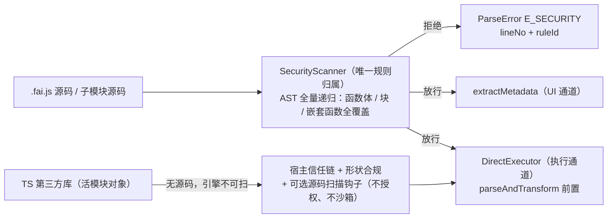

# .fai.js 静态安全门禁 —— 无 IR 双通道下的代码分析阶段拒绝方案

日期：2026-09-08（第二轮：已按"第三方可无歧义执行"标准审阅，补全接口签名、ruleId 枚举、错误传播契约、验收断言方式）
基线仓库：`C:\my\Faicad\faijs`（`main` = `bc7178d`，工作区干净）
状态：**方案（未实施）**。本文只写方案，不含实现代码改动。
自检结论：按本文实施**不需要**再向设计者提问——所有接口签名、规则阈值、错误码、断言方式均已写死；
若实施中仍发现缺口，属方案缺陷，应在本文补充而非自行发挥。

> 本文全部现状结论来自 2026-09-08 读代码 + **实跑探测**（临时脚本，已删除），不引用任何历史方案文档作为现状依据。
> 涉及文件：`lang/metadata-extractor.ts`、`lang/parse-error.ts`、`cad-runtime/direct-executor.ts`、
> `cad-runtime/runtime.ts`、`cad-runtime/module-registry.ts`、`cad-runtime/admit-compat-lib.ts`。
> 行号仅供定位，实施时以代码为准。

---

## 0.5 实施前置（第三方执行前必读）

**术语**

| 术语 | 含义 |
|---|---|
| UI 通道 | `extractMetadata` / `analyzeCode` / `codeToArgs` / `check()` —— 不执行，只产出元数据 |
| 执行通道 | `DirectExecutor` —— 把源码变成单元并用 `new Function` 执行 |
| 单元（unit） | 执行通道的最小执行块：一行 op 或一整个控制流块（`direct-executor.ts` 概念，**Scanner 不涉及**） |
| ns / 命名空间 | `cad` 及 `registerLib` 注册的库绑定名，源码里以 `ns.op()` 形式调用 |
| knownNames | Scanner 判定"这个名字是不是合法命名空间"的名单，自动收集 + 调用方补充（§5.1） |

**开工前请先读这 4 个文件**（本文所有现状结论的出处）
1. `packages/core/src/lang/metadata-extractor.ts`（UI 通道，看语句 dispatch 与"只扫顶层"的盲区）
2. `packages/core/src/cad-runtime/direct-executor.ts`（执行通道，看 `transformFunction` / `transformBlock` / `runUnit`）
3. `packages/core/src/lang/parse-error.ts`（错误类型，本方案扩展它）
4. `packages/core/src/cad-runtime/ports.ts`（`HostPorts` / `LibLoader` / `ProjectLoader` 契约）

**硬约束**
- **不新增 npm 依赖**（仓库只有 `acorn`，无 `acorn-walk`；新增依赖会触发幽灵依赖守卫）。
- **不改** `DirectExecutor` 的调用白名单（它是正确性设施，与本门禁互补）、**不改** timeline 只读块的产品形态、**不恢复** IR。
- 每个新增导出都要 JSDoc 且逐参数 `@param` / `@returns`（pre-commit `verify-export-jsdoc`）。
- 测试 stderr 零容忍：断言错误必须在测试内 `spyOn` 并断言，**禁止**全局静默（项目红线）。

---

## 0. 用户原始需求（逐字）

> 自从@docs\plans\2026-09-06-no-ir-dual-channel-runtime.md 这次重构以后，是否.fai.js的预校验能力就丢失了？比如eval之类的代码，需要被拒绝，还有哪些可能的影响安全性的代码，能否写一份方案，在目前的parser体系下，在代码分析阶段被拒绝。此外，目前.fai.js支持导入其他.fai.js库以及ts库，这些库中的代码，安全性如何校验？

拆解要求：

| # | 要求 | 约束强度 |
|---|---|---|
| R1 | 回答"重构是否丢失预校验能力"——必须给出**实测**结论，不是推测 | 红线 |
| R2 | `eval` 一类危险代码必须在**代码分析阶段**被拒绝（静态门禁），不是运行时报错 | 红线 |
| R3 | 列出**还有哪些可能影响安全性的代码**（完整攻击面清单） | 红线 |
| R4 | 方案必须在**目前的 parser 体系**（MetadataExtractor + DirectExecutor 双通道）下实施 | 红线 |
| R5 | 明确 **`.fai.js` 子模块**与 **TS 第三方库**两类外部代码如何校验 | 红线 |
| R6 | 不得破坏 R6 前辈要求"支持所有 JS 语法、改功能不改 parser"——安全规则须与功能规则解耦 | 红线 |

---

## 1. 结论摘要（先回答）

### 1.1 直接回答 R1：**是的，预校验能力已严重退化，且存在两道不一致的门禁**

重构后 `lang/parser.ts`（语义提取层）被删除，取而代之的两道门禁各有缺口：

- **静态侧 `extractMetadata`**（`lang/metadata-extractor.ts`）：仍保留少量拒绝（顶层裸 `eval`、`new`、动态 `import()`、`with`、`class`），但**只检查顶层语句形态**——**函数体与控制流块只采源码文本进 `functions` / `blocks` 表，不递归扫描内部**（`metadata-extractor.ts:999-1013` 函数声明、`1101-1127` 控制流转 blocks）。
- **执行侧 `DirectExecutor`**：有自己的调用白名单（`emitCall` 只接受 `<ns>.<op>()` / 本机函数），**意外挡住了顶层 `eval(...)` / `Function(...)`**；但函数体原文（`direct-executor.ts:762-770`）与控制流块整段（`:641-658`）**原样嵌入、无任何 AST 安全扫描**，最终由 `new Function('__ctx','__ns', src)`（`:501-502`）执行。

**两者规则不一致**：同一段代码在静态侧放行、在执行侧被拒（或反之）的情况真实存在（§2.2 矩阵）。

### 1.2 已确证的漏洞（2026-09-08 实跑，非推测）

以下 5 条**全部实际执行成功**（返回值确凿写入 `ctx`）：

| 向量 | 代码 | 实测结果 |
|---|---|---|
| **V-A 函数体内 `eval`** | `function e(){ return eval('6*7') }; const r = e()` | `ctx.r === 42` |
| **V-B 函数体内 `globalThis.eval`** | `function e(){ return globalThis.eval('6*7') }; const r = e()` | `ctx.r === 42` |
| **V-C 控制流块内 `eval`** | `for (let i=0;i<1;i++){ const p = eval('6*7') }` | `ctx.p === 42` |
| **V-D 块内 `Function` 构造器** | `for(...){ const f = Function('return 6*7')() }` | `ctx.f === 42` |
| **V-E 块内动态 `import()`** | `for(...){ const m = import('./x') }` | **真的触发 ESM loader**（Node 报 `ERR_MODULE_NOT_FOUND`，证明 `import()` 被执行；浏览器下 `https://…` 同样成立） |

已确证的**全局对象可达**（能力逃逸的前提）：块内 `typeof process === 'object'`、函数内 `typeof fetch === 'function'`、`const g = globalThis` 成功把全局对象写进 `ctx`。执行载体为 `new Function`，其作用域链即 `globalThis` —— 浏览器下 `window/document/localStorage/navigator/location`、Node 下 `process/require(模块作用域不可见)/fetch` 均在可达范围。

### 1.3 顶层为什么看起来"还挡得住"

`DirectExecutor.emitCall`（`:858-880`）只接受 `<ns>.<op>()` / 本机函数，因此顶层 `const r = eval('…')` 会被改写成 `await __ctx.eval(...)` 然后运行时报 `__ctx.eval is not a function`——**不是被安全拒绝，而是碰巧失败**；且 `metadata-extractor` 对同一段代码是 **PASS**（判为 computed 参数）。这条侥幸链不构成防线：`const g = globalThis` 已实测可把全局对象拿进 `ctx`。

### 1.4 决策

| 决策 | 结论 |
|---|---|
| **D1** | 新建 `lang/security-scanner.ts` 作为**唯一**安全规则归属（一个事实一个家）：**AST 全量递归遍历**，覆盖函数体、块、嵌套函数、箭头函数——消除当前"只扫顶层"的盲区。 |
| **D2** | 三处强制调用点：① `extractMetadata` 前置（UI 通道）；② `DirectExecutor.parseAndTransform` 前置（执行通道，补执行侧无安全扫描的洞）；③ `module-registry` 装载每个子模块前置。 |
| **D3** | 判定模型 = **能力黑名单 + 自由标识符白名单**。核心一条：任何**不能解析到**（已声明变量 / ns 绑定 / 函数参数 / 局部声明 / 安全全局白名单）的标识符一律拒绝。这一条同时杀死 `globalThis` / `process` / `fetch` / `eval` / `Function` / `window` / `require` 全部。 |
| **D4** | 规则表是**数据**（声明式常量），不是散落分支：新增 op、新增语法形态**不改扫描器主体**，满足 R6"改功能不改 parser"。 |
| **D5** | 错误码新增 `E_SECURITY`（细分 4 子类），扩 `ParseErrorCode`；`CheckResult` 增加 `stage: 'security'`。 |
| **D6** | `SecurityPolicy`（`strict` / `balanced` / `off`）三档，默认 `strict`；挂在 `CadRuntimeOptions.security` + `ExtractMetadataOptions.security`。3d_editor（AI 生成代码）强制 `strict`。 |
| **D7** | **`.fai.js` 子模块**：是文本 → 与入口同级，走同一 Scanner（有源码就能扫，这是能真正加强的部分）。 |
| **D8** | **TS 第三方库**：引擎拿到的是宿主已加载的活模块对象，**无源码、无法沙箱**。faijs 不假装能隔离——责任划到宿主信任链（= npm 供应链安全），引擎只提供 ① 形状合规（现状 `assertLibConforms`）、② 可选**源码扫描钩子**（宿主提供源码时走同一 Scanner）；**不做能力清单/授权**（§6.2.1 评估：收益近零、制造错觉）。真正的隔离只能靠部署层（Worker / Node VM / 子进程），列为 v2，不在本方案实施范围。 |
| **D9** | 诚实边界：**静态门禁不是安全边界**，是纵深防御第一层。字符串拼接属性名 `g['ev'+'al']`、已获引用二次调用等无法静态判定。此局限写进文档，不掩盖。 |

**工作量**：Scanner 1.5d + 三处接入 0.5d + 攻击向量回归测试 1d + 库钩子/清单 1d + 文档与门禁 0.5d ≈ **4–5d**。

---

## 2. 现状（实测）

### 2.1 两道门禁的位置与分工

| 门禁 | 位置 | 覆盖范围 | 缺口 |
|---|---|---|---|
| 静态门禁 | `lang/metadata-extractor.ts`（`extractMetadata`） | 顶层语句 dispatch：ImportDeclaration / FunctionDeclaration / VariableDeclaration / ExpressionStatement / ReturnStatement / default | **函数体只取 `bodyText`+`bodyHash`（`:1004-1012`），不扫描内部**；**控制流/未知语句整段进 `blocks`（`:1101-1127`），不扫描内部** |
| 执行门禁 | `cad-runtime/direct-executor.ts`（`transformTopNode` / `emitCall`） | 单元变换时：只接受 `<ns>.<op>()` 与本机函数调用 | **函数体原文嵌入**（`:762-770`）、**块整段执行**（`:647-648`）——均无 AST 安全扫描 |

调用关系：`runtime.execute`（`runtime.ts:519`）→ `extractMetadata` → `de.execute`；`runtime.append`（`:600`）→ `extractMetadata(code, { looseVars: true })` → `de.append`。
**注意：`append` 走 `looseVars: true`**，静态门禁在增量路径上更宽松（实测 §2.2 V2）。

子模块：`module-registry.ts:187` 对每个被 import 的 `.fai.js` 调 `extractMetadata(source)`——**同样只扫顶层**，同样盲区，且执行载体相同。

### 2.2 实测矩阵（2026-09-08，临时 `tsx` 脚本直调，脚本已删）

**表 A — 静态门禁 `extractMetadata`（strict = 缺省；loose = `looseVars: true`，即 append 路径）**

| 向量 | strict | loose |
|---|---|---|
| 顶层裸 `eval('1+1')` | REJECT `E_STATEMENT` | REJECT |
| `globalThis.eval('1+1')` | REJECT `E_REFERENCE` | **PASS** ← 增量路径放行 |
| `const r = (0, eval)('1+1')` | **PASS**（判为 computed 参数） | **PASS** |
| `const f = Function` + `f('…')()` | **PASS** | **PASS** |
| `const r = new Function('…')()` | **PASS**（`new` 只在顶层表达式语句被查） | **PASS** |
| 函数体内 `eval` | **PASS**（不递归） | **PASS** |
| `for` 块内 `eval` | **PASS**（不递归） | **PASS** |
| `if` 块内 `fetch` | **PASS** | **PASS** |
| 顶层 `const r = fetch('http://…')` | **PASS**（computed 参数，执行侧会求值） | **PASS** |
| `({}).constructor.constructor('…')()` | **PASS** | **PASS** |
| `const m = import('http://…')` | REJECT `E_CONTROL_FLOW` | REJECT |
| 顶层 `const r = process.exit(1)` | **PASS** | **PASS**（且 loose 下进 `lines`） |
| 函数体内 `globalThis.eval` | **PASS** | **PASS** |
| 合法 op `const part0 = cad.box(10,10,10)` | PASS（对照） | PASS |

**表 B — 执行侧 `DirectExecutor.execute`（不初始化 wasm，只跑纯 JS 单元）**

| 向量 | 结果 |
|---|---|
| `const r = eval('6*7')` | 运行期失败 `__ctx.eval is not a function`（**碰巧失败，非安全拒绝**） |
| `const r = (0, eval)('6*7')` | REJECT `expected <ns>.<op>(...) or local function call` |
| `const f = Function` + `f('…')()` | REJECT（同上） |
| `const r = new Function('…')()` | REJECT（同上） |
| **函数体内 `eval('6*7')`** | **执行成功 `ctx.r === 42`** |
| **`for` 块内 `eval('6*7')`** | **执行成功 `ctx.p === 42`** |
| 顶层 `const g = globalThis` | **执行成功，全局对象进入 ctx** |
| 顶层 `const g = globalThis; const h = g.eval; const z = h(…)` | 全局对象已入 ctx（后续链式取值） |
| **`for` 块内 `Function('return 6*7')()`** | **执行成功 `ctx.f === 42`** |
| **`for` 块内 `import('./x')`** | **触发真实 ESM 加载**（Node loader 报错证明已发起） |
| 函数内 `typeof fetch` | `'function'`（**网络能力可达**） |
| 块内 `typeof process` | `'object'`（**Node 宿主能力可达**） |

### 2.3 根因：为什么重构后会这样

1. **IR 时代**：`parseScript` 是"语句语义提取器"，每行必须压成 `StatementIR`，**不认识的语法直接报错**——副作用是危险代码也被挡在门外（语法限定充当了安全门禁）。
2. **no-IR 之后**：R8 要求"不认识的语法块用只读节点显示、**不分析语义**"，R6 要求"支持所有 JS"。于是控制流块与函数体**只做文本采集，不做语义/安全分析**——安全门禁随之一起被移除。
3. **执行侧自建白名单**（为正确性设计，非为安全），恰好挡住顶层部分向量，掩盖了盲区，也造成两侧规则不一致。

**结论：预校验不是被设计成"放松"，是被"不分析语义"的架构决策连带移除的。这属于设计缺口，需要显式补回。**

### 2.4 现有安全设施盘点（2026-09-08）

| 设施 | 现状 |
|---|---|
| `ParseErrorCode`（`lang/parse-error.ts`） | `E_SYNTAX` / `E_CONTROL_FLOW` / `E_STATEMENT` / `E_VALUE` / `E_IMPORT` / `E_REFERENCE` / `E_ARG`——**无安全类码** |
| `SecurityPolicy` / `E_SECURITY` | **不存在**（全仓 grep 无匹配） |
| 超时 `executionTimeoutMs` | 存在（`direct-executor.ts:321`），但**只在单元循环层检查**；块内同步死循环不可中断 |
| 沙箱 / Worker | 仅 csg/sdf worker（`browser-host/`），**脚本执行无隔离** |
| 库校验 `admitCompatLib` | 仅 `assertLibConforms` 形状合规 + `compatOp` 包装——**零代码内容校验** |
| 依赖 | 仅 `acorn@^8.18.0`（**无 acorn-walk**，扫描器须手写递归遍历，避免新增依赖触发幽灵依赖守卫） |

---

## 3. 攻击面完整清单（R3）

> 分级：**C1 能力逃逸**（执行任意代码）/ **C2 宿主能力越权**（网络、文件系统、DOM）/ **C3 资源耗尽** / **C4 数据与原型污染**。

### C1 能力逃逸（最高危）

| 项 | 形态 | 现状 |
|---|---|---|
| C1-1 | `eval(...)` 直接调用 | 顶层被拒（侥幸）；**函数体/块内可执行**（实测 42） |
| C1-2 | `globalThis.eval` / `window.eval` / `self.eval` | 块/函数体内可执行（实测 42） |
| C1-3 | `(0, eval)(...)` / 别名 `const e = eval` | 顶层被执行侧白名单拒；块/函数体内可行 |
| C1-4 | `Function('…')()` / `new Function('…')()` | **块内实测执行成功（42）** |
| C1-5 | 构造器链 `({}).constructor.constructor('…')()`、`[].map.constructor('…')()` | 同族，块/函数体内可行 |
| C1-6 | 动态 `import()`（含远程 URL） | **块内实测真的发起加载**；浏览器下可拉远程代码 |
| C1-7 | `WebAssembly` / `WebAssembly.compile` | 同源可达（未实测，属同族） |
| C1-8 | `setTimeout('code')` / `setInterval` 字符串态 | 同族 |
| C1-9 | `importScripts`（Worker 环境） | 同族 |

### C2 宿主能力越权

| 项 | 形态 | 现状 |
|---|---|---|
| C2-1 | `globalThis` / `window` / `self` / `top` / `parent` | **实测可达并入 ctx** |
| C2-2 | `fetch` / `XMLHttpRequest` / `WebSocket` / `navigator.sendBeacon` | **函数内 `typeof fetch === 'function'`** → 可把 ctx 中模型数据外发 |
| C2-3 | `process`（Node）/ `process.binding` / `child_process` | **块内 `typeof process === 'object'`** |
| C2-4 | `require`（模块作用域，Node 下 `new Function` 不可见——风险较低） | 低 |
| C2-5 | `document` / `localStorage` / `sessionStorage` / `indexedDB` / `location` / `cookie` | 浏览器下同族可达 |
| C2-6 | `Worker` / `SharedWorker` 自建（绕过宿主超时与管控） | 同族 |
| C2-7 | `debugger` | 无害但应禁（干扰） |

### C3 资源耗尽

| 项 | 形态 | 现状 |
|---|---|---|
| C3-1 | `for(;;){}` / `while(true){}` 同步死循环 | **块整段执行 + 单线程 + 超时只查单元间 → 主线程挂死**（浏览器标签卡死 / Node 进程卡死） |
| C3-2 | 巨量 `cad.box` 循环（OOM / wasm arena 爆） | 可行（A-6 循环已合法化） |
| C3-3 | 正则灾难回溯（ReDoS） | 可行 |
| C3-4 | 深层递归爆栈 | 可行 |

### C4 数据与原型污染

| 项 | 形态 | 现状 |
|---|---|---|
| C4-1 | `__proto__` / `constructor` / `prototype` 赋值 | 顶层 args 有 `E_VALUE` 折叠保护；**块/函数体内无保护** |
| C4-2 | `Object.setPrototypeOf` / `Reflect.set` / `__defineGetter__` | 同族 |
| C4-3 | 污染共享 `ctx`（跨 append、跨模块持久） | 可行 —— `ctx` 是**持久化容器**，一处污染影响后续全部执行 |
| C4-4 | 覆盖 `cad.*` / 已注册库绑定（在块内给 `__ctx.cad.box` 赋值） | 可行（块内可写 `__ctx.*`） |

### 不可静态检测的残留（诚实列出）

- 拼接属性名：`g['ev' + 'al'](...)`、`g[String.fromCharCode(101,118,97,108)]`；
- 已获引用的二次调用（若引用来源是允许集合则无害，来源被禁则链断）；
- 字符串内的代码（`Function('…')` 的参数不可解析）。

> 因此本方案定位为**静态门禁 = 纵深防御第一层**，通过"切断能力来源（自由标识符白名单）"使上述残留失去立足点，但不宣称等价沙箱。

---

## 4. 目标架构



**要点**：Scanner 只做**能力/标识符**判定，不做语法限定；规则表与功能代码解耦（R6）。

---

## 5. 扫描器设计

### 5.1 组件

**签名契约（实施以此为准）**

```ts
// lang/security-scanner.ts（新增；lang/ 为 L0 层，只依赖 acorn 与 ./parse-error）

export type SecurityPolicy = 'strict' | 'balanced' | 'off'

/** 违规条目。ruleId 取值见 §5.9 枚举表（禁止自造）。 */
export interface SecurityViolation {
  ruleId: SecurityRuleId
  /** 1-based 行号，相对**传入的原始源码文本**（Scanner 不做任何包裹/偏移，见下行号口径） */
  lineNo: number
  /** 命中的标识符名 / 属性名 / 节点类型（无则省略） */
  name?: string
  message: string
}

export interface SecurityScanOptions {
  /** 策略档位。**必填**——不允许缺省，调用方必须显式声明（防止无意间关闭门禁） */
  policy: SecurityPolicy
  /**
   * 额外合法名字（S4 与 S7 判定用）。**调用方可不传**——Scanner 始终自动 Collect：
   * ① 源码内全部 `ImportDeclaration` 的本地绑定名（named / namespace / default 三种都要收）；
   * ② `opts.defaultNs ?? 'cad'`。
   * 本字段只用于补充"源码里看不到的名字"：
   * - A1（extractMetadata）：`[defaultNs, ...(options.namespaces ?? [])]`
   * - A2（DirectExecutor）：`Object.keys(this.namespaces)`（含 `cad` 与已 registerLib 的库名）
   * - A3（module-registry）：`['cad', ...父模块传入的绑定名]`
   *
   * ⚠️ ① 是**必须的**：现状 `runtime.execute` 调 `extractMetadata(code, { defaultNs })` 时
   * 并不传 `namespaces`，若不自动收集 import 绑定，`import * as bp from './x.fai.js'` 后的
   * `bp.foo` 会被 S4 判为自由标识符而全量误杀（多文件/第三方库场景直接死）。
   */
  knownNames?: string[]
  /** 默认命名空间名，缺省 'cad'（自动进入 knownNames） */
  defaultNs?: string
}

export interface SecurityScanResult {
  ok: boolean                    // violations 为空
  violations: SecurityViolation[] // 命中即拒的条目；非空 → 调用方拒绝
  warnings: SecurityViolation[]   // 只告警不拒（目前只有 S5 无界循环）
}

/** 全量扫描（返回全部违规），供 CLI / check 收集。policy==='off' 时直接返回 { ok:true, violations:[], warnings:[] }。 */
export function scanSource(code: string, opts: SecurityScanOptions): SecurityScanResult

/** 复用已解析的 AST，避免二次解析；语义与 scanSource 完全一致。 */
export function scanAst(ast: Program, opts: SecurityScanOptions): SecurityScanResult

/** 门禁断言：violations 非空则抛 ParseError（code='E_SECURITY'，ruleId 挂 ParseError.ruleId）。三处接入点统一用它。 */
export function assertSecure(code: string, opts: SecurityScanOptions): void
```

| 项 | 约定 |
|---|---|
| 文件 | `lang/security-scanner.ts`（新增；规则表以 `const RULES` 形式**同文件内联**，不另建 `security-rules.ts`，减少导出面与 JSDoc 门禁负担） |
| 解析 | `acorn.parse(code, { ecmaVersion: 'latest', sourceType: 'module', locations: true })` |
| **解析失败** | acorn 抛错时 **原样上抛、不包装**（语法错误归既有 `E_SYNTAX` 路径，Scanner 不重复定义） |
| **行号口径** | 取 `node.loc.start.line`（1-based），相对**本次调用传入的源码文本**。三处接入点传入的都是原始 `.fai.js` 文本（未经 `export default` 包裹），因此行号与用户在编辑器看到的行号一致 |
| 遍历 | **手写递归 AST walker**（仓库无 `acorn-walk`，不新增依赖以免触发幽灵依赖守卫；约 120–150 行） |
| 作用域 | 遍历中维护 `scopeStack`：函数形参（含默认参数）、函数体 `var/let/const`、块级声明、`catch` 参数、解构名、函数声明名、`for(let/const …)` 的循环变量、`for…of/in` 绑定 |
| 调用顺序 | 先收集本层全部声明再遍历子节点的语句体（处理 `var` 提升与函数声明提升）；**作用域判定存疑时按"已声明"放行**，由 S1 黑名单兜底（见 R-2） |

### 5.2 规则表（数据驱动，新增规则不改遍历器）

**S1 危险标识符黑名单（引用即拒，不区分读写、不区分声明位置）**

命中条件：遍历中出现 `Identifier`（含 `MemberExpression.property` 的标识符形态）且名字命中下表。
**S1 优先于一切**：即使用户用这些名字声明了自己的变量，也照样拒绝（用户须改名）。

| 组 | 名字 | 档位 |
|---|---|---|
| 执行任意代码 | `eval` `Function` `AsyncFunction` `GeneratorFunction` `AsyncGeneratorFunction` | strict + balanced |
| 全局逃逸 | `globalThis` `window` `self` `top` `parent` `frames` | strict + balanced |
| Node 宿主 | `process` `require` `module` `exports` `__dirname` `__filename` | strict + balanced |
| 网络 | `fetch` `XMLHttpRequest` `WebSocket` `EventSource` `navigator` `sendBeacon` | strict + balanced |
| 浏览器存储/DOM | `localStorage` `sessionStorage` `indexedDB` `caches` `document` `location` `cookie` | strict + balanced |
| 动态装载 | `importScripts` `Worker` `SharedWorker` `WebAssembly` | strict + balanced |
| 定时器/微任务（混淆与延时外发） | `setTimeout` `setInterval` `setImmediate` `queueMicrotask` `requestAnimationFrame` | **仅 strict** |
| 元编程（原型污染族） | `Reflect` `Proxy` `crypto` | **仅 strict** |

**不在 S1**（避免误杀，由其它规则管）：`Object` / `Array` / `Math` 等走 S4 白名单（其危险成员走 S3）；
`console` **不禁**（无能力风险，宿主如需静音自行处理——本项目禁止用 spy 掩盖告警）；
`debugger` 是语法节点，走 S2。

> **S1 的意义**：`eval` 家族与全局逃逸入口在**任何位置**（含函数体/块）被引用即拒绝——直接消灭 V-A/B/D。

**S2 危险语法节点黑名单**

| 节点 | 档位 | 说明 |
|---|---|---|
| `ImportExpression`（动态 `import()`） | strict + balanced | 一律拒（消灭 V-E） |
| `WithStatement` | strict + balanced | 拒（现状已有，统一到 Scanner） |
| `DebuggerStatement` | strict + balanced | 拒 |
| `TaggedTemplateExpression` | **仅 strict** | 常见绕过技巧（`` tag`…` `` 可构造动态求值） |
| `MetaProperty`（`new.target` / `import.meta`） | strict + balanced | 拒（`import.meta` 泄漏宿主信息） |
| `AwaitExpression`（顶层） | 不禁 | 现状合法（容器体），保持兼容 |

> **关于 `new` 与 `Function` 的处置（2026-09-08 澄清，取代初稿的"`strict` 全禁 `new`"）**
>
> - **`Function` 有害，与 `new` 无关**：`Function('…')` 与 `new Function('…')` **完全等价**，都是把
>   字符串编译成函数 —— 语义上就是 `eval`。它的危险性在于**代码藏在字符串里**：静态扫描看的是 AST，
>   字符串不是 AST，扫描器永远看不见 `'return fetch(...)'` 里面的内容。因此必须在**标识符层面**
>   禁掉 `Function`（S1），而不是去禁"调用形态"——这正是 S1 存在的理由。
> - **`new` 关键字本身无害**，危险与否 100% 取决于 `new` 后面是什么：`new Date()` 无害，
>   `new Function()` / `new Worker()` / `new WebSocket()` / `new Image()` 有害。
>   而这些有害构造器的**名字全是全局标识符**，已经被 S1（黑名单）与 S4（自由标识符白名单）
>   完整覆盖 —— 例如 `new Image()` 的 `Image` 既不在 S1 也不在安全全局白名单 → S4 拒。
> - **结论：不单独禁 `NewExpression`。** 初稿"`strict` 全禁 `new`"是**保守过度**，会误杀
>   `new Date()` / `new Array(n)` / `new Map()` 等完全无害的合法建模写法，而安全收益为零。
>   保留 S1+S4 即可；`new Function('…')()` 由 S1 的 `Function` 命中（验收 S-5 不变）。
> - 边缘形态 `new (0, eval)('…')` 由 S1 的 `eval` 标识符命中，同样覆盖。

**S3 危险成员属性名黑名单**（档位：strict + balanced 全禁）

命中条件：`MemberExpression.property` 的名字命中下表；计算属性 `x['…']` 中 `…` 为**字符串字面量**时同样判定；
非字面量的计算属性（`x[k]`）**不判**（静态不可知，属 §9 残留风险）。

| 组 | 名字 |
|---|---|
| 原型污染 | `__proto__` `constructor` `prototype` |
| getter/setter 注入 | `__defineGetter__` `__defineSetter__` `__lookupGetter__` `__lookupSetter__` |
| 对象元编程 | `setPrototypeOf` `defineProperty` `defineGetter` `defineSetter` |
| 求值 | `eval`（`x.eval` 形式） |

> 注意：`Object` / `Array` / `Math` 等**本体**在 S4 白名单里放行，只禁其危险成员，避免误杀 `Object.keys()` / `Math.max()`。

**S4 自由标识符白名单（本方案的核心，D3）**

| 类别 | 允许 |
|---|---|
| 已声明变量 | 遍历期 `scopeStack` 中的全部名字（`const/let/var`、函数参数与默认参数、函数名、解构名、`catch` 参数、循环绑定） |
| 命名空间绑定（**自动收集，勿依赖调用方**） | 源码内所有 `ImportDeclaration` 的本地绑定名（named / namespace / default）+ `defaultNs`（缺省 `cad`）+ `opts.knownNames` 补充项 |
| 安全全局白名单（**固定清单，strict 与 balanced 相同**） | `Math` `Number` `String` `Boolean` `Array` `Object` `JSON` `Date` `Map` `Set` `Promise` `Symbol` `RegExp` `Error` `Infinity` `NaN` `undefined` `parseInt` `parseFloat` `isNaN` `isFinite` `console` |
| 其它 | **一律拒** |

> 白名单是**穷举闭合**的：实施时以本行为准，不得在代码里"顺手"加名字；确需新增须同步更新本表与单测。
> `console` 在两档都允许（无能力风险）；`crypto` 不在白名单且 strict 档被 S1 禁。

> **S4 的意义**：一条规则同时消灭 `globalThis` / `process` / `fetch` / `Function` / `window` / `require` —— 因为它们全是"无法解析到声明"的自由标识符。这条也是把"碰巧失败"变成"确定拒绝"的关键。

**S5 结构上限（C3 族；两档同值，判定在解析后、遍历前）**

| 项 | 阈值 | 超限行为 |
|---|---|---|
| 源码长度 | > 1 MiB | violations（拒） |
| 顶层语句数 | > 5 000 | violations（拒） |
| AST 节点总数（walker 计数） | > 200 000 | violations（拒） |
| AST 嵌套深度 | > 100 | violations（拒） |
| 无界循环 `for(;;)` / `while(true)` / `do…while(true)` | — | **warnings（不拒）**，合法建模场景需要 |

> 无界循环只告警的原因：静态无法区分"故意的无限循环"与"靠 `break` 退出的合法写法"；且 v1 无法中断同步死循环（§9）。
> 告警如何呈现：由调用方决定——`check()` 放进 `CheckResult.warnings`，执行路径丢弃（不进 `failedAt`）。

**S6 子模块装载上限**（`module-registry` 配合）：装载深度 > 16、模块总数 > 64 → `failedAt`；循环依赖 → `failedAt`（现状已有，补上限两项）。

**S7 命名空间保护（C4-4）**（strict + balanced）：禁止对 `opts.knownNames` 中的任一名字（`cad`、库/localName）做**赋值或成员赋值**，防块内覆盖 `cad.box`。

判定：赋值目标为下列之一即命中 —— ① 标识符本身（`cad = …`）；② 以该标识符为根的 `MemberExpression`（`cad.box = …`）。
（`__ctx` 不在此列：它只存在于变换后代码，用户源码里不存在，无需判。）

**S8 策略档位**

| 档位 | 适用 | 生效范围 |
|---|---|---|
| `strict`（**默认**） | 3d_editor / AI 生成 / 远端来源 / 子模块 | S1 全表（含"仅 strict"两组）+ S2 全表（含 `TaggedTemplate`）+ S3 + S4 + S5 + S7 |
| `balanced` | 本机 CLI 跑自己写的 `.fai.js` | S1 除"仅 strict"两组外 + S2 除 `TaggedTemplate` 外 + S3 + S4 + S5 + S7 |
| `off` | 受控本地调试 | 不扫描。**必须显式传入，禁止作为任何默认值或回退值** |

三档**都不禁** `new` 关键字（见 §5.2 澄清）；`console` 三档都允许；无界循环三档都只告警。
档位由调用方显式传入；缺省值策略见 §5.3（A1/A2/A3 的缺省一律 `strict`）。

### 5.3 三处接入点（D2）

| # | 接入位置（精确） | 调用形式 | policy 来源 | knownNames 来源 |
|---|---|---|---|---|
| A1 | `lang/metadata-extractor.ts` → `extractMetadata(code, options)` **函数体第一行**（在 `acornParse` 之前，对原始 `code` 扫描） | `assertSecure(code, { policy, knownNames })` | `options.security ?? 'strict'` | `[options.defaultNs ?? 'cad', ...(options.namespaces ?? [])]` |
| A2 | `cad-runtime/direct-executor.ts` → `parseAndTransform(code)` **函数体第一行**（在 `parseBody` 之前） | `assertSecure(code, { policy, knownNames })` | 构造参数 `DirectExecutorOptions.security ?? 'strict'` | `Object.keys(this.namespaces)`（含 `cad` 与已注册库名） |
| A3 | `cad-runtime/module-registry.ts` → 装载每个子模块、读取 `source` 之后、写入缓存之前 | `assertSecure(source, { policy:'strict', knownNames })` | 固定 `strict`（子模块不接受降档） | `['cad', ...该模块的 import 绑定名]` |

**A2 是关键**：当前执行侧只信自己的调用白名单，函数体/块完全不查。只加 A1 会让"绕过 UI 通道直调执行"仍不安全。

> 三处的 `knownNames` 都是**补充项**：Scanner 自己一定会先收集源码内 `ImportDeclaration` 的绑定名并加 `defaultNs`
> （见 §5.1 代码注释与 ⚠️ 说明），调用方不传也不会误杀 import 绑定。

**与 `looseVars` 的关系**：安全策略与 `looseVars` **正交**——`looseVars` 只放宽"变量是否已声明"的**元数据**判定，
Scanner 的 S1 黑名单与安全全局白名单不受其影响（`append` 路径同样全规则生效）。

**A1 的位置细节**：必须在 `extractMetadata` 内部任何**代码包裹**之前（现状存在 `export default async (…) => {…}` 封装回退，
内部有 `lineOffset` 修正）。Scanner 只吃调用方传入的原始文本，因此行号天然与用户编辑器一致。

### 5.4 错误面（D5）

**5.4.1 类型改动**

| 位置 | 改动 |
|---|---|
| `lang/parse-error.ts` | `ParseErrorCode` 增加 `'E_SECURITY'`；`ParseError` 类增加**可选**字段 `ruleId?: string`（不破坏既有构造签名） |
| `cad-runtime/runtime.ts` | `CheckError.stage` 联合类型由 `'parse' \| 'symbol' \| 'reference' \| 'keep'` 增加 `'security'`；`CheckError.code` 可填 `'E_SECURITY'` |

**5.4.2 `ruleId` 枚举（封闭集合，禁止自造；测试按此断言）**

| ruleId | 触发规则 | 示例 |
|---|---|---|
| `SEC_IDENT` | S1 危险标识符 | `eval` / `globalThis` / `fetch` / `Function` |
| `SEC_SYNTAX` | S2 危险语法节点 | `import()` / `with` / `debugger` / 标签模板 / `import.meta` |
| `SEC_MEMBER` | S3 危险成员名 | `x.__proto__` / `x.constructor` / `Object.setPrototypeOf` |
| `SEC_FREE_IDENT` | S4 自由标识符（不在已声明 / knownNames / 白名单） | `Image` / 未声明的 `foo` |
| `SEC_LIMIT` | S5 结构超限 | 源码过长 / 节点过多 / 嵌套过深 |
| `SEC_NS_ASSIGN` | S7 命名空间被赋值 | `cad.box = …` |

warnings 复用同一枚举（目前只有无界循环 → `SEC_LIMIT`，但 `ok` 仍为 `true`）。

**5.4.3 错误消息格式（AI 自纠用）**

```
[security] <ruleId> line <lineNo>: <human message>
例：[security] SEC_IDENT line 12: "eval" is not allowed (arbitrary code execution)
    [security] SEC_FREE_IDENT line 7: unknown identifier "Image" (not declared, not a known namespace)
```

**5.4.4 错误传播契约（三处接入点各不相同，实施须严格照做）**

| 入口 | 违规时行为 | 宿主现状消费方式 |
|---|---|---|
| `analyzeCode` / `codeToArgs` / `check()` | `check()` catch `ParseError` → `CheckResult{ ok:false, errors:[{ stage:'security', code:'E_SECURITY', line, message }] }`；`analyzeCode`/`codeToArgs` **抛** `ParseError`（与现状 parse 失败契约一致） | 3d_editor `executeScript.ts:123` 已 catch parse 阶段错误 → **零改动** |
| `runtime.execute()` / `append()` | **抛** `ParseError`（`code='E_SECURITY'`），**不进 `failedAt`** —— 与现状"ParseError 由 DirectExecutor 重抛"（`runtime.ts:557-558`）语义一致 | 宿主已在 execute 外层 catch → 零改动 |
| 子模块装载（A3） | 抛 `ParseError`，由 `module-registry` 包装成 `ModuleRegistryError('MODULE_SECURITY', { moduleKey, lineNo, ruleId })` → runtime 转 `failedAt` | 与现状模块装载失败路径一致 |

> 判定口径一句话总结：**安全违规 = 源码不可信 = 与语法错误同级的"拒绝执行"，因此走抛错而非 `failedAt`**；
> 只有"子模块装载"因为现状本来就是 `failedAt` 语义，才转成 `failedAt`。

### 5.5 策略注入点

策略注入点（三处，均为**可选字段**，不传即 `strict`）：

| 位置 | 类型现状 | 改动 |
|---|---|---|
| `cad-runtime/runtime.ts:258` | `export interface CadRuntimeOptions {}`（**当前是空接口**） | 增加 `security?: SecurityPolicy`；`CadRuntime` 构造时透传给 `DirectExecutor` 与 A1/A3 调用 |
| `cad-runtime/direct-executor.ts:133` | `DirectExecutorOptions` | 增加 `security?: SecurityPolicy` |
| `lang/metadata-extractor.ts:820` | `ExtractMetadataOptions`（现有 `defaultNs` / `looseVars` / `looseLocalCalls` / `namespaces`） | 增加 `security?: SecurityPolicy` |

- 根门面 `@faicad/faijs` 的 `createRuntime(ports, mode, libs, options)` 的 `options` 透传（签名不变）。
- **缺省一律 `strict`**：`?? 'strict'`，禁止任何回退到 `off` 的写法。
- 宿主降级方式（3d_editor 若需灰度）：`createRuntime(ports, mode, libs, { security: 'balanced' })`——
  一行改动，不需要改任何调用点。

### 5.6 与 R6 的调和（重要）

安全规则**不是语法限定**：Scanner 不关心"这行是不是认识的 op 形态"，只判定"是否引用了能力标识符 / 是否使用了危险语法节点"。因此：
- 新增 op、新增语法形态、链式调用、解构、循环、条件 —— **都不需要改 Scanner**；
- 只有"新增被禁能力"才改规则表（数据），不改遍历器（代码）。

---

## 6. 外部代码校验（R5）

### 6.1 `.fai.js` 子模块（可校验 —— 本方案能真正加强的部分）

| 环节 | 现状 | 方案 |
|---|---|---|
| 装载 | `module-registry.ts:187` 调 `extractMetadata(source)` | 装载前先过 Scanner（A3），违规 → `failedAt`（含模块 key + 行号） |
| 执行载体 | 与入口相同的 `new Function` | 不变（同进程、同权限） |
| 上限 | 无 | S6（深度/总数/循环依赖） |
| 策略 | 无 | 与入口同源策略（`strict` 默认） |

结论：**子模块与入口文件同等对待**，没有"库更可信"的豁免。

### 6.2 TS 第三方库（引擎无法校验代码内容 —— 责任划清）

**现状事实**：`HostPorts.libLoader` 返回的是**宿主已加载的活模块对象**；`admitCompatLib`（`admit-compat-lib.ts`）只做 `assertLibConforms`（形状合规）+ `compatOp` 包装。**引擎拿不到库源码，也隔离不了已加载对象的行为**（同一 JS 作用域，无沙箱）。

**因此明确划分（D8）**：

| 项 | 归属 |
|---|---|
| 库代码是否可信 | **宿主责任** —— 等价于 npm 供应链安全（装谁的包谁负责：lockfile、审计、来源） |
| 引擎能做的 ① | 形状合规 `assertLibConforms`（现状保留） |
| 引擎能做的 ② | **可选源码扫描钩子**：`LibLoader`（`ports.ts:187`）**新增可选方法** `loadSource?(packageName: string): Promise<string \| undefined>`。**不要**改 `loadLib` 的返回值——它返回 `StdlibNamespace`，往里挂 `source` 会被 `admitCompatLib` 当成导出值并污染命名空间。`loadSource` 存在且返回源码时，走同一 Scanner 扫描（A4，policy 固定 `strict`）；不存在则跳过 |
| 引擎做不到的 | 限制已加载模块对象的实际行为（无沙箱、无 Realm、无冻结宿主全局） |
| 真正隔离 | 部署层：浏览器 Worker（无 DOM/网络）/ Node `vm` + 冻结 context / 子进程 —— **v2 独立议题，不在本方案实施** |

#### 6.2.1 关于"能力清单"的评估（2026-09-08 澄清：**本方案不实施**）

"能力清单"指：库在导出对象上声明自己需要哪些宿主能力（如 `export const capabilities = ['network']`），
引擎在 `registerLib` 时读取，在 `strict` 档下若出现越界能力（network / fs / dom）则拒绝注册。

**它听起来像授权，实际上不是**，这是不实施的根本原因：

| 问题 | 说明 |
|---|---|
| ① 引擎无法授予/回收能力 | 同进程 JS 无法阻止一个模块对象调用 `fetch`。清单顶多"拒绝注册"，**不能**让库"只能用到被授予的能力" |
| ② 恶意库直接不声明 | 引擎看不到库代码，撒谎零成本 —— 清单对真正的攻击者**收益为零** |
| ③ 善意库可能被误伤 | 需要下载字体/纹理/远程数据的库会被 `strict` 拒掉，而拒绝并不能让它变安全 |
| ④ 制造安全错觉 | "库声明了能力所以经过审查"是假的，比没有更危险 |

> **结论**：能力清单的**安全收益接近零，成本是 API 面膨胀 + 误伤 + 错觉**。
> 本方案**不实施**，不在引擎引入 `capabilities` 字段。库安全性只落三件事：
> ① 形状合规（现状）；② 可选源码扫描钩子；③ **`docs/library-dev-guide.md` 写死信任边界**
> （"faijs 不审查、不隔离第三方库代码；装谁的包谁负责，等同 npm 供应链安全"）。
> 若未来确有合规审计需求，应做在**宿主侧**（装包时扫描/审计），而不是运行时声明。

> 诚实结论：**TS 库的安全性 = 宿主信任链**。faijs 提供"形状合规 + 可选扫描"，**不提供"沙箱"、也不做授权**。这一条必须写进 `docs/library-dev-guide.md`。

---

## 7. 文件级实施清单

**新增（1 个源文件 + 1 个测试文件）**
- `packages/core/src/lang/security-scanner.ts`：§5.1 的四个导出（`SecurityPolicy` / `SecurityViolation` / `SecurityScanOptions` / `SecurityScanResult` / `scanSource` / `scanAst` / `assertSecure`）+ 手写递归 walker + 规则表（S1–S5、S7）内联为 `const RULES`。
  **不新建 `security-rules.ts`**——规则表与扫描器同文件，减少导出面（项目 pre-commit 要求每个导出带 JSDoc 且逐参数 `@param`）。
- `packages/core/src/lang/security-scanner.test.ts`：§8.1 全部断言（S-1 ~ S-24 中可在单测层覆盖的部分）。

> 注：每个导出符号都必须有 JSDoc 且**逐参数** `@param x` / `@returns`（lefthook `verify-export-jsdoc` 硬门禁）。

**修改**

| 文件 | 改动 |
|---|---|
| `lang/parse-error.ts` | `ParseErrorCode` 增加 `'E_SECURITY'`；`ParseError` 增加可选 `ruleId?: string` |
| `lang/metadata-extractor.ts` | `extractMetadata` 第一行接入 A1；`ExtractMetadataOptions` 增加 `security?` |
| `cad-runtime/direct-executor.ts` | `parseAndTransform` 第一行接入 A2；`DirectExecutorOptions` 增加 `security?` |
| `cad-runtime/runtime.ts` | `CadRuntimeOptions`（现为空接口）增加 `security?` 并透传；`CheckError.stage` 联合增加 `'security'`；`check()` catch 分支识别 `E_SECURITY` |
| `cad-runtime/module-registry.ts` | 装载子模块前接入 A3；违规 → `ModuleRegistryError('MODULE_SECURITY', …)` → `failedAt` |
| `cad-runtime/ports.ts` | `LibLoader` 增加可选 `loadSource?`（§6.2 ②）；**不改 `loadLib` 返回值** |
| 根门面 `src/index.ts` 等 | 导出 `SecurityPolicy` 类型（宿主显式传档位用） |
- `cad-runtime/module-registry.ts`：装载前接入 Scanner（A3）+ S6 上限。
- `cad-runtime/ports.ts`：`libLoader` 返回类型可选增加 `source?`（能力 ② 的可选钩子；**不改 `loadLib` 既有契约，仅扩展可选字段**）。
- `cad-runtime/runtime.ts`：`CadRuntimeOptions.security?`；`CheckError.stage` 增加 `'security'`；透传给三处接入点。
- 根门面 `src/index.ts` 等：`SecurityPolicy` 类型导出（若宿主需要显式传档位）。

**文档（同 PR）**
- `docs/syntax-design.md`：新增"安全约束"小节（禁项表 + 错误码）。
- `docs/library-dev-guide.md` / `.zh.md`：新增"库安全与信任边界"小节（§6.2 结论）。
- `.agents/notes/implemented/feature/`：新增 Agent Note。

**不动**
- `DirectExecutor` 的调用白名单（保留，属正确性设施，与安全门禁互补）。
- `emitCall` / `hoistText` / `hoistBlockText` 文本变换逻辑。
- 几何/拓扑/导出面。

---

## 8. 实施计划与验收

| 阶段 | 内容 | 退出标准 | 验证命令 |
|---|---|---|---|
| **P1 扫描器 + 单测** | `security-scanner.ts` + 规则表 + 三档策略；§8.1 全部单测 | 全表拒绝且**合法 fixture 全放行**（无误杀） | `npm run test -w @faicad/faijs-core -- security-scanner` |
| **P2 三处接入** | A1 / A2 / A3 | 端到端：危险 `.fai.js` 在 `check` 与 `execute` 两种入口都被拒 | `npm run test -w @faicad/faijs-core -- check execute-code direct-executor` |
| **P3 无误杀回归** | 全量 `.fai.js` fixture + 手工合法代码集（S-17~S-22） | 全绿，stderr 零输出 | `npm run test --workspaces` |
| **P4 库边界** | `LibLoader.loadSource?` 可选源码扫描钩子（**不做能力清单**，§6.2.1）+ `docs/library-dev-guide.md` 信任边界章节 | 信任边界文档落地；有源码的库可走 Scanner | `npm run test -w @faicad/gear-lib-demo` |
| **P5 门禁与文档** | lint / typecheck / doc-sync / Agent Note | CI 绿 | `npm run lint && npm run typecheck && npm run doc-sync` |

> P3 的"全量 fixture"指 `packages/tests/faijs/` 与 core 内既有 `.fai.js` 用例。
> **若实施方无法访问 3d_editor 仓库**，以 core fixture 全集 + S-17 ~ S-22 手工集为准即可，不阻塞。
> 严禁以"跑一次 CI 找 bug"代替分阶段验证（项目既有纪律）。

### 8.1 验收断言（每条都是可执行测试）

**断言方式（统一，避免各写各的）**

```ts
// 拒绝类：统一用具名 try/catch，禁止依赖 message 文本匹配
function expectRejected(code: string, ruleId: SecurityRuleId, policy: SecurityPolicy = 'strict') {
  let err: unknown
  try { assertSecure(code, { policy, knownNames: ['cad'] }) } catch (e) { err = e }
  expect(err).toBeInstanceOf(ParseError)
  expect((err as ParseError).code).toBe('E_SECURITY')
  expect((err as ParseError).ruleId).toBe(ruleId)   // 见 §5.4.2 枚举
}
// 放行类
expect(scanSource(code, { policy: 'strict', knownNames: ['cad'] }).ok).toBe(true)
```

**必须拒绝（回归锁定当前漏洞）**

| # | 输入 | 期望 ruleId |
|---|---|---|
| S-1 | 函数体内 `eval('6*7')`（V-A） | `SEC_IDENT` |
| S-2 | 函数体内 `globalThis.eval('6*7')`（V-B） | `SEC_IDENT` |
| S-3 | `for` 块内 `eval('6*7')`（V-C） | `SEC_IDENT` |
| S-4 | 块内 `Function('…')()`（V-D） | `SEC_IDENT` |
| S-5 | 块内 `new Function('…')()` | `SEC_IDENT` |
| S-6 | 块内 `import('http://…')`（V-E） | `SEC_SYNTAX` |
| S-7 | `const g = globalThis` | `SEC_IDENT` |
| S-8 | 块内 `typeof process` / 函数内 `typeof fetch` | `SEC_IDENT` |
| S-9 | `({}).constructor.constructor('…')()` | `SEC_MEMBER` |
| S-10 | `require('fs')` / `WebAssembly` / `importScripts` | `SEC_IDENT` |
| S-11 | `x.__proto__ = {}` / `Object.setPrototypeOf(x, y)` | `SEC_MEMBER` |
| S-12 | 块内 `cad.box = …`（S7） | `SEC_NS_ASSIGN` |
| S-13 | 未声明的自由标识符（如裸 `Image`） | `SEC_FREE_IDENT` |
| S-14 | `debugger` / `with` / `import.meta` / 标签模板（strict） | `SEC_SYNTAX` |
| S-15 | 子模块内含 `eval` | `assertSecure` 抛错 → `module-registry` 转 `failedAt`（含 moduleKey 与行号） |
| S-16 | 同一段危险代码：`strict` 拒、`off` 放行 | 策略生效性 |
| S-17 | **UI 通道与执行通道一致**：`check()` 拒绝的代码，`runtime.execute()` 也必须抛 `E_SECURITY`（A1 + A2 双保险） |

**必须放行（防误杀；`assertSecure` 不抛、`scanSource().ok === true`）**

| # | 输入 | 覆盖点 |
|---|---|---|
| S-18 | `const part0 = cad.box(10, 10, 10)` 及 `packages/tests/faijs/` 全部现有 fixture | 无回归 |
| S-19 | 链式 `let w1 = w0.rect(100, 100)`、解构 `const { front: a } = cad.fai_split(...)` | receiver / 解构 |
| S-20 | 派生常量 `const INX = OUTX - 24`、负字面量 `const y = -5` | 表达式参数 |
| S-21 | `for` / `if` 块内仅使用已声明变量与 `Math.*` 的合法循环 | 块不误杀 |
| S-22 | 本机函数定义与调用；函数体使用 `Math.PI`、`JSON.parse`、`new Date()` | **不禁 `new`** 的回归锁 |
| S-23 | 参数引用 `$param`；`import * as cfg from 'pkg'` 后的 `cfg.OUTX`；`import { bp } from './x.fai.js'` 后的 `bp.solid` | **import 绑定自动入白名单**（§5.1 `knownNames` 注）——不自动收集会全量误杀 |
| S-24 | 顶层 `await`、函数内 `console.log(...)` | 兼容现状 |

**结构性**

| # | 输入 | 期望 |
|---|---|---|
| S-25 | 源码 > 1 MiB / 节点数 > 200k / 嵌套 > 100 | `SEC_LIMIT`（拒） |
| S-26 | `for(;;){}` / `while(true){}` | **只进 `warnings`，`ok === true`**（不拒） |
| S-27 | 模块装载深度 > 16 / 模块数 > 64 / 循环依赖 | `failedAt`（S6） |

---

## 9. 局限与不在本方案范围（诚实边界）

| 项 | 说明 |
|---|---|
| 静态门禁 ≠ 沙箱 | 无法拦截 `g['ev'+'al']`、字符串内代码、已获引用二次调用。**本方案通过切断能力来源（S4）让这些路径失去立足点，但不宣称等价隔离** |
| 同步死循环不可中断 | `for(;;){}` 在块内执行会挂死主线程/进程（超时只查单元间）。**v1 只做静态告警**；根治需 Worker + terminate（v2） |
| TS 库不可隔离 | 见 §6.2 —— 责任在宿主信任链；真隔离需部署层 |
| `console` 输出 | `strict` 允许（无能力风险）；宿主如需静音自行处理（**禁止用 spy 掩盖告警**，遵循项目既有红线） |
| wasm / 几何引擎 | 本方案只管脚本代码分析阶段，不涉几何内核安全 |
| 不改动 R6/R8 | 不引入语法子集、不恢复 IR、不改变 timeline 只读块的产品形态 |

---

## 10. 风险与待裁决

| ID | 风险 | 影响 | 处置 |
|---|---|---|---|
| R-1 | **误杀合法代码**（`Math` 外的全局、AI 手写非常规写法） | 高 | S4 白名单 + P3 全量 fixture 无误杀回归；规则表可配置；先 `balanced` 灰度再切 `strict` 默认 |
| R-2 | 手写 walker 的作用域判定误差（变量遮蔽、块级 `let`、解构、`for(let i…)`） | 中 | 单测覆盖遮蔽/嵌套/解构/`for-of`；保守策略：**判定不清时按"已声明"放行，交给 S1 黑名单兜底** |
| R-3 | 执行侧 A2 接入后与 `looseVars`（append 路径）的交互 | 中 | 安全策略与 `looseVars` **正交**：loose 只放宽变量解析，不放宽能力黑名单；单测锁定 |
| R-4 | 拒绝太严导致 3d_editor AI 生成代码频繁失败 | 中 | 错误信息带 `ruleId` + 行号，供 AI 自纠；`strict` 下提供可读提示文本 |
| R-5 | 性能（全量 AST 递归） | 低 | 单次 O(n)，源码 ≤1MiB；S5 节点上限保护 |
| R-6 | 与"支持所有 JS 语法"（R6）的张力 | 中 | §5.6 已论证：安全门禁判定能力/标识符，不判定语法形态 |

### 已裁决（2026-09-08，用户质疑后修正，无需再议）

1. **不禁 `new`**（撤回初稿的"`strict` 全禁 `NewExpression`"）：`new` 关键字本身无害，危险取决于构造目标；
   有害构造器（`Function`/`Worker`/`WebSocket`/`Image`…）全部是全局标识符，已被 S1 黑名单与 S4
   自由标识符白名单完整覆盖。全禁只会误杀 `new Date()` / `new Array(n)` / `new Map()`，
   **安全收益为零**。详见 §5.2 澄清块。
2. **不实施"能力清单"**（撤回初稿的可选项）：引擎无法授予/回收能力，恶意库不声明即可绕过，
   收益近零且制造"已审查"的安全错觉。库安全性只落"形状合规 + 可选源码扫描 + 文档化信任边界"，
   审计职责归宿主（等同 npm 供应链安全）。详见 §6.2.1。实施量相应减少约 1d（P4 只剩文档 + 可选钩子）。
