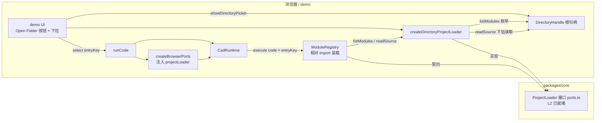

# Browser Host 多文件（§4.5）ProjectLoader 实现方案 — `.fai.js` 相对 import 的浏览器支持

> 状态：**已落地**
> 日期：2026-09-09
> 范围：`packages/core/src/browser-host`、`packages/demo`；参考 `packages/mini_lathe`、`C:\git\OpenCascade\BREP.io`
> 上游能力：`1a7cb6e`（fs ProjectLoader + CLI wiring + entryKey）、`3f2b016`（mini_lathe 真实 .fai.js imports）

---

## 1. 用户原始要求（原文引用）

> 最后一次提交，实现了.fai.js文件的引用，且基于node.fs实现的。可以查看mini_lathe项目的相关代码。现在，我需要在browser host里也支持这个语法特性，用demo项目做测试。你可以参考这个项目C:\git\OpenCascade\BREP.io， 它支持在浏览器里管理本地文件夹。请写一份技术实现方案

拆解为三条约束：

| 编号 | 约束 |
|---|---|
| C1 | browser host 支持 `.fai.js` 文件引用语法（相对 import 多文件），与 node.fs 版能力对等 |
| C2 | 用 demo 项目做测试载体（打开本地项目文件夹 → 运行带相对 import 的入口文件） |
| C3 | 参考 BREP.io 的浏览器本地文件夹管理方案（File System Access API 挂载目录） |

---

## 2. 背景与现状

### 2.1 引擎层多文件能力已就绪（与平台无关）

`1a7cb6e` 之后，faijs 引擎层多文件（§4.5）能力**完整且平台无关**，全部收敛在 L2 `cad-runtime`：

- **契约**：`packages/core/src/cad-runtime/ports.ts` L204-223 定义 `ProjectLoader` 接口——`listModules(): string[]`、`readSource(moduleKey): Promise<string>`、可选 `fingerprint()`。moduleKey 约定「host 决定字符串形态，引擎只做最小归一后按 listModules() 精确匹配」。
- **装载器**：`package/core/src/cad-runtime/module-registry.ts` 的 `ModuleRegistry`——相对 specifier（`./`、`../`、`/`）归一 → 匹配 loader → 读源码 → `assertSecure` strict 安全扫描 → 递归装载 → seed 绑定。循环依赖/深度/数量上限、`BINDING_NOT_EXPORTED` 等错误码齐全。
- **entryKey**：`ExecuteOptions.entryKey`（runtime.ts L193-199），主模块的相对 import 以它为解析基准，保证入口在子目录时 `./parts/x.fai.js` 解析正确。

### 2.2 node 端实现（上轮提交的主体）

`packages/core/src/node-host/fs-project-loader.ts`：

- `createFsProjectLoader(rootDir)`：构造 ProjectLoader。模块清单创建时递归枚举一次（`**/*.fai.js`，POSIX 相对 key，跳过 `node_modules/dist/out/.git/.workbuddy`），`readSource` 每次实时读盘，key 越界（`..` 逃出项目根）拒绝。
- `findProjectRoot(entryFile)`：向上找最近的 `package.json`。
- `projectKeyOf(rootDir, entryFile)`：入口自身也有 key。
- CLI（node-host/cli.ts）`withCliProjectLoader` 注入 ports + `runtime.execute(code, { entryKey })`。

`3f2b016` 把 mini_lathe 改造为真实多文件：`config.fai.js`（共享常量 + `pin_holes` 函数）+ 7 个 part 脚本 + `assembly.fai.js`，装配 STEP 导出验证通过（仅内部实体编号差异）。

### 2.3 browser host 现状：无 ProjectLoader 实现

`packages/core/src/browser-host/index.ts` 的 `createBrowserPorts` 目前只管 `csg/sdf/fonts/assets/events/libLoader`，**没有 projectLoader 选项**。`CreateBrowserPortsOptions` 也无对应字段。浏览器里带相对 import 的脚本（如 mini_lathe assembly）目前会因无 loader：`loadDirectModuleImports` 里 `this.ports.projectLoader` 为 undefined → 返回空 seed → 相对 import 的绑定在 ctx 中缺失 → 引用报错。

### 2.4 demo 现状：单文件模式

`packages/demo/main.ts` + `index.html`：

- textarea 编辑器 + Run；**Open File** 按钮（`<input type="file">`）载入**单个** `.fai.js`（无 projectLoader，单文件行为不变）；
- `example-select` 下拉：内置示例 + `__file__`；
- runCode 流程：`createBrowserPorts({ fontUrl, libLoader })` ×2（brep/mesh）→ check → 串行 execute；
- e2e（`e2e/demo.spec.ts`）已覆盖「打开 mini_lathe axk.fai.js」单文件用例（`fileInput.setInputFiles` + 仓库文件内容直读）。

### 2.5 BREP.io 参考：浏览器本地文件夹管理

`C:\git\OpenCascade\BREP.io` 的实现要点（`src/services/mountedStorage.ts` + `componentLibrary.ts`）：

| 能力 | 实现 | 借鉴点 |
|---|---|---|
| 选择本地文件夹 | `window.showDirectoryPicker({ mode })`（File System Access API，`isSystemAccessSupported()` 探测） | 直接采用 |
| 句柄跨会话持久化 | IndexedDB（`MOUNT_DB_NAME` + `mounts` store）存 handle，`queryPermission`/`requestPermission` 重新授权 | 列为 v2 增强（3d_editor 集成时做），demo 阶段非必需 |
| 递归遍历目录 | `walkMountedDirectoryTree`：`for await ([name, handle] of dirHandle.entries())` + `kind === 'directory'/'file'` 分支 | 直接采用 |
| 按路径读写 | `getFileHandle` 逐段 `getDirectoryHandle` 下钻 + `getFile().text()` | 直接采用 |
| 判重/去重 | `isSameEntry` + 挂载记录归一 | demo 不需要（单会话单目录） |

BREP.io 是「挂载 + 通用文件管理」的完整产品形态；本方案只取其 **目录句柄获取 + 递归枚举 + 按路径读取** 三块最小切片，且不需要 IndexedDB（demo 是测试平台，单次会话挂载即可）。

---

## 3. 目标与非目标

### 3.1 目标

1. core 提供浏览器版 ProjectLoader：`createDirectoryProjectLoader(rootHandle)`（与 `createFsProjectLoader` 对称），导出于 browser-host，`createBrowserPorts` 可注入。
2. demo 新增「Open Folder」能力：挂载本地项目文件夹（File System Access API）→ 枚举全部 `.fai.js` → 选择入口 → 以 `entryKey` 执行，完整跑通 mini_lathe 装配等多文件项目。
3. 测试双覆盖：core 单测（内存 fake handle）+ demo e2e（OPFS 真实 handle stub）。

### 3.2 非目标（明确不做）

- **IndexedDB 句柄持久化 / 多目录挂载管理**（BREP.io mountedStorage 的产品形态）→ 3d_editor 集成时再议，demo 每次打开即可。
- **写回项目目录**（`readwrite` 权限、保存导出到项目文件夹）→ 本期只读。
- **`findProjectRoot` 浏览器版**（向上找 package.json）→ 浏览器里用户直接选择项目目录（如 mini_lathe/），所选目录即项目根，语义清晰。
- **query 参数/URL 加载项目** → 不在本期。
- 不改动引擎 `cad-runtime` 任何代码——多文件通道已完备，浏览器侧只是补 host 实现。

---

## 4. 总体设计



要点：

- **引擎零改动**。`ProjectLoader` 契约、`ModuleRegistry`、`entryKey` 均已就绪（§2.1）；浏览器侧只需补一个实现 + demo 接线。
- **实现与 node 对称**：`browser-host/directory-project-loader.ts` 镜像 `node-host/fs-project-loader.ts` 的模块语义（key 约定、SKIP_DIRS、POSIX 路径、越界拒绝），只把「文件系统」换成「DirectoryHandle」。
- **底层来源分层**：File System Access API 的 handle（`showDirectoryPicker`）与 OPFS handle（`navigator.storage.getDirectory()`）**接口同构**（`kind`/`entries()`/`getDirectoryHandle`/`getFileHandle`/`getFile`）——同一 loader 实现两者通吃，e2e 恰好借此用 OPFS stub 测真实读取链路。

---

## 5. 详细设计

### 5.1 `packages/core/src/browser-host/directory-project-loader.ts`（新文件）

头注释注明与 fs-project-loader 的对称关系（key 约定一致：POSIX 相对根路径、无 `./` 前缀、`ModuleRegistry` 精确匹配）。

```ts
/** 可枚举/可下钻的目录句柄最小接口（structurally 兼容 FileSystemDirectoryHandle / OPFS）。 */
export type FsDirectoryHandleLike = {
  kind?: string
  entries?: () => AsyncIterable<[string, FsEntryHandleLike]>
  getDirectoryHandle?: (name: string, opts?: { create?: boolean }) => Promise<FsDirectoryHandleLike>
  getFileHandle?: (name: string, opts?: { create?: boolean }) => Promise<FsFileHandleLike>
}
export type FsFileHandleLike = { kind?: string; getFile?: () => Promise<File> }
```

模块级常量：`FAI_SUFFIX = '.fai.js'`；`SKIP_DIRS = ['node_modules', 'dist', 'out', '.git', '.workbuddy']`（与 fs 版一致；目录以 `.` 开头也跳过）。

```ts
export interface DirectoryProjectLoader extends ProjectLoader {
  /** 重新枚举模块清单（挂载时枚举一次；目录被外部改动后由 UI 刷新）。 */
  refresh(): Promise<void>
}

export async function createDirectoryProjectLoader(
  rootHandle: FsDirectoryHandleLike,
  opts?: { skipDirs?: string[] },
): Promise<DirectoryProjectLoader>
```

内部实现：

- **`walk(dir, basePath, out)`**：`for await ([name, handle] of dir.entries())`——目录且不在 SKIP_DIRS/点前缀 → 递归；文件且以 `.fai.js` 结尾 → 推入 `out`（POSIX key：`basePath ? basePath + '/' + name : name`）。与 BREP.io `walkMountedDirectoryTree` 同构。
- **`descendToFile(key)`**：按 key 的 `/` 分段，前 N-1 段 `getDirectoryHandle(seg)`，末段 `getFileHandle(seg)`；任一步 `NotFoundError`/`TypeMismatchError` → 抛带 key 的错误（与 `MODULE_NOT_FOUND` 区分上下文）。
- **`listModules()`**：同步返回挂载时（或最近一次 refresh）的枚举缓存——`ProjectLoader` 接口是同步签名，浏览器枚举是异步操作，故清单必须预枚举缓存（与 fs 版「创建时枚举一次」行为一致；fs 用同步 `readdirSync`，浏览器只能异步）。
- **`readSource(key)`**：先校验 `key ∈ listModules`（越界防御，路径归一后的逃逸在引擎侧已被 `normalizeModuleKey` 消解，这里二次校验兜底）→ `descendToFile` → `(await handle.getFile()).text()`。
- **`refresh()`**：重新 `walk`，替换缓存（demo 的 Run 前会调用；外部编辑器改了文件 → 重新枚举看到新文件）。
- **不实现 `fingerprint()`**（fs 版同样未实现，ModuleRegistry 每轮全量重读语义不变）。

### 5.2 `createBrowserPorts` 增加 projectLoader（`browser-host/index.ts`）

- `CreateBrowserPortsOptions` 增字段 `projectLoader?: HostPorts['projectLoader']`；
- `createBrowserPorts` 返回值合并 `projectLoader: opts?.projectLoader`（缺省不注入，单文件行为不变；与 `libLoader` 的缺省语义一致）。

### 5.3 demo UI：Open Folder + 项目入口选择（`packages/demo`）

**index.html**：

- 在 banner-controls 增加 `<button id="open-dir-btn" class="btn btn-secondary">Open Folder</button>`（紧邻现有 Open File）。

**main.ts**：

1. **状态**：
   ```ts
   type ProjectState = {
     rootName: string            // 目录名（状态栏显示）
     loader: DirectoryProjectLoader
     keys: string[]              // 模块清单（loader.listModules()）
     entryKey: string | null     // 当前选中的入口 key（null = 非项目模式）
   }
   let project: ProjectState | null = null
   ```

2. **打开文件夹**（`open-dir-btn` → click）：
   - 探测 `window.showDirectoryPicker` 缺失 → `setStatus('File System Access API 不可用（需要 Chrome/Edge 或 localhost/HTTPS）', 'error')`；
   - `const handle = await showDirectoryPicker({ mode: 'read' })`（拒绝授权 → 错误提示，不崩溃）；
   - `const loader = await createDirectoryProjectLoader(handle)`（挂载即枚举）→ `project = { rootName: handle.name, loader, keys: loader.listModules(), entryKey: 默认选择 }`；
   - **默认入口**：`src/assembly.fai.js` 存在则优先，否则取第一个 key（README 化：状态栏显示）；`keys.length === 0` → 提示「目录下没有 .fai.js」并清空 project。
   - 填充 `example-select`：清空旧的项目 option，插入 `<option value="__proj:<key>">📁 <key></option>`（保留内置示例与 `__file__`），切到默认入口 option；
   - 载入入口源码进编辑器 + `runCode()`。

3. **选择项目入口**（example-select change 分支 `__proj:` 前缀）：更新 `project.entryKey` → 读 `loader.readSource(key)` 进编辑器 → `runCode()`。

4. **runCode() 集成**：
   - 运行前：`if (project?.entryKey) await project.loader.refresh()`（子文件可被外部编辑后新增模块/删除模块都能反映；读源码是实时的）；
   - `createBrowserPorts({ fontUrl, libLoader: demoLibLoader, projectLoader: project?.entryKey ? project.loader : undefined })` ×2（brep/mesh 共享**同一个** loader 实例——无状态可并发；
   - `runtime.execute(code, project?.entryKey ? { entryKey: project.entryKey } : undefined)`；
   - 状态栏前缀：项目模式显示 `Project: mini_lathe (src/assembly.fai.js) — ...`。
   - check 阶段不改（与 cliCheck 一致不注入 loader：`check` 只做语法/元数据提取，相对 import 存在性由 execute 阶段 `ModuleRegistry` 校验）。

5. **Open File（单文件）与 Open Folder 并存**：载入单文件 / 切回内置示例时，`project.entryKey = null`（单文件行为完全不变，无 loader）；再切回 `__proj:` option 恢复项目模式。

### 5.4 兼容性与降级

- `showDirectoryPicker`：Chromium/Edge 86+、localhost/HTTPS 必需；demo dev（:8899）满足。Firefox/Safari 不支持 → 明确报错，不静默。
- 权限 `mode: 'read'` 即可（`.fai.js` 只读）；授权被拒 → 错误信息引导。
- 与 3d_editor 的关系：`createDirectoryProjectLoader` 是 core 的浏览器平台能力，3d_editor 未来可直接复用（其会话缓存/store 是上游层）；`ports.ts` L213 注释「3d_editor / browser：项目文件表 + session 内缓存」的「browser」落实为本实现。

---

## 6. 测试设计

### 6.1 core 单测 `packages/core/src/browser-host/directory-project-loader.test.ts`（node 环境）

浏览器 API 在 node 不可用 → 用**内存 fake handle**（纯对象实现 `FsDirectoryHandleLike`，不依赖 DOM/File）：

```ts
/** 由 Record<posixPath, text> 构造内存目录树句柄。 */
function createFakeRoot(files: Record<string, string>): FsDirectoryHandleLike
```

用例：

1. `listModules`：递归枚举出全部 `.fai.js`（POSIX key）；跳过 `node_modules/`、`dist/`、`.git/`、点目录、非 `.fai.js` 文件；排序稳定。
2. `readSource`：命中 key 返回文本；不存在 key / 目录 key → 抛错。
3. 越界防御：`../x.fai.js`、`a/../../x.fai.js` 等归一后不在清单 → 拒绝（不读取）。
4. `refresh()` 后新写入的文件出现、删除的文件消失。
5. **集成冒烟**：`createDirectoryProjectLoader(fakeRoot)` + `ModuleRegistry` 载入一个带相对 import 的入口（主模块 `./parts/b.fai.js`），断言 seed 绑定正确——验证 loader 与引擎契约无缝衔接。

### 6.2 demo e2e `packages/demo/e2e/demo.spec.ts` 新增用例（关键：OPFS stub）

Playwright **不能**驱动真实 `showDirectoryPicker` 系统对话框，但 OPFS 与 picker 返回的 handle **接口同构**。方案：`page.addInitScript` 把 `showDirectoryPicker` stub 为返回 OPFS 根，文件树在 `page.evaluate` 里用 OPFS API 真实写入 → 全链路真实数据流。

新增 helper：

```ts
async function mountOpfsProject(page: Page, files: Record<string, string>) {
  await page.addInitScript(() => {
    // 每个新页面：showDirectoryPicker → OPFS 根句柄（接口与 picker 返回同构）
    window.showDirectoryPicker = async () => navigator.storage.getDirectory()
  })
  // 在 OPFS 中构建项目树（真实 getDirectoryHandle/createWritable 写入）
  await page.evaluate(async (entries) => { /* 递归建目录 + 写文件 */ }, files)
}
```

用例设计：

1. **mini_lathe 项目（brep 多文件）**：从仓库读取 `packages/mini_lathe/src` 全部 `.fai.js`（复用现有「打开 mini_lathe axk.fai.js」用例的 `readFile(new URL(...))` 手法）→ OPFS 写入 `mini_lathe/src/...` 树 → 点 Open Folder → 断言下拉出现 `src/assembly.fai.js`（且是默认选中）→ 自动运行 → 状态栏 `OK — brep: 1 shape(s)` + 装配渲染 + STEP 下载导出含 `ADVANCED_FACE`；mesh 链路显式 `E_MESH_UNSUPPORTED`（cq-compat brep-only）。
2. **mesh 多文件（覆盖 mesh 链路 + 相对 import 组合）**：新增小型纯 cad 项目 fixture（如 `part_a.fai.js`/`part_b.fai.js`/`proj.fai.js`，两个 box + union，纯 mesh 支持）→ OPFS 写入 → Open Folder → 运行 → brep/mesh 两条链都 OK（渲染 + 统计一致）。
3. **空目录降级**：OPFS 根无 `.fai.js` → 状态栏报「目录下没有 .fai.js」。
4. **非项目入口行为不变**：打开文件夹后切回 built-in 示例 → 运行仍走单文件（无 loader）路径。

> 备用方案：若 headless Chromium 下 OPFS 异常（极低概率），降级为「stub 返回内存 fake handle」——由 6.1 的 fake 结构构造，同一测试意图、数据流不再真实。优先 OPFS（更真实）。

### 6.3 CI 集成

- core 单测随 `npm run test -w @faicad/faijs-core` 自动纳入（`src/**/*.test.ts`）；
- demo e2e 随现有 `demo.spec.ts` 一起跑（playwright 已在 CI 流程）；stderr 零容忍约束照常。

---

## 7. 实施步骤与验证（自测顺序）

| # | 步骤 | 验证 |
|---|---|---|
| 1 | core：新增 `directory-project-loader.ts` + 单测（§6.1） | `npm run test -w @faicad/faijs-core`（新增用例全绿）；`npm run lint` / `npx tsc --noEmit`（core 路径） |
| 2 | `createBrowserPorts` 注入 projectLoader 选项 | 同包单测回归 |
| 3 | demo：Open Folder UI + 项目入口选择 + entryKey 执行 | `npm run dev`（:8899）手工全流程跑 mini_lathe assembly |
| 4 | demo e2e 新用例（§6.2，先 build 再单跑 `npx playwright test demo.spec.ts`） | 新增用例通过，存量用例不回归 |
| 5 | 全量自测过了才跑 CI：`pwsh -NoProfile scripts/ci.ps1`（faijs） | CI 全绿；记录失败项只重跑失败的 |
| 6 | Agent Note + 文档 | `.agents/notes/` 新增决策记录（browser ProjectLoader 落地）；`ports.ts`/browser-host 注释同步 |

---

## 8. 风险与待确认

| # | 风险/待定 | 影响 | 应对 |
|---|---|---|---|
| R1 | headless Chromium 对 OPFS 的支持度 | e2e 数据流真实性 | Playwright 默认 chromium 支持 OPFS；异常则走 §6.2 备用 fake handle 方案 |
| R2 | `showDirectoryPicker` 需要用户手势与授权 | 自动化测试无法触达真实 picker | 已在测试设计用 stub 隔离（§6.2）；真实交互留在手工验收 |
| R3 | 外部工具修改项目目录后清单过期 | 运行结果与实际文件不一致 | `refresh()` 每次运行前重枚举（§5.3-4） |
| R4 | Firefox/Safari 不支持 FSA | demo 功能受限 | 明确报错 + 文档注明 Chromium/Edge 支持范围（本地开发/CI 均为 Chromium） |
| Q1 | 默认入口选择策略：`src/assembly.fai.js` 优先是否足够通用 | 多项目约定 | 本期按此；3d_editor 集成时由 UI 明确指定入口（无隐式默认） |
| Q2 | IndexedDB 持久化本期不做，用户是否期望 demo 里记住上次挂载 | 体验 | 按非目标处理；如需可在 demo 加轻量 IDB（复用 BREP.io mountedStorage 模式），独立小任务 |

---

## 9. 参考材料

- `1a7cb6e` / `3f2b016`（fs ProjectLoader、mini_lathe 多文件改造）——包内代码：`packages/core/src/node-host/fs-project-loader.ts`、`packages/core/src/cad-runtime/module-registry.ts`、`packages/core/src/cad-runtime/runtime.ts`、`packages/core/src/cad-runtime/ports.ts`、`packages/core/src/node-host/cli.ts`
- BREP.io：`src/services/mountedStorage.ts`（IndexedDB handle 持久化 + permission）、`src/services/componentLibrary.ts`（`walkMountedDirectoryTree`、`getMountedFileHandleByPath`、`readMountedFileHandleText`）
- 现有 demo e2e 手法：`packages/demo/e2e/demo.spec.ts`（仓库文件直读 + `fileInput.setInputFiles`）