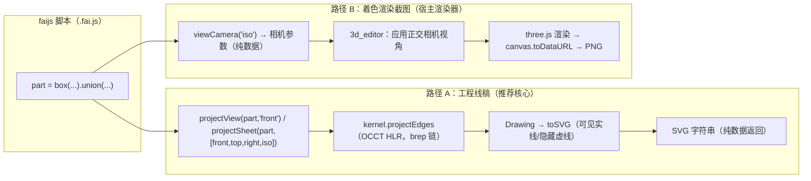

# faijs 视图投影与截图能力技术方案

状态：方案（未实施）
日期：2026-09-10

## 1. 需求来源（用户原话）

> 请调研一下，如何让faijs代码能够生成截图，比如三视图、等轴测图等。看看brepjs是否支持这个功能，freecad里如何实现这个功能。然后本项目应该如何实现，写一份技术方案。

需求拆解：

- 目标：**faijs 脚本面**能生成"截图"，典型形态为三视图、等轴测图。
- 调研对象：brepjs（是否支持）、FreeCAD（如何实现）。
- 交付物：本项目（faijs）的实现技术方案。

## 2. 调研结论

### 2.1 brepjs：支持"HLR 投影到 2D 线稿"，不支持"直接出图"

brepjs 本身**没有**内置"截图/图片渲染"输出，它提供的是两层能力：

1. **浏览器渲染**：`mesh` + `toBufferGeometryData` → Three.js / WebGL 集成（`docs/threejs-integration.md`，另有 `brepjs-viewer` 为 React + R3F 渲染器）。这是"实时渲染"，出图需宿主自行 canvas 截图。
2. **HLR 投影（关键能力，本项目已 vendored）**：`projection/` 模块提供 3D→2D 边投影 + 隐藏线消除（HLR）：

   - `cameraFns.ts`：`createCamera(position, direction, xAxis)`、`cameraFromPlane('front'|'top'|'right'|...)`、`cameraLookAt`、`projectEdges(shape, camera, withHiddenLines)`。
   - `projectionPlanes.ts`：标准视图方向表（front/back/top/bottom/left/right + XY/XZ/YZ 等六个轴平面）。
   - `makeProjectedEdges.ts`：调 kernel `projectEdges`，返回 `{ visible, hidden }`，各含 `sharp / smooth / outline` 三类边。
   - `sketching/draw3d.ts`：`drawProjection(shape, camera)` → `{ visible: Drawing; hidden: Drawing }`。
   - `sketching/drawing.ts`：`Drawing.toSVG()` / `toSVGViewBox()` / `toSVGPaths()` / `approximate('svg')` —— **SVG 线稿输出能力完整**。

3. **kernel 能力差异（重要约束）**：HLR 投影**只有 occt-wasm kernel 支持**。brepkit 明确不支持（brepkit issue #815：capability flag `projection: false` for brepkit，`true` for occt-wasm，"No way to project a 3D solid to 2D visible/hidden edges"）。occt-wasm 是 brepjs 默认 kernel，其 npm 文档将 "Projection: Hidden line removal (HLR), multiview SVG render (Front/Top/Right/Iso)" 列为核心能力之一；同时明确排除 TKV3d / TKHLR（除 HLR facade）/ AIS 显示模块——即 occt-wasm 只提供 HLR 计算，不提供显示/渲染。

**结论**：brepjs（经 occt-wasm）能产出"三视图/等轴测的 2D 工程线稿（SVG）"，但"截图"（位图/渲染图）需要宿主渲染器（Three.js）配合。

### 2.2 FreeCAD：TechDraw 工作台 = OCCT HLR + 投影方向向量

FreeCAD 的工程视图（TechDraw）实现路径：

1. **隐藏线消除**：`ProjectionAlgos.cpp` 直接构造 `HLRBRep_Algo`（精确 HLR），`brep_hlr->Add(Input)` 后按投影方向计算可见/隐藏边；偏好设置提供 `HLRBRep_PolyAlgo`（多边形近似，粗视图，快但输出为短直线段）。
2. **视图方向**：每个视图一个 `Direction` 向量——+X 右、-X 左、+Y 后、-Y 前、+Z 上、-Z 下。**Front = (0,-1,0)，Isometric = (1,-1,1)**（官方文档原话）；`XDirection` 控制视图绕方向旋转。
3. **多视图**：`TechDraw ProjectionGroup` 一键生成多视图投影（前/顶/右 + 4 个等轴测角可选）。
4. **线型管理**：可见线（实线）、隐藏线（虚线）、平滑线（smooth，相切过渡）、接缝线（seam）；可独立开关。
5. **输出**：SVG / DXF / PDF。
6. **已知问题**：HLR 精确算法对复杂模型慢（FreeCAD issue #19329：OCC HLRAlgo 处理大零件数分钟量级，投影方向微调可显著影响耗时）。

**结论**：FreeCAD 的三视图/等轴测 = **OCCT HLR + 方向向量 + 线型分类**，输出为 2D 矢量图。本项目 vendored 的 brepjs `projection/` 模块与其同源（都是 OCCT HLR），原理完全一致。

### 2.3 本项目现状盘点

**faijs（packages/core）**

- vendored brepjs `projection/` 全套代码已入库：`vendored/brepjs/projection/{cameraFns,projectionPlanes,makeProjectedEdges}.ts`、`sketching/draw3d.ts`、`sketching/drawing.ts`（含 toSVG）。
- kernel 层：`kernel/occtWasm/surfaceOps.ts#projectEdges` → `occtWasmAdapter.projectEdges`（OCCT HLR），brep 链可用。
- L3 API（`api/generated/projection.ts`）：已暴露 `Camera` / `CubeFace` / `ProjectionPlane` 类型 + `createCamera` / `cameraFromPlane` / `cameraLookAt` / `isProjectionPlane` 四个 pure 符号。
- **缺口**：`projectEdges` / `makeProjectedEdges` / `drawProjection` 在 `api/surface/arg-spec.ts` 登记为 **skip**，理由：返回 `{ visible: Edge[]; hidden: Edge[] }` 克隆句柄数组 + compound 生命周期管理，与 faijs "单一产物收养"模型不匹配（多产物收养模型缺位，留待宿主层）。因此 faijs 脚本面当前**无法**投影。
- 无任何 projection 测试（vendored brepjs 及 packages/tests 均无）。
- mesh 链：manifold 路径（`mesh/types` 的 `Shape`），sdf 等 mesh-only 形状存在。

**3d_editor（宿主）**

- three.js 渲染（`ViewportContainer` / `engine/components/renderers/*`），消费 `@faicad/faijs`（tgz 包）+ `occt-wasm` + `manifold-3d`。
- `bridge/execute-command.ts` 已有 `executeScript`（faijs 脚本执行，经 `engine/script-engine/executeScript`）与 **`takeScreenshot`**（three.js `canvas.toDataURL('image/png')`，支持指定宽高）——**着色渲染截图通道已存在**。
- 视图命令族：`setCameraMode` / `setCameraPosition` / `resetCamera` / `animateCamera` / `zoomToFit`。

## 3. 方案设计

### 3.1 总体架构：两条正交路径

"截图"按语义分两种，分别走两条路径：



- **路径 A（工程图语义，与 FreeCAD TechDraw 同原理）**：faijs 面 op 内部完成 HLR + Drawing + SVG 序列化，**只返回 SVG 字符串（纯数据），不向脚本面暴露 Edge 句柄**，从根上绕开 arg-spec skip 的"多产物收养"障碍。三视图、等轴测线稿都走这里。
- **路径 B（着色图语义）**：faijs 面只提供标准视角相机参数（纯数据），3d_editor 复用现有 `takeScreenshot` 渲染 PNG。mesh 链形状（含 sdf）只能走此路径。

两条路径互补：**brep 链 → A（精确线稿）+ B（着色图）均可；mesh-only 链 → 仅 B**。

### 3.2 路径 A：faijs 投影 op（HLR → SVG）

#### 3.2.1 op 形态（脚本面草案）

```js
// 单视图：返回 SVG 字符串
const svg = projectView(part, 'front');            // view: 'front'|'back'|'top'|'bottom'|'left'|'right'|'iso'|任意方向对象
const svg2 = projectView(part, { dir: [1, -1, 1] }); // 等轴测（等价 'iso'）

// 多视图工程图：返回组合 SVG（一个画布内多视图布局）
const sheet = projectSheet(part, ['front', 'top', 'right', 'iso']);

// 相机参数（路径 B 用）：返回纯数据对象
const cam = viewCamera('iso');   // { position, direction, xAxis, yAxis }
```

- 返回值均为纯数据（string / plain object），经语句边界自动 unwrap 后成为执行结果值，可被 `@faicad/faijs` 消费、落盘或传给宿主。
- 在 `arg-spec.ts` 中登记为 `kind: 'query'`（返回纯数据，非 Shape，不进 `defineOp` 产物收养），由 `gen-l3-surface.ts` 生成 TS 面 + 脚本面接线（沿用 `compat-projection.ts` 的 `projectBrepOp` 机制或 pure 直出，见实现决策）。

#### 3.2.2 视图定义

- **标准视图**：复用 `PROJECTION_PLANES`（front/back/top/bottom/left/right），等价于 FreeCAD `Direction` 向量：
  - front=(0,-1,0)、top=(0,0,-1)（vendored 约定，Z 轴向下看）、right=(-1,0,0) 等。
- **等轴测**：新增 `'iso'` 别名，camera 方向 = (1,-1,1)（FreeCAD 官方惯例），经 `createCamera([0,0,0],[1,-1,1])` 推导正交轴。
- **任意视角**：接受 `{ dir, xAxis? }` 或 `Camera` 对象，`createCamera` 已有完整推导逻辑。
- `viewCamera(view)` 与 `projectView(view)` 共用同一视图解析函数，保证两条路径视角一致。

#### 3.2.3 三视图组合（projectSheet）

- 视图集合默认 `['front','top','right']`（第一角投影布局：主视图居中、俯视图在其下、右视图在其左），可配置；加 `'iso'` 即成为 FreeCAD ProjectionGroup 式多视图。
- 每个视图独立做一次 HLR → 各自 `Drawing.toSVG()`，再以 `<g transform="translate(...)">` 拼进一个 SVG 画布；各视图包围盒对齐、等比例缩放。
- 投影平面/坐标系：沿用 `draw3d.ts#edgesToDrawing` 的既有做法（`drawRectangle(1000,1000)` 平面承载投影边）。

#### 3.2.4 线型与样式

| 类别 | 来源（kernel 已分类） | SVG 样式 |
| --- | --- | --- |
| 可见硬边 sharp | `visible.sharp` | 实线，默认 stroke 黑色 |
| 可见轮廓 outline | `visible.outline` | 实线（可加粗） |
| 可见相切边 smooth | `visible.smooth` | 可选开关（默认关，FreeCAD smooth 线默认显示但可关） |
| 隐藏边 | `hidden.*` | 虚线 `stroke-dasharray`（默认开启，可关） |

- `opts`：`{ hiddenLines?: boolean; smoothLines?: boolean; outlineWidth?: number; margin?: number; scale?: 'fit'|number }`。
- 曲线转 SVG path 前执行 `Drawing.approximate('svg')`（`drawing.ts` 已有近似逻辑）。

#### 3.2.5 错误处理（遵循静态规则红线）

- 投影依赖 OCCT HLR，属 **brep 链专属**操作：执行前按静态规则判定输入形状的链路来源；mesh-only 形状（如 sdf）抛明确错误（沿用 `E_MESH_UNSUPPORTED` 语义的投影变体），**不做运行时回退**。
- 未绑定 brep kernel 时抛引导性错误（复用 `compat-projection.ts#assertKernelBound` 模式）。

#### 3.2.6 与"测量/截图不消费 shape"存活判定的关系（约定保证）

本项目自动显示判定在 `cad-runtime/live-shapes.ts#computeLiveShapes`（方案见 `docs/plans/2026-09-06-no-ir-dual-channel-runtime.md` §4.4）。对"截图后 shape 仍自动显示"的保证如下：

- **C3 规则（live-shapes.ts 第 76–84 行）**：语句有赋值且所有输出名都是非几何（不在 shapeVarNames）→ 判为**纯数据/测量/查询语句，不消费任何输入**。本方案的 `projectView`/`projectSheet` 输出是 SVG 字符串（非 shape），天然命中 C3：
  ```js
  const part = box(20, 20, 20)
  const svg = projectView(part, 'front')   // C3：svg 非几何 → 不消费 part → part 仍为终端自动显示
  ```
- **与测量同族**：`measurement` 模块全部登记为 `query`（返回纯数据），本方案三个 op 同样登记 `query`（或 `pure`），沿用同一机制，约定不破坏。
- **运行时也不消费**：query 模板"输入 Shape 借入 brepjs handle → 调 vendored → 返回纯数据"，`makeProjectedEdges` 内部对输入 shape 只借入/克隆边，不销毁、不转移所有权，投影后 shape 仍归脚本 ctx。
- **注意（原 C5 边界，随 §3.7 变更）**：旧规则下**无赋值的裸调用** `projectView(part, 'front')` 会走 C5 默认消费规则（顶层 var-ref 位置实参），同 `volume(part)` 裸调用一样会吃掉 shape 显示。**§3.7 将整体变更此规则**：无赋值语句默认不消费，且 shape→shape 裸调用原地写回第一个 shape 实参（如 `fai_drill(part0)` 钻孔结果落在 part0 上）。变更后 `projectView(part,'front')` 裸调用亦不消费 part。

### 3.3 路径 B：着色渲染截图（3d_editor 集成）

- faijs 侧：`viewCamera(view) → Camera 纯数据`（与路径 A 共享视图定义）。
- 3d_editor 侧（**不在本次 faijs 仓库范围内改动，属宿主配合项**）：
  - 新增 `setCameraView(view)` 命令：把 `viewCamera` 的 `direction/xAxis` 换算成 three.js 正交相机（`OrthographicCamera`）朝向，再调现有 `takeScreenshot` → PNG。
  - 或直接让脚本返回的相机参数被现有相机命令族消费（`setCameraPosition` 已有）。
- mesh 链形状（含 sdf）的三视图/等轴测着色图只能走此路径；等轴测方向同样用 (1,-1,1)。

### 3.4 文件改动清单

**faijs 仓库**

| 文件 | 改动 |
| --- | --- |
| `packages/core/src/api/view/view-camera.ts`（新） | `viewCamera(view)`：视图解析（标准视图/iso/任意方向）→ Camera 纯数据 |
| `packages/core/src/api/view/view-projection.ts`（新） | `projectView(shape, view, opts)`：借入 shape → `projectEdges` → Drawing → `toSVG`，返回字符串；内部统一释放投影边 |
| `packages/core/src/api/view/view-sheet.ts`（新） | `projectSheet(shape, views, opts)`：多视图组合 SVG |
| `packages/core/src/api/view/index.ts`（新） | 导出三个 op + 类型 |
| `packages/core/src/api/surface/arg-spec.ts` | projection 模块登记 `projectView` / `projectSheet` / `viewCamera`（kind: query/pure，含 scriptFace）；**保留** `projectEdges`/`makeProjectedEdges` 的 skip（内部实现仍借用 vendored 函数，但脚本面不暴露句柄） |
| `packages/core/scripts/gen-l3-surface.ts` | 重新生成（`npx tsx packages/core/scripts/gen-l3-surface.ts projection`），脚本面接线 |
| `packages/core/src/cad-runtime/live-shapes.ts` | §3.7 规则 1：`lineConsumes` 新增 C4（无赋值 → 不消费） |
| `packages/core/src/cad-runtime/direct-executor.ts` | §3.7 规则 2：`transformExpressionStatement` 裸调用分支——只读查询放行 / 修改类写回（含成员方法 receiver 写回） |
| `packages/core/src/lang/metadata-extractor.ts` | §3.7.4（可选）：裸调用按 op 元数据投影 `outputs: [首 shape 实参]`，producer 精确化 |
| `packages/core/src/api/view/__tests__/`（新） | 见 3.5 |

**不改动**：vendored brepjs 代码（`cameraFns`/`makeProjectedEdges`/`draw3d`/`drawing` 全部复用）；如 `edgesToDrawing` 的 1000×1000 平面或近似参数在实测中不满足，再做最小局部调整并同步上游备注。

**3d_editor（宿主，配合项）**：新增/调整视角预设命令 + 复用 `takeScreenshot`（文档化接口约定即可，不在本方案的实施边界内强制）。

### 3.5 测试计划

- 单视图：box / cylinder / knurl 齿轮的 `projectView` → SVG 非空、含 `<path>`、`viewBox` 合理、隐藏线虚线存在。
- 等轴测：`viewCamera('iso')` 方向 = normalize(1,-1,1) 断言；`projectView(part,'iso')` 成功且含轮廓。
- 三视图组合：`projectSheet` 输出含 N 个 `<g>`（N=视图数）、各视图非空。
- 错误路径：mesh-only 形状 → 断言错误码；未绑定 kernel → 断言引导错误。
- parity/回归：与 brepjs 上游 `drawProjection` 输出对比（同源代码，主要防 vendored 回归）；`initOcctWasm()` 在 `beforeAll` 完成。
- **存活判定对拍（C3 保证）**：脚本 `const part = box(20,20,20); const svg = projectView(part,'front')` 经 `extractMetadata` + `computeLiveShapes` 后，part 仍为终端（自动显示保留）。
- **C4 裸调用不消费（§3.7 规则 1）**：`projectView(part,'front')` / `volume(part0)` / `fai_drill(part0,{...})` 裸调用后，输入 shape 仍为终端；`let part2 = cad.subtract(part0,part1)` 的消费行为不变（part0/part1 不终端）。
- **原地写回（§3.7 规则 2）**：`cad.fai_drill(part0,{diameter:5})` 裸调用后，ctx.part0 为钻孔后形状（与 `part0 = cad.fai_drill(part0,...)` 结果一致）；`volume(part0)` / `projectView(part)` 裸调用后输入变量值不变（不写回）；成员方法 `part0.drill(...)` 写回 receiver。
- 遵守 stderr 零容忍（CI 强制）。

### 3.7 执行语义变更：无赋值裸调用 = 默认不消费 + 修改类原地写回

> 决策（用户定调）：**不禁止无赋值裸调用**。只读查询裸调用合法且不消费；shape→shape 修改类裸调用 = 原地修改（写回第一个 shape 位置实参）。禁止的代价是新增语法错误、迫使 AI 生成/手写脚本全部绕成显式赋值，且与命令式 CAD 习惯（FreeCAD/CadQuery `part.drill()` 风格）冲突；双语义是确定性规则，可判定、可测试。

#### 3.7.1 现状的两个缺口

1. **存活判定**（`cad-runtime/live-shapes.ts#lineConsumes` C5）：无赋值裸调用（`hasAssignment=false`）的 positional 顶层 var-ref 被判为**消费**——`projectView(part)` / `fai_drill(part0)` 会吃掉 part 的自动显示。
2. **运行时**（`cad-runtime/direct-executor.ts#transformExpressionStatement` 第 1003–1007 行）：裸调用生成 `await __ns.cad.fai_drill(...)`（`writes: []`）——**结果被丢弃**，钻孔不会落在 part0 上。

（现状自赋值 `part0 = cad.fai_drill(part0)` 已正确写回，producer 语义天然成立，保持不变。）

#### 3.7.2 规则 1：无赋值语句默认不消费（live-shapes.ts）

`lineConsumes` 消费判定新增短路（置于 C3 之前）：

- **C4（新增）**：`hasAssignment === false` → **默认不消费任何输入**，直接返回 false。
- C0/C1（keep）、C3（赋值且输出非几何）不变；C5 仅对"赋值且输出含几何"的语句生效（布尔/构造的实参顶层 var-ref 仍消费——`let part2 = cad.subtract(part0, part1)` 后 part0/part1 不显示的现状保持）。

行为变化矩阵：

| 语句 | 旧规则 | 新规则 |
| --- | --- | --- |
| `const v = volume(part0)` | 不消费（C3） | 不消费（C3）不变 |
| `volume(part0)`（裸调用） | 消费 | **不消费（C4）** |
| `const svg = projectView(part,'front')` | 不消费（C3） | 不消费（C3）不变 |
| `projectView(part,'front')`（裸调用） | 消费 | **不消费（C4）** |
| `fai_drill(part0, {...})`（裸调用） | 消费 | **不消费（C4）** |
| `part0 = fai_drill(part0, {...})`（自赋值） | 不消费（producer 后无消费） | 不变 |
| `let part2 = cad.subtract(part0, part1)` | part0/part1 消费 | 不变 |

#### 3.7.3 规则 2：修改类裸调用原地写回（direct-executor.ts）

`transformExpressionStatement` 裸调用分支（第 1003–1007 行）改造：

- **只读查询（返回纯数据）**：保持 `await <call>`（writes=[]），结果作为执行结果值供宿主取用；**不写回**。判定：运行时返回值非 Shape（`isShape(r) === false`）；静态可据 arg-spec kind（`query`/`pure`）预知。
- **修改类 op（返回 Shape 且首个位置实参是 shape 变量）**：生成
  ```ts
  const __r = await __ns.cad.fai_drill(__ctx.part0, {...})
  if (__isShape(__r)) __ctx.part0 = __r
  ```
  `writes: ['part0']`。判定：运行时按返回值 `isShape` 兜底（防 projectView 返回字符串被误写回）；静态按 arg-spec kind（`brep-op`）精确化。
- **成员方法调用（shape receiver）**：`part0.drill(...)` → 同规则写回 receiver：`__ctx.part0 = await __ctx.part0.drill(...)`（返回值 Shape 时）。

**写回目标规则**：修改类裸调用写回**第一个 shape 位置实参**；成员方法写回 receiver。多 shape 参数时写回第一个（如 `subtract(part0, part1)` 写回 part0）；要写回其他参数必须显式赋值。op JSDoc 标注"原地修改"语义。

**实现要点（代码级）**：

1. **判定守卫**：运行时写回判定用 `define-op.ts#isGeometryInput`（`isShape ∨ isMeshShape`，覆盖构造器产物与裸 mesh），**不用** SDK 严格 `isShape`（WeakSet 只认构造器产物）。经 `new Function('__ctx','__ns','__isGeom', src)` 第三参数注入。
2. **transform 生成代码**（`transformExpressionStatement` 裸调用分支）：
   ```ts
   const __r = await <call>
   if (__isGeom(__r) && __isGeom(__ctx.<target>)) __ctx.<target> = __r
   ```
   双条件：返回值是几何且目标原值是几何才写回——`projectView`/`volume` 返回非几何永不写回（运行时兜底，无需静态 op 类别）；receiver 若是模块命名空间（非几何）也不写回。
3. **写回目标静态选择**：命名空间/本机调用取 `arguments[0]`（Identifier 且 declared/ctxHas）；成员方法取 receiver（ctx 对象，命名空间走 `__ns` 不在候选）；首参非简单标识符 → 无目标，放行 `await`。
4. **producer 精确化必须执行期登记**（不能靠 extractor 静态猜）：只读调用（如 `volume(part0)`）若把 producer 前移会漏判真实消费；修改类写回若不更新 producer，写回行之前的旧消费会误伤新值。实现：`DirectExecutor.inplaceWrites: Map<lineNo, target>`（同 `keepByLine`/`blockOutputs` 先例），`computeLiveShapes` 输入加 `inplaceWrites`，lastProducer 叠加。metadata-extractor 不改。
5. **待验证**：`writes:[target]` 使 `ExecutionAnchor.outputs` 从 `[]` 变 `['part0']`——审计库函数体内 `getCurrentStmt()?.outputs` 读取点（primitive 命名读）无行为破裂。

#### 3.7.4 存活判定的 producer 精确化（可选但建议）

裸调用写回后 part0 的新值 producer 是裸调用行，但 metadata 的 `outputs=[]` 不会更新 lastProducer。等价性分析：判定以"最后写者之后是否被消费"为准则，ctx 实际存新值，C4 又令裸调用行自身不消费——结果与精确 producer 一致（part0 显示新值 iff 其后无消费语句）。**建议**：`metadata-extractor` 对裸调用按 op 元数据（arg-spec kind=brep-op 且首个实参为 shape 变量）投影 `outputs: [首实参]`，使 lastProducer 精确到写回行，消除边缘场景（如块词法扫描 blockConsumes 的锚点）偏差。

#### 3.7.5 影响面与迁移

- 现有测试审计：`live-shapes.test.ts`（无裸调用用例，新增 C4 用例）、`direct-executor.test.ts`、`packages/tests/faijs/no-ir/parity/a14-live-shapes.test.ts`（A-14 对拍同步）。
- 宿主（3d_editor）脚本生成：UI 自动生成代码若存在"裸调用丢结果"的存量写法，变更后变为写回/放行——需审计 `engine/script-engine` 生成器与 fixture（faqts-d 等）。
- 文档同步：`docs/syntax-design.md`（语句语义）、`docs/api-contract.md`（op 三分类补"原地修改"标记）。
- 与 §3.2.6 的关系：投影/截图 op 属于只读查询族，裸调用/赋值均不消费 shape；`fai_drill` 类修改 op 裸调用写回 + 不消费。

### 3.8 里程碑

- **P1**：`view-camera` + `projectView`（单视图 SVG）+ arg-spec 登记 + 生成 + 单视图测试。产出：`projectView(part,'front'|'iso') → SVG`。
- **P2**：`projectSheet`（三视图 + 等轴测组合、第一角布局）+ 线型开关 + 测试。
- **P3**：3d_editor 配合（SVG 展示/导出入口；`takeScreenshot` 视角预设），端到端验证 faijs 脚本 → 截图文件。
- **P4（可选）**：SVG→PNG 转换（浏览器 canvas / Node `resvg-js`）；核实 occt-wasm 上游 "multiview SVG render (Front/Top/Right/Iso)" 原生 API（本仓库 vendored 层未见该方法，若上游暴露可直接对比/选用）。

## 4. 风险与待确认

| 风险/待确认 | 说明 | 对策 |
| --- | --- | --- |
| HLR 性能 | OCCT 精确 HLR 对复杂模型慢（FreeCAD #19329 有据） | 文档标注；P4 调研 coarse（PolyAlgo）选项；三视图=三次 HLR，可缓存 |
| vendored projection 无测试覆盖 | 项目内无 projection 测试 | 3.5 自建测试，防 vendored 回归 |
| 等轴测 HLR 边界情况 | 任意方向投影的轮廓/相切边分类 | 以 box/cylinder/齿轮 fixture 覆盖；必要时对照上游 brepjs |
| 三视图投影制图标准 | 第一角（中国/ISO）vs 第三角（美标）布局差异 | 默认第一角，`opts.projection` 可配置 |
| occt-wasm "multiview SVG" | vendored 层未发现该方法，上游 API 未核实 | P4 专项核实，不阻塞 P1–P3 |
| SVG 与"截图"的关系 | SVG 是矢量图，若用户要位图 PNG | 路径 B 直出 PNG；或 P4 加 SVG→PNG 转换 |

## 5. 参考来源

- brepjs 官方：`projection/README.md`（cameraFns/projectEdges）、`docs/threejs-integration.md`、`src/projection/`（vendored 于本仓库）
- brepkit issue #815（投影仅 occt-wasm 支持）：https://github.com/andymai/brepkit/issues/815
- occt-wasm（HLR + multiview SVG 能力声明；排除 TKV3d/TKHLR/AIS）：https://www.npmjs.com/package/occt-wasm
- FreeCAD `ProjectionAlgos.cpp`（HLRBRep_Algo）：https://free-cad.sourceforge.net/SrcDocu/d2/d61/ProjectionAlgos_8cpp_source.html
- FreeCAD TechDraw 文档（Direction 向量：Front=(0,-1,0)、Iso=(1,-1,1)；XDirection）：https://gitlab.com/freecad/FreeCAD-documentation/-/blob/main/wiki/TechDraw_View.md
- FreeCAD TechDraw 偏好（HLRBRep_PolyAlgo coarse）：https://github.com/FreeCAD/FreeCAD-documentation/blob/main/wiki/TechDraw_Preferences.md
- FreeCAD issue #19329（HLR 性能）：https://github.com/FreeCAD/FreeCAD/issues/19329
- 本项目：`packages/core/src/vendored/brepjs/projection/*`、`sketching/draw3d.ts`、`sketching/drawing.ts`、`api/surface/arg-spec.ts`（projection skip 登记）、`packages/core/src/api/generated/projection.ts`、3d_editor `bridge/execute-command.ts`（executeScript/takeScreenshot）
