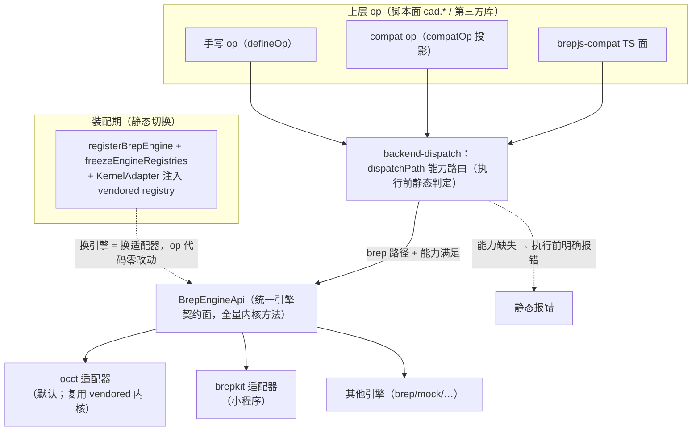

# Brep 引擎可切换性重构方案（op 静态切换 + 能力前置判定）

状态：方案（未实施）

日期：2026-09-23

## 0. 用户原始需求（原文）

> 我要求的是上层的 op 应该可以切换几何内核执行。这个切换指的是**静态的切换**。比如 web 到小程序，要换几何内核，不是动态切换。
>
> 如果底层的引擎 api 有缺失，应该是在**执行前就能发现**该 op 不支持，而不是尝试运行后报错。
>
> 根据我的这份要求，写一份架构重构的方案。

此前两轮的用户裁定（本方案的事实前提，不再重辩）：

> vendor 层绕过 BrepEngineApi 抽象、直接调用 occt-wasm 内核 API，**破坏了几何内核的可切换性**——违规。
>
> 你说的这些都是托辞。真正的架构要求是**可以切换几何内核**。

**范围裁定（2026-09-23，影响本方案边界）**：

> 这样，需求里写明，**mesh 绑定 manifold 没问题**。它很小，且不是 gpl 的，无限制。

即：可切换重构的对象是 **BREP 链**；**mesh 链绑定 manifold-3d 为既定架构决策**（体积小、Apache-2.0 宽松许可、无传染限制），不在本方案重构范围。回答"为什么是所有 BREP op、为什么排除 mesh op"：① 违规点（compat op 绕过抽象直调 occt 内核）只存在于 BREP 双链并存处，mesh 链无第二内核、无同构违规；② mesh 绑定 manifold 已被用户裁定为可接受，无需可切换。

---

## 1. 现状（全部以当前代码为准）

### 1.1 两条 BREP 链并存

| | 链 A：faijs 手写 op | 链 B：brepjs compat op |
|---|---|---|
| op 来源 | `defineOp({ mesh, brep })` | `compatOp(projectBrepOp(...))`，从 vendored brepjs 投影 |
| 数量 | 手写 op（`api/pattern.ts`、`api/boolean.ts`、`api/fillet.ts`、`api/chamfer.ts`、`api/sketch.ts` 等） | **36 个**：`api/generated/operations.ts` 16 + `topology.ts` 19 + `sketching.ts` 1 |
| 内核获取 | `getBackends().kernel.brep`（引擎注册表 `registerBrepEngine`，occt/brepkit/mock **可切换**） | vendored kernel registry 的 `getKernel()`（被 `bindOcctKernel()` **冻结绑定** occt-wasm 单实例） |
| 能力判定 | `defineOp` 声明 `capabilities` → `backend-dispatch` 能力路由 | **零声明**（见 P1）→ 能力路由盲区 |

> **计数口径（重要）**：compat op 数只能以 `api/surface/arg-spec.ts` 中 `kind: 'brep-op'` 的条目数为准，当前为 **36**。
> `grep 'compatOp(' api/generated/` 会得 72，是**双计**——`renderBrepOp`（`scripts/gen-l3-surface.ts:124-134`）为每个 op 同时产出一行 JSDoc（含 `compatOp(projectBrepOp(…))` 字样）和一行调用。
> 口径校验式：`grep -c 'export const \w* = compatOp(' api/generated/*.ts` 之和 == `kind === 'brep-op'` 条目数。

### 1.2 六个具体问题（2026-09-23 全仓核查证据）

- **P1 — compat op 零能力声明**：36 个 compat op，**0 处 `capabilities`**。生成模板 `renderBrepOp` 输出的 spec 只有 `{ name, naming }`（`gen-l3-surface.ts:130-133`）→ `dispatchPath` 的 `requiredCapability` 恒为 `undefined`，能力路由整个跳过。
  （附：`api/generated/kernel.ts` 与 `brepjs/index.ts` 里的 `capabilities` 命中是 `KernelCapabilities` 类型 re-export，不是 op 声明。）

- **P2 — 能力名缺两族**：`BrepCapabilityName`（`cad-runtime/backend-dispatch.ts:34`）= `'heal' | 'directEdit' | 'advSurface' | 'assembly' | 'meshLift' | BrepEvolutionKind`。
  - 缺 **pattern 族**：`linearPattern / circularPattern / gridPattern / rectangularPattern`；
  - 缺 **基础方法族**：裸 `mirror / rotate / translate / scale`，以及 `extrude / loft / makeRectangle / section / makeArcEdge / makeBezierEdge` 等非演化内核方法。
  两者都无处声明——即使想声明也表达不了。

- **P3 — 能力名语义冲突（红线级隐患）**：`BrepEvolutionKind`（`brep/engine/types.ts:168-184`）的 12 项是**短名**（`'fuse' | … | 'mirror' | 'rotate' | 'translate' | 'scale' | …`），语义为"本引擎提供 `*WithHistory` 核函数"（内核方法真名由 `${kind}WithHistory` 推导，见 `brep/engine/evolution-declaration.test.ts:48`）。
  而 compat op `cad.mirror`（`api/generated/topology.ts:285`）经 vendored 函数调用的是**裸 `kernel.mirror`**（无历史）。
  两族共用同一个字符串名 ⇒ `engineCapabilitySet` 把它们摊平进同一个 `Set<string>`，**无法区分"提供 `mirrorWithHistory`"与"提供 `mirror`"** ⇒ 一个只实现 `mirrorWithHistory` 的引擎会被判为具备 `mirror` 能力，静态判定放行、运行时崩。这正是 AGENTS.md 红线要消灭的形态。

- **P4 — BrepEngineApi 缺内核方法**：接口（`brep/engine/primitives.ts`，实测顶格方法签名下界 **83** 个）**无 pattern 方法**，也**无裸 `mirror`/`rotate`**（只有 `*WithHistory` 形态）。手写 `api/pattern.ts:56-58` 只能以 `(kernel as unknown as { linearPattern(...) }).linearPattern(...)` 强转调用——类型系统与 `_AssertSatisfiesBrepEngineApi` 编译期守卫全部失效。

- **P5 — vendored kernel registry 与引擎注册表脱钩**：`bindOcctKernel()`（`api/occt-kernel-bridge.ts:46-56`）执行 `registerKernel('occt-wasm', adapter)`，把 vendored registry 冻死绑定 occt-wasm 单实例；调用点见 `brep/engine/adapters/occt.ts:75`。它与 `registerBrepEngine` 当前激活引擎无关。**brepkit 装配环境下 compat op 执行时抛 "kernel not initialized"——运行时崩**，违反红线"BREP 路径抛异常 = 设计缺陷或 bug，必须直接报错暴露"。
  （命名消歧：仓库另有 `brep/handle-bridge.ts:31` 的 `getKernel()`，它读 `getBackends().kernel.brep`，是**可切换**的——本方案中一律写 `handle-bridge.getKernel()` 指它，写 `vendoredRegistry.getKernel()` 指被冻结的那个。）

- **P6 — brepkit 适配器能力子集 + 一处待验证前提**：`brepkit-kernel/brepkitKernel.ts` 实测 **24 处 `unsupported(...)`**，其中 `makeRectangle`（`:191`）、`extrude`（`:194`）、`loft`（`:195`）、`section`（`:202`）与 9 个 `*WithHistory` 方法，以及 `isValid`（`:483`）、`removeDegenerateEdges`（`:488`）等。
  **待验证前提**：本方案 Phase 2 需要"brepkit wasm 已导出 `linearPattern`/`circularPattern`/`gridPattern`/`mirror` 等内核函数"这一事实，但当前工作区**不存在 `packages/weapp/` 包**，无法复核。⇒ 本方案把它列为 **Phase 0 前置盘点**的产出物（见 §4），不得当作已验证前提直接开工。

### 1.3 后果

- 换引擎（web→小程序）= 静态切换只对链 A 生效；**链 B（36 个 compat op + brepjs-compat TS 面 + 依赖它们的第三方库）绑定 occt**，"引擎可切换"名不副实。
- brepkit 下 compat op 的失败形态是**运行时**（occt 未初始化 / 方法不存在），不是**执行前静态判定**——能力缺失无法被宿主在装配期发现。
- mesh 链（manifold 单链，`CsgBackend` 注入）不受以上问题影响，且按用户裁定不在重构范围。

---

## 2. 架构要求（本方案的验收标准）

适用边界：以下 R1–R4 仅约束 **BREP 链**（用户裁定：mesh 绑定 manifold 为既定决策，不在范围）。mesh op 维持现状：mesh 实现经 `CsgBackend`（`boolean/csg-backend.ts`，可注入 Inline/Worker 后端）→ `getManifoldModule()` 单例执行，不要求多引擎。

- **R1 静态切换（BREP）**：所有 BREP op（手写 + compat + 第三方库）**执行最终落在当前激活引擎上，op 代码不感知引擎身份**；web→小程序 = 装配期注册不同引擎（`registerBrepEngine`）+ 冻结（`freezeEngineRegistries`），**无运行期切换**。
- **R2 能力前置判定（BREP）**：op 静态声明所需能力（`capabilities`），引擎静态声明所提供能力（`BrepCapabilities`）；分派时 `backend-dispatch` 能力路由**全覆盖**，缺能力 → 执行前明确报错（静态报错），**禁止运行时尝试后崩**。
- **R3 既有红线不变**：静态规则执行前判定、无运行时 try-catch 回退；声明里少写一项 = 让该 op 静默通过静态判定后死在运行时（红线违规）。
- **R4 范围裁定**：mesh 绑定 manifold-3d 是既定架构决策（体积小、Apache-2.0、无 GPL 传染），**不纳入**引擎可切换重构；本方案任何改动不得破坏 mesh 单链路径。

---

## 3. 目标架构



要点：

1. **单链收敛**：compat op 不再依赖"vendored registry 冻结绑定 occt"，执行落在当前引擎上。机制见 Phase 2：装配期把"当前引擎的 `BrepEngineApi` 适配器"包装为 brepjs `KernelAdapter` 形态注册进 vendored registry（取代 `bindOcctKernel()` 的固定绑定），`vendoredRegistry.getKernel()` 返回当前引擎——**vendored 函数全部逻辑（命名/角色表/Result）原样保留、零改动**。
   语义与终态一致（同一判定、同一引擎、同一能力表），仅接线位置在装配期。occt 路径复用同一 occt-wasm 实例，D10 单实例约束不变。
2. **能力名分层**：能力名分三层，互不共用字符串：
   - 族级布尔位（5 项，保留，见 §5.3 缺口）；
   - `BrepEvolutionKind`（12 项）——值改为**内核方法真名**（`'fuseWithHistory'` … `'mirrorWithHistory'`），消除与基础方法的同名冲突；
   - `BrepMethodKind`（新增）——**非演化内核方法真名**（裸 `mirror`/`rotate`/`translate`/`scale`、pattern 族、`extrude`/`loft`/…）。
3. **能力声明全覆盖**：每个 brep-only op 的 `DualOpMeta.capabilities` 必须有声明且合法。
4. **静态判定唯一入口**：`backend-dispatch` 的能力路由是 op → 引擎的唯一决策点，**所有 op 都经过它**。

---

## 4. 分阶段改造

### Phase 0 — 前置盘点（产出可复核工件）

目标：把"哪些 op 需要哪些内核方法、哪些引擎提供哪些方法"从口头断言变成**入库的可执行工件**。

1. **compat op 盘点**：以 `api/surface/arg-spec.ts` 的 `kind: 'brep-op'` 条目为单一真源，逐条解析 `source`（如 `operations/api.js#extrude`）定位 vendored 函数，提取其中 `getKernel().<方法名>(` 的调用点，得到"op → 内核方法集合"。
   落地形式：**新增**脚本 `packages/core/scripts/gen-capability-map.ts`，输出 `packages/core/src/api/surface/capability-map.json`（入库），并由**新增**测试断言其与 `arg-spec.ts` 条目、与生成物 compat op 数三方一致。
2. **brepkit wasm 导出面盘点**：确认 brepkit wasm **实际导出**的内核函数清单（`linearPattern`/`circularPattern`/`gridPattern`/`rectangularPattern`/`mirror`/`rotate`/…）。**产物必须入库**（符号清单 JSON + 断言测试），不得以"某 build 目录里的 d.ts"为依据——当前工作区不存在该目录，该前提未经验证。
3. **产出能力映射表**（同时更新 `docs/ops-api-inventory.md`），列：op / vendored 函数 / 内核方法 / 能力名 / 归 `BrepEvolutionKind` 还是 `BrepMethodKind` / occt 是否实现 / brepkit 是否导出·是否接线。

工作量：中。产出是 Phase 1–3 的工作底表，**Phase 0 未完成不得进入 Phase 2**。

### Phase 1 — 能力名分层 + 声明机制补全（红线合规）

目标：brepkit 下所有 compat op 由"运行时崩"变为"执行前静态报错"。

1. **能力名真名化（消除 P3 冲突）**：
   - `brep/engine/types.ts` 的 `BrepEvolutionKind` 12 项改为内核方法真名：`'fuseWithHistory' | 'cutWithHistory' | 'intersectWithHistory' | 'filletWithHistory' | 'chamferWithHistory' | 'translateWithHistory' | 'rotateWithHistory' | 'mirrorWithHistory' | 'scaleWithHistory' | 'shellWithHistory' | 'offsetWithHistory' | 'thickenWithHistory'`。
   - `brep/engine/evolution-declaration.test.ts:48` 的 `methodOf = (kind) => \`${kind}WithHistory\`` 改为恒等（或删除并直接使用 kind）。
   - 同步更新声明点：`adapters/occt.ts:31-44`（12 项）、`adapters/brepkit.ts:41`（`['fuseWithHistory','cutWithHistory','filletWithHistory']`）、`adapters/brep-mock.ts`（如有）、手写 op `api/boolean.ts:128/158/184/213`、测试 `brep/engine/capability-routing.test.ts:42-46/62`、`api/internal/compat-op.test.ts:102/142`。
2. **新增基础方法族 `BrepMethodKind`**（`brep/engine/types.ts`）：
   - 初始项（Phase 0 盘点后补全）：`'mirror' | 'rotate' | 'translate' | 'scale' | 'linearPattern' | 'circularPattern' | 'gridPattern' | 'rectangularPattern' | 'makeRectangle' | 'extrude' | 'loft' | 'section' | 'makeArcEdge' | 'makeBezierEdge' | 'isValid' | 'removeDegenerateEdges' | 'importStl' | 'createXCAFDocument' | 'importXCAFFromSTEP'`；
   - `BrepCapabilities` 新增字段 `methods?: readonly BrepMethodKind[]`（逐核声明，不做族级布尔；空/缺省 = 一个都不提供）；
   - `backend-dispatch.ts`：`EngineCapabilitiesLike` 加 `methods?: readonly string[]`、`engineCapabilitySet` 展开该字段、`BrepCapabilityName` 联合加 `BrepMethodKind`。
3. **arg-spec 加列**：`api/surface/arg-spec.ts` 的 `ArgSpecEntry` 增加 `capabilities?: BrepCapabilityName[]`（`import type`，纯类型无运行时环）。为 **36** 条 `kind: 'brep-op'` 条目逐条填写（依据 Phase 0 的能力映射表）。
4. **生成器透传**：`scripts/gen-l3-surface.ts` 的 `renderBrepOp` 在 spec 里输出 `capabilities`（`compat-op.ts:193-204` 早已把 `spec.capabilities` 透传给 `defineOp`，本步只是**打开既有通道**）。生成文件禁手改；改后重跑生成并校验 diff 只含 `capabilities` 行。
5. **手写 op 补声明**：`api/pattern.ts` 的 `defineOp` 补 `capabilities: ['linearPattern']`（`api/boolean.ts` / `fillet.ts` / `chamfer.ts` / `sketch.ts` 已有声明，只随真名化改名）。
6. **断言测试（强制）**：
   - `kind: 'brep-op'` 条目数 == `arg-spec` 中**已声明 capabilities** 的条目数 == 生成物中 `export const X = compatOp(` 出现数（三方一致，防漏防漂移）；
   - 每条 compat op 的 `capabilities` 非空且每个名字都在 `BrepCapabilityName` 联合内；
   - 全部手写 brep-only op 同理。

工作量：中。涉及 `types.ts`、`backend-dispatch.ts`、`arg-spec.ts`、`gen-l3-surface.ts`、`api/pattern.ts`、4 处既有声明、3 个测试。

### Phase 2 — BrepEngineApi 扩展 + 适配器接线 + 内核获取收敛

目标：小程序（brepkit）获得与 occt 对等的关键 BREP 能力（pattern/mirror 等），且 compat op 执行落在当前引擎上。

1. **接口扩展**：`brep/engine/primitives.ts` 的 `BrepEngineApi` 增补 Phase 0 映射表中标注"occt ✓ / brepkit wasm 已导出"的方法。第一批：`linearPattern` / `circularPattern` / `gridPattern` / `rectangularPattern` / `mirror` / `rotate`（接口现有 `mirrorWithHistory`/`rotateWithHistory`，但 compat op 调的是**无历史基础方法**，需补基础方法）。
2. **occt 适配器实现**：`occt-kernel/`（`initOcctWasm` 返回面）补齐新方法——内部复用 vendored `occtWasmAdapter` 的对应实现（同一 occt-wasm 实例，D10 不变）。
3. **brepkit 适配器接线**：`brepkit-kernel/brepkitKernel.ts` 补齐新方法，调 brepkit wasm 已导出的内核函数；`adapters/brepkit.ts` 能力表同步逐核声明（`evolution` + `methods`），保持"声明=实现"诚实原则。wasm 未导出的方法保持 `unsupported(...)` 且**不在能力表声明**（静态判定兜底），**不伪造**。
4. **手写 op 撤强转**：`api/pattern.ts` 的 `as unknown as` 强转改为调正式接口方法。
5. **compat op 内核获取收敛（适配器注入）**：
   - 装配期把"当前引擎的 `BrepEngineApi` 适配器"包装为 brepjs `KernelAdapter` 形态，注册进 vendored registry（取代 `bindOcctKernel()` 的固定绑定），使 `vendoredRegistry.getKernel()` 返回当前引擎；
   - `api/internal/compat-projection.ts:38-51` 的 `assertKernelBound` 判据同步更新为"当前引擎已注册"，`isOcctKernelBound()` 相应更名/替换为引擎中立判据；
   - **装配期完整性检查（必须）**：`KernelAdapter` 是 211 方法大接口，缺失方法**不全是"能力方法"**——vendored 面大量**辅助构造方法**（`vendored/brepjs/core/kernelBoundary.ts` 的 `getKernel().createVector3d / createPoint3d / createDirection3d / createAxis1 / createAxis2 / createAxis3` 等）任何 compat op 都可能触发，且**不落在能力名体系内、无法由 op 声明覆盖**。⇒ 装配期必须断言 KernelAdapter 的必备胶水方法齐备，缺失则在**装配期**报错（而非执行期崩）；该清单由 Phase 0 盘点产出并入库为测试。
6. **测试**：
   - 编译期：`_AssertSatisfiesBrepEngineApi` 对 occt 与 brepkit 均通过（未实现的方法显式 `unsupported`，且不在能力表声明）；
   - 功能：occt 与 brepkit 双引擎下 `linearPattern`/`circularPattern`/`mirror` 的 parity 测试（有实现的能力）；
   - 静态判定：brepkit 下未实现能力（如 `chamfer`）与未接线能力 → 执行前明确报错（含 `brepEngineId` + 缺失能力名）；
   - 装配期完整性：KernelAdapter 缺胶水方法 → 装配期报错。

工作量：大。涉及 `primitives.ts`、`occt-kernel/`、`brepkit-kernel/`、`adapters/brepkit.ts`、`adapters/occt.ts`、`occt-kernel-bridge.ts`、`compat-projection.ts`、`api/pattern.ts`、parity 测试。

### Phase 3 — 全量收敛（任意 op、任意内核）

目标：把 Phase 0 盘点出的**全部** vendored 内核方法登记进 `BrepEngineApi` 与 `BrepMethodKind`，使 36 个 compat op + brepjs-compat TS 面在任一已注册引擎下可用或**静态**报不支持——彻底消除"两条链"。

- 以 Phase 0 的能力映射表为工作底表，逐方法补齐接口、两适配器实现/声明、测试；
- brepkit 侧：wasm 无对应内核函数的能力保持 `unsupported` 且能力表不声明（静态判定兜底），**不伪造**。

工作量：大（vendored 内核方法数百）。按能力族拆子阶段滚动推进（pattern → 构形 → 修复/查询 → 装配 → 其余）。

### Phase 4 — 文档与门禁

- `docs/api-contract.md` §7：compat op 与手写 op 统一经 `BrepEngineApi` + 能力声明；记录静态切换（装配期换引擎）、能力前置判定语义、能力名三层结构（族级布尔 / `*WithHistory` 真名 / 基础方法真名）；
- `docs/ops-api-inventory.md`：能力声明列（来自 Phase 0 的能力映射表）；
- Agent Note（`.agents/notes/`）：记录"两链收敛 + 能力名分层"决策（非平凡架构变更）；
- 门禁：`npm run doc-sync`（12 项）、`scripts/ci.ps1` 全绿。

---

## 5. 明确的设计选择、风险与已知缺口

### 5.1 已确定的设计选择（实施时无需再裁决）

| 选择 | 决定 | 理由 |
|---|---|---|
| compat op 内核获取 | **装配期适配器注入**（把当前引擎的 `BrepEngineApi` 适配器包装为 `KernelAdapter` 注册进 vendored registry） | vendored 函数的内核调用与结果组装/命名逻辑一体（如 `linearPattern` 的 `replica[k]` 角色回投、Result 语义、keep 处理），在 faijs 侧复制这套逻辑会造成双份维护并丢失命名资产；注入方案让 vendored 函数零改动（保 D3） |
| 能力名分层 | `BrepEvolutionKind` 真名化 + 新增 `BrepMethodKind` | 别名制无解：`'mirror'` 一个字符串无法同时表示"提供 `mirrorWithHistory`"与"提供 `mirror`"，两族必须分名（P3） |
| 缺能力时的错误归类 | **保持 `dispatchPath` 现有分派语义**（不改行为） | Phase 1 的目标是"让缺失**可被静态发现**"，不是改变错误归类。改动 auto 降级语义会牵连既有测试与宿主行为，超出本方案范围 |

### 5.2 缺能力时的实际报错形态（实施与断言必须按此写）

`backend-dispatch.ts:137-163` 两种模式行为不同，**断言不得混用**：

| mode | 场景 | 结果 |
|---|---|---|
| `'brep'` | 无 brep 实现 / 输入不在链上 / 缺能力 | `BrepUnsupportedError`，消息含 `E_BREP_UNSUPPORTED` |
| `'auto'`（**缺省**，`CadRuntime` 构造 `mode = 'auto'`，`runtime.ts:460`） | 缺能力且**有** mesh 实现 | 静态降级走 mesh |
| `'auto'` | 缺能力且**无** mesh 实现（compat op 即此情形） | `MeshUnsupportedError`，消息含 `E_MESH_UNSUPPORTED: current engine lacks capability '<name>' and function has no mesh implementation` |

既有测试已钉住该行为（`define-op.test.ts:103`、`brep/engine/capability-routing.test.ts:42-54`）。⇒ compat op 在缺省 auto 模式下抛的是 `E_MESH_UNSUPPORTED`。

### 5.3 已知缺口（不在本期范围，须保留记录）

- **族级布尔位残留多报风险**：`BrepCapabilities` 的 `heal` / `directEdit` / `advSurface` / `assembly` / `meshLift` 仍是**族级布尔**（`types.ts:200-224`）。`types.ts:151-167` 已论证"族级布尔的后果是多报"并据此把 `evolution` 逐核化，但这 5 位未处理。
  现实风险一例：brepkit 声明 `heal: true`（`adapters/brepkit.ts:42`），而 heal 族的 `isValid`（`brepkitKernel.ts:483`）、`removeDegenerateEdges`（`:488`）是 `unsupported(...)`。
  处理路径：Phase 1 引入的 `methods` 字段已铺好逐核化通道（把族内方法登记进 `methods`、能力位由布尔改名单），Phase 3 可一并推进。**本期不扩大范围，但缺口必须显式保留。**
- **`disposalModel` 未并入 `BrepCapabilities`**（D5 既有决策）：faijs 句柄释放由 `cad-runtime` 顶替释放统一编排，不作为能力位。

---

## 6. 验收判据（清单）

1. **静态切换**：同一 op 在 occt 装配与 brepkit 装配下走同一套判定/执行路径；装配期换引擎后 op 代码零改动。
2. **能力前置判定**：装配 brepkit 后，未实现能力（如 `chamfer`）与未接线能力 → **执行前**明确报错（含 `brepEngineId` + 缺失能力名），错误码按 §5.2 的表（`brep` 模式 `E_BREP_UNSUPPORTED`；缺省 auto 且 op 为 brep-only 时 `E_MESH_UNSUPPORTED`）；全仓无"运行时 kernel not initialized / 方法不存在"泄漏（grep 断言 + 测试）。
3. **声明全覆盖**：36 个 compat op（`kind: 'brep-op'` 条目数）+ 手写 brep-only op 的 `capabilities` 100% 非空、合法；断言以 `arg-spec.ts` 为单一真源，**不得写死数字**。
4. **守卫生效**：`_AssertSatisfiesBrepEngineApi` 对 occt 与 brepkit 均通过。
5. **装配期完整性**：KernelAdapter 必备胶水方法缺失 → 装配期报错（非执行期）。
6. **parity 回归**：occt 下既有行为不变，`scripts/ci.ps1` 全绿；Phase 2 后 occt/brepkit 的 pattern/mirror parity 通过。
7. **文档**：`api-contract` / `inventory` 更新，`npm run doc-sync` 通过，Agent Note 落地。

---

## 7. 与并行工作的衔接

- **扩展库化（`@faicad/faijs-editor`）**：独立，互不阻塞；本方案只改 core 引擎面。
- **three.js 剥离（调研）**：独立；网格层与 BREP 引擎面正交。
- **weapp 宿主**：本方案 Phase 2 是 weapp 获得 pattern/mirror 能力的前提；Phase 0 的 brepkit wasm 导出面盘点是 weapp 能力的**事实基线**（当前工作区无 `packages/weapp/`，故必须由 Phase 0 建立）。
- **mesh 链**：不参与本方案（用户裁定绑定 manifold 为既定决策）。weapp 下 mesh 若需运行，沿用 `CsgBackend` 注入路径；若 manifold 无法在小程序环境运行，属 weapp 实施问题，另行评估，不改变本方案的 BREP 重构边界。

---

## 8. 实施交接清单（第三方 agent 直接执行）

### 8.1 分阶段进入条件（缺一不可）

| 阶段 | 进入条件 | 完成判据 |
|---|---|---|
| Phase 0 | 无 | `capability-map.json` 入库 + 三方一致断言测试通过 + brepkit wasm 导出面清单入库 |
| Phase 1 | Phase 0 完成 | 能力名分层落地 + 36 条 compat op 全部声明 + 断言测试通过 + occt 全量测试不变 |
| Phase 2 | Phase 1 完成 **且** Phase 0 证明 brepkit 已导出首批方法 | 接口扩展 + 双适配器接线 + 注入式内核获取 + 装配期完整性检查 + parity 通过 |
| Phase 3 | Phase 2 完成 | 映射表全量登记，or 静态报不支持 |
| Phase 4 | 全阶段完成 | doc-sync + ci.ps1 全绿 + Agent Note 落地 |

### 8.2 逐文件改动清单（Phase 1，可直接照做）

| 文件 | 改动 |
|---|---|
| `packages/core/src/brep/engine/types.ts` | `BrepEvolutionKind` 12 项改为 `*WithHistory` 真名；新增 `BrepMethodKind`；`BrepCapabilities` 加 `methods?: readonly BrepMethodKind[]` |
| `packages/core/src/cad-runtime/backend-dispatch.ts` | 第 26-34 行注释与 `BrepCapabilityName` 联合加 `BrepMethodKind`；`EngineCapabilitiesLike` 加 `methods?: readonly string[]`；`engineCapabilitySet` 展开 `caps.methods` |
| `packages/core/src/brep/engine/evolution-declaration.test.ts` | `methodOf`（第 48 行）改恒等；`OCCT_EXPECTED`（第 32 行）改真名 |
| `packages/core/src/brep/engine/adapters/occt.ts` | `OCCT_EVOLUTION_KINDS`（第 31-44 行）改真名 |
| `packages/core/src/brep/engine/adapters/brepkit.ts` | `evolution`（第 41 行）改 `['fuseWithHistory','cutWithHistory','filletWithHistory']`；按 Phase 0 结论补 `methods` |
| `packages/core/src/brep/engine/adapters/brep-mock.ts` | capabilities 为空（`capability-routing.test.ts:36-40` 已把"该引擎无 evolution 能力"作为测试前提），无需改动 |
| `packages/core/src/brep/engine/capability-routing.test.ts` | 第 42-46 行 `'fuse'` → `'fuseWithHistory'`；第 62 行注释同步 |
| `packages/core/src/api/internal/compat-op.test.ts` | 第 102/142 行 `['cut']` → `['cutWithHistory']` |
| `packages/core/src/api/boolean.ts` | 第 128/158/184/213 行 `'fuse'/'cut'/'intersect'` → 真名 |
| `packages/core/src/api/surface/arg-spec.ts` | `ArgSpecEntry` 加 `capabilities?: BrepCapabilityName[]`；36 条 `kind: 'brep-op'` 条目逐条填写 |
| `packages/core/scripts/gen-l3-surface.ts` | `renderBrepOp`（第 124-134 行）spec 输出加 `capabilities` |
| `packages/core/src/api/pattern.ts` | `defineOp` 补 `capabilities: ['linearPattern']` |
| 新增测试 | 三方一致断言（arg-spec 条目 ↔ 声明非空 ↔ 生成物 compat op 数）+ 能力名合法性断言 |

### 8.3 命令与门禁

```bash
# 生成（改 arg-spec / 生成器后必跑）
npx tsx packages/core/scripts/gen-l3-surface.ts

# 口径自检（Phase 0/1 均用）
grep -c 'export const [A-Za-z]* = compatOp(' packages/core/src/api/generated/*.ts
grep -c "kind: 'brep-op'" packages/core/src/api/surface/arg-spec.ts

# 单包测试（按 AGENTS.md：先跑自己写的，再跑受影响的，最后才 CI）
npm run test -w @faicad/faijs

# 全量 CI（只在上述全绿后跑一次）
pwsh -NoProfile scripts/ci.ps1

# 文档门禁
npm run doc-sync
```

### 8.4 完成定义（DoD）

1. Phase 0–4 全部完成判据满足（§8.1 表）；
2. `scripts/ci.ps1` 全绿；
3. 无任何"运行时 kernel not initialized / 方法不存在"的失败形态残留（grep + 测试双证）；
4. 新增/更新 Agent Note 与 `docs/api-contract.md` / `docs/ops-api-inventory.md`；
5. 交付说明中逐条对照 §6 验收判据给出证据（命令 + 输出）。
