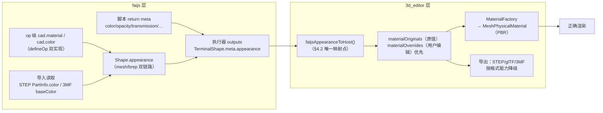

# 2026-10-04 faijs PBR 外观（颜色/材质/透明度）API 设计

状态：**已废弃**（2026-10-05，用户要求完全重新设计：删除兼容存量条款、外观设置不属 op、改为 `box1.set...` 方法写法、导入导出按已有规范。替代方案见 [2026-10-05-faijs-pbr-appearance-api-design.md](./2026-10-05-faijs-pbr-appearance-api-design.md)）
作者：MainAgent（会话调研结论整理）

## 0. 用户原话（最高优先级，直接引用）

> 请调研cadquery 如何给模型设置颜色和材质，如何导出gltf

> 请了解../3d_editor项目是如何实现pbr渲染的，以及如何设计faijs模型的pbr相关的api，能够给模型设置颜色、材质、透明度等，然后可以在编辑器里正确渲染

需求拆解（本文档的验收锚点）：

1. faijs 模型**能设置颜色、材质、透明度**（用户点名三要素，材质为 PBR 语义）。
2. 设置结果能在 **3d_editor 里正确渲染**（走编辑器已有的 PBR 渲染管线）。
3. 设计为 **API 方案**（本文档只做方案，不实施；除非用户明确说开始实施）。

## 1. 背景与目标

faijs 目前对「外观」（颜色/材质/透明度）只有两条半途：脚本 `return` 元数据携带 `color/metalness/roughness` 三个字段（`lang/types.ts` 的 `ScriptMetaIR.appearance`），以及 STEP/3MF 导入时**读取**颜色（`occt-kernel` 的 `PartInfo.color`、`mesh/threemf-loader` 的 `baseColor/vertexColors`）。**没有任何「设置」外观的 API**，没有透明度，没有完整 PBR 参数，mesh 数据结构（`Shape = { positions, indices }`）不携带外观；编辑器 STEP 导入路径还会把颜色丢掉。

本方案定义：

- faijs 侧权威的**外观规格类型**（引擎无关、可序列化、可重放）；
- 三层 API 形态（op 级 / 叶子 return meta 级 / 面级 Phase 2）；
- 双链路（mesh/brep）下的数据模型与实现路径；
- 与 3d_editor 渲染管线（`MaterialAppearance` → `MeshPhysicalMaterial`）的对接；
- 导出（STEP/glTF/3MF）能力矩阵；
- 分阶段实施计划与验收标准。

## 2. 现状调研结论（本次会话实测源码，非猜测）

### 2.1 3d_editor 的 PBR 渲染实现（`C:\my\Faicad\3d_editor`）

| 层 | 位置 | 结论 |
|---|---|---|
| 渲染器 | `packages/app/src/engine/EngineManager.ts` | Three.js `WebGLRenderer`，`outputColorSpace = SRGBColorSpace`，`toneMapping = ACESFilmicToneMapping`，exposure 1.0 |
| 环境 | `packages/app/src/engine/environment/EnvironmentManager.ts` | PMREMGenerator 生成 `scene.environment`（IBL） |
| 后处理 | `packages/app/src/engine/composer/AdaptiveComposer.ts` | post-processing 色调映射（NEUTRAL/ACES_FILMIC/LINEAR） |
| 材质类 | `packages/app/src/engine/material/MaterialFactory.ts` | `MaterialAppearance` → `THREE.MeshPhysicalMaterial`（含 TextureCache 纹理解析） |
| 外观描述符 | `packages/shared/src/types.ts` `MaterialAppearance` | **29 字段**：color(sRGB RGBA 0–1)、map/metalness/roughness/normal/ao、emissive(+intensity)、transmission/thickness/ior/attenuation、clearcoat(+roughness)、sheen、anisotropy、specular、envMapIntensity、alphaMode(OPAQUE/MASK/BLEND)/alphaCutoff、doubleSided、unlit |
| 材质状态 | `packages/app/src/stores/core/material-store.ts` | `materialOverrides`（用户编辑，scopedId 键）+ `materialOriginals`（文件/脚本原值）+ `defaultMaterial`；`MaterialEditor.tsx` 编辑 override |
| 脚本→材质 | `packages/app/src/engine/script-engine/executeScript.ts:276` → `scene-mutator.ts` `buildAppearance()` | 目前只消费 `meta.appearance.{color,metalness,roughness}`（hex → sRGB RGBA，默认 metalness 0.3 / roughness 0.6），写入 `materialOverrides` |
| 3MF 导入 | `packages/app/src/engine/formatLoaders.ts` `buildGroupFromArchive()` | 3MF baseColor → `MeshPhongMaterial`，colorgroup → vertexColors（Phong，非 PBR） |
| STEP 导入 | `formatLoaders.ts` STEP 分支 | `loadBrep` 单 compound，**丢弃 PartInfo.color**，未建材质 |
| 3MF 导出 | `packages/app/src/engine/exporters/three-mf-exporter.ts` | 从 `mesh.material.color` 提取，按颜色去重生成 `<basematerials>`，仅颜色 |

结论：3d_editor 是**完整 PBR 渲染管线**，且外观描述符（`MaterialAppearance`）已经覆盖 PBR 全参数。缺口在**上游数据源**：脚本/导入只提供最多 3 个字段。

### 2.2 faijs 现有颜色/材质能力（`C:\my\Faicad\faijs`）

| 项 | 位置 | 现状 |
|---|---|---|
| 网格 Shape | `packages/core/src/mesh/types.ts` | `{ positions, indices }`，**无外观字段** |
| 脚本 return meta | `packages/core/src/lang/metadata-extractor.ts:1056-1071` | 解析 `return { shape, name, color, metalness, roughness }`；`ScriptMetaIR.appearance` 仅 3 字段（`lang/types.ts:53`） |
| STEP 颜色读取 | `packages/core/src/occt-kernel/stepColorParser.ts` + `occtKernel.ts` | XCAF label 颜色 + `STYLED_ITEM` 引用链 fallback → `PartInfo.color [r,g,b] 0-1 \| null` |
| 3MF 颜色读取 | `packages/core/src/mesh/threemf-loader.ts` | `ThreemfObject.baseColor`（sRGB）+ `vertexColors`（colorgroup）+ 逐三角形 pid/p1..p3 |
| 装配成员颜色 | `packages/core/src/node-host/cli.ts` | `behavior.memberColors`（导出 STEP 时保留） |
| op 定义机制 | `packages/core/src/define-op.ts` `defineOp` | 双实现（mesh/brep）声明 + schema/capabilities/outputs，静态分派、无运行时回退 |
| cad 命名空间 | `packages/core/src/api/api-namespace.ts` `createApiNamespace()` | 平台面 op 装配点；K5 约束（引擎零函数知识，统一以 defineOp 元数据承载） |
| 上游兼容面 | `packages/core/src/api/surface/arg-spec.ts:2909+`、`upstream-surface.json` | brepjs 上游 `topology/metadata/colorFns.js` 有 `Color/ColorInput/colorShape/colorFaces/getShapeColor/getFaceColor`，**均被 skip**（faijs 未实现） |
| 容器 schema | `docs/plans/2026-10-03-fai-zip-third-party-sdk-and-viewer-plan.md` §3.2 | `FaiViewerMesh.appearance?: unknown // 材质等外观元数据（由宿主定义）`——**槽位已预留，类型待定义** |
| glTF 导出 | `docs/plans/2026-10-03-cadquery-full-port-roadmap.md` §2.3 | 曾以「没有需求」排除 GLTF/VTK/VRML 导出器；备注 `occt-wasm` 有 `XAFDocument.exportGLTF()`。**本次需求改变了该前提**（至少「带外观的看图/发布导出」有需求） |

### 2.3 现状缺口清单

1. faijs 无「设置」外观的 API（只有读取侧）。
2. 无透明度/alpha、无 PBR 材质参数（transmission/clearcoat/emissive/sheen/anisotropy/specular/纹理）。
3. `Shape` 不携带外观，mesh/brep 双链路产物都不自解释。
4. 编辑器 STEP 导入丢色；`materialOriginals` 生产代码无写入方（仅测试赋值）。
5. 脚本外观只写 `materialOverrides`（与用户手动编辑同层，语义未区分「原值/覆盖」）。
6. 导出侧：3MF 仅颜色；glTF/STEP 无 faijs 侧写路径。

## 3. 设计约束与原则

1. **K5**：新 op 一律走 `defineOp` 声明 + `createApiNamespace()` 装配，引擎（parser/compile/runtime）不对函数名特判。平台面放 core `cad` 命名空间；`fai_*` 编辑器专属扩展仍走 `@faicad/faijs-extra`（本方案不涉及扩展库）。
2. **双实现、无回退**：外观是**纯元数据操作**（不改几何），mesh 链与 brep 链都实现「附加外观」；执行前静态判定路径，无运行时 try-catch 回退。
3. **一个事实一个家**：外观规格的权威类型在 faijs（引擎无关、可序列化）；3d_editor 的 `MaterialAppearance` 是宿主渲染实现细节，faijs 不依赖它；宿主负责双向映射。
4. **确定性/可重放**：外观随脚本语句确定，重放产生相同外观；编辑器手动 override 是宿主层叠加，不污染脚本原值。
5. **兼容存量**：现有 `return { shape, color, metalness, roughness }` 与 `ScriptMetaIR.appearance` 语义不变、继续有效；新字段是纯增量。
6. **宽容兼容外部数据**：STEP/3MF 读入的颜色是「原值」，任何合法值都接受（3MF hex、STEP STYLED_ITEM 链）；内部 API 参数校验严格但对外部文件不设严格性拒收。
7. **单位与坐标系约定**（`docs/api-contract.md`）：mm、+Z 向上、角度度；颜色 sRGB、分量 0–1（hex 兼容）。
8. **方案边界**：本文档只设计 API/数据模型/对接/导出映射，不实施。纹理资产引用复用 faijs 现有 `asset` 机制（`api/asset.ts`），不新造资产通道。

## 4. PBR 外观规格（faijs 侧权威类型）

### 4.1 `PbrAppearance`（草案，`packages/core/src/api/appearance.ts`）

```ts
/** 颜色：CSS 命名色 / #rrggbb / #rrggbbaa / [r,g,b]（sRGB 0–1）。 */
export type PbrColor = string | [number, number, number]

/** glTF 透明度约定（与 3d_editor MaterialAppearance.alphaMode 对齐）。 */
export type PbrAlphaMode = 'OPAQUE' | 'MASK' | 'BLEND'

/**
 * faijs PBR 外观规格 —— 引擎无关、JSON 可序列化、随 Shape 走双链路。
 * 全字段可选：未设置字段 = 继承上游 / 宿主默认，不隐式清零。
 */
export interface PbrAppearance {
  /** 基色。字符串支持 CSS 命名色与 hex（#rrggbb / #rrggbbaa），aa 分量映射 opacity。 */
  color?: PbrColor
  /** 透明度 0–1（权威字段）。color 的 aa 分量等价于 opacity；并存时 opacity 优先。 */
  opacity?: number
  /** 金属度 0–1；粗糙度 0–1。 */
  metalness?: number
  roughness?: number

  /** 自发光：颜色 + 强度（>0 时启用，默认 1）。 */
  emissive?: [number, number, number]
  emissiveIntensity?: number

  /** 透射/玻璃（对应 MeshPhysicalMaterial.transmission 族）。 */
  transmission?: number
  thickness?: number
  ior?: number
  attenuationColor?: [number, number, number]
  attenuationDistance?: number

  /** 清漆（车漆/釉面）。 */
  clearcoat?: number
  clearcoatRoughness?: number

  /** 织物/丝绒。 */
  sheen?: number
  sheenColor?: [number, number, number]
  sheenRoughness?: number

  /** 拉丝金属。 */
  anisotropy?: number
  anisotropyRotation?: number

  /** 高光工作流（替代 metalness 工作流）。 */
  specularIntensity?: number
  specularColor?: [number, number, number]

  /** 环境光强度（IBL 贡献）。 */
  envMapIntensity?: number

  /** 透明度模式：默认 OPAQUE；opacity<1 未显式指定时宿主按 BLEND 处理。 */
  alphaMode?: PbrAlphaMode
  alphaCutoff?: number
  /** 双面渲染（薄壁/开口面）。 */
  doubleSided?: boolean
  /** 无光照（unlit，自发光贴图类）。 */
  unlit?: boolean
}

/** 当前 return-meta 子集（lang/types.ts ScriptMetaIR.appearance 的增量扩展，见 §5.2）。 */
export type ScriptAppearance = Pick<
  PbrAppearance,
  'color' | 'metalness' | 'roughness' | 'opacity' | 'emissive' | 'emissiveIntensity' |
  'transmission' | 'ior' | 'thickness' | 'clearcoat' | 'clearcoatRoughness' |
  'alphaMode' | 'alphaCutoff' | 'doubleSided' | 'unlit'
>
```

要点：

- **可选全字段、不做默认值清零**：`material` 只写用户指定的字段；未指定字段由宿主用其默认材质参数补全（3d_editor `defaultMaterial`）。这保证「设了颜色就只改颜色」的直觉，且与现有 `meta.appearance` 语义一致。
- `opacity` 是透明度的**唯一权威字段**（`color` 只存 RGB；hex 的 aa 分量是便捷写法，转换层归一为 `opacity`）。
- `alphaMode` 直接对齐 glTF 语义与编辑器 `MaterialAppearance.alphaMode`，避免三次映射失真。

### 4.2 与 3d_editor `MaterialAppearance` / glTF PBR 的映射（宿主转换层契约）

| faijs `PbrAppearance` | 3d_editor `MaterialAppearance` | glTF 2.0 PBR |
|---|---|---|
| `color` + `opacity` | `color: [r,g,b,opacity]` | `baseColorFactor` + `alphaMode`（`opacity<1`→`BLEND`；`alphaMode='MASK'`→`MASK`+`alphaCutoff`） |
| `metalness` / `roughness` | 同名 | `metallicFactor` / `roughnessFactor` |
| `emissive` / `emissiveIntensity` | 同名 | `emissiveFactor`（×intensity 需导出方换算或宿主烘焙） |
| `transmission/thickness/ior/attenuation*` | 同名 | **OCCT glTF 导出不支持**，仅编辑器内渲染；导出降级（见 §8） |
| `clearcoat/clearcoatRoughness` | 同名 | 同上，仅编辑器内 |
| `sheen*` / `anisotropy*` / `specular*` | 同名 | 同上，仅编辑器内 |
| `envMapIntensity` | 同名 | 仅编辑器内（IBL 强度，非 glTF 标准） |
| `alphaMode/alphaCutoff` | 同名 | 映射 |
| `doubleSided` | 同名 | `doubleSided` |
| `unlit` | 同名 | 编辑器内（KHR_materials_unlit 可选） |

> 映射规则明确：**PBR 全参数在编辑器内正确渲染；跨格式导出按目标格式能力降级**（颜色+金属/粗糙+alpha 是 glTF/3MF/STEP 的公共子集）。

## 5. API 设计

### 5.1 op 级（主 API，双实现）

注册进 `createApiNamespace()` 的两个 op：

```ts
// cad.material(shape, spec) —— 返回「附加了外观的新 shape」，几何不变
declare function material(shape: Shape, spec: PbrAppearance): Promise<Shape>

// cad.color(shape, color) —— 便捷 op，等价 material(shape, { color })
declare function color(shape: Shape, color: PbrColor): Promise<Shape>
```

- 均走 `defineOp({ mesh, brep })`：mesh 实现与 brep 实现都是「复制引用 + 附加外观」，不改几何、不触发网格重建/布尔。
- 返回**新 Shape 对象**（不可变风格，与现有 op 一致），原 shape 不受影响。
- 名称选择说明：`material` 与 `color` 与上游 brepjs `colorFns` 的命名族（`Color`/`colorShape`/`colorFaces`）语义同源、词形更短；面级 op 用 `colorFaces`/`materialFaces` 直接对齐上游（见 §5.3），为未来 compat 投影留同名（当前 surface 的 skip 项可逐步改为投影）。
- 不支持在 `material` 之后再次 `material` 覆盖？**支持**：后写覆盖前写（合并语义，`{...a, ...b}`，undefined 字段保留旧值）。

### 5.2 叶子级：`return` meta 扩展（零新语法）

扩展现有 `metadata-extractor.ts` 的 return 对象解析，接受 `ScriptAppearance` 子集字段（§4.1）：

```js
// 现状（继续有效）
return { shape: part0, name: 'Box', color: '#e53935', metalness: 0.1, roughness: 0.4 }

// 新增
return { shape: part0, name: 'Box', color: '#e53935', opacity: 0.6, emissive: [1, 0.2, 0], emissiveIntensity: 2 }
```

- `ScriptMetaIR.appearance` 类型同步扩展（`lang/types.ts`），新增字段全部可选。
- 解析实现：`parseReturnStatement` 的 key 分支从 3 个扩到 `ScriptAppearance` 全集；数组字面量（`emissive: [1,0,0]`）需新增 Literal-array 解析分支。
- **与 op 级的关系**：return meta 是叶子终端的快捷投影，op 级用于链中间/面级；两者合并时以 op 结果为准（op 更靠近几何产物）。

### 5.3 面级（Phase 2，预留设计）

```ts
// cad.colorFaces(shape, faces, color)     —— 对指定面设颜色
// cad.materialFaces(shape, faces, spec)   —— 对指定面设外观
declare function colorFaces(shape: Shape, faces: number[], color: PbrColor): Promise<Shape>
```

- `faces` 为**面序号数组**（brep 面序，契约见 `docs/api-contract.md` 的面序约定；上游 `colorFaces` 同语义）。
- **双链路实现差异是设计重点**（Phase 2 再定稿）：
  - brep 链：XCAF label 级颜色天然支持（`setColor` per face）。
  - mesh 链：需要「面序号 → 三角形组」的稳定映射——现状 mesh 三角化不保留面序，需在网格化阶段记录 face ordinal 到三角形的分组索引，或按组拆分几何。此为本方案唯一需要内核配合的项，故排 Phase 2。
- 面级不与 §5.1/§5.2 冲突：形状级外观 = 默认，面级 = 覆盖。

### 5.4 语法示例（写给使用者的形态）

```js
// 简单着色
const box = cad.box(10, 20, 30)
const red = cad.color(box, '#e53935')
return { shape: red, name: 'Red Box' }

// PBR 金属
const knob = cad.cylinder(8, 20)
const brushed = cad.material(knob, {
  color: [0.85, 0.85, 0.88],
  metalness: 1, roughness: 0.35,
  anisotropy: 0.6, anisotropyRotation: 0.3,
})
return { shape: brushed, name: 'Knob' }

// 玻璃（透明度）
const lens = cad.material(cad.sphere(5), {
  color: [0.9, 0.95, 1],
  transmission: 1, ior: 1.5, thickness: 10,
  opacity: 0.9,
})
return { shape: lens, name: 'Lens' }

// 叶子快捷（等价上面的 return meta 写法）
return { shape: lens, name: 'Lens', color: '#e6f2ff', opacity: 0.9, transmission: 1, ior: 1.5 }
```

## 6. 数据模型与双链路

### 6.1 `Shape` 扩展

```ts
// packages/core/src/mesh/types.ts
export interface Shape {
  positions: Float32Array
  indices: Uint32Array
  /** 可选：形状级外观（双链路产物自解释）。缺省 undefined = 无外观。 */
  appearance?: PbrAppearance
  /** Phase 2：多材质分组 [三角形起始, 数量, 外观]，缺省 undefined。 */
  materialGroups?: Array<{ start: number; count: number; appearance: PbrAppearance }>
}
```

- 纯增量、向后兼容（`isMeshShape` 鸭子判定不受影响）。
- `appearance` 只挂叶子产物即可；中间 shape 携带也不禁止（后置 op 合并语义）。

### 6.2 mesh 路径

- `material`/`color` 的 mesh 实现：`{ ...shape, appearance: merge(shape.appearance, spec) }`（浅拷贝 + 合并），零几何成本。
- 渲染消费：编辑器把 `shape.appearance` 经 §4.2 映射转 `MaterialAppearance`，复用 `MaterialFactory`。
- Phase 2 `materialGroups`：编辑器按组拆 `THREE.Mesh` 或多个 materialIndex，走 `THREE.Mesh` 多材质；`materialGroups` 存在时忽略 `appearance`（或作为未分组三角形的默认）。

### 6.3 brep 路径（XCAF）

- `material`/`color` 的 brep 实现：把 `PbrAppearance` 附加到 brep product 的元数据槽（与现有 `occt-kernel` 读取侧对称的**写侧**：label color 写入 XCAF `setColor`；材质写入 `XCAFDoc_VisMaterial` 可写字段）。
- 网格化输出：brep → mesh 的产物把 brep 外观同步到 `Shape.appearance`（当前 `brep/` 网格化已有产物构造点，增量一行）。
- 导出：XCAF 颜色/材质 → STEP（颜色）与 glTF（PBR 子集）由 occt 写侧承担（§8）。

### 6.4 与 fai.zip / viewer 对齐

`@faicad/faijs-viewer` 的 `FaiViewerMesh.appearance?: unknown` 槽位由本方案的 `PbrAppearance` 补全类型（viewer 包 `appearance?: PbrAppearance`）；3d_editor 以外的第三方宿主按同一类型消费，保证「任何宿主都能正确渲染」。

## 7. 编辑器对接（3d_editor 改动点，供实施阶段参照）



### 7.1 脚本路径

1. `executeScript.ts` 的 `appearanceOverride` 来源从 `ts.meta?.appearance` 扩展为「`outputs[i].appearance`（op 产物）优先，回退 `ts.meta?.appearance`」。
2. `scene-mutator.ts` `buildAppearance()` 从 3 字段版升级为 §4.2 全映射（`faijsAppearanceToHost()`，放 `lib/` 或 `engine/material/`，供三处复用）。
3. **语义修正（现状缺口 5）**：脚本/形状外观应写入 `materialOriginals`（原值），用户 `MaterialEditor` 编辑写入 `materialOverrides`（覆盖）；查询优先级 `overrides > originals > defaultMaterial`。当前脚本外观写 `materialOverrides` 的行为会导致「用户改了材质 → 重放脚本又覆盖用户修改」，与可重放原则冲突。
   - 存量测试（`engine-store.test.ts` 等）按新语义调整断言；行为变化要在实施 PR 中明示。

### 7.2 导入路径（修复现状缺口 4）

- STEP：`formatLoaders.ts` STEP 分支改为消费 `loadBrep` 返回的 `PartInfo.color`（或经 faijs `load` op 产物 `shape.appearance`），写入 `materialOriginals`。
- 3MF：`buildGroupFromArchive` 已提取 baseColor/vertexColors，改为产出 `MaterialAppearance`（含 vertexColors → Phase 2 的 per-vertex 颜色暂仍走 Phong，颜色保留即可）写入 `materialOriginals`，并让 `LoaderResult.materials` 与 store 接线。
- STL：无颜色，维持默认材质。

### 7.3 转换函数

`faijsAppearanceToHost(app: PbrAppearance): MaterialAppearance` 为唯一映射点（§4.2 表），放 `@faicad/shared` 或 3d_editor `engine/material/`；反向 `hostAppearanceToFaijs` 用于导出/保存。

## 8. 导出能力矩阵（以目标格式能力为界）

| 目标 | 能带出 | 不能带出 | 路径 |
|---|---|---|---|
| STEP | 颜色（XCAF） | 材质/透明度 | brep 链 XCAF `setColor`（与 cli `memberColors` 同机制，extend 到单零件） |
| glTF/GLB | 颜色、金属/粗糙、alpha（PBR 子集） | transmission/clearcoat/sheen/anisotropy/specular/IBL | brep 链 XCAF → `occt-wasm` `XAFDocument.exportGLTF()`（roadmap 已确认内核有此能力） |
| 3MF | 颜色（basematerials） | alpha/材质参数（3MF 2.0 规范限制） | 编辑器 `three-mf-exporter` 已实现颜色提取，改为读 `MaterialAppearance` 即可 |
| STL | 无 | 全部 | 维持 |

> 边界说明：CadQuery 的 glTF 导出（上一轮调研结论）同样只支持颜色/材质基色经 XCAF 写出、无完整 PBR —— 本方案与上游能力边界一致，不承诺超格式能力。

## 9. 兼容性与迁移

1. 存量 `.fai.js` 零修改：现有 return meta 三字段继续有效；新字段纯增量。
2. `Shape` 新增字段可选，`isMeshShape`/host 鸭子判定不受影响。
3. `ScriptMetaIR.appearance` 类型扩展向后兼容（旧字段不变）。
4. 编辑器行为变化仅在 §7.1.3（originals/overrides 语义），实施 PR 需同步更新 `engine-store.test.ts` 等断言并明示行为变更。
5. 兼容投影：上游 `colorFns` 的 skip 项（`Color/ColorInput/colorShape/colorFaces/getShapeColor/getFaceColor`）保留 skip，不因本方案强行投影；`colorFaces` 命名对齐已为未来投影留位。

## 10. 测试与验收

| 类别 | 用例 |
|---|---|
| 解析 | return meta 全字段解析（含数组字面量 `emissive`）、未知 key 忽略、opacity/color.aa 归一 |
| op | `material`/`color` mesh/brep 双链：几何不变（positions/indices 相等）、appearance 合并语义（后写覆盖）、多次 material 叠加 |
| 可重放 | 同一脚本两次执行 appearance 相等；重放后编辑器渲染一致 |
| 编辑器 | `faijsAppearanceToHost` 全字段映射、玻璃/金属/透明三种 presets 渲染快照、originals/overrides 优先级 |
| 导入 | STEP 带色零件导入后材质原值入库；3MF baseColor/vertexColors 入库；STL 走默认 |
| 导出 | STEP 颜色保留；glTF 颜色+金属/粗糙+alpha（对比 XAFDocument.exportGLTF 产物）；3MF basematerials 颜色 |
| 回归 | 存量 `metadata-extractor`/`engine-store`/`formatLoaders` 测试全绿；`npm run doc-sync` 门禁通过 |

验收锚点（用户原话映射）：① faijs 脚本可设置颜色/材质/透明度；② 3d_editor 打开该脚本渲染结果正确（PBR 参数生效）；③ 导出（至少 glTF/3MF/STEP 之一）保留可带出的外观。

## 11. 分阶段实施计划（方案阶段，未开始）

| 阶段 | 内容 | 交付 |
|---|---|---|
| **P1 最小闭环** | `PbrAppearance` 类型 + `material`/`color` op（mesh/brep 附加）+ `Shape.appearance` + return meta 扩展（`opacity`/`emissive`/`transmission`/`ior`/`clearcoat` 等标量字段）+ 编辑器 `faijsAppearanceToHost` + originals/overrides 语义修正 | 「颜色/透明度/基础 PBR 在编辑器正确渲染」闭环 |
| **P2 导入修复** | STEP/3MF 导入颜色进 `materialOriginals`；STEP 丢色修复 | 导入即所见 |
| **P3 导出** | STEP 颜色、glTF PBR 子集、3MF 颜色 | 导出不丢外观 |
| **P4 面级** | `colorFaces`/`materialFaces` + mesh 面序分组（内核网格化配合）+ 纹理字段（复用 asset 机制） | 多材质/贴图 |

依赖标注：P4 的 mesh 面序分组依赖网格化阶段改动（`packages/core/src/mesh/` 三角化），属内核配合项，需单独评估；其余阶段均为增量、可独立停。

## 12. 未决问题（需实施阶段实测确认）

1. `occt-wasm` 的 XCAF **写侧** API 面（`setColor`/VisMaterial 可写字段）是否与读取侧对称暴露——决定 P3 STEP/glTF 写路径的具体实现形态。
2. `materialOriginals` 生产写入方缺失的现状（`setMaterialOriginalsForFile` 仅测试引用）——实施时需确认 load 管线是否曾有意只走 overrides。
3. 3MF `opacity`：3MF 2.0 basematerials 无 alpha；Bambu 扩展（`parseBambu3mfFromEntries`）是否有自定义透明度通道——决定 P3 3MF 是否可带 alpha。
4. `emissiveIntensity` 在 glTF 导出时是乘入 `emissiveFactor` 还是丢弃——与 OCCT 写侧能力对齐后定。
5. `Shape.appearance` 在 worker 边界（`browser-host`）的结构化传递是否需要显式加入消息 schema——实施时核对 `cad-runtime` 序列化契约。

## 13. 相关文档

- `docs/api-contract.md`（op 三分类 / Result / 单位契约）
- `docs/language-design.md`（keep-syntax / return meta 语义）
- `docs/ops-api-inventory.md`（API 手册，实施后补条目）
- `docs/plans/2026-10-03-cadquery-full-port-roadmap.md`（§2.3 glTF 排除项与内核能力注记）
- `docs/plans/2026-10-03-fai-zip-third-party-sdk-and-viewer-plan.md`（§3.2 `FaiViewerMesh.appearance` 槽位）
- 3d_editor：`packages/shared/src/types.ts`（MaterialAppearance）、`packages/app/src/engine/material/MaterialFactory.ts`、`packages/app/src/stores/core/material-store.ts`、`packages/app/src/engine/script-engine/scene-mutator.ts`、`packages/app/src/engine/formatLoaders.ts`
